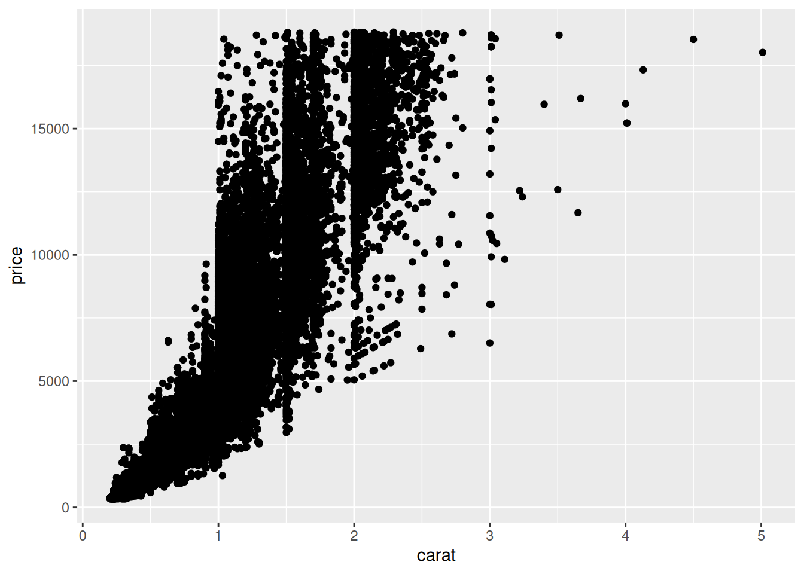
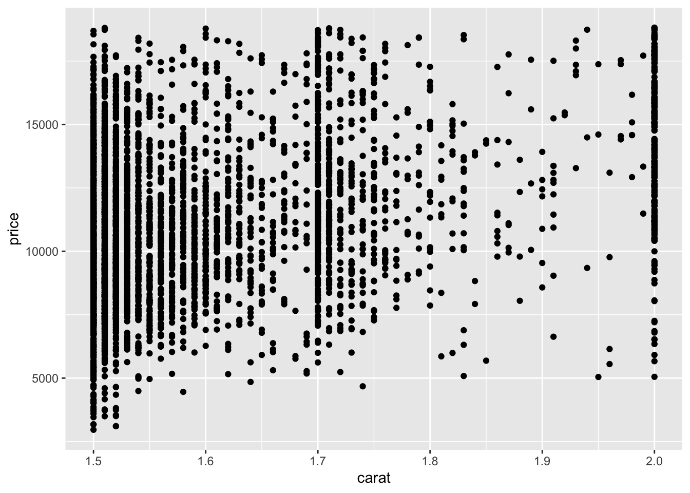
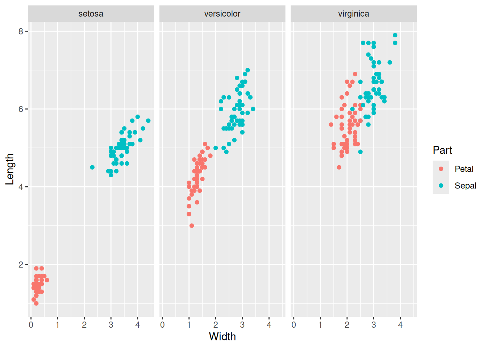
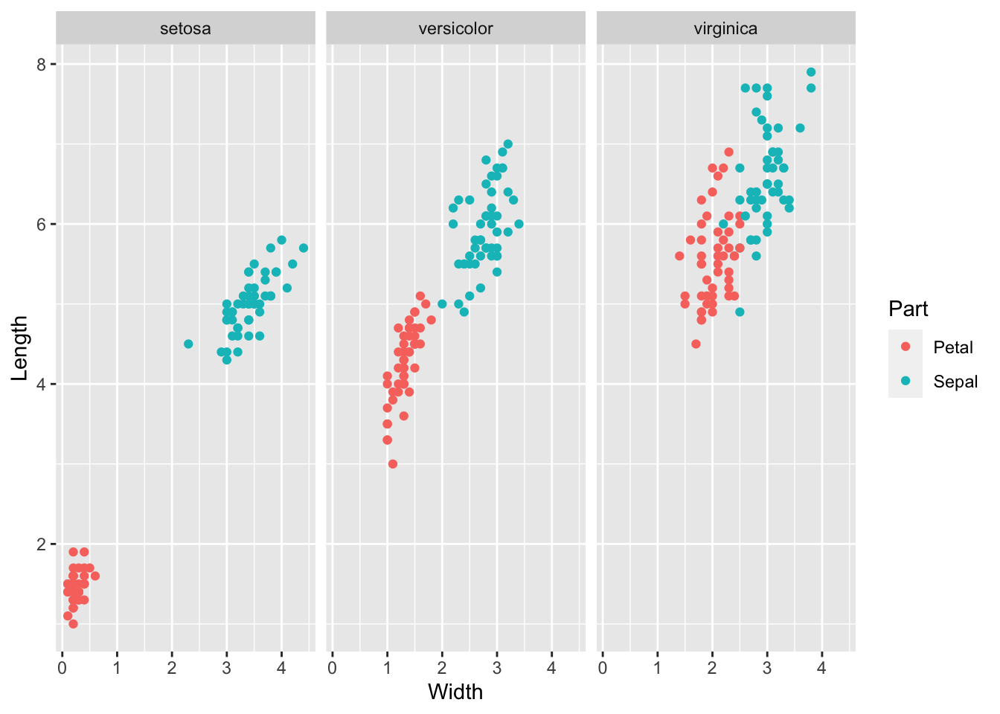

# Communication: Code Style

*Purpose*: From the tidyverse style guide "Good coding style is like correct
punctuation: you can manage without it, butitsuremakesthingseasiertoread." We
will follow the [tidyverse style guide](https://style.tidyverse.org/); Google's
internal [R style guide](https://google.github.io/styleguide/Rguide.html) is
actually based on these guidelines!

*Reading*: [tidyverse style guide](https://style.tidyverse.org/).
*Topics*: [Spacing](https://style.tidyverse.org/syntax.html#spacing) (subsection only), [Pipes](https://style.tidyverse.org/pipes.html) (whole section)
*Reading Time*: ~ 10 minutes


``` r
library(tidyverse)
```

```
## ── Attaching core tidyverse packages ──────────────────────── tidyverse 2.0.0 ──
## ✔ dplyr     1.1.4     ✔ readr     2.1.5
## ✔ forcats   1.0.0     ✔ stringr   1.5.1
## ✔ ggplot2   3.5.1     ✔ tibble    3.2.1
## ✔ lubridate 1.9.4     ✔ tidyr     1.3.1
## ✔ purrr     1.0.4     
## ── Conflicts ────────────────────────────────────────── tidyverse_conflicts() ──
## ✖ dplyr::filter() masks stats::filter()
## ✖ dplyr::lag()    masks stats::lag()
## ℹ Use the conflicted package (<http://conflicted.r-lib.org/>) to force all conflicts to become errors
```

### __q1__ Re-write according to the style guide

*Hint*: The pipe operator `%>%` will help make this code more readable.


``` r
## Original code; hard to read
summarize(group_by(diamonds, cut), mean_price = mean(price))
```

```
## # A tibble: 5 × 2
##   cut       mean_price
##   <ord>          <dbl>
## 1 Fair           4359.
## 2 Good           3929.
## 3 Very Good      3982.
## 4 Premium        4584.
## 5 Ideal          3458.
```


``` r
diamonds %>%
  group_by(cut) %>%
  summarize(
    mean_price = mean(price)
  )
```

```
## # A tibble: 5 × 2
##   cut       mean_price
##   <ord>          <dbl>
## 1 Fair           4359.
## 2 Good           3929.
## 3 Very Good      3982.
## 4 Premium        4584.
## 5 Ideal          3458.
```

### __q2__ Re-write according to the style guide

*Hint*: There are *particular rules* about spacing!


``` r
## NOTE: You can copy this code to the chunk below
iris %>%
  mutate(Sepal.Area=Sepal.Length*Sepal.Width) %>%
  group_by( Species ) %>%
  summarize_if(is.numeric,mean)%>%
  ungroup() %>%
  pivot_longer( names_to="measure",values_to="value",cols=-Species ) %>%
  arrange(value )
```

```
## # A tibble: 15 × 3
##    Species    measure       value
##    <fct>      <chr>         <dbl>
##  1 setosa     Petal.Width   0.246
##  2 versicolor Petal.Width   1.33 
##  3 setosa     Petal.Length  1.46 
##  4 virginica  Petal.Width   2.03 
##  5 versicolor Sepal.Width   2.77 
##  6 virginica  Sepal.Width   2.97 
##  7 setosa     Sepal.Width   3.43 
##  8 versicolor Petal.Length  4.26 
##  9 setosa     Sepal.Length  5.01 
## 10 virginica  Petal.Length  5.55 
## 11 versicolor Sepal.Length  5.94 
## 12 virginica  Sepal.Length  6.59 
## 13 versicolor Sepal.Area   16.5  
## 14 setosa     Sepal.Area   17.3  
## 15 virginica  Sepal.Area   19.7
```


``` r
iris %>%
  mutate(Sepal.Area = Sepal.Length * Sepal.Width) %>%
  group_by(Species) %>%
  summarize_if(is.numeric, mean) %>%
  ungroup() %>%
  pivot_longer(names_to = "measure", values_to = "value", cols = -Species) %>%
  arrange(value)
```

```
## # A tibble: 15 × 3
##    Species    measure       value
##    <fct>      <chr>         <dbl>
##  1 setosa     Petal.Width   0.246
##  2 versicolor Petal.Width   1.33 
##  3 setosa     Petal.Length  1.46 
##  4 virginica  Petal.Width   2.03 
##  5 versicolor Sepal.Width   2.77 
##  6 virginica  Sepal.Width   2.97 
##  7 setosa     Sepal.Width   3.43 
##  8 versicolor Petal.Length  4.26 
##  9 setosa     Sepal.Length  5.01 
## 10 virginica  Petal.Length  5.55 
## 11 versicolor Sepal.Length  5.94 
## 12 virginica  Sepal.Length  6.59 
## 13 versicolor Sepal.Area   16.5  
## 14 setosa     Sepal.Area   17.3  
## 15 virginica  Sepal.Area   19.7
```

### __q3__ Re-write according to the style guide

*Hint*: What do we do about long lines?


``` r
iris %>%
  group_by(Species) %>%
  summarize(Sepal.Length = mean(Sepal.Length), Sepal.Width = mean(Sepal.Width), Petal.Length = mean(Petal.Length), Petal.Width = mean(Petal.Width))
```

```
## # A tibble: 3 × 5
##   Species    Sepal.Length Sepal.Width Petal.Length Petal.Width
##   <fct>             <dbl>       <dbl>        <dbl>       <dbl>
## 1 setosa             5.01        3.43         1.46       0.246
## 2 versicolor         5.94        2.77         4.26       1.33 
## 3 virginica          6.59        2.97         5.55       2.03
```


``` r
iris %>%
  group_by(Species) %>%
  summarize(
    Sepal.Length = mean(Sepal.Length),
    Sepal.Width  = mean(Sepal.Width),
    Petal.Length = mean(Petal.Length),
    Petal.Width  = mean(Petal.Width)
  )
```

```
## # A tibble: 3 × 5
##   Species    Sepal.Length Sepal.Width Petal.Length Petal.Width
##   <fct>             <dbl>       <dbl>        <dbl>       <dbl>
## 1 setosa             5.01        3.43         1.46       0.246
## 2 versicolor         5.94        2.77         4.26       1.33 
## 3 virginica          6.59        2.97         5.55       2.03
```

The following is an *addition* I'm making to the "effective styleguide" for the
class: Rather than doing this:


``` r
## NOTE: No need to edit, just an example
ggplot(diamonds, aes(carat, price)) +
  geom_point()
```


Instead, do this:


``` r
## NOTE: No need to edit, just an example
diamonds %>%
  ggplot(aes(carat, price)) +
  geom_point()
```



This may seem like a small difference (it is), but getting in this habit will
pay off when we start combining data operations with plotting; for instance:


``` r
## NOTE: No need to edit, just an example
diamonds %>%
  filter(1.5 <= carat, carat <= 2.0) %>%

  ggplot(aes(carat, price)) +
  geom_point()
```



Getting in the habit of "putting the data first" will make it easier for you to
add preprocessing steps. Also, you can easily "disable" the plot to inspect your
preprocessing while debugging; that is:


``` r
## NOTE: No need to edit, just an example
diamonds %>%
  filter(1.5 <= carat, carat <= 2.0) %>%
  glimpse()
```

```
## Rows: 4,346
## Columns: 10
## $ carat   <dbl> 1.50, 1.52, 1.52, 1.50, 1.50, 1.50, 1.51, 1.52, 1.52, 1.50, 1.…
## $ cut     <ord> Fair, Good, Good, Fair, Good, Premium, Good, Fair, Premium, Pr…
## $ color   <ord> H, E, E, H, G, H, G, H, I, H, I, F, F, I, H, D, G, F, H, H, E,…
## $ clarity <ord> I1, I1, I1, I1, I1, I1, I1, I1, I1, I1, I1, I1, I1, I1, I1, I1…
## $ depth   <dbl> 65.6, 57.3, 57.3, 69.3, 57.4, 60.1, 64.0, 64.9, 61.2, 61.1, 63…
## $ table   <dbl> 54, 58, 58, 61, 62, 57, 59, 58, 58, 59, 61, 59, 56, 58, 61, 60…
## $ price   <int> 2964, 3105, 3105, 3175, 3179, 3457, 3497, 3504, 3541, 3599, 36…
## $ x       <dbl> 7.26, 7.53, 7.53, 6.99, 7.56, 7.40, 7.29, 7.18, 7.43, 7.37, 7.…
## $ y       <dbl> 7.09, 7.42, 7.42, 6.81, 7.39, 7.28, 7.17, 7.13, 7.35, 7.26, 7.…
## $ z       <dbl> 4.70, 4.28, 4.28, 4.78, 4.29, 4.42, 4.63, 4.65, 4.52, 4.47, 4.…
```

``` r
  ## ggplot(aes(carat, price)) +
  ## geom_point()
```

I'll enforce this "data first" style, but after this class you are (of course)
free to write code however you like!

### __q4__ Re-write according to the style guide

*Hint*: Put the data first!


``` r
ggplot(
  iris %>%
  pivot_longer(
    names_to = c("Part", ".value"),
    names_sep = "\\.",
    cols = -Species
  ),
  aes(Width, Length, color = Part)
) +
  geom_point() +
  facet_wrap(~Species)
```




``` r
iris %>%
  pivot_longer(
    names_to = c("Part", ".value"),
    names_sep = "\\.",
    cols = -Species
  ) %>%

  ggplot(aes(Width, Length, color = Part)) +
  geom_point() +
  facet_wrap(~Species)
```



<!-- include-exit-ticket -->
