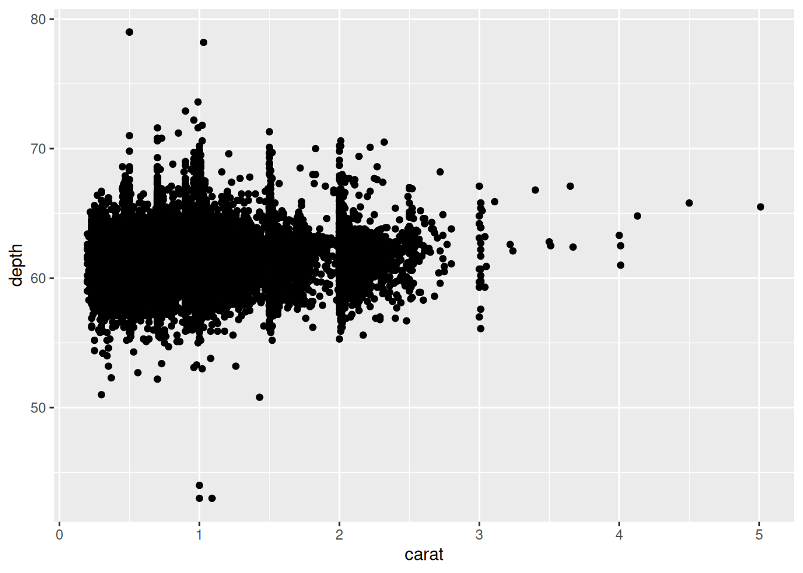
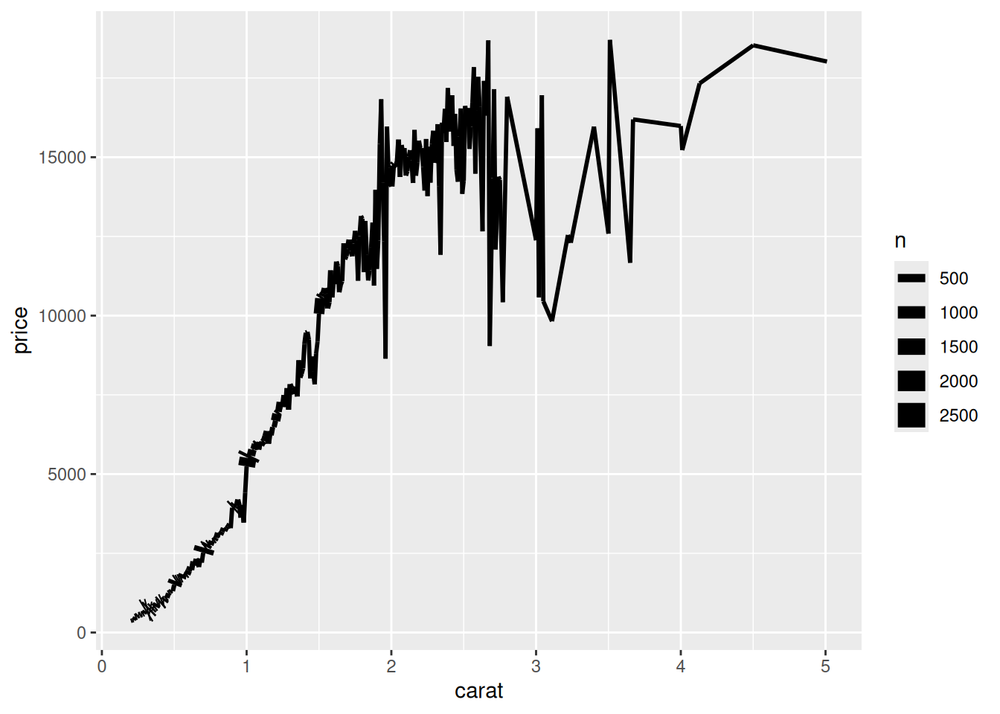
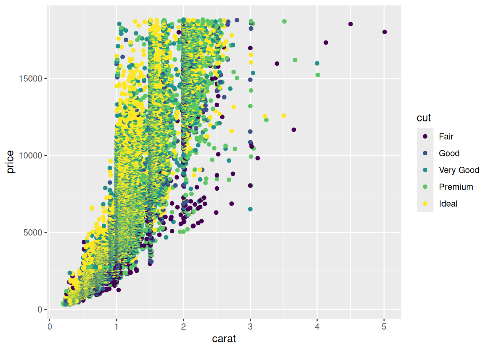

# Vis: Data Visualization Basics

*Purpose*: The most powerful way for us to learn about a dataset is to _visualize the data_. Throughout this class we will make extensive use of the _grammar of graphics_, a powerful graphical programming _grammar_ that will allow us to create just about any graph you can imagine!

*Reading*: (None, this is the reading)


### __q1__ Inspect a dataset

Inspect the `diamonds` dataset. What do the `cut`, `color`, and `clarity` variables mean?

*Hint*: We learned how to inspect a dataset in `e-data-00-basics`!


``` r
?diamonds
```

### __q2__ Standard checks

Use your "standard checks" to determine what variables the dataset has.


``` r
glimpse(diamonds)
```

```
## Rows: 53,940
## Columns: 10
## $ carat   <dbl> 0.23, 0.21, 0.23, 0.29, 0.31, 0.24, 0.24, 0.26, 0.22, 0.23, 0.…
## $ cut     <ord> Ideal, Premium, Good, Premium, Good, Very Good, Very Good, Ver…
## $ color   <ord> E, E, E, I, J, J, I, H, E, H, J, J, F, J, E, E, I, J, J, J, I,…
## $ clarity <ord> SI2, SI1, VS1, VS2, SI2, VVS2, VVS1, SI1, VS2, VS1, SI1, VS1, …
## $ depth   <dbl> 61.5, 59.8, 56.9, 62.4, 63.3, 62.8, 62.3, 61.9, 65.1, 59.4, 64…
## $ table   <dbl> 55, 61, 65, 58, 58, 57, 57, 55, 61, 61, 55, 56, 61, 54, 62, 58…
## $ price   <int> 326, 326, 327, 334, 335, 336, 336, 337, 337, 338, 339, 340, 34…
## $ x       <dbl> 3.95, 3.89, 4.05, 4.20, 4.34, 3.94, 3.95, 4.07, 3.87, 4.00, 4.…
## $ y       <dbl> 3.98, 3.84, 4.07, 4.23, 4.35, 3.96, 3.98, 4.11, 3.78, 4.05, 4.…
## $ z       <dbl> 2.43, 2.31, 2.31, 2.63, 2.75, 2.48, 2.47, 2.53, 2.49, 2.39, 2.…
```

The `diamonds` dataset has variables `carat, cut, color, clarity, depth, table, price, x, y, z`.

Now that we have the list of variables in the dataset, we know what we can visualize!

## The Grammar of Graphics

In this class, we'll use the *Grammar of Graphics* for data visualization. This is implemented in the `ggplot2` package. The anatomy of a ggplot is broken down below:


``` r
## NOTE: No need to edit; run and inspect

ggplot(            # 1. Starting a ggplot
  data = diamonds  # 2. Dataset to visualize
) +                # 3. Adding elements to the plot
  geom_point(      # 4. Geometry
    mapping = aes( # 5. `Aes`thetic mapping
      x = carat,   # 5.1. Mapping the `x` variable
      y = depth    # 5.2. Mapping the `y` variable
    )
  )
```



The core idea in ggplot is that we can break *every concievable plot* down into just a few elements:

* Data (the `data` argument): The data to visualize
* Geometries (or `geom_*()` functions): The visual elements we'll use to show the data
* Mapping (the relationship between the data and the geometries)

Assuming we're not messing with the data[1], this implies that making a plot boils down to *choosing the geometries* and *mapping geometries to the data*. This is a bit abstract, but once you internalize this approach, *you can make virtually any plot you can imagine*.

[1] Sometimes we'll mess with the data to make a more informative plot---stay tuned!

Let's practice: Adapt the code above to complet the task below.

### __q3__ Make your first ggplot

Using `ggplot`, visualize `price` vs `carat` with points. What trend do you observe?

*Hint*: Usually the language `y` vs `x` refers to the `vertical axis` vs `horizontal axis`. This is the opposite order from the way we often specify `x, y` pairs. Language is hard!


``` r
## TODO: Complete this code
ggplot(diamonds) +
  geom_point(aes(x = carat, y = price))
```


**Observations**:

- `price` generally increases with `carat`
- The trend is not 'clean'; there is no single curve in the relationship

## A note on *aesthetics*

The function `aes()` is short for *aesthetics*. Aesthetics in ggplot are the mapping of variables in a dataframe to visual elements in the graph. For instance, in the plot above you assigned `carat` to the `x` aesthetic, and `price` to the `y` aesthetic. But there are *many more* aesthetics you can set, some of which vary based on the `geom_` you are using to visualize. 


``` r
## NOTE: This is some more advanced code we'll learn to write later
diamonds %>% 
  group_by(carat) %>% 
  summarize(
    price = mean(price),
    n = n()
  ) %>% 
  
  # This is the focus of this code: Note the 
  # additional `linewidth` argument to aes()
  ggplot() +
  geom_line(aes(x = carat, y = price, linewidth = n))
```



As with any R function, we can consult the documentation to learn more.

### __q4__ Read the docs

Look up the documentation for `geom_point()`, and scroll down to the *Aesthetics* section. What aesthetics (other than `x` and `y`) does `geom_point()` accept?

### __q5__ Visualize a third variable

Adapt your code from q3 to visualize `price`, `carat`, and `cut` simultaneously.

*Hint*: Remember that you can add additional aesthetic mappings in `aes()`.


``` r
## TODO: Complete this code
ggplot(diamonds) +
  geom_point(aes(x = carat, y = price, color = cut))
```



**Observations**:

- `price` generally increases with `carat`
- The `cut` helps explain the variation in price;
  - `Ideal` cut diamonds tend to be more expensive
  - `Fair` cut diamonds tend to be less expensive

<!-- include-exit-ticket -->
