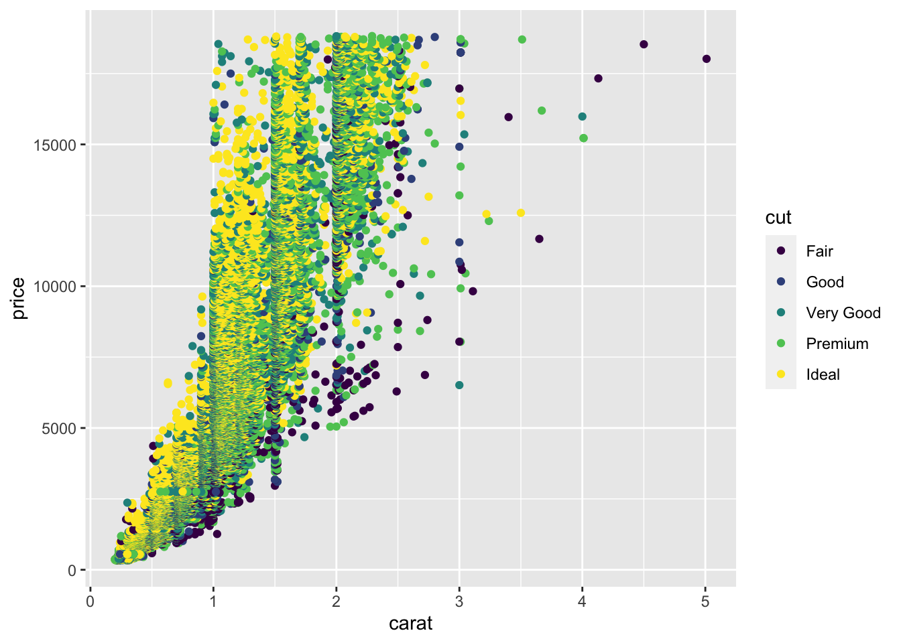

# Vis: Data Visualization Basics

*Purpose*: The most powerful way for us to learn about a dataset is to
_visualize the data_. Throughout this class we will make extensive use of the
_grammar of graphics_, a powerful graphical programming _grammar_ that will
allow us to create just about any graph you can imagine!

*Reading*: [Data Visualization Basics](https://rstudio.cloud/learn/primers/1.1). *Note*: In RStudio use `Ctrl + Click` (Mac `Command + Click`) to follow the link.
*Topics*: `Welcome`, `A code template`, `Aesthetic mappings`.
*Reading Time*: ~ 30 minutes


### __q1__ Inspect the `diamonds` dataset. What do the `cut`, `color`, and `clarity` variables mean?

*Hint*: We learned how to inspect a dataset in `e-data-00-basics`!


```r
?diamonds
```

### __q2__ Use your "standard checks" to determine what variables the dataset has.


```r
glimpse(diamonds)
```

```
## Rows: 53,940
## Columns: 10
## $ carat   <dbl> 0.23, 0.21, 0.23, 0.29, 0.31, 0.24, 0.24, 0.26, 0.22, 0.23, 0.…
## $ cut     <ord> Ideal, Premium, Good, Premium, Good, Very Good, Very Good, Ver…
## $ color   <ord> E, E, E, I, J, J, I, H, E, H, J, J, F, J, E, E, I, J, J, J, I,…
## $ clarity <ord> SI2, SI1, VS1, VS2, SI2, VVS2, VVS1, SI1, VS2, VS1, SI1, VS1, …
## $ depth   <dbl> 61.5, 59.8, 56.9, 62.4, 63.3, 62.8, 62.3, 61.9, 65.1, 59.4, 64…
## $ table   <dbl> 55, 61, 65, 58, 58, 57, 57, 55, 61, 61, 55, 56, 61, 54, 62, 58…
## $ price   <int> 326, 326, 327, 334, 335, 336, 336, 337, 337, 338, 339, 340, 34…
## $ x       <dbl> 3.95, 3.89, 4.05, 4.20, 4.34, 3.94, 3.95, 4.07, 3.87, 4.00, 4.…
## $ y       <dbl> 3.98, 3.84, 4.07, 4.23, 4.35, 3.96, 3.98, 4.11, 3.78, 4.05, 4.…
## $ z       <dbl> 2.43, 2.31, 2.31, 2.63, 2.75, 2.48, 2.47, 2.53, 2.49, 2.39, 2.…
```

The `diamonds` dataset has variables `carat, cut, color, clarity, depth, table,
price, x, y, z`.

Now that we have the list of variables in the dataset, we know what we can visualize!

### __q3__ Using `ggplot`, visualize `price` vs `carat` with points. What trend do
you observe?

*Hint*: Usually the language `y` vs `x` refers to the `vertical axis` vs
`horizontal axis`. This is the opposite order from the way we often specify `x,
y` pairs. Language is hard!


```r
## TODO: Complete this code
ggplot(diamonds) +
  geom_point(aes(x = carat, y = price))
```


**Observations**:

- `price` generally increases with `carat`
- The trend is not 'clean'; there is no single curve in the relationship

## A note on *aesthetics*

The function `aes()` is short for *aesthetics*. Aesthetics in ggplot are the
mapping of variables in a dataframe to visual elements in the graph. For
instance, in the plot above you assigned `carat` to the `x` aesthetic, and
`price` to the `y` aesthetic. But there are *many more* aesthetics you can set,
some of which vary based on the `geom_` you are using to visualize. The next
question will explore this idea more.

### __q4__ Create a new graph to visualize `price`, `carat`, and `cut`
simultaneously.

*Hint*: Remember that you can add additional aesthetic mappings in `aes()`. Some options include `size`, `color`, and `shape`.


```r
## TODO: Complete this code
ggplot(diamonds) +
  geom_point(aes(x = carat, y = price, color = cut))
```



**Observations**:

- `price` generally increases with `carat`
- The `cut` helps explain the variation in price;
  - `Ideal` cut diamonds tend to be more expensive
  - `Fair` cut diamonds tend to be less expensive

<!-- include-exit-ticket -->
