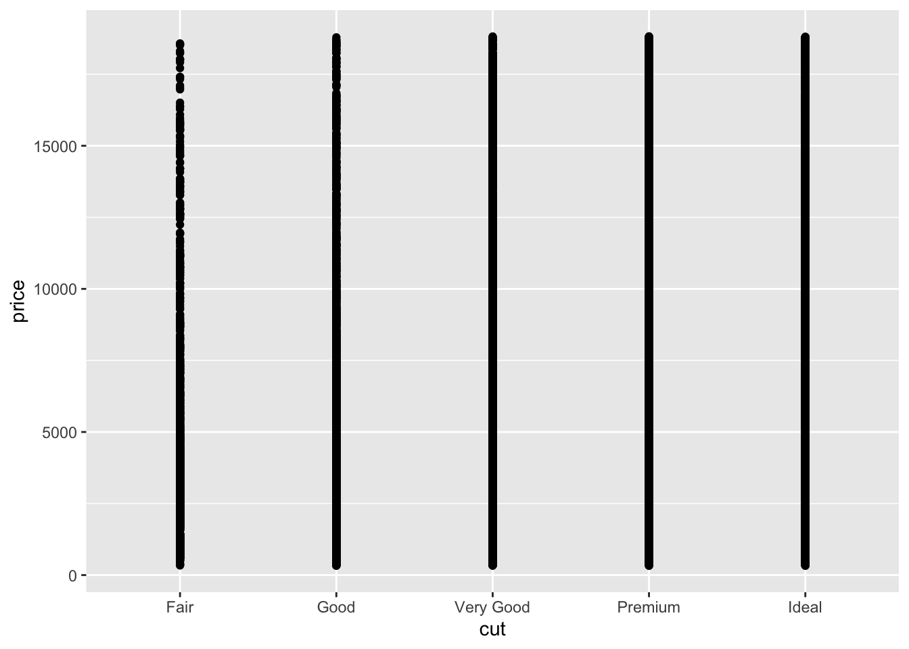
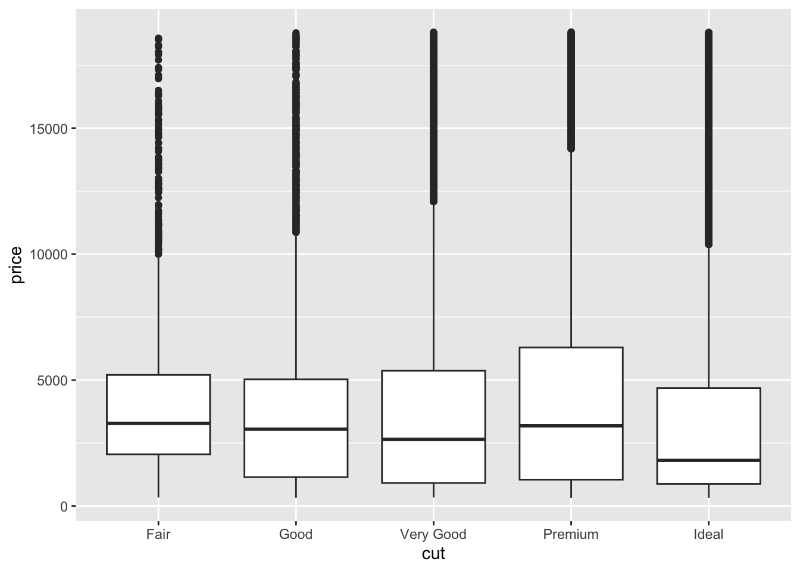
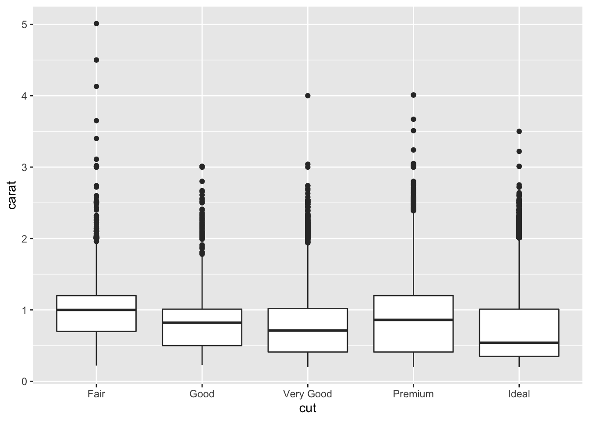

# Stats: EDA Basics

*Purpose*: *Exploratory Data Analysis* (EDA) is a __crucial__ skill for a
practicing data scientist. Unfortunately, much like human-centered design EDA is
hard to teach. This is because EDA is **not** a strict procedure, so much as it
is a **mindset**. Also, much like human-centered design, EDA is an *iterative,
nonlinear process*. There are two key principles to keep in mind when doing EDA:

- 1. Curiosity: Generate lots of ideas and hypotheses about your data.
- 2. Skepticism: Remain unconvinced of those ideas, unless you can find credible
  patterns to support them.

Since EDA is both *crucial* and *difficult*, we will practice doing EDA *a lot*
in this course!

*Reading*: [Exploratory Data Analysis](https://rstudio.cloud/learn/primers/3.1)
*Topics*: (All topics)
*Reading Time*: ~45 minutes

*Note*: This exercise will consist of interpreting pre-made graphs. You can run
the whole notebook to generate all the figures at once. Just make sure to do
all the exercises and write your observations!


```r
library(tidyverse)
```

```
## ── Attaching packages ─────────────────────────────────────── tidyverse 1.3.1 ──
```

```
## ✔ ggplot2 3.3.5     ✔ purrr   0.3.4
## ✔ tibble  3.1.2     ✔ dplyr   1.0.7
## ✔ tidyr   1.1.3     ✔ stringr 1.4.0
## ✔ readr   1.4.0     ✔ forcats 0.5.1
```

```
## ── Conflicts ────────────────────────────────────────── tidyverse_conflicts() ──
## ✖ dplyr::filter() masks stats::filter()
## ✖ dplyr::lag()    masks stats::lag()
```

### __q0__ Remember from `e02-data-basics` there were *simple checks* we're supposed
to do? Do those simple checks on the diamonds dataset below.


```r
## TODO: Recall time! Do our first simple checks on the diamonds dataset
diamonds %>% glimpse
```

```
## Rows: 53,940
## Columns: 10
## $ carat   <dbl> 0.23, 0.21, 0.23, 0.29, 0.31, 0.24, 0.24, 0.26, 0.22, 0.23, 0.…
## $ cut     <ord> Ideal, Premium, Good, Premium, Good, Very Good, Very Good, Ver…
## $ color   <ord> E, E, E, I, J, J, I, H, E, H, J, J, F, J, E, E, I, J, J, J, I,…
## $ clarity <ord> SI2, SI1, VS1, VS2, SI2, VVS2, VVS1, SI1, VS2, VS1, SI1, VS1, …
## $ depth   <dbl> 61.5, 59.8, 56.9, 62.4, 63.3, 62.8, 62.3, 61.9, 65.1, 59.4, 64…
## $ table   <dbl> 55, 61, 65, 58, 58, 57, 57, 55, 61, 61, 55, 56, 61, 54, 62, 58…
## $ price   <int> 326, 326, 327, 334, 335, 336, 336, 337, 337, 338, 339, 340, 34…
## $ x       <dbl> 3.95, 3.89, 4.05, 4.20, 4.34, 3.94, 3.95, 4.07, 3.87, 4.00, 4.…
## $ y       <dbl> 3.98, 3.84, 4.07, 4.23, 4.35, 3.96, 3.98, 4.11, 3.78, 4.05, 4.…
## $ z       <dbl> 2.43, 2.31, 2.31, 2.63, 2.75, 2.48, 2.47, 2.53, 2.49, 2.39, 2.…
```

I'm going to walk you through a train of thought I had when studying the
diamonds dataset.

There are four standard "C's" of
[judging](https://en.wikipedia.org/wiki/Diamond_(gemstone)) a diamond.[1] These
are `carat, cut, color` and `clarity`, all of which are in the `diamonds`
dataset.

## Hypothesis 1

**Here's a hypothesis**: `Ideal` is the "best" value of `cut` for a diamond.
Since an `Ideal` cut seems more labor-intensive, I hypothesize that `Ideal` cut
diamonds are less numerous than other cuts.

### __q1__ Run the chunk below, and study the plot. Was hypothesis 1 correct? Why
or why not?


```r
diamonds %>%
  ggplot(aes(cut)) +
  geom_bar()
```


**Observations**:
- The truth is actually the opposite! `Ideal` cut diamonds are *more* numerous than all other cuts! Perhaps because cutting a diamond is easier than mining a new one, gemcutters add value to a diamond by striving for an ideal cut.

## Hypothesis 2

**Another hypothesis**: The `Ideal` cut diamonds should be the most pricey.

### __q2.1__ Study the following graph; does it support, contradict, or not relate to hypothesis 2?

*Hint*: Is this an effective graph? Why or why not?


```r
diamonds %>%
  ggplot(aes(cut, price)) +
  geom_point()
```



**Observations**:
- This graph is virtually useless! There is severe overplotting. We cannot tell address Hypothesis 2 with this graph

The following is a set of *boxplots*; the middle bar denotes the median, the
boxes denote the *quartiles* (upper and lower "quarters" of the data), and the
lines and dots denote large values and outliers.

### __q2.2__ Study the following graph; does it support or contradict hypothesis 2?


```r
diamonds %>%
  ggplot(aes(cut, price)) +
  geom_boxplot()
```



**Observations**:
- Surprisingly, `Ideal` diamonds tend to be the *least* pricey! This was very surprising to me.

## Unraveling Hypothesis 2

Upon making the graph in __q2.2__, I was very surprised. So I did some reading
on diamond cuts. It turns out that some gemcutters [sacrifice cut for
carat](https://en.wikipedia.org/wiki/Diamond_(gemstone)#Cut). Could this effect
explain the surprising pattern above?

### __q3__ Study the following graph; does it support a "carat over cut" hypothesis? How might this relate to price?

*Hint*: The article linked above will help you answer these questions!


```r
diamonds %>%
  ggplot(aes(cut, carat)) +
  geom_boxplot()
```



**Observations**:
- The median of `Ideal` diamonds is a fair bit lower in `carat` than other cuts. This provides some evidence that gemcutters trade `cut` for `carat`.
- The very largest `carat` diamonds tend to be of `Fair` cut; this makese sense, as cutting the gemstone will only reduce weight.
- It seems that many diamond purchasers are more interested in carat than fine cut. This provides some rationale for why `Ideal` diamonds are cheaper; they are necessarily lower-carat.

## Footnotes

[1] Don't mistake my focus on `diamonds` as an endorsement of the diamond
industry. In my opinion aesthetic diamonds are a morally dubious scam.

<!-- include-exit-ticket -->
