# Vis: Bar Charts

*Purpose*: *Bar charts* are a key tool for EDA. In this exercise, we'll learn how to construct a variety of different bar charts, as well as when---and when *not*---to use various charts.

*Reading*: (None, this is the reading)


``` r
library(tidyverse)
```

```
## ── Attaching core tidyverse packages ──────────────────────── tidyverse 2.0.0 ──
## ✔ dplyr     1.1.4     ✔ readr     2.1.5
## ✔ forcats   1.0.0     ✔ stringr   1.5.1
## ✔ ggplot2   3.5.1     ✔ tibble    3.2.1
## ✔ lubridate 1.9.4     ✔ tidyr     1.3.1
## ✔ purrr     1.0.4     
## ── Conflicts ────────────────────────────────────────── tidyverse_conflicts() ──
## ✖ dplyr::filter() masks stats::filter()
## ✖ dplyr::lag()    masks stats::lag()
## ℹ Use the conflicted package (<http://conflicted.r-lib.org/>) to force all conflicts to become errors
```

## Two types of bar chart

There are two geometries in ggplot that will make a bar chart:

- `geom_bar()` is used for counting. It takes the `x` aesthetic *only*.


``` r
## NOTE: Do not edit this
tibble(a = c(1, 2, 2, 3, 3, 3)) %>% 
  ggplot(aes(x = a)) +
  geom_bar()
```

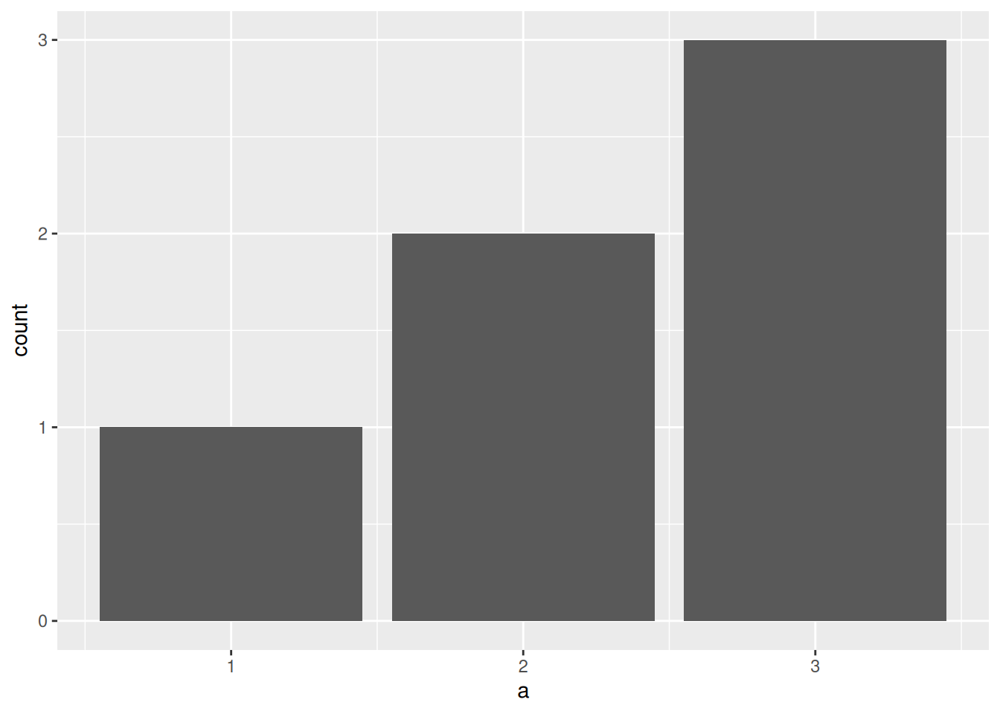

- `geom_col()` is used to show `x, y` pairs. It requires both an `x` and `y` aesthetic.


``` r
## NOTE: Do not edit this
tibble(
  a = c(1, 2, 3),
  b = c(3, 1, 2)
) %>% 
  ggplot(aes(x = a, y = b)) +
  geom_col()
```

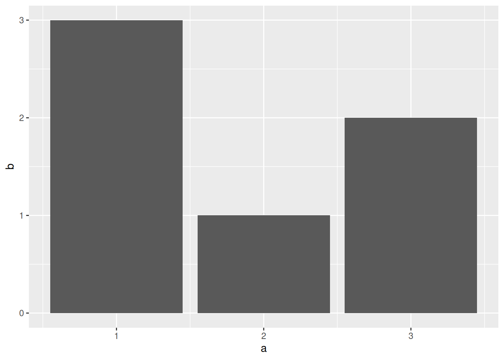

`geom_bar()` effectively counts the number of rows belonging to each unique value of the `x` aesthetic. We can do a *manual* `geom_bar()` by using the `count()` function:


``` r
## NOTE: Do not edit this
tibble(a = c(1, 2, 2, 3, 3, 3)) %>% 
  count(a) %>% # Count adds the column `n` of counts
  ggplot(aes(x = a, y = n)) +
  geom_col()
```

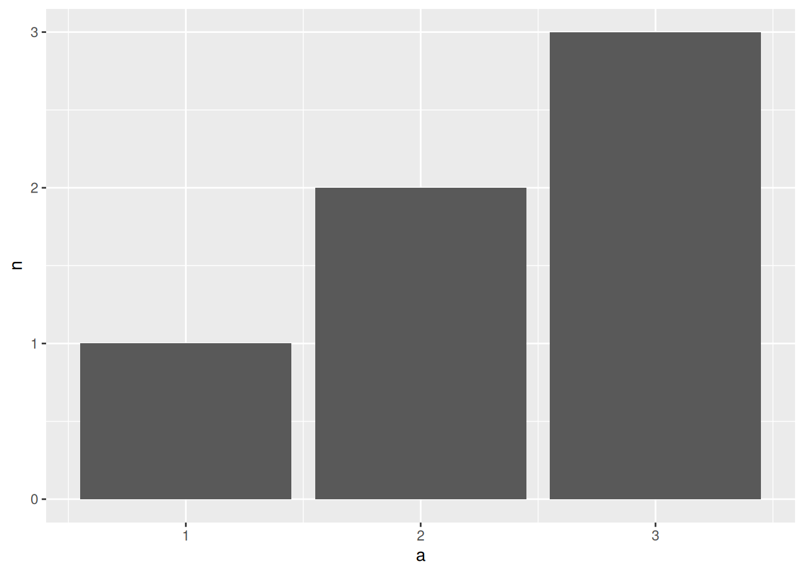

### __q1__ Convert this plot

Convert the following `geom_bar()` plot into the same visual using `geom_col()`.


``` r
mpg %>%
  count(trans) %>%
  ggplot(aes(x = trans, y = n)) +
  geom_col()
```

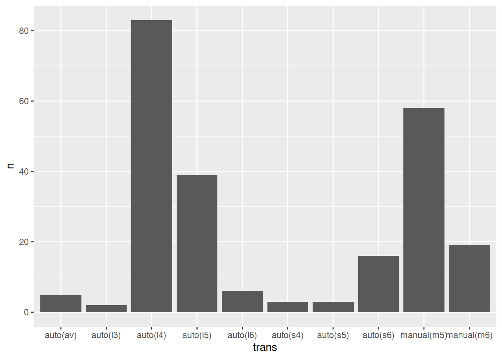

## Fundamentals of the bar chart

There are some common properties of *all* bar charts:

- Values are shown with *bars*
  - The top of the bar is the data value
  - The bottom of the bar is at zero
- The data must be 1:1
  - That is, for each value of the `x` aesthetic, there is only one value of the `y` aesthetic*
  
The requirement of 1:1 data is really important! Look at what happens if we try to plot data that is *not* 1:1:


``` r
## NOTE: Do not edit this
tibble(
  a = c(1, 2, 2), # Note that our x aesthetic (a) has repeat values
  b = c(3, 1, 2)  # Hence, we have two different b values for a == 2
) %>% 
  ggplot(aes(x = a, y = b)) +
  geom_col()
```

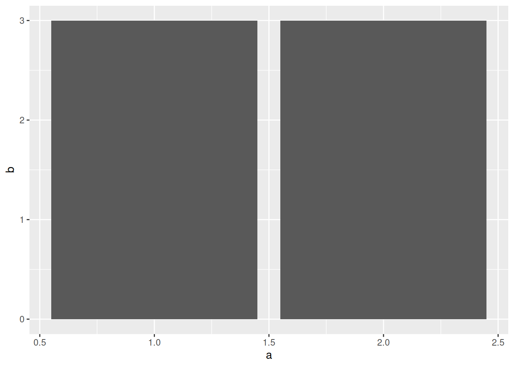

It's hard to tell what's happening, but the bars for `a == 2` are *stacked*. But if we try to interpret this plot, it seems like `b == 3` when `a == 2`, which is not true.

*There's an exception when we have additional aesthetics such as `fill` or `color`.

For the `mpg` dataset, we can see that the pairs `cty, hwy` clearly don't have this one-to-one property:


``` r
## NOTE: Run this chunk for an illustration
mpg %>% filter(cty == 20)
```

```
## # A tibble: 11 × 11
##    manufacturer model      displ  year   cyl trans drv     cty   hwy fl    class
##    <chr>        <chr>      <dbl> <int> <int> <chr> <chr> <int> <int> <chr> <chr>
##  1 audi         a4           2    2008     4 manu… f        20    31 p     comp…
##  2 audi         a4 quattro   2    2008     4 manu… 4        20    28 p     comp…
##  3 hyundai      tiburon      2    2008     4 manu… f        20    28 r     subc…
##  4 hyundai      tiburon      2    2008     4 auto… f        20    27 r     subc…
##  5 subaru       forester …   2.5  2008     4 manu… 4        20    27 r     suv  
##  6 subaru       forester …   2.5  2008     4 auto… 4        20    26 r     suv  
##  7 subaru       impreza a…   2.5  2008     4 auto… 4        20    25 p     comp…
##  8 subaru       impreza a…   2.5  2008     4 auto… 4        20    27 r     comp…
##  9 subaru       impreza a…   2.5  2008     4 manu… 4        20    27 r     comp…
## 10 volkswagen   new beetle   2.5  2008     5 manu… f        20    28 r     subc…
## 11 volkswagen   new beetle   2.5  2008     5 auto… f        20    29 r     subc…
```

### __q2__ Inspect this plot

The following code attempts to visualize `cty, hwy` from `mpg` using `geom_col()`. There's something fishy about the `hwy` values; answer the questions below.

*Hint*: Try adding the `position = "dodge"` argument to `geom_col()`.


``` r
mpg %>%
  ggplot(aes(x = cty, y = hwy)) +
  geom_col(position = "dodge")
```

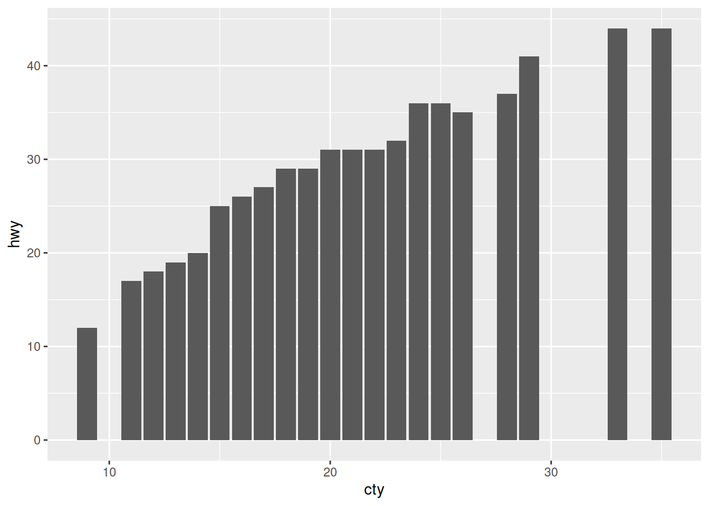

**Observations**:
- Since `position = "stacked"` is the default for `geom_col()`, we see not the real `hwy` values, but effectively a sum at each `cty` value!

## Stacked bar charts

We can make stacked bar charts *less* terrible by using a third aesthetic to disambiguate the bar segments. For instance,


``` r
## NOTE: Do not edit this
tibble(
  a = c(1, 2, 2),
  b = c(3, 1, 2),
  c = c("a", "a", "b")
) %>% 
  ggplot(aes(x = a, y = b, fill = c)) +
  geom_col()
```

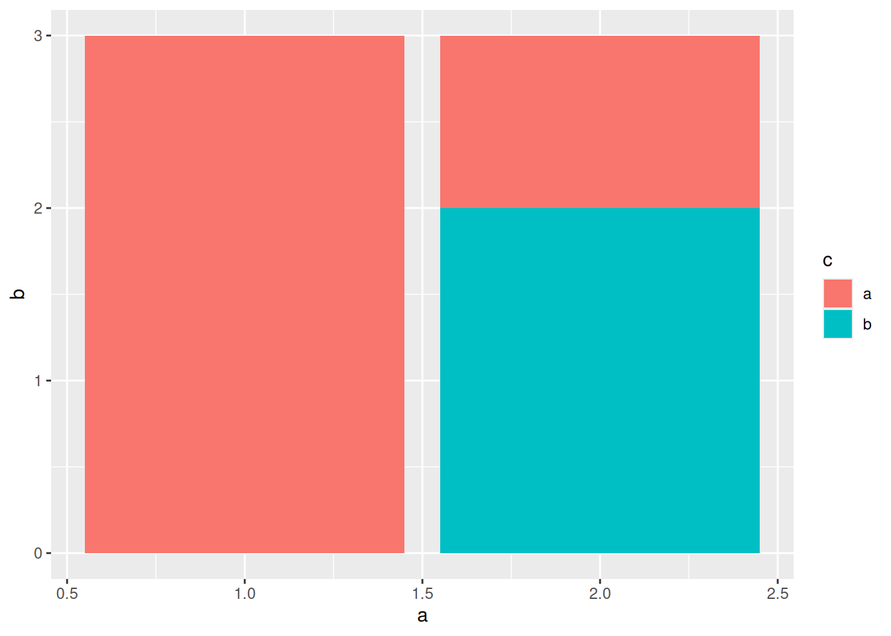

Stacked bar charts have their uses, but it's usually better to find a different way to show this kind of data. In particular, comparing *within* a stack is difficult, since the bars do not all start at zero. One way to make comparisons easier is to *dodge* the bars, so they all start at zero. We can do this with the `position = "dodge"` argument:


``` r
## NOTE: Do not edit this
tibble(
  a = c(1, 2, 2),
  b = c(3, 1, 2),
  c = c("a", "a", "b")
) %>% 
  ggplot(aes(x = a, y = b, fill = c)) +
  geom_col(position = "dodge")
```

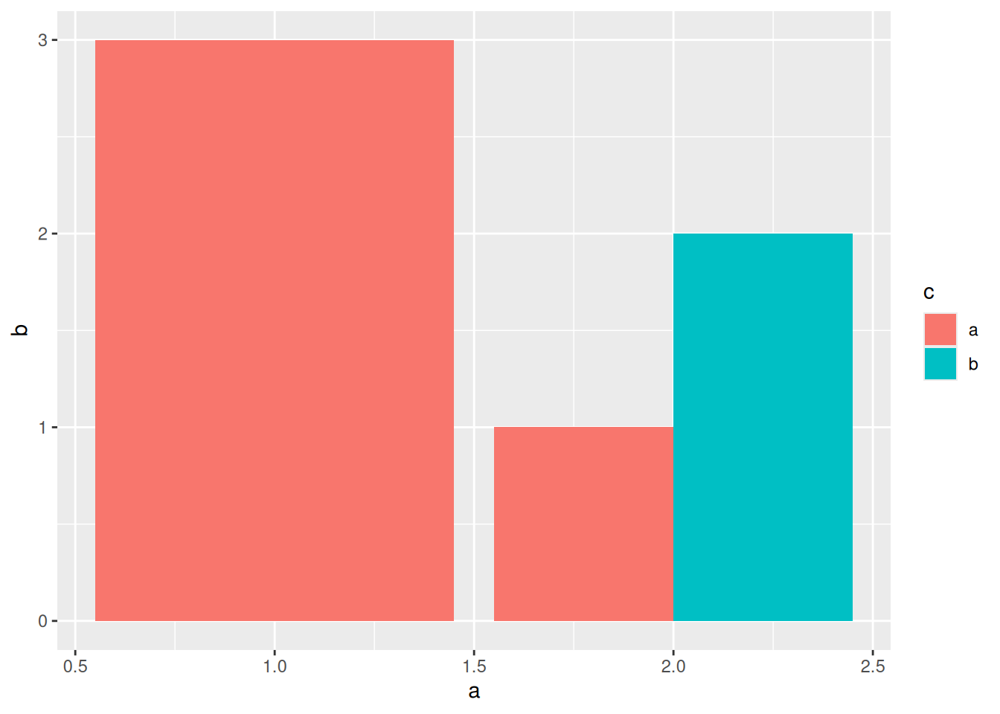

Note that this naturally "shrinks" some of the bars so we can fit them near the same value. Don't mistake these bars as belonging to other `a` values (like 1.75, 2.25)---this is just an artifact of the dodging.

Note that we need to put the `position = "dodge"` argument inside the relevant geometry, and not, say, `ggplot()`.

### __q3__ Compare these plots

The following are two different visualizations of the `mpg` dataset. Document your observations between the `v1` and `v2` visuals. Then, determine which---`v1` or `v2`---enabled you to make more observations. What was the difference between the two visuals?


``` r
## TODO: Run this code without changing, describe your observations on the data
mpg %>%
  ggplot(aes(x = class, fill = class)) +
  geom_bar()
```

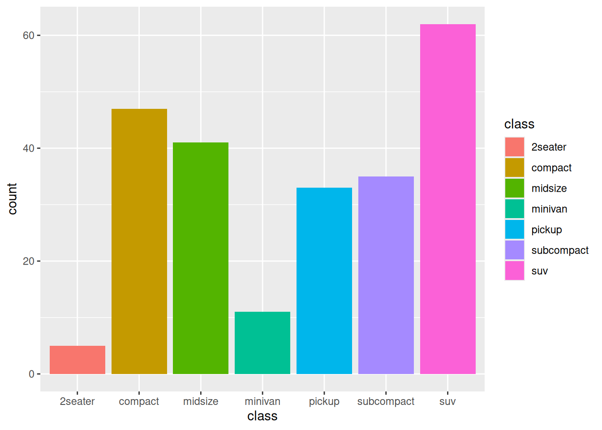

**Observations**:
In this dataset:
- `SUV`'s are most numerous, followed by `compact` and `midsize`
- There are very few `2seater` vehicles


``` r
## TODO: Run this code without changing, describe your observations on the data
mpg %>%
  ggplot(aes(class, fill = drv)) +
  geom_bar()
```

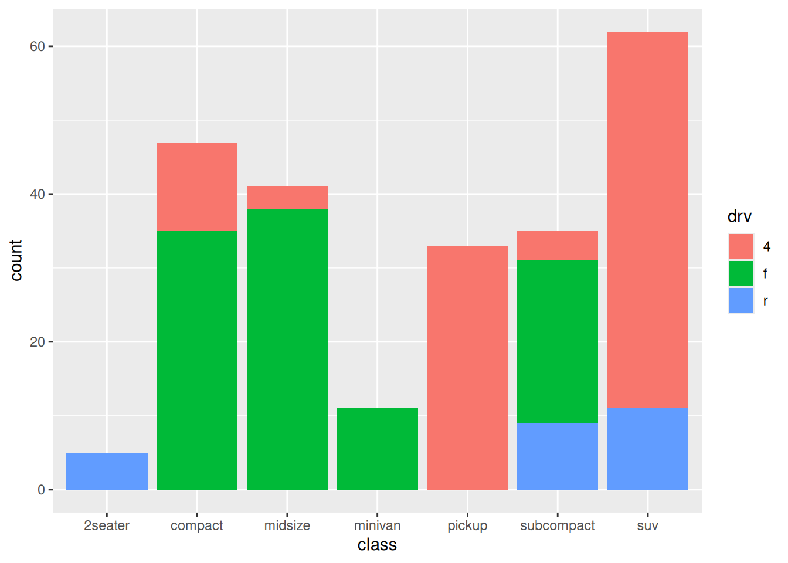

**Observations**:
In this dataset:
- `SUV`'s are most numerous, followed by `compact` and `midsize`
- There are very few `2seater` vehicles
- `pickup`'s and `SUV`'s tend to have `4` wheel drive
- `compact`'s and `midsize` tend to have `f` drive
- All the `2seater` vehicles are `r` drive

**Compare `v1` and `v2`**:

- Which visualization---`v1` or `v2`---enabled you to make more observations?
  - `v2` enabled me to make more observations
- What was the difference between `v1` and `v2`?
  - `v1` showed the same variable `class` using two aesthetics
  - `v2` showed two variables `class` and `drv` using two aesthetics

### __q4__ Fix this plot

The following code has a bug; it does not do what its author intended. Identify and fix the bug. What does the resulting graph tell you about the relation between `manufacturer` and `class` of cars in this dataset?

*Note*: I use a `theme()` call to rotate the x-axis labels. We'll learn how to do this in a future exercise.


``` r
mpg %>%
  ggplot(aes(x = manufacturer, fill = class)) +
  geom_bar(position = "dodge") +
  theme(axis.text.x = element_text(angle = 270, vjust = 0.5, hjust = 0))
```

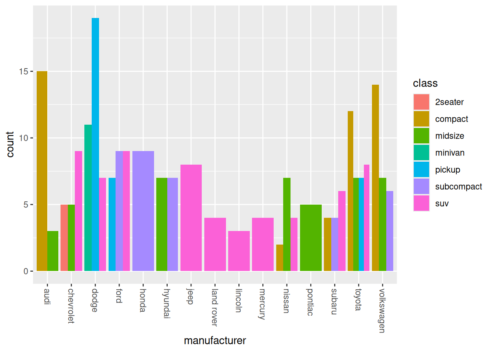

**Observations**
- Certain manufacturers seem to favor particular classes of car. For instance,
  *in this dataset*:
  - Jeep, Land Rover, Lincoln, and Mercury only have `suv`'s
  - Audi, Toyota, and Volkswagen favor `compact`
  - Dodge favors `pickup`

## A bit on facets

Sometimes there's just too much data to fit a set of bars on one chart. In this case, it can be wise to separate the plot into a set of *small multiples*, often by grouping the data on a third (or fourth) variable.

For small multiples, we can use the functions `facet_wrap()` or `facet_grid()`. `facet_wrap()` takes just one variable,


``` r
## NOTE: Do not edit this
tibble(
  a = c(1, 2, 1, 2),
  b = c(3, 1, 2, 2),
  c = c("a", "a", "b", "b")
) %>% 
  ggplot(aes(x = a, y = b)) +
  geom_col() +
  facet_wrap(~c)
```

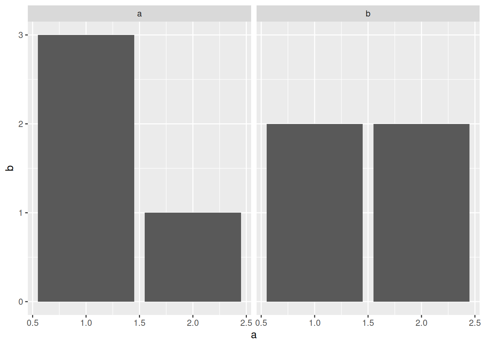

`facet_grid()` allows us to specify a column for horizontal and/or vertical faceting, so we can provide up to two. Here's a lineup of examples:


``` r
## NOTE: Do not edit this
# Horizontal facets
tibble(
  a = c(1, 2, 1, 2),
  b = c(3, 1, 2, 2),
  c = c("a", "a", "b", "b")
) %>% 
  ggplot(aes(x = a, y = b)) +
  geom_col() +
  facet_grid(~c)
```


``` r
# Vertical facets
tibble(
  a = c(1, 2, 1, 2),
  b = c(3, 1, 2, 2),
  c = c("a", "a", "b", "b")
) %>% 
  ggplot(aes(x = a, y = b)) +
  geom_col() +
  facet_grid(c ~ .)
```

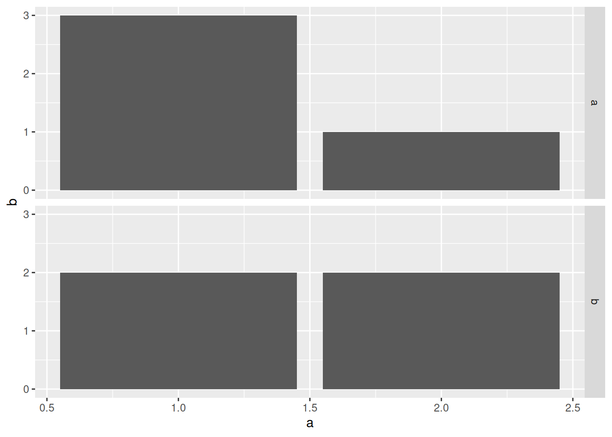

``` r
# Two-way faceting
tibble(
  a = c(1, 2, 1, 2, 1, 2),
  b = c(3, 1, 2, 2, 3, 1),
  c = c("a", "a", "b", "b", "a", "a"),
  d = c("a", "a", "a", "a", "b", "b")
) %>% 
  ggplot(aes(x = a, y = b)) +
  geom_col() +
  facet_grid(c ~ d)
```

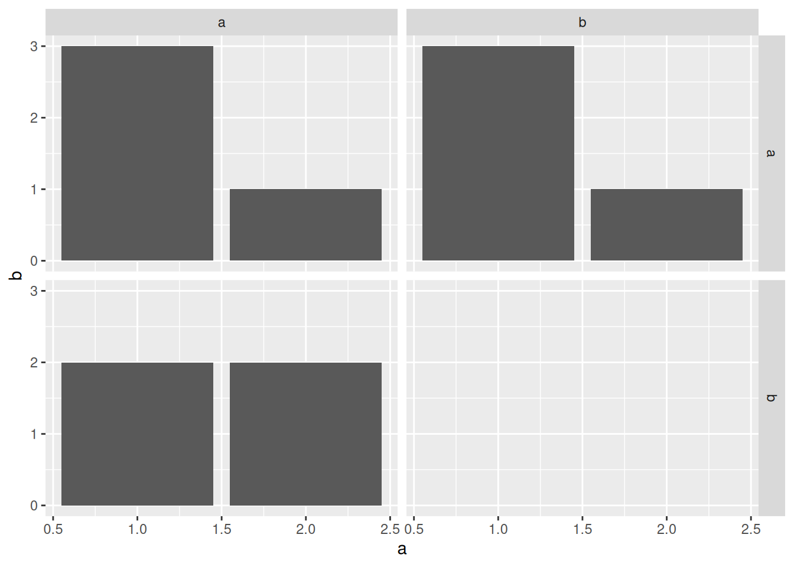

In general, if you have just one variable to facet on, you can use `facet_wrap()` as a default. If you want more control and options over your faceting, use `facet_grid()`. We'll talk more about facets in a future exercise.

### __q5__ Improve this plot

The following graph is hard to read. Experiment with other choices of faceting to make the visual more convenient to read.


``` r
mpg %>%
  ggplot(aes(x = cyl)) +
  geom_bar() +
  facet_wrap(~ manufacturer)
```

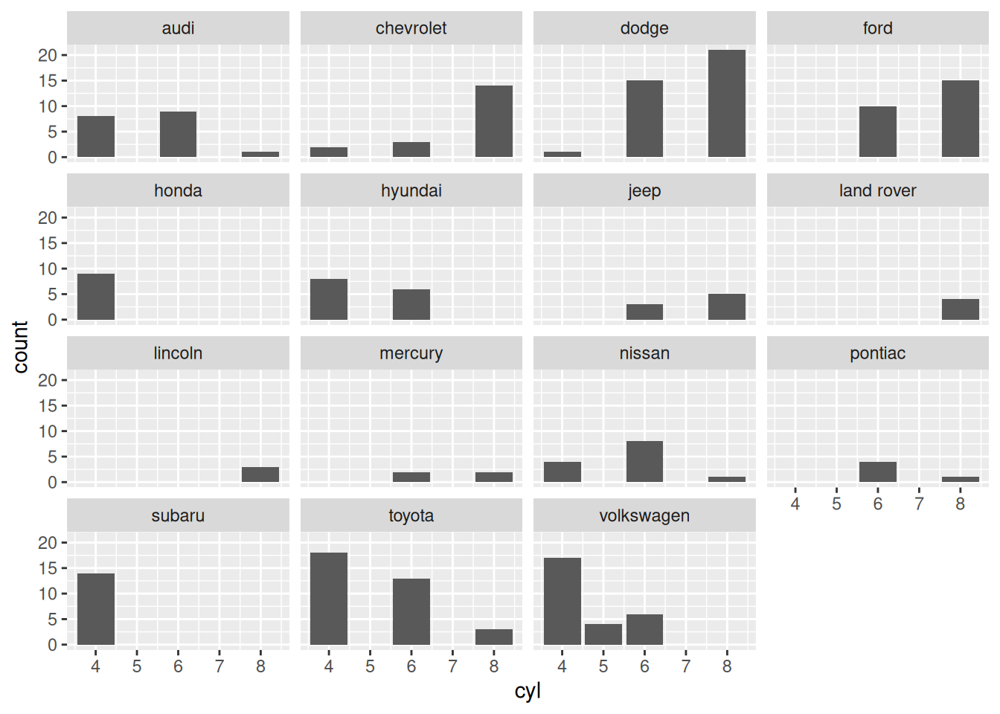

<!-- include-exit-ticket -->
