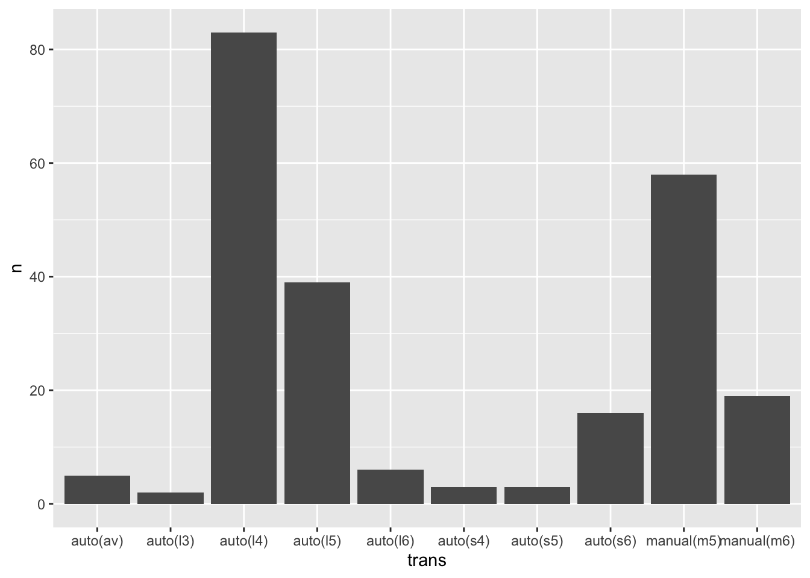
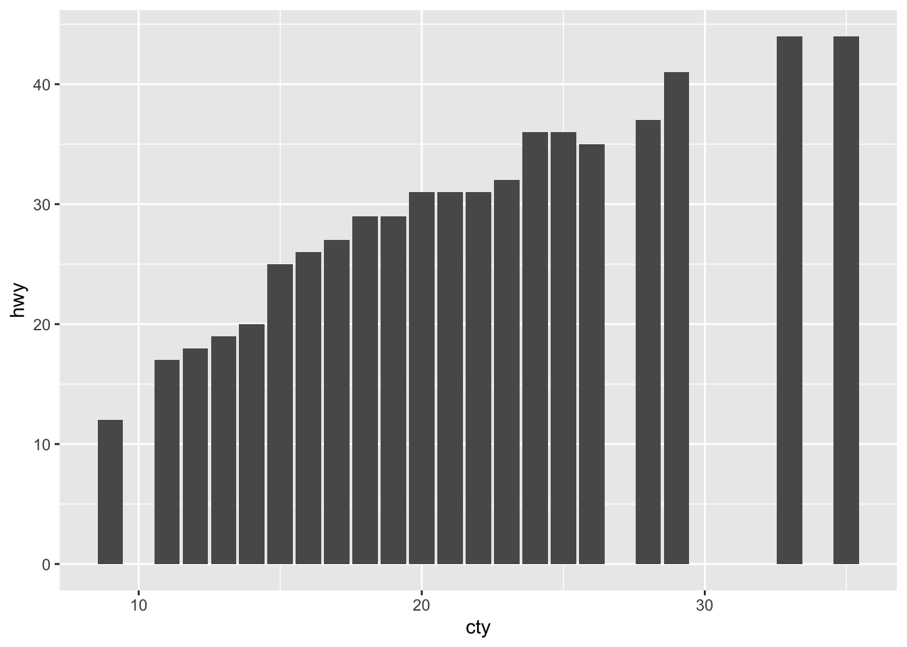
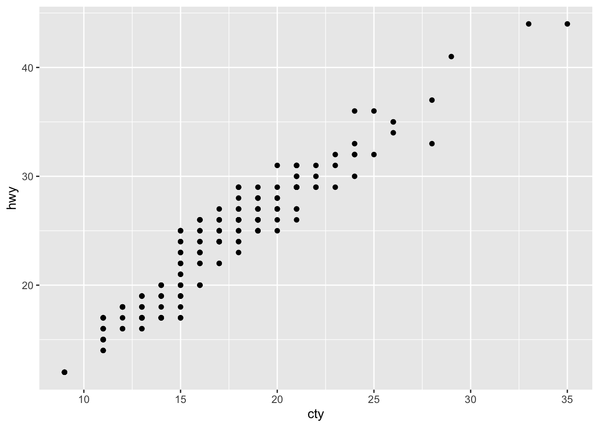
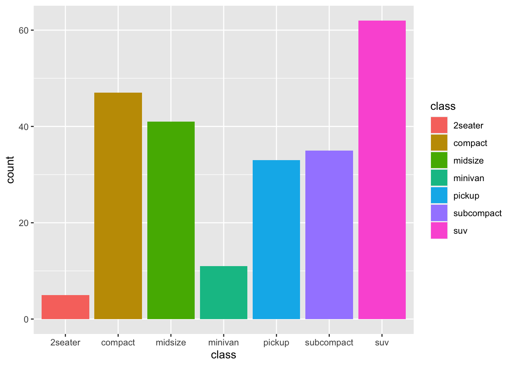
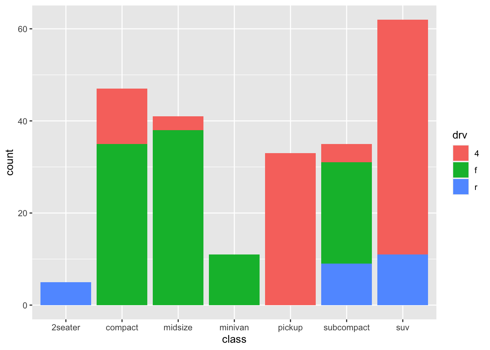
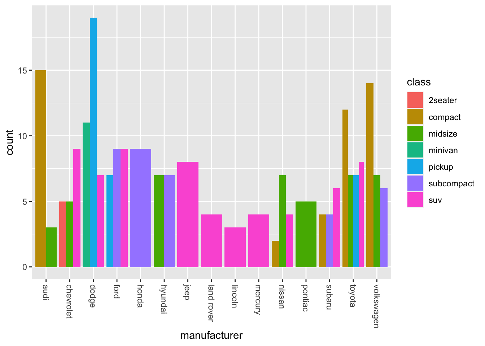
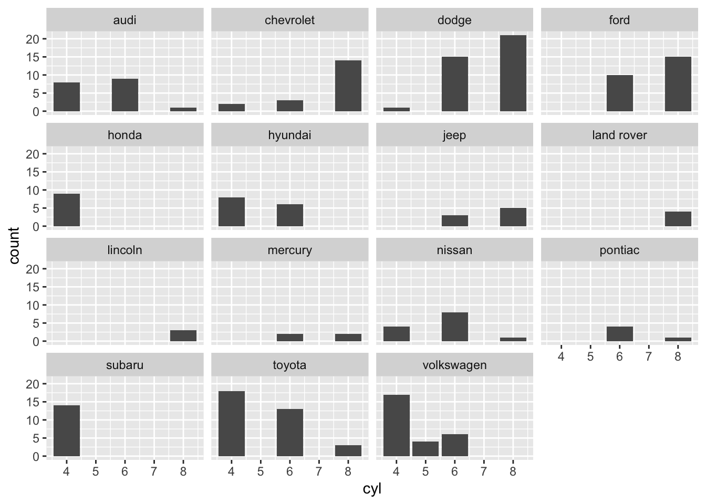

# Vis: Bar Charts

*Purpose*: *Bar charts* are a key tool for EDA. In this exercise, we'll learn
how to construct a variety of different bar charts, as well as when---and when
*not*---to use various charts.

*Reading*: [Bar Charts](https://rstudio.cloud/learn/primers/3.2)
*Topics*: (All topics)
*Reading Time*: ~30 minutes


```r
library(tidyverse)
```

```
## ── Attaching packages ─────────────────────────────────────── tidyverse 1.3.0 ──
```

```
## ✔ ggplot2 3.4.0      ✔ purrr   1.0.1 
## ✔ tibble  3.1.8      ✔ dplyr   1.0.10
## ✔ tidyr   1.2.1      ✔ stringr 1.5.0 
## ✔ readr   2.1.3      ✔ forcats 0.5.2
```

```
## ── Conflicts ────────────────────────────────────────── tidyverse_conflicts() ──
## ✖ dplyr::filter() masks stats::filter()
## ✖ dplyr::lag()    masks stats::lag()
```

### __q1__ In the reading, you learned the relation between `geom_bar()` and
`geom_col()`. Use that knowledge to convert the following `geom_bar()` plot into
the same visual using `geom_col()`.


```r
mpg %>%
  count(trans) %>%
  ggplot(aes(x = trans, y = n)) +
  geom_col()
```



The reading mentioned that when using `geom_col()` our x-y data should be
`1-to-1`. This next exercise will probe what happens when our data are not
`1-to-1`, and yet we use a `geom_col()`. Note that a
[one-to-one](https://en.wikipedia.org/wiki/Injective_function) function is one
where each input leads to a single output. For the `mpg` dataset, we can see
that the pairs `cty, hwy` clearly don't have this one-to-one property:


```r
## NOTE: Run this chunk for an illustration
mpg %>% filter(cty == 20)
```

```
## # A tibble: 11 × 11
##    manufacturer model      displ  year   cyl trans drv     cty   hwy fl    class
##    <chr>        <chr>      <dbl> <int> <int> <chr> <chr> <int> <int> <chr> <chr>
##  1 audi         a4           2    2008     4 manu… f        20    31 p     comp…
##  2 audi         a4 quattro   2    2008     4 manu… 4        20    28 p     comp…
##  3 hyundai      tiburon      2    2008     4 manu… f        20    28 r     subc…
##  4 hyundai      tiburon      2    2008     4 auto… f        20    27 r     subc…
##  5 subaru       forester …   2.5  2008     4 manu… 4        20    27 r     suv  
##  6 subaru       forester …   2.5  2008     4 auto… 4        20    26 r     suv  
##  7 subaru       impreza a…   2.5  2008     4 auto… 4        20    25 p     comp…
##  8 subaru       impreza a…   2.5  2008     4 auto… 4        20    27 r     comp…
##  9 subaru       impreza a…   2.5  2008     4 manu… 4        20    27 r     comp…
## 10 volkswagen   new beetle   2.5  2008     5 manu… f        20    28 r     subc…
## 11 volkswagen   new beetle   2.5  2008     5 auto… f        20    29 r     subc…
```

### __q2__ The following code attempts to visualize `cty, hwy` from `mpg` using
`geom_col()`. There's something fishy about the `hwy` values; what's wrong here?

*Hint*: Try changing the `position` parameter for `geom_col()`.


```r
mpg %>%
  ggplot(aes(x = cty, y = hwy)) +
  geom_col(position = "dodge")
```



**Observations**:
- Since `position = "stacked"` is the default for `geom_col()`, we see not the real `hwy` values, but effectively a sum at each `cty` value!

A more standard way to visualize this kind of data is a *scatterplot*, which
we'll study later. For now, here's an example of a more effective way to
visualize `cty` vs `hwy`:


```r
## NOTE: Run this chunk for an illustration
mpg %>%
  ggplot(aes(cty, hwy)) +
  geom_point()
```



### __q3__ The following are two different visualizations of the `mpg` dataset.
Document your observations between the `v1` and `v2` visuals. Then, determine
which---`v1` or `v2`---enabled you to make more observations. What was the
difference between the two visuals?


```r
## TODO: Run this code without changing, describe your observations on the data
mpg %>%
  ggplot(aes(class, fill = class)) +
  geom_bar()
```



**Observations**:
In this dataset:
- `SUV`'s are most numerous, followed by `compact` and `midsize`
- There are very few `2seater` vehicles


```r
## TODO: Run this code without changing, describe your observations on the data
mpg %>%
  ggplot(aes(class, fill = drv)) +
  geom_bar()
```



**Observations**:
In this dataset:
- `SUV`'s are most numerous, followed by `compact` and `midsize`
- There are very few `2seater` vehicles
- `pickup`'s and `SUV`'s tend to have `4` wheel drive
- `compact`'s and `midsize` tend to have `f` drive
- All the `2seater` vehicles are `r` drive

**Compare `v1` and `v2`**:

- Which visualization---`v1` or `v2`---enabled you to make more observations?
  - `v2` enabled me to make more observations
- What was the difference between `v1` and `v2`?
  - `v1` showed the same variable `class` using two aesthetics
  - `v2` showed two variables `class` and `drv` using two aesthetics

### __q4__ The following code has a bug; it does not do what its author intended.
Identify and fix the bug. What does the resulting graph tell you about the
relation between `manufacturer` and `class` of cars in this dataset?

*Note*: I use a `theme()` call to rotate the x-axis labels. We'll learn how to
do this in a future exercise.


```r
mpg %>%
  ggplot(aes(x = manufacturer, fill = class)) +
  geom_bar(position = "dodge") +
  theme(axis.text.x = element_text(angle = 270, vjust = 0.5, hjust = 0))
```



**Observations**
- Certain manufacturers seem to favor particular classes of car. For instance,
  *in this dataset*:
  - Jeep, Land Rover, Lincoln, and Mercury only have `suv`'s
  - Audi, Toyota, and Volkswagen favor `compact`
  - Dodge favors `pickup`

### __q5__ The following graph is hard to read. What other form of faceting would
make the visual more convenient to read? Modify the code below with your
suggested improvement.


```r
mpg %>%
  ggplot(aes(x = cyl)) +
  geom_bar() +
  facet_wrap(~ manufacturer)
```



<!-- include-exit-ticket -->
