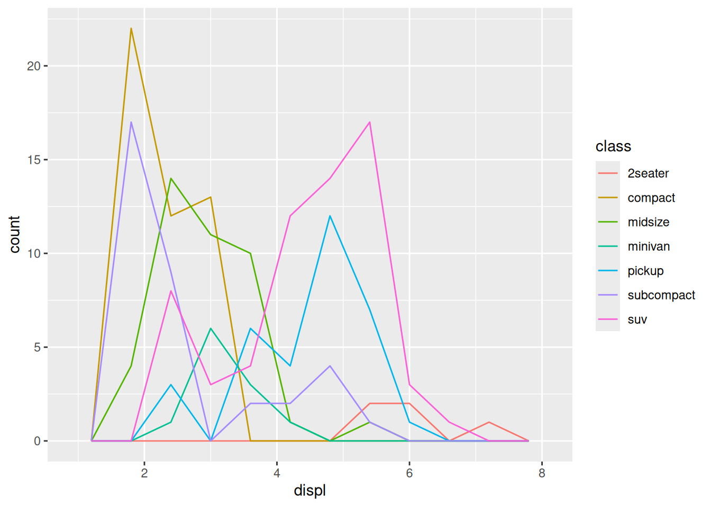

# Vis: Histograms

*Purpose*: *Histograms* are a key tool for EDA. In this exercise we'll get a little more practice constructing and interpreting histograms and densities.

*Reading*: (None, this is the reading)


``` r
library(tidyverse)
```

```
## ── Attaching core tidyverse packages ──────────────────────── tidyverse 2.0.0 ──
## ✔ dplyr     1.1.4     ✔ readr     2.1.5
## ✔ forcats   1.0.0     ✔ stringr   1.5.1
## ✔ ggplot2   3.5.1     ✔ tibble    3.2.1
## ✔ lubridate 1.9.4     ✔ tidyr     1.3.1
## ✔ purrr     1.0.4     
## ── Conflicts ────────────────────────────────────────── tidyverse_conflicts() ──
## ✖ dplyr::filter() masks stats::filter()
## ✖ dplyr::lag()    masks stats::lag()
## ℹ Use the conflicted package (<http://conflicted.r-lib.org/>) to force all conflicts to become errors
```

## Histograms

A histogram is a form of bar chart. Much like `geom_bar()`, histograms count up rows. Unlike `geom_bar()`, a histogram is well-suited to deal with continuous data. To illustrate, let's look at the `displ` values in the `mpg` dataset with a `geom_bar()`:


``` r
## NOTE: No need to modify
mpg %>%
  ggplot(aes(displ)) +
  geom_bar()
```


Some of the `displ` values only appear once, but they're very close to similar values. This can give a misleading impression of the data. A *histogram* first "bins" the data before counting up rows. This allows us to combine values that are nearby:


``` r
## NOTE: No need to modify
mpg %>%
  ggplot(aes(displ)) +
  geom_histogram(bins = 20)
```


This view of the data gives a better impression of a "bulk" of data near `displ == 2`.

### __q1__ Make a histogram

Make a histogram of `cty` fuel economy.


``` r
## TASK: Make a histogram of
mpg %>%
  ggplot(aes(cty)) +
  geom_histogram()
```

```
## `stat_bin()` using `bins = 30`. Pick better value with `binwidth`.
```


## The golden rule of histograms

Since we have to bin the data to make a histogram, there is an important choice to be made in the number of bins. A different bin count can lead to a totally different view of the data.

If we pick very few bins, we lose a lot of resolution:


``` r
## NOTE: No need to modify
mpg %>%
  ggplot(aes(displ)) +
  geom_histogram(bins = 5)
```


This plot gives the impression that the data peaks around `displ == 3` or so. However, we get a different view with more bins,


``` r
## NOTE: No need to modify
mpg %>%
  ggplot(aes(displ)) +
  geom_histogram(bins = 10)
```


This plot shows us a peak around `displ == 2` and another peak around `displ == 5`. Increasing the bin count again gives us yet another view,


``` r
## NOTE: No need to modify
mpg %>%
  ggplot(aes(displ)) +
  geom_histogram(bins = 15)
```


We still see a peak around `displ == 2`, but now the peak near `displ == 5` seems more diffuse. Patterns that tend to persist across multiple bin sizes tend to be more trustworthy.

## Frequency polygons

Frequency polygons are a useful tool to show "histograms" with multiple groups. As we saw last time, bars can easily overlap. A frequency polygon bins the data, but shows counts using lines (rather than bars),


``` r
## NOTE: No need to modify
mpg %>%
  ggplot(aes(displ, color = class)) +
  geom_freqpoly(bins = 10)
```



Note how we can see all the lines, and nothing is stacked (since there are no bars).


## Density plots

There's one more alternative to a frequency polygon, which is to plot an estimated density of the data. We'll talk about (probability) densities later in the class, but for now, the thing to know is that densities always integrate to `1`.


``` r
## NOTE: No need to modify
mpg %>%
  ggplot(aes(displ, color = class)) +
  geom_density()
```


Density plots are better for showing where the data tends to be located. Frequency polygon plots also show where the data is located, but are better for showing the relative size of each group.

### __q2__ Interpret a graph

Using the graphs generated in the chunks `q1-vis1` and `q1-vis2` below, answer:

- Which `class` has the most vehicles?
- Which `class` has the broadest distribution of `cty` values?
- Which graph---`vis1` or `vis2`---best helps you answer each question?


``` r
## NOTE: No need to modify
mpg %>%
  ggplot(aes(cty, color = class)) +
  geom_freqpoly(bins = 10)
```


- From this graph, it's easy to see that `suv` is the most numerous class


``` r
## NOTE: No need to modify
mpg %>%
  ggplot(aes(cty, color = class)) +
  geom_density()
```


- From this graph, it's easy to see that `subcompact` has the broadest distribution

In my opinion, it's easier to see the broadness of `subcompact` by the density plot `q1-vis2`.

In the previous exercise, we learned how to *facet* a graph. Let's use that part of the grammar of graphics to clean up the graph above.

### __q3__ Modify a plot

Modify `q1-vis2` to use a `facet_wrap()` on the `class`. "Free" the vertical axis with the `scales` keyword to allow for a different y scale in each facet.


``` r
mpg %>%
  ggplot(aes(cty)) +
  geom_density() +
  facet_wrap(~class, scales = "free_y")
```


In the reading, we learned that the "most important thing" to keep in mind with `geom_histogram()` and `geom_freqpoly()` is to _explore different binwidths_. We'll explore this idea in the next question.

### __q4__ Analyze a histogram

Analyze the following graph; make sure to test different binwidths. What patterns do you see? Which patterns remain as you change the binwidth?


``` r
## TODO: Run this chunk; play with differnet bin widths
diamonds %>%
  filter(carat < 1.1) %>%

  ggplot(aes(carat)) +
  geom_histogram(binwidth = 0.01, boundary = 0.005) +
  scale_x_continuous(
    breaks = seq(0, 1, by = 0.1)

  )
```


**Observations**
- The largest number of diamonds tend to fall on *or above* even 10-ths of a carat.
- The peak near `0.5` is very broad, compared to the others.
- The peak at `0.3` is most numerous

<!-- include-exit-ticket -->
