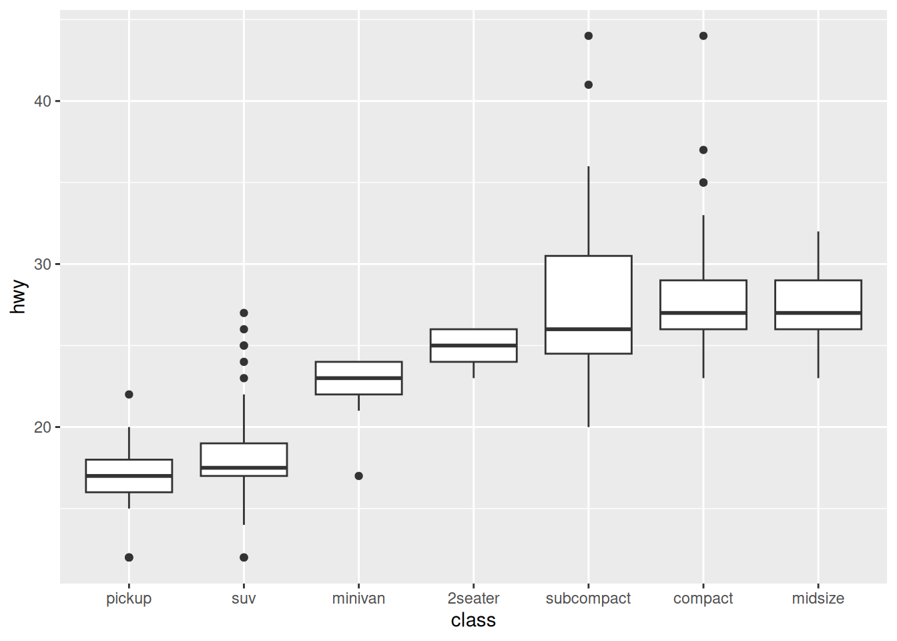

# Vis: Boxplots and Counts

*Purpose*: *Boxplots* are a key tool for EDA. Like histograms, boxplots give us a sense of "shape" for a distribution. However, a boxplot is a *careful summary* of shape. This helps us pick out key features of a distribution, and enables easier comparison of different distributions.

*Reading*: [Boxplots and Counts](https://rstudio.cloud/learn/primers/3.4)
*Topics*: (All topics)
*Reading Time*: ~20 minutes


```r
library(tidyverse)
```

```
## ── Attaching packages ─────────────────────────────────────── tidyverse 1.3.1 ──
```

```
## ✔ ggplot2 3.3.5     ✔ purrr   0.3.4
## ✔ tibble  3.1.2     ✔ dplyr   1.0.7
## ✔ tidyr   1.1.3     ✔ stringr 1.4.0
## ✔ readr   1.4.0     ✔ forcats 0.5.1
```

```
## ── Conflicts ────────────────────────────────────────── tidyverse_conflicts() ──
## ✖ dplyr::filter() masks stats::filter()
## ✖ dplyr::lag()    masks stats::lag()
```

A *subtle point* from the primer is that we can use `dplyr` to generate new
facts about our data, then use `ggplot2` to visualize those facts. We'll
practice this idea in a number of ways.

### __q1__ Use a `cut_*` verb to create a categorical variable out of `carat`. Tweak
the settings in your cut and document your observations.

*Hint*: Recall that we learned about `cut_interval, cut_number, cut_width`. Take
your pick!


```r
diamonds %>%
  mutate(carat_cut = cut_width(carat, width = 0.5, boundary = 0)) %>%
  ggplot(aes(x = carat_cut, y = price)) +
  geom_boxplot()
```


**Observations**
- Price tends to increase with carat
- Median price rises dramatically across carat [0, 2]
- Median price is roughly constant across carat [2, 4.5]
- Across carat [2, 4.5], the whiskers have essentially the same max price
- The IQR is quite small at low carat, but increases with carat; the prices become more variable at higher carat

### __q2__ The following code visualizes the count of diamonds of *all* carats according to their cut and color. Modify the code to consider *only* diamonds with `carat >= 2`. Does the most common group of cut and color change?


```r
## NOTE: No need to modify; run and inspect
diamonds %>%
  count(cut, color) %>%
  ggplot(aes(cut, color, fill = n)) +
  geom_tile()
```


Modify the following code:


```r
diamonds %>%
  filter(carat >= 2) %>%
  count(cut, color) %>%
  ggplot(aes(cut, color, fill = n)) +
  geom_tile()
```



**Observations**:
- Yes, it used to be `G, Ideal`, but is now `I, Premium`

### __q3__ The following plot has overlapping x-axis labels. Use a verb from the reading to `flip` the coordinates and improve readability.


```r
mpg %>%
  ggplot(aes(manufacturer, hwy)) +
  geom_boxplot() +
  coord_flip()
```


This is a simple---but important---trick to remember when visualizing data with many categories.

<!-- include-exit-ticket -->
