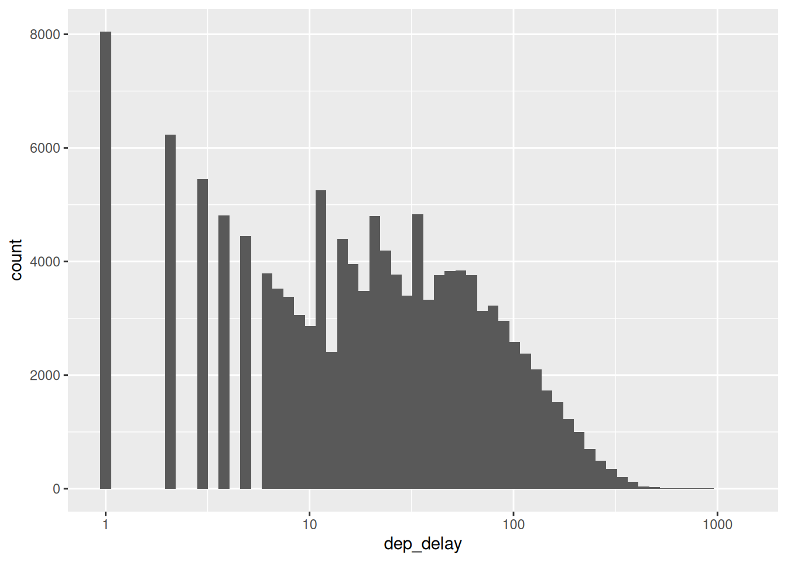
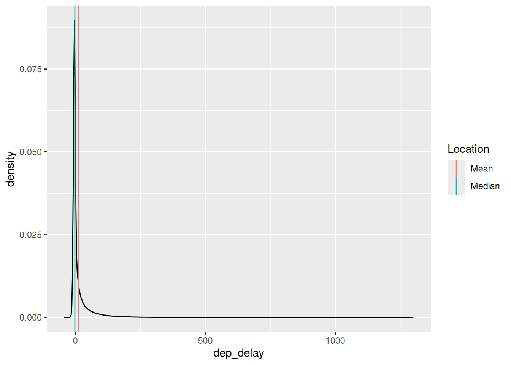
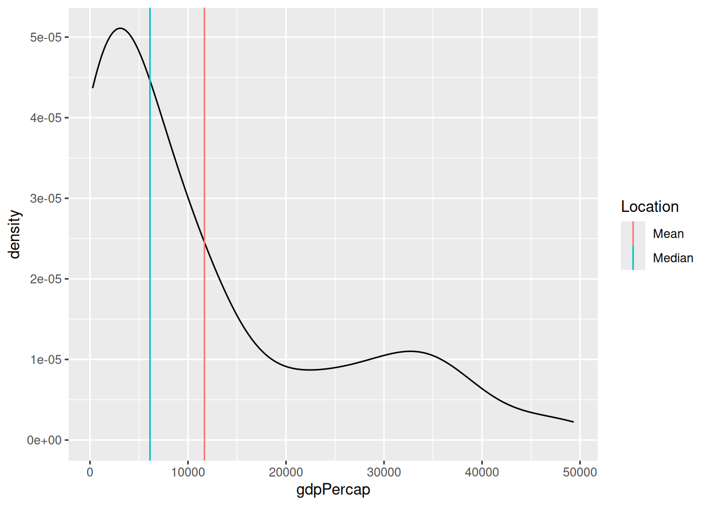
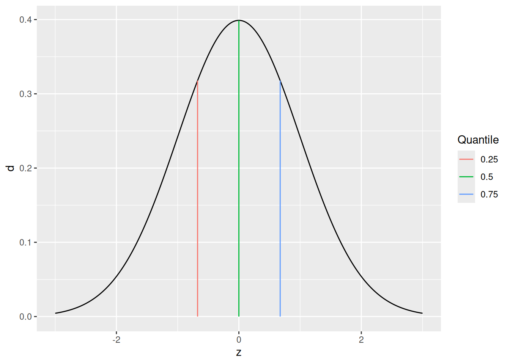
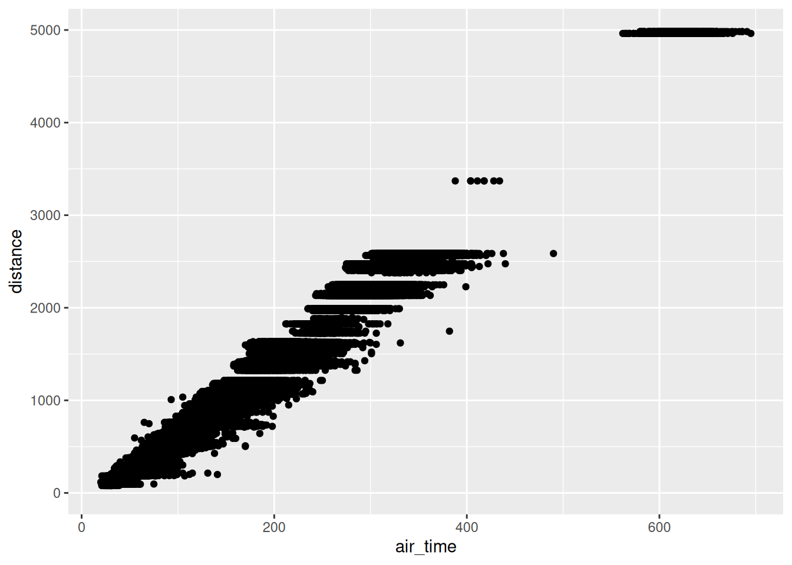
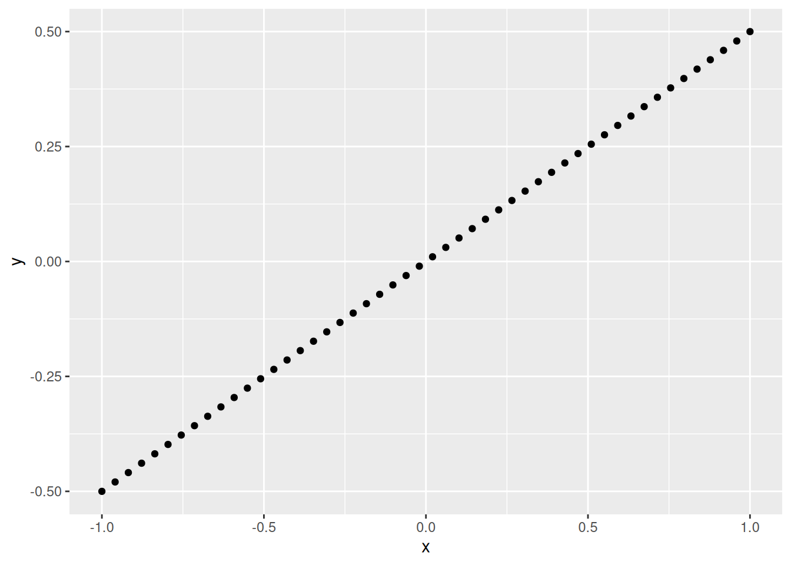
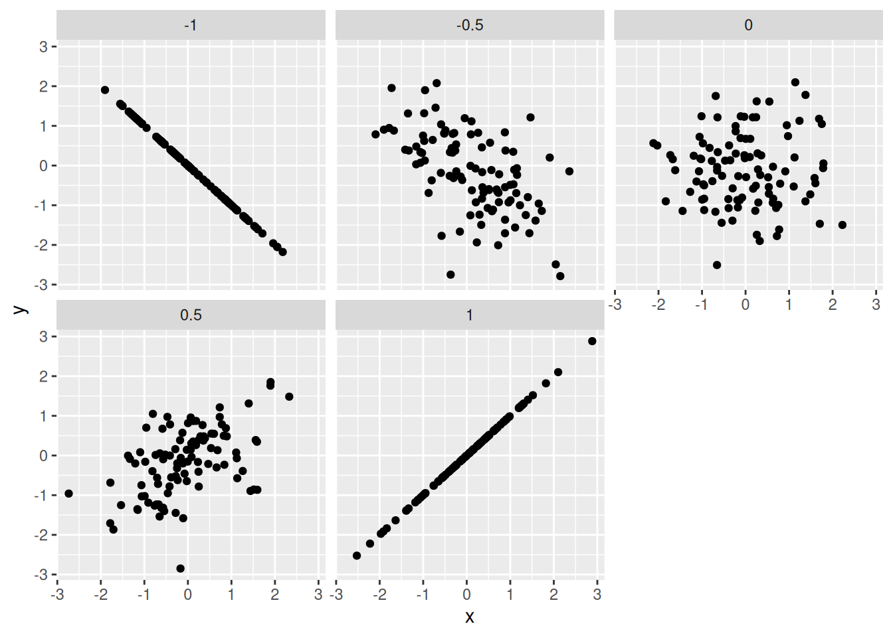
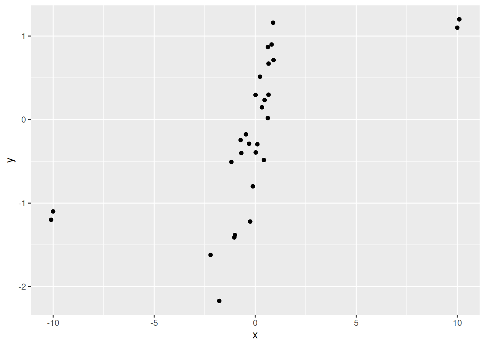

# Stats: Descriptive Statistics

*Purpose*: We will use *descriptive statistics* to make quantitative summaries of a dataset. Descriptive statistics provide a much more compact description than a visualization, and are important when a data consumer wants "just one number".

*Reading*: (None; this exercise *is* the reading.)

*Topics*: Mean, standard deviation, median, quantiles, dependence, correlation, robustness


```r
library(tidyverse)
```

```
## ── Attaching packages ─────────────────────────────────────── tidyverse 1.3.0 ──
```

```
## ✔ ggplot2 3.4.0      ✔ purrr   1.0.1 
## ✔ tibble  3.1.8      ✔ dplyr   1.0.10
## ✔ tidyr   1.2.1      ✔ stringr 1.5.0 
## ✔ readr   2.1.3      ✔ forcats 0.5.2
```

```
## ── Conflicts ────────────────────────────────────────── tidyverse_conflicts() ──
## ✖ dplyr::filter() masks stats::filter()
## ✖ dplyr::lag()    masks stats::lag()
```

```r
library(nycflights13)
library(gapminder)
library(mvtnorm)

## NOTE: No need to change this!
vis_central <- function(df, var) {
  df %>%
    ggplot(aes({{var}})) +
    geom_density() +
    geom_vline(
      data = . %>% summarize(mu = mean({{var}}, na.rm = TRUE)),
      mapping = aes(xintercept = mu, color = "Mean")
    ) +
    geom_vline(
      data = . %>% summarize(mu = median({{var}}, na.rm = TRUE)),
      mapping = aes(xintercept = mu, color = "Median")
    ) +
    scale_color_discrete(name = "Location")
}
```

## Statistics
<!-- -------------------------------------------------- -->

A *statistic* is a numerical summary of a sample. Statistics are useful because they provide a useful summary about our data. A histogram gives us a rich summary of a datset: for example the departure delay time in the NYC flight data.


```r
## NOTE: No need to change this!
flights %>%
  ggplot(aes(dep_delay)) +
  geom_histogram(bins = 60) +
  scale_x_log10()
```

```
## Warning in self$trans$transform(x): NaNs produced
```

```
## Warning: Transformation introduced infinite values in continuous x-axis
```

```
## Warning: Removed 208344 rows containing non-finite values (`stat_bin()`).
```



However, we might be interested in a few questions about these data:

- What is a *typical* value for the departure delay? (Location)
- How *variable* are departure delay times? (Spread)
- How much does departure delay *co-vary* with distance? (Dependence)

We can give quantitative answers to all these questions using statistics!

## Handling NA's
<!-- ------------------------- -->

Before we can start computing (descriptive) statistics, we need to learn how to deal with data issues. For instance, in the NYC flights data, we have a number of `NA`s.


```r
## NOTE: No need to change this!
flights %>%
  summarize(across(where(is.numeric), ~sum(is.na(.)))) %>%
  glimpse
```

```
## Rows: 1
## Columns: 14
## $ year           <int> 0
## $ month          <int> 0
## $ day            <int> 0
## $ dep_time       <int> 8255
## $ sched_dep_time <int> 0
## $ dep_delay      <int> 8255
## $ arr_time       <int> 8713
## $ sched_arr_time <int> 0
## $ arr_delay      <int> 9430
## $ flight         <int> 0
## $ air_time       <int> 9430
## $ distance       <int> 0
## $ hour           <int> 0
## $ minute         <int> 0
```

These `NA`s will "infect" our computation, and lead to `NA` summaries.


```r
## NOTE: No need to change this!
flights %>%
  summarize(across(where(is.numeric), mean)) %>%
  glimpse
```

```
## Rows: 1
## Columns: 14
## $ year           <dbl> 2013
## $ month          <dbl> 6.54851
## $ day            <dbl> 15.71079
## $ dep_time       <dbl> NA
## $ sched_dep_time <dbl> 1344.255
## $ dep_delay      <dbl> NA
## $ arr_time       <dbl> NA
## $ sched_arr_time <dbl> 1536.38
## $ arr_delay      <dbl> NA
## $ flight         <dbl> 1971.924
## $ air_time       <dbl> NA
## $ distance       <dbl> 1039.913
## $ hour           <dbl> 13.18025
## $ minute         <dbl> 26.2301
```

Let's learn how to handle this:

### __q1__ The following code returns `NA`. Look up the documentation for `mean` and use an additional argument to strip the `NA` values in the dataset before computing the mean. Make this modification to the code below and report the mean departure delay time.


```r
## TASK: Edit to drop all NAs before computing the mean
flights %>%
  summarize(dep_delay = mean(dep_delay, na.rm = TRUE))
```

```
## # A tibble: 1 × 1
##   dep_delay
##       <dbl>
## 1      12.6
```

**Observations**:

- The mean departure delay is about `12.6` minutes

## Central Tendency
<!-- ------------------------- -->

*Central tendency* is the idea of where data tend to be "located"---this concept is also called *location*. It is best thought of as the "center" of the data. The following graph illustrates central tendency.


```r
## NOTE: No need to change this!
set.seed(101)
tibble(z = rnorm(n = 1e3)) %>%
  vis_central(z)
```


There are two primary measures of central tendency; the *mean* and *median*. The mean is the simple [arithmetic average](https://en.wikipedia.org/wiki/Arithmetic_mean): the sum of all values divided by the total number of values. The mean is denoted by $\overline{x}$ and defined by

$$\overline{X} = \frac{1}{n} \sum_{i=1}^n X_i,$$

where $n$ is the number of data points, and the $X_i$ are the individual values.

The [median](https://en.wikipedia.org/wiki/Median) is the value that separates half the data above and below. Weirdly, there's no standard symbol for the median, so we'll just denote it as $\text{Median}[D]$ to denote the median of a set of data $D$.

The median is a *robust* statistic, which is best illustrated by example. Consider the following two samples `v_base` and `v_outlier`. The sample `v_outlier` has an *outlier*, a value very different from the other values. Observe what value the mean and median take for these different samples.


```r
## NOTE: No need to change this!
v_base <- c(1, 2, 3, 4, 5)
v_outlier <- c(v_base, 1e3)

tibble(
  mean_base = mean(v_base),
  median_base = median(v_base),

  mean_outlier = mean(v_outlier),
  median_outlier = median(v_outlier)
) %>% glimpse
```

```
## Rows: 1
## Columns: 4
## $ mean_base      <dbl> 3
## $ median_base    <dbl> 3
## $ mean_outlier   <dbl> 169.1667
## $ median_outlier <dbl> 3.5
```

Note that for `v_outlier` the mean is greatly increased, but the median is only slightly changed. It is in this sense that the median is *robust*---it is robust to outliers. When one has a dataset with outliers, the median is usually a better measure of central tendency.[1]

It can be useful to think about when the mean and median agree or disagree with each other. For instance, with the flights data:


```r
## NOTE: No need to change this!
flights %>% vis_central(dep_delay)
```

```
## Warning: Removed 8255 rows containing non-finite values (`stat_density()`).
```



the mean and median `dep_delay` largely agree (relative to all the other data). But for the gapminder data:


```r
## NOTE: No need to change this!
gapminder %>%
  filter(year == max(year)) %>%
  vis_central(gdpPercap)
```



the mean and median `gdpPercap` disagree.[2]

### __q2__ The following code computes the mean and median `dep_delay` for each carrier, and sorts based on mean. Duplicate the code, and sort by median instead. Report your observations on which carriers are in both lists, and which are different. Also comment on what negative `dep_delay` values mean.

*Hint*: Remember you can check the documentation of a built-in dataset with `?flights`!


```r
## NOTE: No need to change this!
flights %>%
  group_by(carrier) %>%
  summarize(
    mean = mean(dep_delay, na.rm = TRUE),
    median = median(dep_delay, na.rm = TRUE)
  ) %>%
  arrange(desc(mean)) %>%
  head(5)
```

```
## # A tibble: 5 × 3
##   carrier  mean median
##   <chr>   <dbl>  <dbl>
## 1 F9       20.2    0.5
## 2 EV       20.0   -1  
## 3 YV       19.0   -2  
## 4 FL       18.7    1  
## 5 WN       17.7    1
```

```r
## TASK: Duplicate the code above, but sort by `median` instead
flights %>%
  group_by(carrier) %>%
  summarize(
    mean = mean(dep_delay, na.rm = TRUE),
    median = median(dep_delay, na.rm = TRUE)
  ) %>%
  arrange(desc(median)) %>%
  head(5)
```

```
## # A tibble: 5 × 3
##   carrier  mean median
##   <chr>   <dbl>  <dbl>
## 1 FL       18.7    1  
## 2 WN       17.7    1  
## 3 F9       20.2    0.5
## 4 UA       12.1    0  
## 5 VX       12.9    0
```

**Observations**:

- The carriers `F9, FL, WN` are in both lists
- The carriers `EV, YV` are top in mean, while `UA, VX` are top in median
- Negative values of `dep_delay` signal early departures

## Multi-modality
<!-- ------------------------- -->

It may not seem like it, but we're actually *making an assumption* when we use the mean (or median) as a typical value. Imagine we had the following data:


```r
bind_rows(
  tibble(X = rnorm(300, mean = -2)),
  tibble(X = rnorm(300, mean = +2))
) %>%

  ggplot(aes(X)) +
  geom_histogram(bins = 60) +
  geom_vline(aes(xintercept = mean(X), color = "Mean")) +
  geom_vline(aes(xintercept = median(X), color = "Median")) +
  scale_color_discrete(name = "Statistic")
```


Here the mean and median are both close to zero, but *zero is an atypical number*! This is partly why we don't *only* compute descriptive statistics, but also do a deeper dive into our data. Here, we should probably refuse to give a single typical value; instead, it seems there might really be two populations showing up in the same dataset, so we can give two typical numbers, say `-2, +2`.


## Quantiles
<!-- ------------------------- -->

Before we can talk about spread, we need to talk about *quantiles*. A [quantile](https://en.wikipedia.org/wiki/Quantile) is a value that separates a user-specified fraction of data (or a distribution). For instance, the median is the $50%$ quantile; thus $\text{Median}[D] = Q_{0.5}[D]$. We can generalize this idea to talk about any quantile between $0%$ and $100%$.

The following graph visualizes the $25%, 50%, 75%$ quantiles of a standard normal. Since these are the quarter-quantiles ($1/4, 2/4, 3/4$), these are often called the *quartiles*.


```r
## NOTE: No need to change this!
tibble(z = seq(-3, +3, length.out = 500)) %>%
  mutate(d = dnorm(z)) %>%

  ggplot(aes(z, d)) +
  geom_line() +
  geom_segment(
    data = tibble(p = c(0.25, 0.50, 0.75)) %>%
      mutate(
        z = qnorm(p),
        d = dnorm(z)
      ),
    mapping = aes(xend = z, yend = 0, color = as_factor(p))
  ) +
  scale_color_discrete(name = "Quantile")
```



*Note*: The function `qnorm` returns the quantiles of a normal distribution. We'll focus on quantiles of *samples* in this exercise.

We'll use the quartiles to define the *interquartile range*. First, the `quantile()` function computes quantiles of a sample. For example:


```r
## NOTE: No need to change this! Run for an example
flights %>%
  pull(dep_delay) %>%
  quantile(., probs = c(0, 0.25, 0.50, 0.75, 1.00), na.rm = TRUE)
```

```
##   0%  25%  50%  75% 100% 
##  -43   -5   -2   11 1301
```

Like with `mean, median`, we need to specify if we want to remove `NA`s. We can provide a list of `probs` to specify the probabilities of the quantiles. Remember: a *probability* is a value between $[0, 1]$, while a *quantile* is a value that probably has units, like minutes in the case of `dep_delay`.

Now we can define the interquartile range:

$$IQR[D] = Q_{0.75}[D] - Q_{0.25}[D]$$,

where $Q_{p}[D]$ is the $p$-th quantile of a sample $D$.

### __q3__ Using the function `quantile`, compute the *interquartile range*; this is the difference between the $75%$ and $25%$ quantiles.


```r
## NOTE: No need to change this!
set.seed(101)
v_test_iqr <- rnorm(n = 10)

test_iqr <- quantile(v_test_iqr, probs = 0.75) - quantile(v_test_iqr, probs = 0.25)
```

Use the following test to check your answer.


```r
## NOTE: No need to change this!
assertthat::assert_that(test_iqr == IQR(v_test_iqr))
```

```
## [1] TRUE
```

```r
print("Great job!")
```

```
## [1] "Great job!"
```

## Spread
<!-- ------------------------- -->

*Spread* is the concept of how tightly or widely data are *spread out*. There are two primary measures of spread: the *standard deviation*, and the *interquartile range*.

The [standard deviation](https://en.wikipedia.org/wiki/Standard_deviation) (SD) is denoted by $s$ and defined by

$$s = \sqrt{ \frac{1}{n-1} \sum_{i=1}^n (X_i - \overline{X})^2 },$$

where $\overline{X}$ is the mean of the data. Note the factor of $n-1$ rather than $n$: This slippery idea is called [Bessel's correction](https://en.wikipedia.org/wiki/Bessel%27s_correction). Note that $\sigma^2$ is called the *variance*.

By way of analogy, mean is to standard deviation as median is to IQR: The IQR is a robust measure of spread. Returning to our outlier example:


```r
## NOTE: No need to change this!
v_base <- c(1, 2, 3, 4, 5)
v_outlier <- c(v_base, 1e3)

tibble(
  sd_base = sd(v_base),
  IQR_base = IQR(v_base),

  sd_outlier = sd(v_outlier),
  IQR_outlier = IQR(v_outlier)
) %>% glimpse
```

```
## Rows: 1
## Columns: 4
## $ sd_base     <dbl> 1.581139
## $ IQR_base    <dbl> 2
## $ sd_outlier  <dbl> 407.026
## $ IQR_outlier <dbl> 2.5
```

### __q4__ Using the code from q2 as a starting point, compute the standard deviation (`sd()`) and interquartile range (`IQR()`), and rank the top five carriers, this time by sd and IQR. Report your observations on which carriers are in both lists, and which are different. Also note and comment on which carrier (among your top-ranked) has the largest difference between `sd` and `IQR`.


```r
## TODO: Use code from q2 to compute the sd and IQR, rank as before
flights %>%
  group_by(carrier) %>%
  summarize(
    sd = sd(dep_delay, na.rm = TRUE),
    IQR = IQR(dep_delay, na.rm = TRUE)
  ) %>%
  arrange(desc(sd)) %>%
  head(5)
```

```
## # A tibble: 5 × 3
##   carrier    sd   IQR
##   <chr>   <dbl> <dbl>
## 1 HA       74.1     6
## 2 F9       58.4    22
## 3 FL       52.7    21
## 4 YV       49.2    30
## 5 EV       46.6    30
```

```r
flights %>%
  group_by(carrier) %>%
  summarize(
    sd = sd(dep_delay, na.rm = TRUE),
    IQR = IQR(dep_delay, na.rm = TRUE)
  ) %>%
  arrange(desc(IQR)) %>%
  head(5)
```

```
## # A tibble: 5 × 3
##   carrier    sd   IQR
##   <chr>   <dbl> <dbl>
## 1 EV       46.6    30
## 2 YV       49.2    30
## 3 9E       45.9    23
## 4 F9       58.4    22
## 5 FL       52.7    21
```

**Observations**:

- The carriers `F9, FL, YV, EV` are in both lists
- The carrier `HA` is top in `sd`, while `9E` is top in IQR
- `HA` has a large difference between `sd` and `IQR`; based on the following vis, it appears that `HA` has a lot more outliers than other carriers, which bumps up its `sd`


```r
flights %>%
  filter(carrier %in% c("HA", "F9", "FL", "YV", "EV")) %>%
  ggplot(aes(carrier, dep_delay)) +
  geom_boxplot()
```

```
## Warning: Removed 2949 rows containing non-finite values (`stat_boxplot()`).
```


## Dependence
<!-- ------------------------- -->

So far, we've talked about descriptive statistics to consider one variable at a time. To conclude, we'll talk about statistics to consider *dependence* between two variables in a dataset.

[Dependence](https://en.wikipedia.org/wiki/Correlation_and_dependence)---like location or spread---is a general idea of relation between two variables. For instance, when it comes to flights we'd expect trips between more distant airports to take longer. If we plot `distance` vs `air_time` in a scatterplot, we indeed see this dependence.


```r
flights %>%
  ggplot(aes(air_time, distance)) +
  geom_point()
```

```
## Warning: Removed 9430 rows containing missing values (`geom_point()`).
```



Two flavors of correlation help us make this idea quantitative: the *Pearson correlation* and *Spearman correlation*. Unlike our previous quantities for location and spread, these correlations are *dimensionless* (they have no units), and they are bounded between $[-1, +1]$.

The [Pearson correlation](https://en.wikipedia.org/wiki/Pearson_correlation_coefficient) is often denoted by $r_{XY}$, and it specifies the variables being considered $X, Y$. It is defined by

$$r_{XY} = \frac{\sum_{i=1}^n (X_i - \overline{X}) (Y_i - \overline{Y})}{s_X s_Y}.$$

The [Spearman correlation](https://en.wikipedia.org/wiki/Spearman%27s_rank_correlation_coefficient) is often denoted by $\rho_{XY}$, and is actually defined in terms of the Pearson correlation $r_{XY}$, but with the ranks ($1$ to $n$) rather than the values $X_i, Y_i$.

For example, we might expect a strong correlation between the `air_time` and the `distance` between airports. The function `cor` computes the Pearson correlation.


```r
## NOTE: No need to change this!
flights %>%
  summarize(rho = cor(air_time, distance, use = "na.or.complete"))
```

```
## # A tibble: 1 × 1
##     rho
##   <dbl>
## 1 0.991
```

*Note*: Unfortunately, the function `cor` doesn't follow the same pattern as `mean` or `sd`. We have to use this `use` argument to filter `NA`s.

However, we wouldn't expect any relation between `air_time` and `month`.


```r
## NOTE: No need to change this!
flights %>%
  summarize(rho = cor(air_time, month, use = "na.or.complete"))
```

```
## # A tibble: 1 × 1
##      rho
##    <dbl>
## 1 0.0109
```

In the case of a *perfect linear relationships* the Pearson correlation takes the value $+1$ (for a positive slope) or $-1$ for a negative slope.

### __q5__ Compute the Pearson correlation between `x, y` below. Play with the `slope` and observe the change in the correlation.


```r
slope <- 0.5 # Play with this value; observe the correlation
df_line <-
  tibble(x = seq(-1, +1, length.out = 50)) %>%
  mutate(y = slope * x)


df_line %>%
  ggplot(aes(x, y)) +
  geom_point()
```



**Observations**:

- `slope` values greater than 0 have a positive correlation
- `slope` values less than 0 have a negative correlation

Note that this means *correlation is a measure of dependence*; it is **not** a measure of slope! It is better thought of as how *strong* the relationship between two variables is. A closer-to-zero correlation indicates a noisy relationship between variables, while a closer-to-one (in absolute value) indicates a more perfect, predictable relationship between the variables. For instance, the following code simulates data with different correlations, and facets the data based on the underlying correlation.


```r
## NOTE: No need to change this!
map_dfr(
  c(-1.0, -0.5, +0.0, +0.5, +1.0), # Chosen correlations
  function(r) {
    # Simulate a multivariate gaussian
    X <- rmvnorm(
      n = 100,
      sigma = matrix(c(1, r, r, 1), nrow = 2)
    )
    # Package and return the data
    tibble(
      x = X[, 1],
      y = X[, 2],
      r = r
    )
  }
) %>%
  # Plot the data
  ggplot(aes(x, y)) +
  geom_point() +
  facet_wrap(~r)
```



One of the primary differences between Pearson and Spearman is that Pearson is a *linear correlation*, while Spearman is a *nonlinear correlation*. For instance, the following data


```r
## NOTE: No need to change this!
# Positive slope
df_monotone <-
  tibble(x = seq(-pi/2 + 0.1, +pi/2 - 0.1, length.out = 50)) %>%
  mutate(y = tan(x))

df_monotone %>%
  ggplot(aes(x, y)) +
  geom_point()
```


have a perfect relationship between them. The Pearson correlation does not pick up on this fact, while the Spearman correlation indicates a perfect relation.


```r
# Positive slope
df_monotone %>%
  summarize(rho = cor(x, y, method = "pearson"))
```

```
## # A tibble: 1 × 1
##     rho
##   <dbl>
## 1 0.846
```

```r
df_monotone %>%
  summarize(rho = cor(x, y, method = "spearman"))
```

```
## # A tibble: 1 × 1
##     rho
##   <dbl>
## 1     1
```

One more note about functional relationships: Neither Pearson nor Spearman can pick up on arbitrary dependencies.

### __q6__ Run the code chunk below and look at the visualization: Make a prediction about what you think the correlation will be. Then compute the Pearson correlation between `x, y` below.


```r
## NOTE: No need to change this!
df_quad <-
  tibble(x = seq(-1, +1, length.out = 50)) %>%
  mutate(y = x^2 - 0.5)

## TASK: Compute the Pearson and Spearman correlations on `df_quad`
df_quad %>%
  summarize(rho = cor(x, y, method = "pearson"))
```

```
## # A tibble: 1 × 1
##         rho
##       <dbl>
## 1 -2.02e-16
```

```r
df_quad %>%
  summarize(rho = cor(x, y, method = "spearman"))
```

```
## # A tibble: 1 × 1
##       rho
##     <dbl>
## 1 -0.0236
```

```r
df_quad %>%
  ggplot(aes(x, y)) +
  geom_point()
```


**Observations**:

- Both correlations are near-zero

One last point about correlation: The mean is to Pearson correlation as the median is to Spearman correlation. The median and Spearman's rho are robust to outliers.


```r
## NOTE: No need to change this!
set.seed(101)
X <- rmvnorm(
  n = 25,
  sigma = matrix(c(1, 0.9, 0.9, 1), nrow = 2)
)

df_cor_outliers <-
  tibble(
    x = X[, 1],
    y = X[, 2]
  ) %>%
  bind_rows(tibble(x = c(-10.1, -10, 10, 10.1), y = c(-1.2, -1.1, 1.1, 1.2)))

df_cor_outliers %>%
  ggplot(aes(x, y)) +
  geom_point()
```



```r
df_cor_outliers %>%
  summarize(rho = cor(x, y, method = "pearson"))
```

```
## # A tibble: 1 × 1
##     rho
##   <dbl>
## 1 0.621
```

```r
df_cor_outliers %>%
  summarize(rho = cor(x, y, method = "spearman"))
```

```
## # A tibble: 1 × 1
##     rho
##   <dbl>
## 1 0.884
```

<!-- include-exit-ticket -->

## Notes
<!-- -------------------------------------------------- -->

[1] So then why bother with the mean? It turns out the mean is a fundamental idea in statistics, as it's a key component of *a lot* of other statistical procedures. You'll end up using the mean in countless different ways, so it's worth recognizing its weakness to outliers.

[2] As a side note, since dollars are pretty-well divorced from reality (there's not physical upper bound on perceived value), distributions of dollars can have very large outliers. That's why you often see *median* incomes reported, rather than *mean* income.
