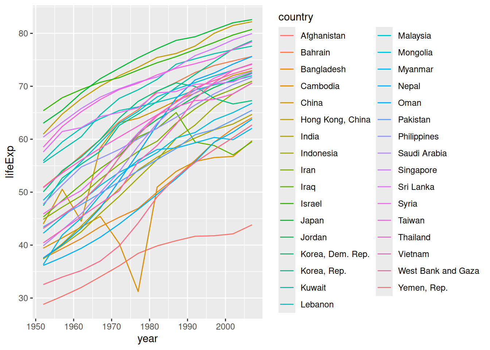
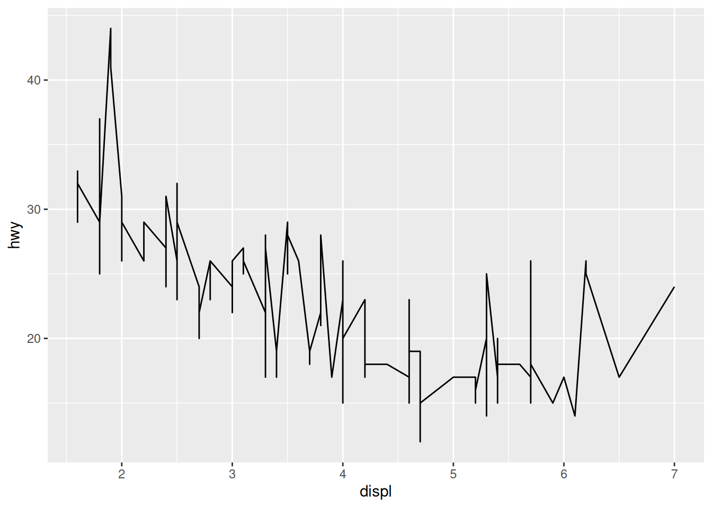
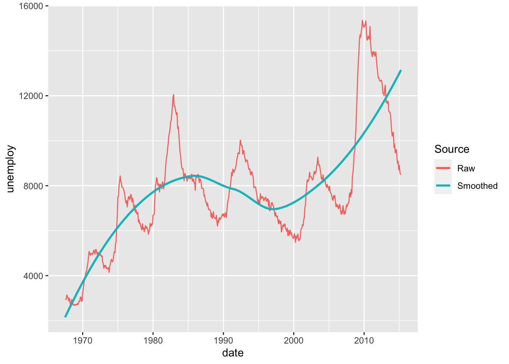

# Vis: Lines

*Purpose*: *Line plots* are a key tool for EDA. In contrast with a scatterplot,
a line plot assumes the data have a *function* relation. This can create an
issue if we try to plot data that do not satisfy our assumptions. In this
exercise, we'll practice some best-practices for constructing line plots.

*Reading*: [Line plots](https://rstudio.cloud/learn/primers/3.6)
*Topics*: Welcome, Line graphs, Similar geoms (skip Maps)
*Reading Time*: ~30 minutes


```r
library(tidyverse)
```

```
## ── Attaching packages ─────────────────────────────────────── tidyverse 1.3.0 ──
```

```
## ✔ ggplot2 3.4.0      ✔ purrr   1.0.1 
## ✔ tibble  3.1.8      ✔ dplyr   1.0.10
## ✔ tidyr   1.2.1      ✔ stringr 1.5.0 
## ✔ readr   2.1.3      ✔ forcats 0.5.2
```

```
## ── Conflicts ────────────────────────────────────────── tidyverse_conflicts() ──
## ✖ dplyr::filter() masks stats::filter()
## ✖ dplyr::lag()    masks stats::lag()
```

```r
library(gapminder)
```

### __q1__ The following graph doesn't work as its author intended. Based on what we learned in the reading, fix the following code.


```r
gapminder %>%
  filter(continent == "Asia") %>%
  ggplot(aes(year, lifeExp, color = country)) +
  geom_line()
```



### __q2__ A line plot makes *a certain assumption* about the underlying data. What assumption is this? How does that assumption relate to the following graph? Put differently, why is the use of `geom_line` a bad idea for the following dataset?


```r
## TODO: No need to edit; just answer the questions
mpg %>%
  ggplot(aes(displ, hwy)) +
  geom_line()
```



**Observations**:
- A line plot assumes the underlying data have a *function* relationship; that is, that there is one y value for every x value
- The `mpg` dataset does not have a function relation between `displ` and `hwy`; there are cars with identical values of `displ` but different values of `hwy`

### __q3__ The following graph shows both the raw data and a smoothed version. Describe the trends that you can see in the different curves.


```r
## TODO: No need to edit; just interpret the graph
economics %>%
  ggplot(aes(date, unemploy)) +
  geom_line(aes(color = "Raw")) +
  geom_smooth(aes(color = "Smoothed"), se = FALSE) +
  scale_color_discrete(name = "Source")
```

```
## `geom_smooth()` using method = 'loess' and formula = 'y ~ x'
```



**Observations**:
- The `Raw` data indicate short-term cyclical patterns that occur over a few years
- The `Smoothed` data indicate a longer-term trend occurring over decades

<!-- include-exit-ticket -->
