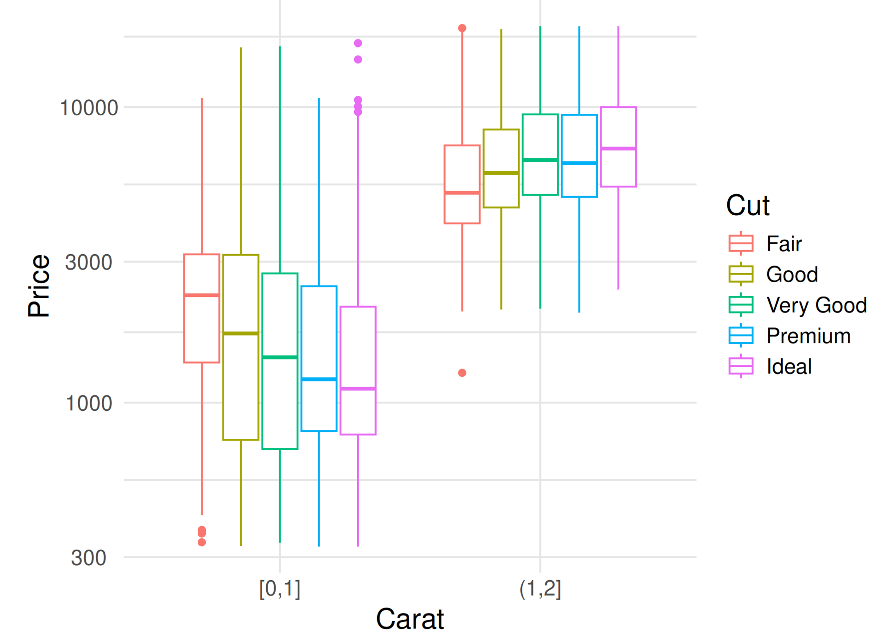
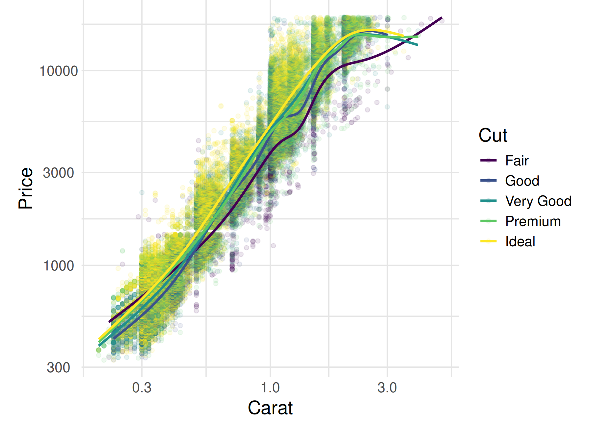
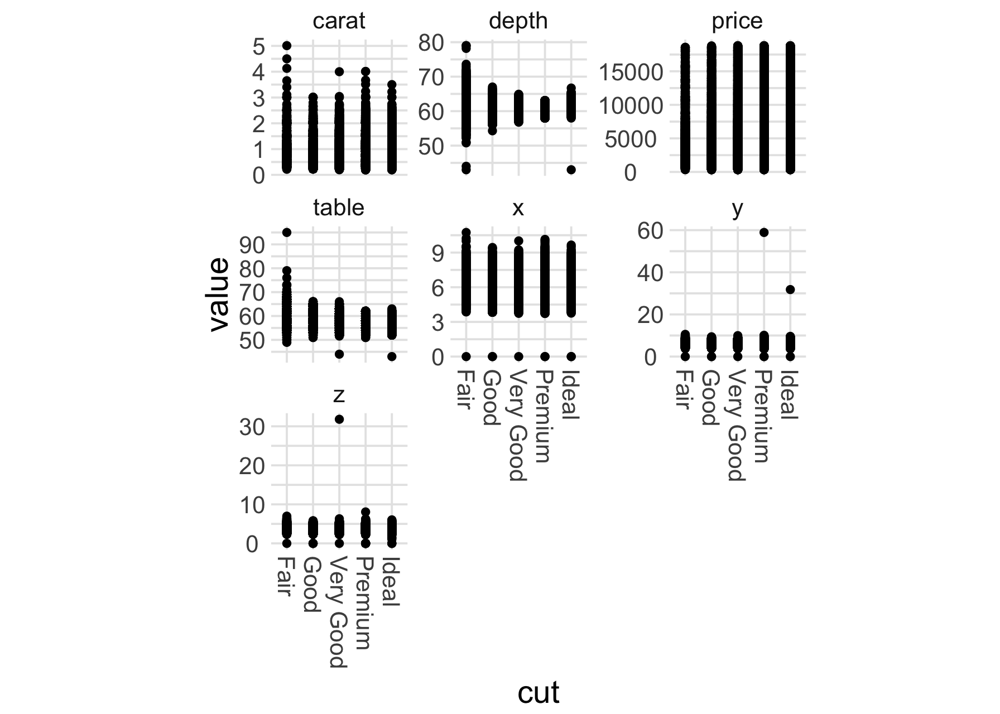

# Communication: Narrative Basics

*Purpose*: The point of data science is not to gather a random pile of facts;
it's to *do something* with those facts. One of our key goals in data science is
to help drive decisions and action---we accomplish this by communicating our
*data story*. Since story is fundamentally an exercise in narrative, we'll
start our data story training with some narrative basics.

*Reading*: [Randy Olson's TED Talk](https://www.youtube.com/watch?v=ERB7ITvabA4){target="_blank"}, introducing the *And, But, Therefore* (ABT) framework.
*Reading Time*: ~ 10 minutes

*Lesson Plan*: Ensure all students submit their narrative spectrum
classifications and justification through the Google Form. Set aside a
full-class meeting to discuss the student results. Visualize the results,
and see what (if any) consensus the class came to. Ask a few students who
classified the graphs differently to share their perspective. After gathering
student input, offer your own perspective on the graph. Repeat for
each example.

Make sure to emphasize that different people will read graphs differently;
we don't have *complete control* over the narrative when presenting a graph.
But the simpler and more focused our graph, the better control we have over
the narrative experienced. (TODO: Future exercises/activities should
emphasize this!)

## Exposition

Scientist-turned-storyteller Randy Olson[1] introduced the *narrative spectrum*.
Three points along the spectrum are listed below:

| TLA | Framework | Narrative Spectrum |
|-----|-----|-----|
| AAA | And, And, And | Non-narrative |
| ABT | And, But, Therefore | Just right! |
| DHY | Despite, However, Yet | Overly-narrative |

The narrative spectrum runs from non-narrative: introducing no conflict or
tension, to overly-narrative: introducing too many conflicting ideas. Olson
observed that the middle of the narrative spectrum is just the right amount of
narrative content. The extreme points tend to be boring:

- A child may tell a story like "We went to the store, AND the man had a hat,
  AND I lost a shoe, AND we went home." This story lacks any narrative content:
  no part of the story relates to any other part, so no conflict or drama
  can arise. (AAA)
- An extremely learned professor may tell a story like "Kolmogorov proposed a
  5/3 power law. HOWEVER Smith found 3/8 power law behavior. YET Chandrasekhar
  discovered a 2/3 power law...." This story swings in the opposite direction;
  there is *too much conflict*, and most listeners will be totally lost. This is
  the proverbial *random pile of facts* we need to avoid when communicating.
  (DHY)

Using the ABT framework can help us get started with framing a story. For
example:

  "Data science is the use of computation and statistics to learn from data AND
  we want to use data science to help people make decisions BUT a random pile of
  facts will lose our audience THEREFORE we will study narrative to help tell
  our data story."

The **AND** part of the framework is our *exposition*; every story needs some
setup. The **BUT** part introduces some conflict---in a hollywood story this
could be a murder, but in science it could be an unexplained phenomenon.
**THEREFORE** is where we pay off the exposition and conflict. In our hollywood
story its where we solve the murder. In science its where we learn something
about reality, and pose the next exciting question to investigate.

*Note*: The ABT framework is **not the only way to tell a story**. It is a
simplified framework to help us get started!

## Exercises: Judging Narrative Content

Now let's put all that narrative theory to use! We're going to judge a number of
graphs based on their narrative content, placing them at a point on Olson's
narrative spectrum. To do so, we're going to need some framing for the following
exercise:

**For this exercise**, pretend that you are going to show the following graphs
to a very busy data scientist.

The following graphs are not intended for you to use to discover things. They
are intended to communicate your findings to someone else. Your data science
colleague is smart and competent (she knows what a boxplot is, understands
variability, etc.), but she's also busy. You need to present a figure that
*tells a story* quickly, or she's going to use her limited time to think about
something else.

**Your task**: Study the following graphs and determine *the closest
point*---AAA, ABT, or DHY---near which the example lies on narrative spectrum.
Keep in mind your intended audience (your colleague) when judging how much or
how little narrative content is present.


```
## ── Attaching packages ─────────────────────────────────────── tidyverse 1.3.0 ──
```

```
## ✔ ggplot2 3.4.0      ✔ purrr   1.0.1 
## ✔ tibble  3.1.8      ✔ dplyr   1.0.10
## ✔ tidyr   1.2.1      ✔ stringr 1.5.0 
## ✔ readr   2.1.3      ✔ forcats 0.5.2
```

```
## ── Conflicts ────────────────────────────────────────── tidyverse_conflicts() ──
## ✖ dplyr::filter() masks stats::filter()
## ✖ dplyr::lag()    masks stats::lag()
```

### __q1__ Identify the point on the narrative spectrum, and justify your answer.

*Hint*: Try telling yourself a story based on the graph! This can be your
**justification** for the narrative spectrum point you select.



```
## Saving 7 x 5 in image
```

**Classify**:
ABT

**Justify**
At low carat, an improvement in `cut` tends to *decrease* `price`. However,
at a higher carat, an improvement in `cut` tends to *increase* `price`.
This graph conveys a small amount of information, but still manages to
introduce some conflict.

### __q2__ Identify the point on the narrative spectrum, and justify your answer.


```
## `geom_smooth()` using method = 'gam' and formula = 'y ~ s(x, bs = "cs")'
```



```
## Saving 7 x 5 in image
## `geom_smooth()` using method = 'gam' and formula = 'y ~ s(x, bs = "cs")'
```

**Classify**:
DHY

**Justify**
Diamonds tend to be `price` ordered by their `cut`. However, at low `carat`
the `Fair` diamonds tend to be most pricey. Yet `Good`, `Very Good` and
`Premium` diamonds tend to overlap. There are too many conflicting ideas
in this graph to quickly tell a compelling story.

### __q3__ Identify the point on the narrative spectrum, and justify your answer.



```
## Saving 7 x 5 in image
```

**Classify**:
AAA

**Justify**
The highest `carat` diamonds tend to be `Fair`, and `Fair` diamonds tend
to vary a lot in `depth`, and `price` varies widely for all `cut` values,
and some diamonds have `x, y, z` values at zero....

### __q4__ Turn in all your answers via google forms. [Link](https://forms.gle/kHuT5oufUQA7jRWG8)

<!-- include-exit-ticket -->

# Bibliography
<!-- -------------------------------------------------- -->

- [1] Olson, ["Houston, We Have a Narrative"](http://scienceneedsstory.com/) (2015)
