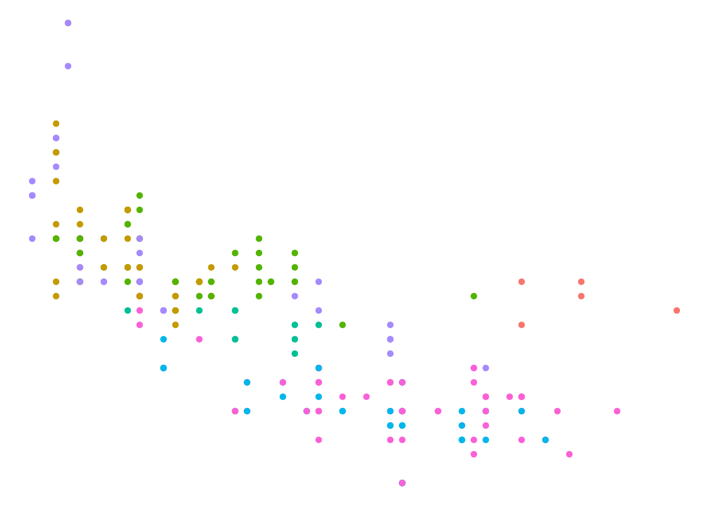
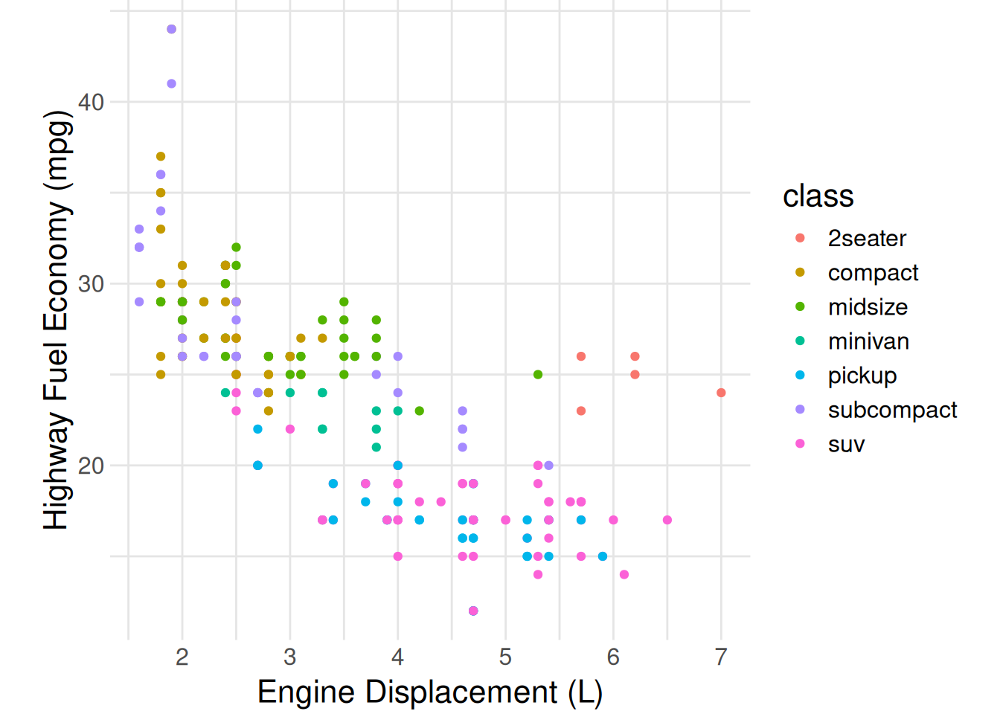
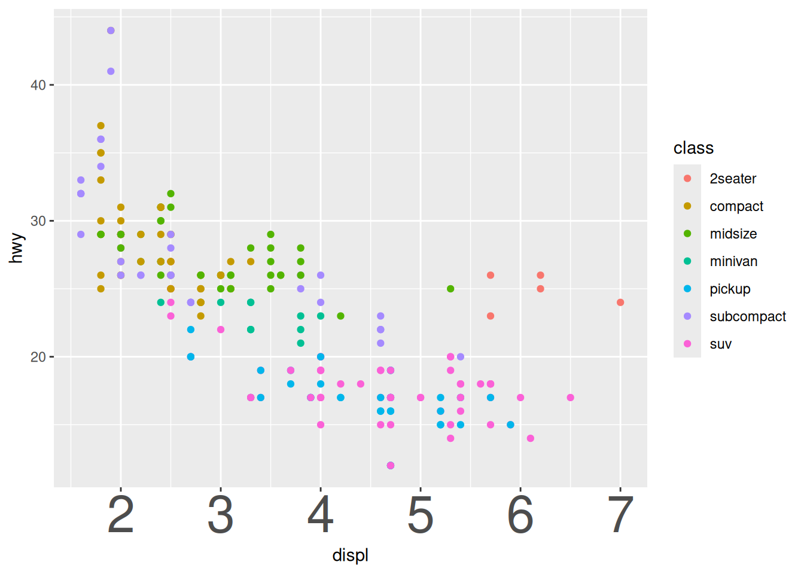
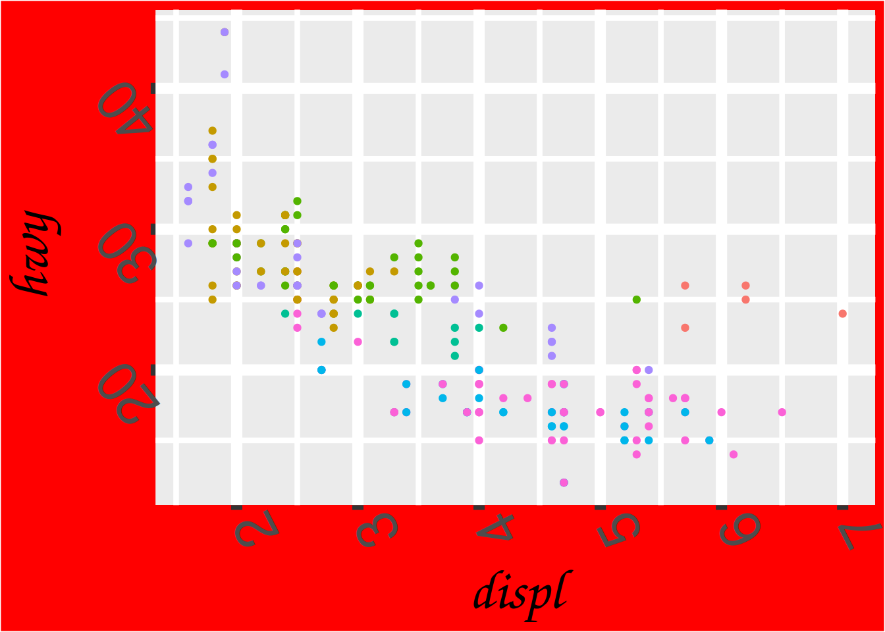

# Vis: Themes

*Purpose*: Themes are key for aesthetic purposes; to make really good-looking graphs, we'll need to use `theme()`.

*Reading*: [`theme()` documentation](https://ggplot2.tidyverse.org/reference/theme.html) (Use as a reference; don't read the whole thing!)


### __q1__ Use `theme_void()` and `guides()` (with an argument) to remove everything in this plot except the points.


```r
mpg %>%
  ggplot(aes(displ, hwy, color = class)) +
  geom_point()
```


```r
mpg %>%
  ggplot(aes(displ, hwy, color = class)) +
  geom_point() +
  guides(color = "none") +
  theme_void()
```



When I make presentation-quality figures, I often start with the following stub code:


```r
## NOTE: No need to edit; feel free to re-use this code!
theme_common <- function() {
  theme_minimal() %+replace%
  theme(
    axis.text.x = element_text(size = 12),
    axis.text.y = element_text(size = 12),
    axis.title.x = element_text(margin = margin(4, 4, 4, 4), size = 16),
    axis.title.y = element_text(margin = margin(4, 4, 4, 4), size = 16, angle = 90),

    legend.title = element_text(size = 16),
    legend.text = element_text(size = 12),

    strip.text.x = element_text(size = 12),
    strip.text.y = element_text(size = 12),

    panel.grid.major = element_line(color = "grey90"),
    panel.grid.minor = element_line(color = "grey90"),

    aspect.ratio = 4 / 4,

    plot.margin = unit(c(t = +0, b = +0, r = +0, l = +0), "cm"),
    plot.title = element_text(size = 18),
    plot.title.position = "plot",
    plot.subtitle = element_text(size = 16),
    plot.caption = element_text(size = 12)
  )
}
```

The `%+replace` magic above allows you to use `theme_common()` within your own ggplot calls.

### __q2__ Use `theme_common()` with the following graph. Document what's changed by the `theme()` arguments.


```r
mpg %>%
  ggplot(aes(displ, hwy, color = class)) +
  geom_point() +
  labs(
    x = "Engine Displacement (L)",
    y = "Highway Fuel Economy (mpg)"
  )
```


```r
mpg %>%
  ggplot(aes(displ, hwy, color = class)) +
  geom_point() +
  theme_common() +
  labs(
    x = "Engine Displacement (L)",
    y = "Highway Fuel Economy (mpg)"
  )
```



**Observations**:

- The text is larger, hence more readable
- The background was flipped grey to white
- The guide lines have been flipped from white to grey

Calling `theme_common()`, along with settings `labs()` and making some smart choices about geoms and annotations is often all you need to make a *really high-quality graph*.

### __q3__ Make the following plot as *ugly as possible*; the more `theme()` arguments you use, the better!

*Hint*: Use the `theme()` settings from q2 above as a starting point, and read the documentation for `theme()` to learn how to do more horrible things to this graph.


```r
mpg %>%
  ggplot(aes(displ, hwy, color = class)) +
  geom_point() +
  theme(
    axis.text.x = element_text(size = 32)
  )
```



Here's one possible graph:


```r
mpg %>%
  ggplot(aes(displ, hwy, color = class)) +
  geom_point() +
  guides(color = "none") +
  theme(
    line = element_line(size = 3, color = "purple"),
    rect = element_rect(fill = "red"),
    axis.text.x = element_text(size = 32, angle = 117),
    axis.text.y = element_text(size = 32, angle = 129),
    axis.title.x = element_text(size = 32, family = "Comic Sans MS"),
    axis.title.y = element_text(size = 32, family = "Comic Sans MS")
  )
```

```
## Warning: The `size` argument of `element_line()` is deprecated as of ggplot2 3.4.0.
## ℹ Please use the `linewidth` argument instead.
```



<!-- include-exit-ticket -->
