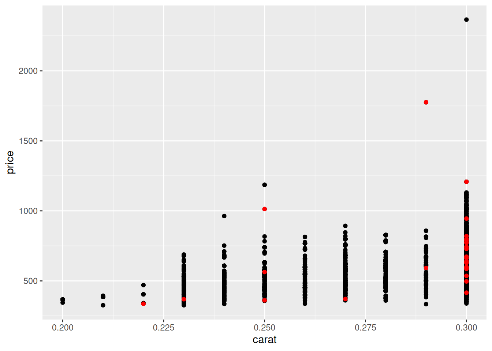

# Data: Pipes and Placeholders

*Purpose*: The pipe `%>%` has additional functionality than what we've used so far. In this exercise we'll learn about the *placeholder* `.`, which will give us more control over how data flows between our functions.

*Reading*: [The Pipe](https://magrittr.tidyverse.org/reference/pipe.html)


```r
library(tidyverse)
```

```
## ── Attaching packages ─────────────────────────────────────── tidyverse 1.3.0 ──
```

```
## ✔ ggplot2 3.4.0      ✔ purrr   1.0.1 
## ✔ tibble  3.1.8      ✔ dplyr   1.0.10
## ✔ tidyr   1.2.1      ✔ stringr 1.5.0 
## ✔ readr   2.1.3      ✔ forcats 0.5.2
```

```
## ── Conflicts ────────────────────────────────────────── tidyverse_conflicts() ──
## ✖ dplyr::filter() masks stats::filter()
## ✖ dplyr::lag()    masks stats::lag()
```

### __q1__ Re-write the following code to use the *placeholder*.

*Hint*: This may feel very simple, in which case good. This is not a trick question.


```r
diamonds %>% glimpse(.)
```

```
## Rows: 53,940
## Columns: 10
## $ carat   <dbl> 0.23, 0.21, 0.23, 0.29, 0.31, 0.24, 0.24, 0.26, 0.22, 0.23, 0.…
## $ cut     <ord> Ideal, Premium, Good, Premium, Good, Very Good, Very Good, Ver…
## $ color   <ord> E, E, E, I, J, J, I, H, E, H, J, J, F, J, E, E, I, J, J, J, I,…
## $ clarity <ord> SI2, SI1, VS1, VS2, SI2, VVS2, VVS1, SI1, VS2, VS1, SI1, VS1, …
## $ depth   <dbl> 61.5, 59.8, 56.9, 62.4, 63.3, 62.8, 62.3, 61.9, 65.1, 59.4, 64…
## $ table   <dbl> 55, 61, 65, 58, 58, 57, 57, 55, 61, 61, 55, 56, 61, 54, 62, 58…
## $ price   <int> 326, 326, 327, 334, 335, 336, 336, 337, 337, 338, 339, 340, 34…
## $ x       <dbl> 3.95, 3.89, 4.05, 4.20, 4.34, 3.94, 3.95, 4.07, 3.87, 4.00, 4.…
## $ y       <dbl> 3.98, 3.84, 4.07, 4.23, 4.35, 3.96, 3.98, 4.11, 3.78, 4.05, 4.…
## $ z       <dbl> 2.43, 2.31, 2.31, 2.63, 2.75, 2.48, 2.47, 2.53, 2.49, 2.39, 2.…
```

### __q2__ Fix the lambda expression

The reading discussed *Using lambda expressions with `%>%`*; use this part of the reading to explain why the following code fails. Then fix the code so it runs without error.


```r
2 %>%
  {. * .}
```

```
## [1] 4
```

### __q3__ Re-write the following code using the placeholder `.` operator to simplify the second filter.

*Hint*: You should be able to simplify the second call to `filter` down to just
`filter(cut == "Fair")`.


```r
diamonds %>%
  filter(carat <= 0.3) %>%

  ggplot(aes(carat, price)) +
  geom_point() +
  geom_point(
    data = . %>% filter(cut == "Fair"),
    color = "red"
  )
```



The placeholder even works at "later" points in a pipeline. We can use it to
help simplify code, as you did above.

<!-- include-exit-ticket -->
