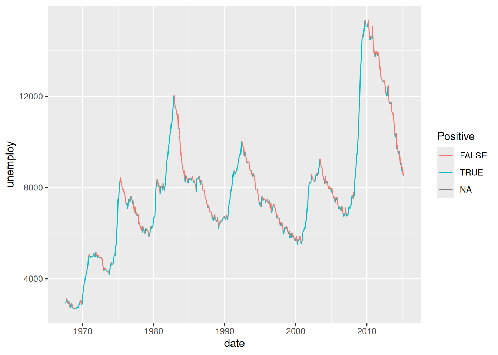
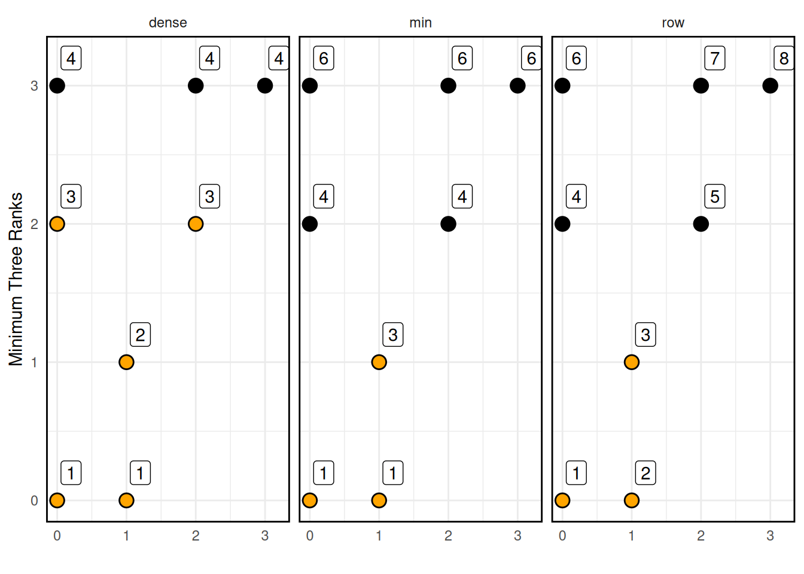

# Data: Window Functions

*Purpose*: Window functions are another family of `dplyr` verbs that are related to aggregates like `mean` and `sd`. These functions are useful for building up more complicated filters, enabling aesthetic tricks in plots, and some advanced data wrangling we'll do next exercise.

*Reading*: [Window Functions](https://dplyr.tidyverse.org/articles/window-functions.html#cumulative-aggregates-1), *Types of window functions*, *Ranking functions*, and *Lead and lag*


``` r
library(tidyverse)
```

```
## ── Attaching core tidyverse packages ──────────────────────── tidyverse 2.0.0 ──
## ✔ dplyr     1.1.4     ✔ readr     2.1.5
## ✔ forcats   1.0.0     ✔ stringr   1.5.1
## ✔ ggplot2   3.5.1     ✔ tibble    3.2.1
## ✔ lubridate 1.9.4     ✔ tidyr     1.3.1
## ✔ purrr     1.0.4     
## ── Conflicts ────────────────────────────────────────── tidyverse_conflicts() ──
## ✖ dplyr::filter() masks stats::filter()
## ✖ dplyr::lag()    masks stats::lag()
## ℹ Use the conflicted package (<http://conflicted.r-lib.org/>) to force all conflicts to become errors
```

``` r
library(ggrepel)
```

## Lead and Lag
<!-- ------------------------- -->

The lead and lag functions simply provide a "shifted" copy of a vector.


``` r
## NOTE: No need to edit this; just an example
v <- c(1, 2, 3, 4, 5)
lead(v)
```

```
## [1]  2  3  4  5 NA
```

``` r
lag(v)
```

```
## [1] NA  1  2  3  4
```

These are particularly useful for computing things like differences:


``` r
## NOTE: No need to edit this; just an example
x <- seq(-1, +1, length.out = 6)
f <- x ^ 2

## Forward finite difference
df_dx <- (lead(f) - f) / (lead(x) - x)
df_dx
```

```
## [1] -1.600000e+00 -8.000000e-01  2.255141e-16  8.000000e-01  1.600000e+00
## [6]            NA
```

Make sure to order your data or use the `order_by` argument when using `lead` or `lag`! GGplot automatically reorders your data when making a line plot, but `lead` and `lag` will use the order of the data you provide.

### __q1__ Use a window function modify the following visual to color each segment differently based on whether the period of time was increasing or decreasing.


``` r
economics %>%
  arrange(date) %>%
  mutate(
    delta = lead(unemploy, order_by = date) - unemploy,
    Positive = delta > 0
  ) %>%

  ggplot(aes(date, unemploy, color = Positive)) +
  geom_segment(aes(
    xend = lead(date, order_by = date),
    yend = lead(unemploy, order_by = date)
  ))
```

```
## Warning: Removed 1 row containing missing values or values outside the scale range
## (`geom_segment()`).
```



## Ranks
<!-- ------------------------- -->

The rank functions allow you to assign (integer) ranks to smallest (or largest) values of a vector.


``` r
## NOTE: No need to edit this; just an example
v <- c(1, 1, 2, 3, 5)
row_number(v)
```

```
## [1] 1 2 3 4 5
```

``` r
min_rank(v)
```

```
## [1] 1 1 3 4 5
```

``` r
dense_rank(v)
```

```
## [1] 1 1 2 3 4
```

You can use the `desc()` function (or a negative sign) to reverse the ranking order.


``` r
## NOTE: No need to edit this; just an example
v <- c(1, 1, 2, 3, 5)
row_number(desc(v))
```

```
## [1] 4 5 3 2 1
```

``` r
min_rank(desc(v))
```

```
## [1] 4 4 3 2 1
```

``` r
dense_rank(-v)
```

```
## [1] 4 4 3 2 1
```

I find it difficult to remember how the rank functions behave, so I created the following visual to help remind myself how they function..


``` r
## NOTE: No need to edit this; just an example
set.seed(101)
tribble(
  ~x, ~y,
  0,  0,
  1,  0,
  1,  1,
  0,  2,
  2,  2,
  0,  3,
  2,  3,
  3,  3
) %>%
  mutate(
    rk_row = row_number(y),
    rk_min = min_rank(y),
    rk_dense = dense_rank(y)
  ) %>%
  pivot_longer(
    names_to = "fcn",
    names_prefix = "rk_",
    values_to = "rk",
    cols = c(-x, -y)
  ) %>%

  ggplot(aes(x, y)) +
  geom_point(size = 4) +
  geom_point(
    data = . %>% filter(rk <= 3),
    size = 3,
    color = "orange"
  ) +
  geom_label(aes(label = rk), nudge_x = 0.2, nudge_y = 0.2) +

  facet_wrap(~fcn) +
  theme_minimal() +
  theme(panel.border = element_rect(color = "black", fill = NA, size = 1)) +
  labs(
    x = "",
    y = "Minimum Three Ranks"
  )
```

```
## Warning: The `size` argument of `element_rect()` is deprecated as of ggplot2 3.4.0.
## ℹ Please use the `linewidth` argument instead.
## This warning is displayed once every 8 hours.
## Call `lifecycle::last_lifecycle_warnings()` to see where this warning was
## generated.
```



### __q2__ Use a rank function to filter the largest 3 `hwy` values and **all** vehicles that have those values.


``` r
q2 <-
  mpg %>%
  filter(dense_rank(desc(hwy)) <= 3)
q2
```

```
## # A tibble: 4 × 11
##   manufacturer model      displ  year   cyl trans  drv     cty   hwy fl    class
##   <chr>        <chr>      <dbl> <int> <int> <chr>  <chr> <int> <int> <chr> <chr>
## 1 toyota       corolla      1.8  2008     4 manua… f        28    37 r     comp…
## 2 volkswagen   jetta        1.9  1999     4 manua… f        33    44 d     comp…
## 3 volkswagen   new beetle   1.9  1999     4 manua… f        35    44 d     subc…
## 4 volkswagen   new beetle   1.9  1999     4 auto(… f        29    41 d     subc…
```

Use the following test to check your work.


``` r
## NOTE: No need to change this
assertthat::assert_that(dim(q2)[1] == 4)
```

```
## [1] TRUE
```

``` r
print("Nice!")
```

```
## [1] "Nice!"
```

<!-- include-exit-ticket -->
