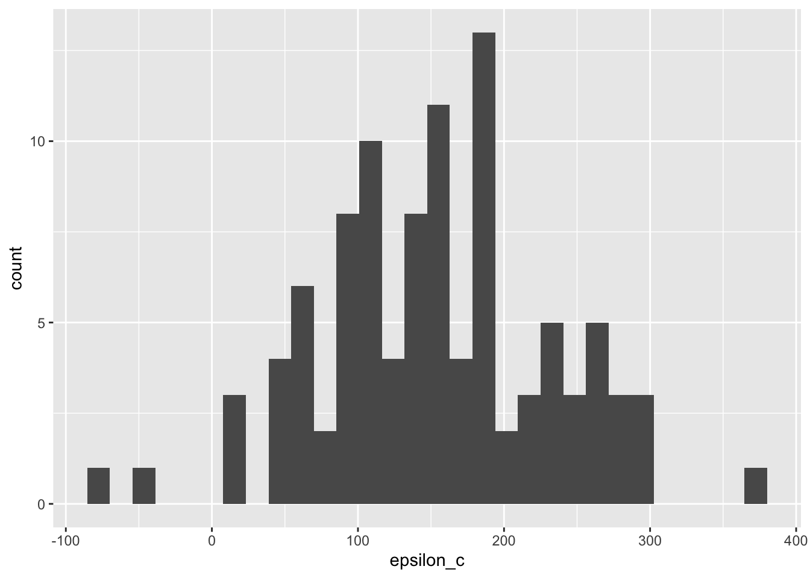

# Stats: Error and Bias

*Purpose*: *Error* is a subtle concept. Often statistics concepts are introduced
with a host of assumptions on the errors. In this short exercise, we'll reminder
ourselves what errors are and learn what happens when one standard
assumption---*unbiasedness*---is violated.

*Prerequisites*: `c02-michelson`, `e-stat06-clt`


```r
## Note: No need to edit this chunk!
library(tidyverse)
```

```
## ── Attaching packages ─────────────────────────────────────── tidyverse 1.3.0 ──
```

```
## ✔ ggplot2 3.4.0      ✔ purrr   1.0.1 
## ✔ tibble  3.1.8      ✔ dplyr   1.0.10
## ✔ tidyr   1.2.1      ✔ stringr 1.5.0 
## ✔ readr   2.1.3      ✔ forcats 0.5.2
```

```
## ── Conflicts ────────────────────────────────────────── tidyverse_conflicts() ──
## ✖ dplyr::filter() masks stats::filter()
## ✖ dplyr::lag()    masks stats::lag()
```

```r
library(googlesheets4)

url <- "https://docs.google.com/spreadsheets/d/1av_SXn4j0-4Rk0mQFik3LLr-uf0YdA06i3ugE6n-Zdo/edit?usp=sharing"

c_true <- 299792.458 # Exact speed of light in a vacuum (km / s)
c_michelson <- 299944.00  # Michelson's speed estimate (km / s)

meas_adjust <- +92 # Michelson's speed of light adjustment (km / s)
c_michelson_uncertainty <- 51 # Michelson's measurement uncertainty (km / s)

gs4_deauth()
ss <- gs4_get(url)
df_michelson <-
  read_sheet(ss) %>%
  select(Date, Distinctness, Temp, Velocity) %>%
  mutate(
    Distinctness = as_factor(Distinctness),
    c_meas = Velocity + meas_adjust
  )
```

```
## ✔ Reading from "michelson1879".
```

```
## ✔ Range 'Sheet1'.
```

## Errors
<!-- -------------------------------------------------- -->

Let's re-examine the Michelson speed of light data to discuss the concept of *error*. Let $c$ denote the true speed of light, and let $\hat{c}_i$ denote the i-th measurement by Michelson. Then the error $\epsilon_{c,i}$ is:

$$\epsilon_{c,i} \equiv \hat{c}_i - c.$$

Note that these are *errors* (and not some other quantity) because they are
differences against the true value $c$. Very frequently in statistics, we
*assume* that the errors are *unbiased*; that is we assume $\mathbb{E}[\epsilon]
= 0$. Let's take a look at what happens when that assumption is violated.

### __q1__ Compute the errors $\epsilon_c$ using Michelson's measurements `c_meas` and the true speed of light `c_true`.


```r
## TASK: Compute `epsilon_c`
df_q1 <-
  df_michelson %>%
  mutate(epsilon_c = c_meas - c_true)

df_q1 %>%
  ggplot(aes(epsilon_c)) +
  geom_histogram()
```

```
## `stat_bin()` using `bins = 30`. Pick better value with `binwidth`.
```



We can use descriptive statistics in order to summarize the errors. This will give us a quantification of the *uncertainty* in our measurements: remember that uncertainty is our assessment of the error.

### __q2__ Estimate the mean and standard deviation of $\epsilon_c$ from `df_q1.` Is the error mean large or small, compared to its standard deviation? How about compared to Michelson's uncertainty `c_michelson_uncertainty`?


```r
## TASK: Estimate `epsilon_mean` and `epsilon_sd` from df_q1
df_q2 <-
  df_q1 %>%
  summarize(
    epsilon_mean = mean(epsilon_c),
    epsilon_sd = sd(epsilon_c)
  )
```

**Observations**:


Use the following tests to check your answers.


```r
## NOTE: No need to change this!
assertthat::assert_that(abs((df_q2 %>% pull(epsilon_mean)) - 151.942) < 1e-3)
```

```
## [1] TRUE
```

```r
assertthat::assert_that(abs((df_q2 %>% pull(epsilon_sd)) - 79.01055) < 1e-3)
```

```
## [1] TRUE
```

```r
print("Great job!")
```

```
## [1] "Great job!"
```

Generally, we want our errors to have *zero mean*---the case where the errors have zero mean is called *unbiased*. The quantity $\mathbb{E}[\epsilon]$ is called *bias*, and an estimate such as $\hat{c}$ with $\mathbb{E}[\epsilon] \neq 0$ is called *biased*.

What can happen when our estimates are biased? In that case, increased data *may not* improve our estimate, and our statistical tools---such as confidence intervals---may give us a false impression of the true error. The next example will show us what happens if we apply confidence intervals in a biased-data setting like Michelson's data.

### __q3__ Use a CLT approximation to construct a $99%$ confidence interval on the mean of `c_meas`. Check (with the provided code) if your CI includes the true speed of light.

*Hint*: This computation should **not** use the true speed of light $c_true$ in any way.


```r
## TASK: Compute a 99% confidence interval on the mean of c_meas
C <- 0.99
q <- qnorm( 1 - (1 - C) / 2 )
df_q3 <-
  df_q1 %>%
  summarize(
    c_meas_mean = mean(c_meas),
    c_meas_sd = sd(c_meas),
    n_samp = n(),
    c_lo = c_meas_mean - q * c_meas_sd / sqrt(n_samp),
    c_hi = c_meas_mean + q * c_meas_sd / sqrt(n_samp)
  )

## NOTE: This checks if the CI contains c_true
(df_q3 %>% pull(c_lo) <= c_true) & (c_true <= df_q3 %>% pull(c_hi))
```

```
## [1] FALSE
```

Use the following tests to check your answers.


```r
## NOTE: No need to change this!
assertthat::assert_that(abs((df_q3 %>% pull(c_lo)) - 299924.048) < 1e-3)
```

```
## [1] TRUE
```

```r
assertthat::assert_that(abs((df_q3 %>% pull(c_hi)) - 299964.752) < 1e-3)
```

```
## [1] TRUE
```

```r
print("Well done!")
```

```
## [1] "Well done!"
```

Once you correctly compute a CI for `c_meas`, you should find that the interval *does not* include `c_true`. CI is never guaranteed to include its true value---it is a probabilistic construction, after all. However, we saw above that the errors are *biased*; even if we were to gather more data, our confidence intervals would converge on the *wrong* value. Statistics are not a cure-all!

<!-- include-exit-ticket -->
