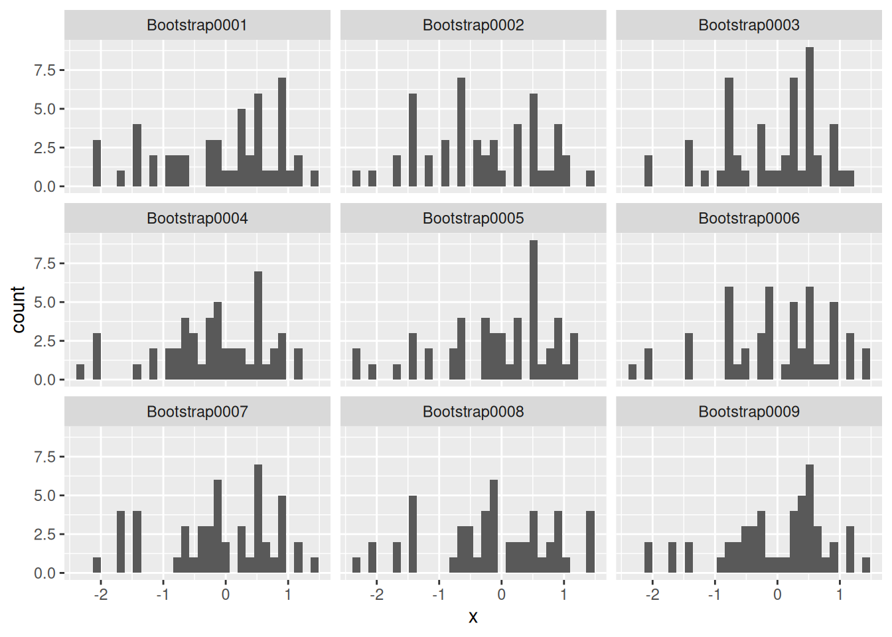
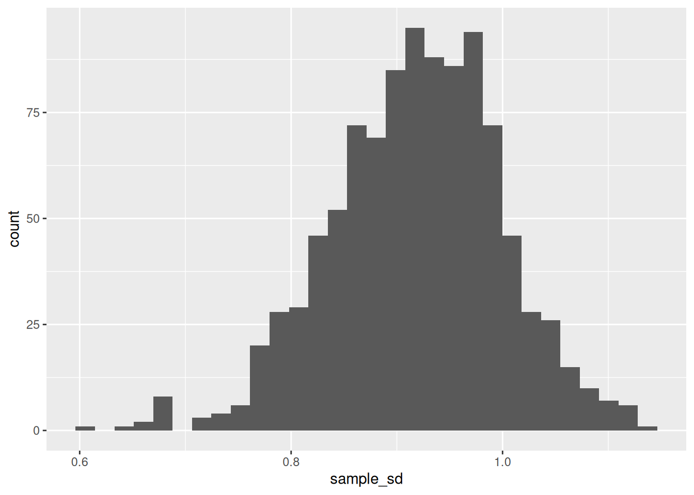

*Purpose*: The sampling distribution is a key object in statistics---it helps us understand how good our estimates are. However, following the definition is an impractical way to compute a sampling distribution. In this exercise we'll learn about a practical recipe for estimating a sampling distribution---bootstrap resampling.

*Reading*: (None, this is the reading)

*Topics*: Resampling and inference


``` r
library(tidyverse)
```

```
## ── Attaching core tidyverse packages ──────────────────────── tidyverse 2.0.0 ──
## ✔ dplyr     1.1.4     ✔ readr     2.1.5
## ✔ forcats   1.0.0     ✔ stringr   1.5.1
## ✔ ggplot2   3.5.1     ✔ tibble    3.2.1
## ✔ lubridate 1.9.4     ✔ tidyr     1.3.1
## ✔ purrr     1.0.4     
## ── Conflicts ────────────────────────────────────────── tidyverse_conflicts() ──
## ✖ dplyr::filter() masks stats::filter()
## ✖ dplyr::lag()    masks stats::lag()
## ℹ Use the conflicted package (<http://conflicted.r-lib.org/>) to force all conflicts to become errors
```

``` r
library(rsample)
```

## The Core Idea: Resampling with Replacement
<!-- ------------------------- -->

In the previous exercise (`e-stat04-population`) we learned about the difference between a population and a sample. We also talked about sampling distributions---a *sampling distribution* is a theoretical distribution where we repeatedly gather a sample (of fixed size $n$) from the population, and compute the same summary statistic each time. The distribution of the summary statistic is the sampling distribution.

However, this theoretical recipe is not a practical idea: It would be silly to gather many small samples and analyze them separately. If we've worked hard to gather a large dataset, we should just analyze it all together. To overcome this practical hurdle, we'll use the idea of *resampling*---this is based on a key assumption, that *our sample is representative of our population*.

Here's a sample from a normal distribution (population). For ease of comparison, we draw the normal distribution as a solid curve.


``` r
## NOTE: No need to edit this setup
set.seed(101) # Set a seed for reproducibility

mu <- 0
sd <- 1
n <- 50

df_data_norm <- tibble(x = rnorm(n, mean = mu, sd = sd))

df_data_norm %>%
  ggplot(aes(x)) +
  geom_histogram(aes(y = after_stat(..density..))) +
  geom_line(
    aes(y = d),
    data = tibble(x = seq(-2.5, +1.5, length.out = 500)) %>% 
      mutate(d = dnorm(x, mean = mu, sd = sd)),
    color = "salmon"
  )
```

```
## `stat_bin()` using `bins = 30`. Pick better value with `binwidth`.
```


The sample (histogram) does not look identical to the population (solid curve). But it can't, because we don't have all the observations in the population. The key assumption we make in statistical inference is that *the sample "looks like" the population*. In technical terms, such a sample is *representative* of a chosen population.

The way we use this assumption is to treat our sample *as though* it were the population. This is subtle though. If we resample our *entire* sample, we end up with *exactly the same* sample. That's not helpful!


``` r
## NOTE: Do not edit this code
# This is the **WRONG** way to do resampling
df_data_norm %>% 
  # Resample *without* replacement
  pull(x) %>% 
  sample(., size = n, replace = FALSE) %>% 
  tibble(x = ., source = "Resampled") %>% 
  # Visualize against the original sample
  bind_rows(., df_data_norm %>% mutate(source = "Original")) %>% 
  ggplot(aes(x)) +
  geom_freqpoly(aes(color = source, linetype = source), bins = 15)
```


Note that the `Resampled` set looks exactly like the `Original` sample. This is not what we want. Instead, we have to resample *with replacement*.


``` r
## NOTE: Do not edit this code
# This is the **RIGHT** way to do resampling
df_data_norm %>% 
  # Resample *with* replacement
  pull(x) %>% 
  sample(., size = n, replace = TRUE) %>% 
  tibble(x = ., source = "Resampled") %>% 
  # Visualize against the original sample
  bind_rows(., df_data_norm %>% mutate(source = "Original")) %>% 
  ggplot(aes(x)) +
  geom_freqpoly(aes(color = source, linetype = source), bins = 15)
```


Once we have resampled the sample, we can compute any statistics we care about:


``` r
## NOTE: Do not edit this code
# This is the **RIGHT** way to do resampling
df_data_norm %>% 
  # Resample *with* replacement
  pull(x) %>% 
  sample(., size = n, replace = TRUE) %>% 
  tibble(x = ., source = "Resampled") %>% 
  # Compute statistics we care about
  bind_rows(., df_data_norm %>% mutate(source = "Original")) %>% 
  group_by(source) %>% 
  summarize(
    sample_mean = mean(x),
    sample_sd = sd(x)
  )
```

```
## # A tibble: 2 × 3
##   source    sample_mean sample_sd
##   <chr>           <dbl>     <dbl>
## 1 Original       -0.124     0.932
## 2 Resampled       0.103     0.763
```

This is the core idea of resampling. But to simulate a sampling distribution, we need to do this many times.

### Efficient resampling

The code we just saw is computationally wasteful, since it stores the same data in many copies. So, programmers have written efficient packages to support resampling methods. We will use the `rsample` package for resampling in this class. The `bootstraps()` function resamples with replacement a desired number of `times`. 

*Note*: Bootstrap resampling is just one of many kinds of resampling methods. It's called "bootstrapping" because we're "pulling ourselves up by our own bootstraps", in the sense that we're only using the sample we have at hand.


``` r
df_data_norm %>% 
  bootstraps(., times = 1000)
```

```
## # Bootstrap sampling 
## # A tibble: 1,000 × 2
##    splits          id           
##    <list>          <chr>        
##  1 <split [50/16]> Bootstrap0001
##  2 <split [50/19]> Bootstrap0002
##  3 <split [50/16]> Bootstrap0003
##  4 <split [50/21]> Bootstrap0004
##  5 <split [50/18]> Bootstrap0005
##  6 <split [50/16]> Bootstrap0006
##  7 <split [50/15]> Bootstrap0007
##  8 <split [50/17]> Bootstrap0008
##  9 <split [50/22]> Bootstrap0009
## 10 <split [50/23]> Bootstrap0010
## # ℹ 990 more rows
```

This looks weird; we have 1000 rows, corresponding to `times = 1000`. The `splits` column is where the programming magic happens: Rather than storing a copy of the original data, a `split` is a list of observations to use in a resample. To take advantage of `bootstraps()`, we have to use the `anaysis()` function on the `splits` column. Here's an example of accessing a single resample:


``` r
## NOTE: No need to edit
df_data_norm %>% 
  bootstraps(., times = 1) %>% 
  # Pull out a single `splits` object
  pull(splits) %>% 
  .[[1]] %>% 
  # Use analysis() to turn the split into a usable dataset
  analysis()
```

```
## # A tibble: 50 × 1
##         x
##     <dbl>
##  1 -1.46 
##  2 -0.223
##  3  0.758
##  4  1.17 
##  5  0.920
##  6  0.279
##  7  0.569
##  8 -0.223
##  9  0.448
## 10  0.403
## # ℹ 40 more rows
```

The following code uses `bootstraps()` and `analysis()` to show the first 9 resamplings.


``` r
## NOTE: No need to edit this setup
df_resample_norm <-
  bootstraps(df_data_norm, times = 1000) %>%
  mutate(df = map(splits, ~ analysis(.x)))

# Visualize the first 9 of the resamples
df_resample_norm %>%
  slice(1:9) %>%
  unnest(df) %>%
  ggplot(aes(x)) +
  geom_histogram() +
  facet_wrap(~ id)
```

```
## `stat_bin()` using `bins = 30`. Pick better value with `binwidth`.
```



In the example above, I set `times = 1000` but show only the first nine. Generally, a larger value of `times` is better, but a good rule of thumb is to do at least `1000` resamples.

*Side Notes*:

- The `bootstraps()` function comes from the `rsample` package, which implements many different resampling strategies (beyond the bootstrap).
- The `analysis()` function also comes from `rsample`; this is a special function we need to call when working with a resampling of the data [1].
- We saw the `map()` function in `e-data10-map`; using `map()` above is necessary in part because we need to call `analysis()`. Since `analysis()` is not vectorized, we need the map to use this function on every split in `splits`.

### Using resampling

Working with `bootstraps()` can be a little finicky. Here's some example code you can adapt for future use.

**Fundamentally, this code is resampling the data with replacement, and carrying out an analysis on each (resampled) dataset using a function we provide.**


``` r
## NOTE: No need to edit this example
# Start with our dataset
df_demo <- 
  df_data_norm %>% 
  # Create the bootstrap resamplings
  bootstraps(., times = 1000) %>% 
  # Finicky code: Compute an estimate for each resampling (`splits` column)
  mutate(
    # The `map_*` family of functions iterates a provided function over a column
    sample_mean = map_dbl(
      # Chosen column
      splits,
      # Function we provide (defined inline)
      function(split_df) {
        # First, we use `analysis()` to translate the split into usable data
        split_df %>% 
          analysis() %>% 
          # Then, we carry out whatever analysis we want
          summarize(sample_mean = mean(x)) %>% 
          # One last wrangling step
          pull(sample_mean)
      }
    )
  )

df_demo 
```

```
## # Bootstrap sampling 
## # A tibble: 1,000 × 3
##    splits          id            sample_mean
##    <list>          <chr>               <dbl>
##  1 <split [50/18]> Bootstrap0001     -0.118 
##  2 <split [50/22]> Bootstrap0002     -0.301 
##  3 <split [50/19]> Bootstrap0003     -0.0764
##  4 <split [50/17]> Bootstrap0004     -0.180 
##  5 <split [50/20]> Bootstrap0005      0.0279
##  6 <split [50/19]> Bootstrap0006     -0.195 
##  7 <split [50/17]> Bootstrap0007     -0.222 
##  8 <split [50/17]> Bootstrap0008     -0.188 
##  9 <split [50/22]> Bootstrap0009      0.0463
## 10 <split [50/18]> Bootstrap0010     -0.184 
## # ℹ 990 more rows
```

### __q1__ Modify the code

Copy and modify the previous code to estimate a sampling distribution for the *standard deviation*. Provide this as a column `sample_sd`.


``` r
df_q1 <-
  df_data_norm %>% 
  bootstraps(., times = 1000) %>% 
  mutate(
    sample_sd = map_dbl(
      splits,
      function(split_df) {
        split_df %>% 
          analysis() %>% 
          summarize(sample_sd = sd(x)) %>% 
          pull(sample_sd)
      }
    )
  )

df_q1
```

```
## # Bootstrap sampling 
## # A tibble: 1,000 × 3
##    splits          id            sample_sd
##    <list>          <chr>             <dbl>
##  1 <split [50/17]> Bootstrap0001     0.762
##  2 <split [50/16]> Bootstrap0002     0.990
##  3 <split [50/15]> Bootstrap0003     0.919
##  4 <split [50/20]> Bootstrap0004     0.985
##  5 <split [50/22]> Bootstrap0005     0.898
##  6 <split [50/17]> Bootstrap0006     0.909
##  7 <split [50/17]> Bootstrap0007     0.916
##  8 <split [50/21]> Bootstrap0008     1.08 
##  9 <split [50/17]> Bootstrap0009     0.968
## 10 <split [50/17]> Bootstrap0010     1.10 
## # ℹ 990 more rows
```

The following test will verify that your `df_q1` is correct:


``` r
## NOTE: No need to change this!
assertthat::assert_that(
    df_q1 %>% 
      mutate(
        test_sd = map_dbl(splits, ~analysis(.) %>% summarize(s = sd(x)) %>% pull(s)),
        test = test_sd == sample_sd
      ) %>% 
      pull(test) %>% 
      all()
)
```

```
## [1] TRUE
```

``` r
print("Great job!")
```

```
## [1] "Great job!"
```

The following code will visualize your results.


``` r
## NOTE: No need to edit
df_q1 %>% 
  ggplot(aes(sample_sd)) +
  geom_histogram()
```

```
## `stat_bin()` using `bins = 30`. Pick better value with `binwidth`.
```



This plot gives us an (approximate) sampling distribution for the standard deviation. A reasonable next step would be to compute the *standard error*.

### __q2__ Compute the standard error

Compute the standard error for the mean by completing the code below.

*Hint*: We defined the standard error in the previous stat exercise (e-stat04).


``` r
## TASK: Compute the standard error
df_q2 <- 
  df_data_norm %>% 
  bootstraps(., times = 1000) %>% 
  mutate(
    sample_mean = map_dbl(
      splits,
      function(split_df) {
        split_df %>% 
          analysis() %>% 
          summarize(sample_mean = mean(x)) %>% 
          pull(sample_mean)
      }
    )
  ) %>% 
  summarize(se = sd(sample_mean))

df_q2
```

```
## # A tibble: 1 × 1
##      se
##   <dbl>
## 1 0.134
```

The following test will verify that your `df_q2` is correct:


``` r
## NOTE: No need to change this!
assertthat::assert_that(
    (df_q2 %>% pull(se)) > 0.1,
    msg = "Take a closer look at the definition of the standard error. We only divide by sqrt(n) when using the standard deviation of the *population* (not the standard deviation of the *samping distribution*)."
)
```

```
## [1] TRUE
```

``` r
print("Great job!")
```

```
## [1] "Great job!"
```

We can use a sampling distribution to build a "reasonable interval" for the population value we're trying to estimate. We can do this by taking quantiles of the distribution.

### __q3__ Quantiles of the sampling distribution

Compute the lower and upper quantiles of the sampling distribution for the mean, such that 0.99 of the distribution is contained within the endpoints, and an *equal* amount of the distribution lands on either side outside the endpoints.

*Hint*: You should use the `alpha` provided below, but you need to select *half* of `alpha` from the left tail, and *half* from the right tail.


``` r
## TASK: Compute the lower and upper quantiles of the sampling distribution
alpha <- 0.01

df_q3 <- 
  df_demo %>% 
  summarize(
# task_begin
    # mean_lo = ?,
    # mean_up = ?,
# task_end
    mean_lo = quantile(sample_mean, alpha / 2),
    mean_up = quantile(sample_mean, 1 - alpha / 2),
  )
```

The following will visualize your results against the sampling distribution:


``` r
## NOTE: Do not edit this code
df_demo %>% 
  ggplot(aes(sample_mean)) +
  geom_histogram() +
  geom_vline(
    data = df_q3,
    mapping = aes(xintercept = mean_lo)
  ) +
  geom_vline(
    data = df_q3,
    mapping = aes(xintercept = mean_up)
  )
```

```
## `stat_bin()` using `bins = 30`. Pick better value with `binwidth`.
```


The following test will verify that your `df_q2` is correct:


``` r
## NOTE: No need to change this!
assertthat::assert_that(
    abs(
      df_q3 %>% pull(mean_lo) %>% .[[1]]
    - quantile(df_demo$sample_mean, 0.005)
    ) < 1e-3,
    msg = "Your value of mean_lo is incorrect"
)
```

```
## [1] TRUE
```

``` r
assertthat::assert_that(
    abs(
      df_q3 %>% pull(mean_up) %>% .[[1]]
    - quantile(df_demo$sample_mean, 0.995)
    ) < 1e-3,
    msg = "Your value of mean_up is incorrect"
)
```

```
## [1] TRUE
```

``` r
print("Great job!")
```

```
## [1] "Great job!"
```

These upper and lower quantiles construct a *confidence interval*, an important tool for quantifying uncertainty. We'll discuss the interpretation of confidence intervals in `e-stat07-clt`. However, if you'd like a preview, [this animation](https://seeing-theory.brown.edu/frequentist-inference/index.html) is the best visual explain I've found on how confidence intervals are constructed [3].

<!-- include-exit-ticket -->

## Notes
<!-- -------------------------------------------------- -->

[1] This is because `rsample` does some fancy stuff under the hood. Basically `bootstraps` does not make any additional copies of the data; the price we pay for this efficiency is the need to call `analysis()`.

[2] For a slightly more mathematical treatment of the bootstrap, try [these MIT course notes](https://ocw.mit.edu/courses/mathematics/18-05-introduction-to-probability-and-statistics-spring-2014/readings/MIT18_05S14_Reading24.pdf)

[3] [This](https://seeing-theory.brown.edu/frequentist-inference/index.html) **the best** visualization of the confidence interval concept that I have ever found. Click through Frequentist Inference > Confidence Interval to see the animation.
