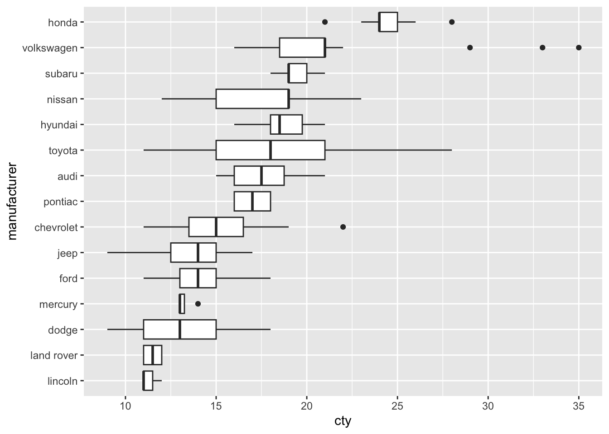
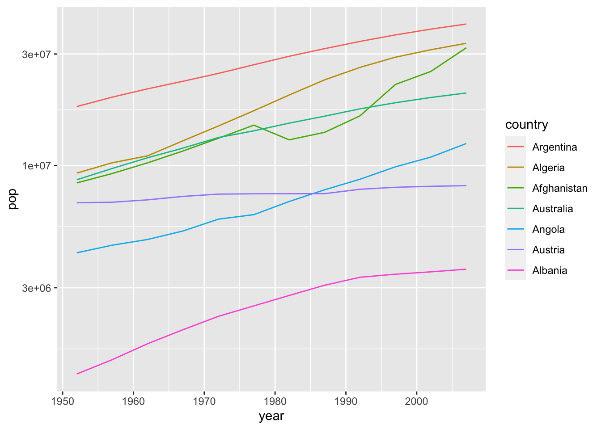

# Data: Factors

*Purpose*: Factors are an important type of variables. Since they're largely in
a class of their own, there are special tools available in the package `forcats`
to help wrangle factors.

*Reading*: (None)


```r
library(tidyverse)
```

```
## ── Attaching packages ─────────────────────────────────────── tidyverse 1.3.1 ──
```

```
## ✔ ggplot2 3.3.5     ✔ purrr   0.3.4
## ✔ tibble  3.1.2     ✔ dplyr   1.0.7
## ✔ tidyr   1.1.3     ✔ stringr 1.4.0
## ✔ readr   1.4.0     ✔ forcats 0.5.1
```

```
## ── Conflicts ────────────────────────────────────────── tidyverse_conflicts() ──
## ✖ dplyr::filter() masks stats::filter()
## ✖ dplyr::lag()    masks stats::lag()
```

```r
library(gapminder)
```

A *factor* is a variable that only takes fixed, often non-numeric, values.
Factors are sometimes called *categorical variables*. We've already seen

## Organization
<!-- -------------------------------------------------- -->

### __q1__ The following chunk displays the levels of the factor `continent`. Run
the following code chunk and note in what *order* they are listed.


```r
## NOTE: No need to edit this
diamonds %>%
  pull(cut) %>%
  levels()
```

```
## [1] "Fair"      "Good"      "Very Good" "Premium"   "Ideal"
```

```r
## TASK: Determine what order the factors are listed in.
```

**Observations**:

- The factor levels are ordered in terms of increasing quality of diamond cut.
- The levels are essentially a measure of quality; we would expect price to (generally) increase with improved cut.

### __q2__ Determine the levels for the `continent` variable in the `gapminder` dataset. Note the *order* of the levels.


```r
## TASK: Determine the levels of the variable
gapminder %>%
  pull(continent) %>%
  levels()
```

```
## [1] "Africa"   "Americas" "Asia"     "Europe"   "Oceania"
```

```r
## TASK: Determine what order the factors are listed in.
```

**Observations**:

- The factor levels are ordered alphabetically.


The [forcats](https://forcats.tidyverse.org/) package has tools for working with
factors. For instance, we can assign manual factor levels with the function
`fct_relevel()`. This is generally used in a `mutate()`; for instance `mutate(x
= fct_relevel(x, "a", "b", "c")`.

### __q3__ Relevel the continents.

Copy your code from q2 and introduce a mutate using `fct_relevel()` to reorder `continent`. Choose which levels to reorder and what order in which to put them. Note how the resulting order is changed when you call `levels()` at the end of the pipe.


```r
gapminder %>%
  mutate(
    continent = fct_relevel(
      continent,
      "Oceania"
    )
  ) %>%
  pull(continent) %>%
  levels()
```

```
## [1] "Oceania"  "Africa"   "Americas" "Asia"     "Europe"
```

**Observations**:

- Calling `fct_reorder()` as I do in the solution brings "Oceania" to the front, but leaves the other factors alone.

## Visual Tricks
<!-- -------------------------------------------------- -->

When factors do no have any *meaningful* order, it is generally better to
sort them on another variable, rather


```r
mpg %>%
  mutate(manufacturer = fct_reorder(manufacturer, cty)) %>%

  ggplot(aes(manufacturer, cty)) +
  geom_boxplot() +
  coord_flip()
```



The function `fct_reorder(f, x)` allows you to reorder the factor `f` based on
another variable `x`. This will "match" the order between the two.

### __q4__ Use `fct_reorder()` to sort `manufacturer` to match the order of `cty`.


```r
## TASK: Modify the following code to sort the factor `manufacturer` based on
## `cty`.
mpg %>%
  mutate(manufacturer = fct_reorder(manufacturer, cty)) %>%

  ggplot(aes(manufacturer, cty)) +
  geom_boxplot() +
  coord_flip()
```


**Observations**:

*Before*
- Toyota and Nissan seem have the most variable vehicles in this dataset, in terms of `cty`.
- Volkswagon has a number of high `cty` outliers.
*Sorted*
- Honda has the most efficient vehicles in this sample.
- Lincoln and Land Rover have the least efficient vehicles in this sample.
- Mercury has a remarkably consistent set of `cty` values; perhaps this is a small sample.

The function `fct_reorder2(f, x, y)` allows us to sort on *two* variables; this
is most useful when making line plots.

### __q5__ Sort the countries by values.

Use `fct_reorder2()` to sort `country` to match the order of `x = year, y = pop`. Pay attention to the rightmost edge of the curves and the legend order. How does `fct_reorder2()` sort factors?


```r
## TASK: Modify the following code to sort the factor `country` based on `year`
## and `pop`.
gapminder %>%
  filter(dense_rank(country) <= 7) %>%
  mutate(country = fct_reorder2(country, year, pop)) %>%

  ggplot(aes(year, pop, color = country)) +
  geom_line() +
  scale_y_log10()
```



**Observations**:

- The factors are sorted such that the rightmost points on the lines are vertically ordered the same as the legend.

This *small, simple trick* is extremely helpful for creating easily-readable
line graphs.

<!-- include-exit-ticket -->
