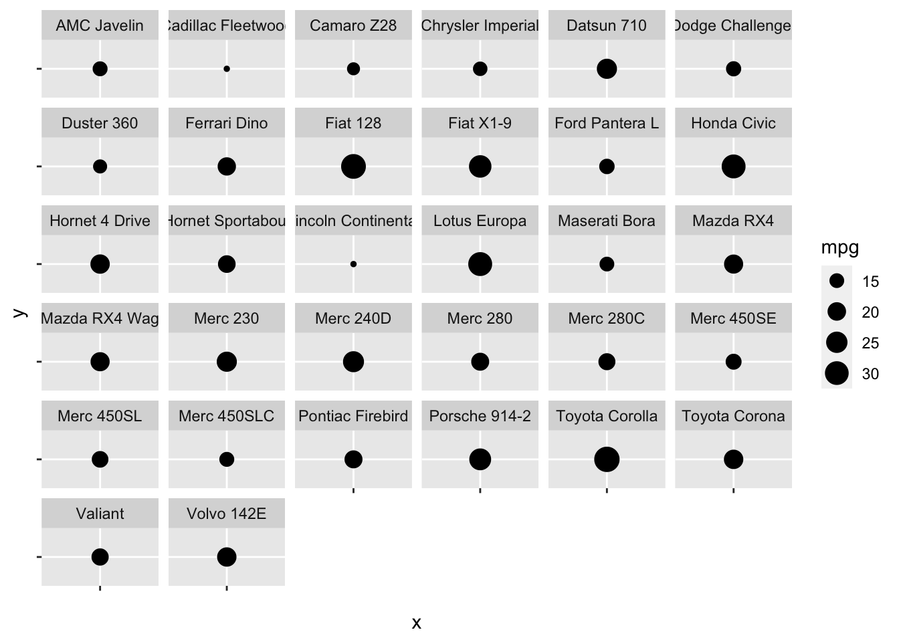
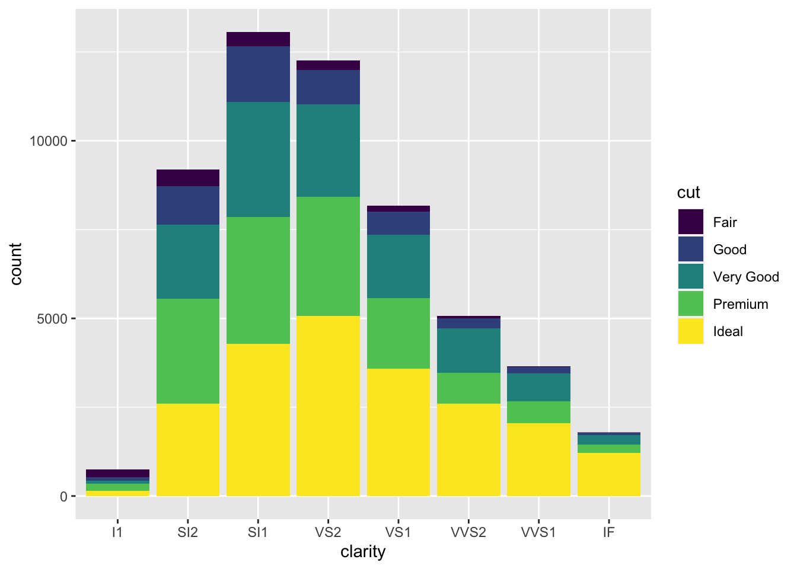
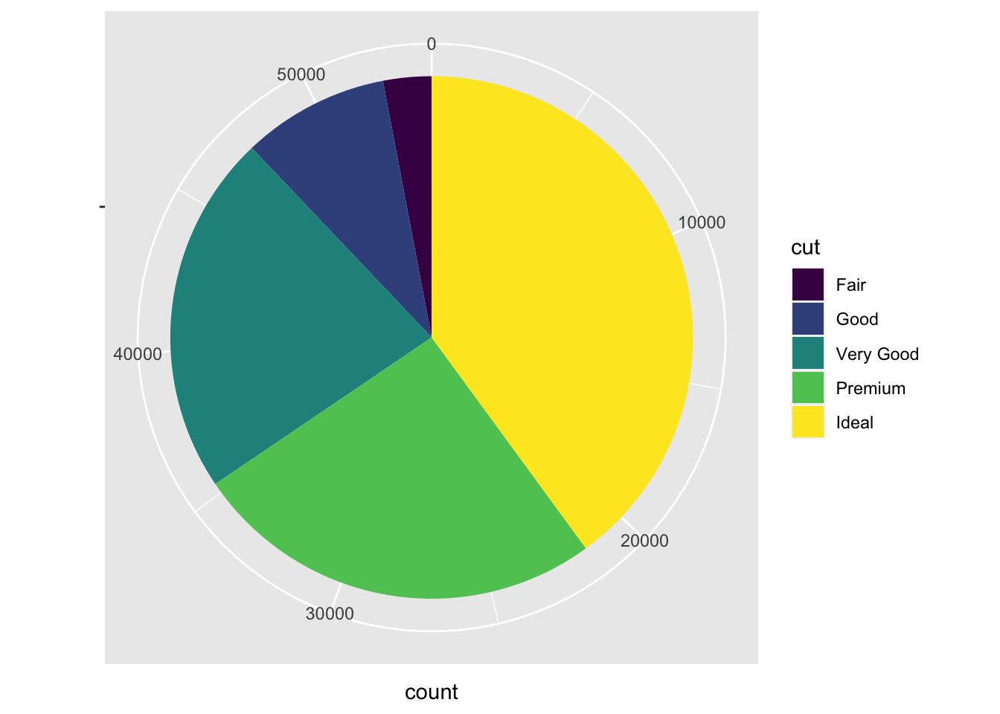

# Vis: Perceptual Basics

*Purpose*: Creating a *presentation-quality* graph is an exercise in *communication*. In order to create graphs that other people can understand, we should know some stuff about *how humans see data*. Through the required "reading" (video) you'll learn about visual perception, then put these ideas to use criticizing some graphs. Later, you'll use these ideas to *improve* some graphs.

*Reading*: [How Humans See Data](https://www.youtube.com/watch?v=fSgEeI2Xpdc&list=PLluqivwOH1ouKkbM0c6x-g7DQnXF0UmC0&index=37&t=0s) (Video)


```r
library(tidyverse)
```

```
## ── Attaching packages ─────────────────────────────────────── tidyverse 1.3.0 ──
```

```
## ✔ ggplot2 3.4.0      ✔ purrr   1.0.1 
## ✔ tibble  3.1.8      ✔ dplyr   1.0.10
## ✔ tidyr   1.2.1      ✔ stringr 1.5.0 
## ✔ readr   2.1.3      ✔ forcats 0.5.2
```

```
## ── Conflicts ────────────────────────────────────────── tidyverse_conflicts() ──
## ✖ dplyr::filter() masks stats::filter()
## ✖ dplyr::lag()    masks stats::lag()
```

## Criticize these graphs!
<!-- -------------------------------------------------- -->

Using the ideas from the reading (video), state some issues with the following graphs. As a reminder, the *visual hierarchy* is:

1. Position along a common scale
2. Position on identical but nonaligned scales
3. Length
4. Angle; Slope (With slope not too close to 0, $\pi/2$, or $\pi$.)
5. Area
6. Volume; Density; Color saturation
7. Color hue

### __q1__ What are some issues with the following graph? *Don't just say* "it's bad"---use concepts from the required reading.


```r
## NOTE: No need to edit; run and criticize
mpg %>%
  ggplot(aes(manufacturer, cty)) +
  geom_boxplot() +
  coord_flip()
```


**Observations**:

- An alphabetical ordering of factors is almost never meaningful.

We'll learn how to reorder factors in `e-data11-factors`:


```r
mpg %>%
  ggplot(aes(fct_reorder(manufacturer, cty), cty)) +
  geom_boxplot() +
  coord_flip()
```


### __q2__ What are some issues with the following graph? *Don't just say* "it's bad"---use concepts from the required reading.


```r
## NOTE: No need to edit; run and criticize
as_tibble(mtcars) %>%
  mutate(model = rownames(mtcars)) %>%

  ggplot(aes(x = "", y = "", size = mpg)) +
  geom_point() +
  facet_wrap(~model)
```



- Area is *low* on the visual hierarchy; it is difficult to see the difference between mpg values.

### __q3__ What are some issues with the following graph? *Don't just say* "it's bad"---use concepts from the required reading.


```r
## NOTE: No need to edit; run and criticize
diamonds %>%
  ggplot(aes(clarity, fill = cut)) +
  geom_bar()
```



- Stacked bar charts force us to make comparisons using length, rather than position along a common axis.

### __q4__ What are some issues with the following graph? *Don't just say* "it's bad"---use concepts from the required reading.


```r
## NOTE: No need to edit; run and criticize
diamonds %>%
  ggplot(aes(x = "", fill = cut)) +
  geom_bar() +
  coord_polar("y") +
  labs(x = "")
```



- A pie chart has encodes numbers as angles, which is low on the visual hierarchy.

<!-- include-exit-ticket -->
