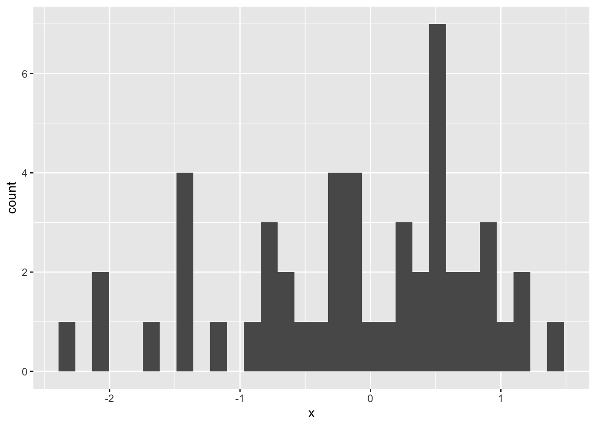
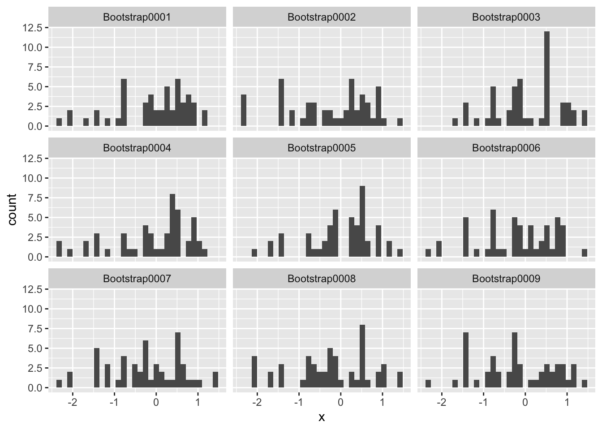

# Stats: The Bootstrap, Some Recipies

*Purpose*: Confidence intervals are an important tool for assessing our estimates. However, our tools so far for estimating confidence intervals rely on assumptions (normality, applicability of the CLT) that limit the statistics we can study. In this exercise we'll learn about a general-purpose tool we can use to approximate CI---the *bootstrap*.


```r
library(MASS)
library(tidyverse)
```

```
## ── Attaching packages ─────────────────────────────────────── tidyverse 1.3.1 ──
```

```
## ✔ ggplot2 3.3.5     ✔ purrr   0.3.4
## ✔ tibble  3.1.2     ✔ dplyr   1.0.7
## ✔ tidyr   1.1.3     ✔ stringr 1.4.0
## ✔ readr   1.4.0     ✔ forcats 0.5.1
```

```
## ── Conflicts ────────────────────────────────────────── tidyverse_conflicts() ──
## ✖ dplyr::filter() masks stats::filter()
## ✖ dplyr::lag()    masks stats::lag()
## ✖ dplyr::select() masks MASS::select()
```

```r
library(broom)
library(rsample)
```

## A Simple Example: Estimating the Mean
<!-- ------------------------- -->

first, imagine that we have a sample from some population.


```r
## NOTE: No need to edit this setup
set.seed(101)
df_data_norm <- tibble(x = rnorm(50))

df_data_norm %>%
  ggplot(aes(x)) +
  geom_histogram()
```

```
## `stat_bin()` using `bins = 30`. Pick better value with `binwidth`.
```



The set of samples---so long as it is representative of the population---is our *best available approximation* of the population. What the bootstrap does is operationalize this observation: We treat our sample as a population, and sample from it randomly. What that means is we generate some number of new *bootstrap samples* from our available sample. Visually, that looks like the following:


```r
## NOTE: No need to edit this setup
df_resample_norm <-
  bootstraps(df_data_norm, times = 1000) %>%
  mutate(df = map(splits, ~ analysis(.x)))

df_resample_norm %>%
  slice(1:9) %>%
  unnest(df) %>%
  ggplot(aes(x)) +
  geom_histogram() +
  facet_wrap(~ id)
```

```
## `stat_bin()` using `bins = 30`. Pick better value with `binwidth`.
```



Every panel in this figure depicts a single *bootstrap resample*, drawn from our original sample. Each bootstrap resample plays the role of a single sample; we construct a resample, compute a single statistic for each bootstrap resample, and we do this whole process some number of `times`. In the example above, I set `times = 1000`; generally larger is better, but a good rule of thumb is to do `1000` resamples.

*Notes*:

- The `bootstraps()` function comes from the `rsample` package, which implements many different resampling strategies (beyond the bootstrap).
- The `analysis()` function also comes from `rsample`; this is a special function we need to call when working with a resampling of the data [1].
- We saw the `map()` function in `e-data10-map`; using `map()` above is necessary in part because we need to call `analysis()`. Since `analysis()` is not vectorized, we need the map to use this function on every split in `splits`.


```r
## NOTE: No need to edit this example
v_mean_est <-
  map_dbl(
    df_resample_norm %>% pull(df),
    ~ summarize(.x, mean_est = mean(x)) %>% pull(mean_est)
  )

v_mean_est[1:9]
```

```
## [1] -0.066678997 -0.244149601  0.049938113 -0.074652483  0.008309007
## [6] -0.196989467 -0.252095066 -0.238739640 -0.189294459
```

### __q1__ Modify the code above to use within a `mutate()` call on `df_resample_norm`. Assign the mean estimates to the new column `mean_est`.


```r
df_q1 <-
  df_resample_norm %>%
  mutate(
    mean_est = map_dbl(
      df,
      ~ summarize(.x, mean_est = mean(x)) %>% pull(mean_est)
    )
  )

df_q1
```

```
## # Bootstrap sampling 
## # A tibble: 1,000 x 4
##    splits          id            df                mean_est
##    <list>          <chr>         <list>               <dbl>
##  1 <split [50/16]> Bootstrap0001 <tibble [50 × 1]> -0.0667 
##  2 <split [50/21]> Bootstrap0002 <tibble [50 × 1]> -0.244  
##  3 <split [50/20]> Bootstrap0003 <tibble [50 × 1]>  0.0499 
##  4 <split [50/15]> Bootstrap0004 <tibble [50 × 1]> -0.0747 
##  5 <split [50/21]> Bootstrap0005 <tibble [50 × 1]>  0.00831
##  6 <split [50/16]> Bootstrap0006 <tibble [50 × 1]> -0.197  
##  7 <split [50/19]> Bootstrap0007 <tibble [50 × 1]> -0.252  
##  8 <split [50/17]> Bootstrap0008 <tibble [50 × 1]> -0.239  
##  9 <split [50/17]> Bootstrap0009 <tibble [50 × 1]> -0.189  
## 10 <split [50/18]> Bootstrap0010 <tibble [50 × 1]> -0.136  
## # … with 990 more rows
```

The following test will verify that your `df_q1` is correct:


```r
## NOTE: No need to change this!
assertthat::assert_that(
  assertthat::are_equal(
    df_q1 %>% pull(mean_est),
    v_mean_est
  )
)
```

```
## [1] TRUE
```

```r
print("Great job!")
```

```
## [1] "Great job!"
```

What we have now in `df_q1 %>% pull(mean_est)` is an approximation of the *sampling distribution* for the mean estimate. Remember that a confidence interval is a construction based on the sampling distribution, so this is the object we need! From this point, our job would be to work the mathematical manipulations necessary to construct a confidence interval from the quantiles of `df_q1 %>% pull(mean_est)`. Thankfully, the `rsample` package has already worked out those details for us!

The `rsample` function `int_pctl()` will compute (percentile) confidence intervals from a bootstrap resampling, but we need to compute our own statistics. Remember the `fitdistr()` function from the previous exercise?


```r
# NOTE: No need to change this demo code
df_data_norm %>%
  pull(x) %>%
  fitdistr(densfun = "normal") %>%
  tidy()
```

```
## # A tibble: 2 x 3
##   term  estimate std.error
##   <chr>    <dbl>     <dbl>
## 1 mean    -0.124    0.131 
## 2 sd       0.923    0.0923
```

The output of `fitdistr()`, after run through `tidy()`, is exactly what `int_pctl()` expects. Note that the output here is a tibble with a `term` column and two statistics: the  `estimate` and the `std.error`. To use `int_pctl()`, we'll have to provide statistics in this compatible form.

### __q2__ Modify the code below following `recall-fitdistr` to provide tidy results to `int_pctl()`.

*Hint*: You should only have to modify the formula (`~`) line.


```r
df_q2 <-
  df_resample_norm %>%
  mutate(
    estimates = map(
      splits,
      ~ analysis(.x) %>% pull(x) %>% fitdistr(densfun = "normal") %>% tidy()
    )
  )

# NOTE: The following function call will work once you correctly edit the code above
int_pctl(df_q2, estimates)
```

```
## # A tibble: 2 x 6
##   term  .lower .estimate .upper .alpha .method   
##   <chr>  <dbl>     <dbl>  <dbl>  <dbl> <chr>     
## 1 mean  -0.378    -0.118  0.124   0.05 percentile
## 2 sd     0.750     0.911  1.07    0.05 percentile
```

Once you learn how to provide statistics in the form that `int_pctl()` is expecting, you're off to the races! You can use the bootstrap to compute confidence intervals for very general settings.

One of the important things to remember is that the bootstrap is an *approximation*. The bootstrap relies on a number of assumptions; there are many, but two important ones are:

1. The data are representative of the population
2. Resampling is performed sufficiently many times

The next two tasks will study what happens when these two assumptions are not met.

### __q3__ (Representative sample) Read the following code before running it, and make a hypothesis about the result. Is the sample entering `bootstraps()` representative of the population `rnorm(mean = 0, sd = 1)`? How are the bootstrap results affected?


```r
## TASK: Read this code; will the data be representative of the population
## rnorm(mean = 0, sd = 1)?
tibble(x = rnorm(n = 100)) %>%
  filter(x < 0) %>%

  bootstraps(times = 1000) %>%
  mutate(
    estimates = map(
      splits,
      ~ analysis(.x) %>% pull(x) %>% fitdistr(densfun = "normal") %>% tidy()
    )
  ) %>%
  int_pctl(estimates)
```

```
## # A tibble: 2 x 6
##   term  .lower .estimate .upper .alpha .method   
##   <chr>  <dbl>     <dbl>  <dbl>  <dbl> <chr>     
## 1 mean  -0.965    -0.770 -0.605   0.05 percentile
## 2 sd     0.425     0.572  0.718   0.05 percentile
```

**Observations**:

- The sample is not at all representative; we are totally missing all positive samples.
- Correspondingly, the mean is much lower than it should be, and the standard deviation is too small.

The following code generates `100` different samples from a normal distribution (each with `n = 10`), and computes a very coarse bootstrap for each one.

### __q4__ (Number of replicates) First run this code, and comment on whether the approximate coverage probability is close to the nominal `0.95`. Increase the value of `n_boot` and re-run; at what point does the coverage probability approach the desired `0.95`?

*Note*: At higher values of `n_boot`, the following code can take a long while to run. I recommend keeping `n_boot <= 1000`.


```r
## TASK: Run this code,
set.seed(101)
times <- 100 # Number of bootstrap resamples

df_q4 <-
  map_dfr(
    seq(1, 100), # Number of replicates
    function(repl) {
      tibble(x = rnorm(10)) %>%
        bootstraps(times = times) %>%
        mutate(
          estimates = map(
            splits,
            ~ analysis(.x) %>% pull(x) %>% fitdistr(densfun = "normal") %>% tidy()
          )
        ) %>%
        int_pctl(estimates, alpha = 1 - 0.95) %>%
        mutate(repl = repl)
    }
  )
```

```
## Warning: Recommend at least 1000 non-missing bootstrap resamples for terms:
## `mean`, `sd`.

## Warning: Recommend at least 1000 non-missing bootstrap resamples for terms:
## `mean`, `sd`.

## Warning: Recommend at least 1000 non-missing bootstrap resamples for terms:
## `mean`, `sd`.

## Warning: Recommend at least 1000 non-missing bootstrap resamples for terms:
## `mean`, `sd`.

## Warning: Recommend at least 1000 non-missing bootstrap resamples for terms:
## `mean`, `sd`.

## Warning: Recommend at least 1000 non-missing bootstrap resamples for terms:
## `mean`, `sd`.

## Warning: Recommend at least 1000 non-missing bootstrap resamples for terms:
## `mean`, `sd`.

## Warning: Recommend at least 1000 non-missing bootstrap resamples for terms:
## `mean`, `sd`.

## Warning: Recommend at least 1000 non-missing bootstrap resamples for terms:
## `mean`, `sd`.

## Warning: Recommend at least 1000 non-missing bootstrap resamples for terms:
## `mean`, `sd`.

## Warning: Recommend at least 1000 non-missing bootstrap resamples for terms:
## `mean`, `sd`.

## Warning: Recommend at least 1000 non-missing bootstrap resamples for terms:
## `mean`, `sd`.

## Warning: Recommend at least 1000 non-missing bootstrap resamples for terms:
## `mean`, `sd`.

## Warning: Recommend at least 1000 non-missing bootstrap resamples for terms:
## `mean`, `sd`.

## Warning: Recommend at least 1000 non-missing bootstrap resamples for terms:
## `mean`, `sd`.

## Warning: Recommend at least 1000 non-missing bootstrap resamples for terms:
## `mean`, `sd`.

## Warning: Recommend at least 1000 non-missing bootstrap resamples for terms:
## `mean`, `sd`.

## Warning: Recommend at least 1000 non-missing bootstrap resamples for terms:
## `mean`, `sd`.

## Warning: Recommend at least 1000 non-missing bootstrap resamples for terms:
## `mean`, `sd`.

## Warning: Recommend at least 1000 non-missing bootstrap resamples for terms:
## `mean`, `sd`.

## Warning: Recommend at least 1000 non-missing bootstrap resamples for terms:
## `mean`, `sd`.

## Warning: Recommend at least 1000 non-missing bootstrap resamples for terms:
## `mean`, `sd`.

## Warning: Recommend at least 1000 non-missing bootstrap resamples for terms:
## `mean`, `sd`.

## Warning: Recommend at least 1000 non-missing bootstrap resamples for terms:
## `mean`, `sd`.

## Warning: Recommend at least 1000 non-missing bootstrap resamples for terms:
## `mean`, `sd`.

## Warning: Recommend at least 1000 non-missing bootstrap resamples for terms:
## `mean`, `sd`.

## Warning: Recommend at least 1000 non-missing bootstrap resamples for terms:
## `mean`, `sd`.

## Warning: Recommend at least 1000 non-missing bootstrap resamples for terms:
## `mean`, `sd`.

## Warning: Recommend at least 1000 non-missing bootstrap resamples for terms:
## `mean`, `sd`.

## Warning: Recommend at least 1000 non-missing bootstrap resamples for terms:
## `mean`, `sd`.

## Warning: Recommend at least 1000 non-missing bootstrap resamples for terms:
## `mean`, `sd`.

## Warning: Recommend at least 1000 non-missing bootstrap resamples for terms:
## `mean`, `sd`.

## Warning: Recommend at least 1000 non-missing bootstrap resamples for terms:
## `mean`, `sd`.

## Warning: Recommend at least 1000 non-missing bootstrap resamples for terms:
## `mean`, `sd`.

## Warning: Recommend at least 1000 non-missing bootstrap resamples for terms:
## `mean`, `sd`.

## Warning: Recommend at least 1000 non-missing bootstrap resamples for terms:
## `mean`, `sd`.

## Warning: Recommend at least 1000 non-missing bootstrap resamples for terms:
## `mean`, `sd`.

## Warning: Recommend at least 1000 non-missing bootstrap resamples for terms:
## `mean`, `sd`.

## Warning: Recommend at least 1000 non-missing bootstrap resamples for terms:
## `mean`, `sd`.

## Warning: Recommend at least 1000 non-missing bootstrap resamples for terms:
## `mean`, `sd`.

## Warning: Recommend at least 1000 non-missing bootstrap resamples for terms:
## `mean`, `sd`.

## Warning: Recommend at least 1000 non-missing bootstrap resamples for terms:
## `mean`, `sd`.

## Warning: Recommend at least 1000 non-missing bootstrap resamples for terms:
## `mean`, `sd`.

## Warning: Recommend at least 1000 non-missing bootstrap resamples for terms:
## `mean`, `sd`.

## Warning: Recommend at least 1000 non-missing bootstrap resamples for terms:
## `mean`, `sd`.

## Warning: Recommend at least 1000 non-missing bootstrap resamples for terms:
## `mean`, `sd`.

## Warning: Recommend at least 1000 non-missing bootstrap resamples for terms:
## `mean`, `sd`.

## Warning: Recommend at least 1000 non-missing bootstrap resamples for terms:
## `mean`, `sd`.

## Warning: Recommend at least 1000 non-missing bootstrap resamples for terms:
## `mean`, `sd`.

## Warning: Recommend at least 1000 non-missing bootstrap resamples for terms:
## `mean`, `sd`.

## Warning: Recommend at least 1000 non-missing bootstrap resamples for terms:
## `mean`, `sd`.

## Warning: Recommend at least 1000 non-missing bootstrap resamples for terms:
## `mean`, `sd`.

## Warning: Recommend at least 1000 non-missing bootstrap resamples for terms:
## `mean`, `sd`.

## Warning: Recommend at least 1000 non-missing bootstrap resamples for terms:
## `mean`, `sd`.

## Warning: Recommend at least 1000 non-missing bootstrap resamples for terms:
## `mean`, `sd`.

## Warning: Recommend at least 1000 non-missing bootstrap resamples for terms:
## `mean`, `sd`.

## Warning: Recommend at least 1000 non-missing bootstrap resamples for terms:
## `mean`, `sd`.

## Warning: Recommend at least 1000 non-missing bootstrap resamples for terms:
## `mean`, `sd`.

## Warning: Recommend at least 1000 non-missing bootstrap resamples for terms:
## `mean`, `sd`.

## Warning: Recommend at least 1000 non-missing bootstrap resamples for terms:
## `mean`, `sd`.

## Warning: Recommend at least 1000 non-missing bootstrap resamples for terms:
## `mean`, `sd`.

## Warning: Recommend at least 1000 non-missing bootstrap resamples for terms:
## `mean`, `sd`.

## Warning: Recommend at least 1000 non-missing bootstrap resamples for terms:
## `mean`, `sd`.

## Warning: Recommend at least 1000 non-missing bootstrap resamples for terms:
## `mean`, `sd`.

## Warning: Recommend at least 1000 non-missing bootstrap resamples for terms:
## `mean`, `sd`.

## Warning: Recommend at least 1000 non-missing bootstrap resamples for terms:
## `mean`, `sd`.

## Warning: Recommend at least 1000 non-missing bootstrap resamples for terms:
## `mean`, `sd`.

## Warning: Recommend at least 1000 non-missing bootstrap resamples for terms:
## `mean`, `sd`.

## Warning: Recommend at least 1000 non-missing bootstrap resamples for terms:
## `mean`, `sd`.

## Warning: Recommend at least 1000 non-missing bootstrap resamples for terms:
## `mean`, `sd`.

## Warning: Recommend at least 1000 non-missing bootstrap resamples for terms:
## `mean`, `sd`.

## Warning: Recommend at least 1000 non-missing bootstrap resamples for terms:
## `mean`, `sd`.

## Warning: Recommend at least 1000 non-missing bootstrap resamples for terms:
## `mean`, `sd`.

## Warning: Recommend at least 1000 non-missing bootstrap resamples for terms:
## `mean`, `sd`.

## Warning: Recommend at least 1000 non-missing bootstrap resamples for terms:
## `mean`, `sd`.

## Warning: Recommend at least 1000 non-missing bootstrap resamples for terms:
## `mean`, `sd`.

## Warning: Recommend at least 1000 non-missing bootstrap resamples for terms:
## `mean`, `sd`.

## Warning: Recommend at least 1000 non-missing bootstrap resamples for terms:
## `mean`, `sd`.

## Warning: Recommend at least 1000 non-missing bootstrap resamples for terms:
## `mean`, `sd`.

## Warning: Recommend at least 1000 non-missing bootstrap resamples for terms:
## `mean`, `sd`.

## Warning: Recommend at least 1000 non-missing bootstrap resamples for terms:
## `mean`, `sd`.

## Warning: Recommend at least 1000 non-missing bootstrap resamples for terms:
## `mean`, `sd`.

## Warning: Recommend at least 1000 non-missing bootstrap resamples for terms:
## `mean`, `sd`.

## Warning: Recommend at least 1000 non-missing bootstrap resamples for terms:
## `mean`, `sd`.

## Warning: Recommend at least 1000 non-missing bootstrap resamples for terms:
## `mean`, `sd`.

## Warning: Recommend at least 1000 non-missing bootstrap resamples for terms:
## `mean`, `sd`.

## Warning: Recommend at least 1000 non-missing bootstrap resamples for terms:
## `mean`, `sd`.

## Warning: Recommend at least 1000 non-missing bootstrap resamples for terms:
## `mean`, `sd`.

## Warning: Recommend at least 1000 non-missing bootstrap resamples for terms:
## `mean`, `sd`.

## Warning: Recommend at least 1000 non-missing bootstrap resamples for terms:
## `mean`, `sd`.

## Warning: Recommend at least 1000 non-missing bootstrap resamples for terms:
## `mean`, `sd`.

## Warning: Recommend at least 1000 non-missing bootstrap resamples for terms:
## `mean`, `sd`.

## Warning: Recommend at least 1000 non-missing bootstrap resamples for terms:
## `mean`, `sd`.

## Warning: Recommend at least 1000 non-missing bootstrap resamples for terms:
## `mean`, `sd`.

## Warning: Recommend at least 1000 non-missing bootstrap resamples for terms:
## `mean`, `sd`.

## Warning: Recommend at least 1000 non-missing bootstrap resamples for terms:
## `mean`, `sd`.

## Warning: Recommend at least 1000 non-missing bootstrap resamples for terms:
## `mean`, `sd`.

## Warning: Recommend at least 1000 non-missing bootstrap resamples for terms:
## `mean`, `sd`.

## Warning: Recommend at least 1000 non-missing bootstrap resamples for terms:
## `mean`, `sd`.

## Warning: Recommend at least 1000 non-missing bootstrap resamples for terms:
## `mean`, `sd`.
```

```r
## Estimate the coverage probability of the bootstrap intervals
df_q4 %>%
  filter(term == "mean") %>%
  mutate(cover = (.lower <= 0) & (0 <= .upper)) %>%
  summarize(mean(cover))
```

```
## # A tibble: 1 x 1
##   `mean(cover)`
##           <dbl>
## 1           0.9
```

**Observations**:

- I find a coverage probability around `0.73` at `n_boot = 10`. This is much smaller than desired.
- At `n_boot = 1000` I find an estimated coverage probability around `0.88`, which is closer but not perfect.

*Aside*: The `rsample` function `int_pctl` actually complains when you give it fewer than `1000` replicates. Since you'll usually be running the bootstrap only a handful of times (rather than `100` above), you need not be stingy with bootstrap replicates. Do at least `1000` in most cases.

## A Worked Example: Probability Estimate
<!-- ------------------------- -->

To finish, I'll present some example code on how you can apply the bootstrap to a more complicated problem. In the previous exercise `e-stat08-fit-dist` we estimated a probability based on a fitted distribution. Now we have the tools to produce a bootstrap-approximated a confidence interval for that probability estimate.

Remember that we had the following setup: sampling from a weibull distribution and estimating parameters with `fitdistr()`.


```r
## NOTE: No need to change this example code
set.seed(101)

df_data_w <- tibble(y = rweibull(50, shape = 2, scale = 4))
pr_true <- pweibull(q = 2, shape = 2, scale = 4)

df_data_w %>%
  pull(y) %>%
  fitdistr(densfun = "weibull") %>%
  tidy()
```

```
## # A tibble: 2 x 3
##   term  estimate std.error
##   <chr>    <dbl>     <dbl>
## 1 shape     2.18     0.239
## 2 scale     4.00     0.274
```

In order to approximate a confidence interval for our probability estimate, we'll need to provide the probability value in the form that `int_pctl()` expects. Below I define a helper function that takes each split, extracts the estimated parameters, and uses them to compute a probability estimate. I then add that value as a new row to the output of `tidy()`, making sure to populate the columns `estimate` and `term`.


```r
## NOTE: No need to change this example code; but feel free to adapt it!
fit_fun <- function(split) {
  ## Fit distribution
  df_tmp <-
    analysis(split) %>%
    pull(y) %>%
    fitdistr(densfun = "weibull") %>%
    tidy()

  ## Extract statistics
  scale_est <-
    df_tmp %>%
    filter(term == "scale") %>%
    pull(estimate)
  shape_est <-
    df_tmp %>%
    filter(term == "shape") %>%
    pull(estimate)

  ## Add probability estimate in tidy form
  df_tmp %>%
    bind_rows(tibble(
      estimate = pweibull(q = 2, scale = scale_est, shape = shape_est),
      term = "pr"
    ))
}

df_resample_pr <-
  bootstraps(df_data_w, times = 1000) %>%
  mutate(estimates = map(splits, fit_fun))
```

```
## Warning in densfun(x, parm[1], parm[2], ...): NaNs produced

## Warning in densfun(x, parm[1], parm[2], ...): NaNs produced

## Warning in densfun(x, parm[1], parm[2], ...): NaNs produced

## Warning in densfun(x, parm[1], parm[2], ...): NaNs produced

## Warning in densfun(x, parm[1], parm[2], ...): NaNs produced

## Warning in densfun(x, parm[1], parm[2], ...): NaNs produced

## Warning in densfun(x, parm[1], parm[2], ...): NaNs produced

## Warning in densfun(x, parm[1], parm[2], ...): NaNs produced

## Warning in densfun(x, parm[1], parm[2], ...): NaNs produced

## Warning in densfun(x, parm[1], parm[2], ...): NaNs produced

## Warning in densfun(x, parm[1], parm[2], ...): NaNs produced

## Warning in densfun(x, parm[1], parm[2], ...): NaNs produced

## Warning in densfun(x, parm[1], parm[2], ...): NaNs produced

## Warning in densfun(x, parm[1], parm[2], ...): NaNs produced

## Warning in densfun(x, parm[1], parm[2], ...): NaNs produced

## Warning in densfun(x, parm[1], parm[2], ...): NaNs produced

## Warning in densfun(x, parm[1], parm[2], ...): NaNs produced

## Warning in densfun(x, parm[1], parm[2], ...): NaNs produced

## Warning in densfun(x, parm[1], parm[2], ...): NaNs produced

## Warning in densfun(x, parm[1], parm[2], ...): NaNs produced

## Warning in densfun(x, parm[1], parm[2], ...): NaNs produced

## Warning in densfun(x, parm[1], parm[2], ...): NaNs produced

## Warning in densfun(x, parm[1], parm[2], ...): NaNs produced

## Warning in densfun(x, parm[1], parm[2], ...): NaNs produced

## Warning in densfun(x, parm[1], parm[2], ...): NaNs produced

## Warning in densfun(x, parm[1], parm[2], ...): NaNs produced

## Warning in densfun(x, parm[1], parm[2], ...): NaNs produced

## Warning in densfun(x, parm[1], parm[2], ...): NaNs produced

## Warning in densfun(x, parm[1], parm[2], ...): NaNs produced

## Warning in densfun(x, parm[1], parm[2], ...): NaNs produced

## Warning in densfun(x, parm[1], parm[2], ...): NaNs produced

## Warning in densfun(x, parm[1], parm[2], ...): NaNs produced

## Warning in densfun(x, parm[1], parm[2], ...): NaNs produced

## Warning in densfun(x, parm[1], parm[2], ...): NaNs produced

## Warning in densfun(x, parm[1], parm[2], ...): NaNs produced

## Warning in densfun(x, parm[1], parm[2], ...): NaNs produced

## Warning in densfun(x, parm[1], parm[2], ...): NaNs produced

## Warning in densfun(x, parm[1], parm[2], ...): NaNs produced

## Warning in densfun(x, parm[1], parm[2], ...): NaNs produced

## Warning in densfun(x, parm[1], parm[2], ...): NaNs produced

## Warning in densfun(x, parm[1], parm[2], ...): NaNs produced

## Warning in densfun(x, parm[1], parm[2], ...): NaNs produced

## Warning in densfun(x, parm[1], parm[2], ...): NaNs produced

## Warning in densfun(x, parm[1], parm[2], ...): NaNs produced

## Warning in densfun(x, parm[1], parm[2], ...): NaNs produced

## Warning in densfun(x, parm[1], parm[2], ...): NaNs produced

## Warning in densfun(x, parm[1], parm[2], ...): NaNs produced

## Warning in densfun(x, parm[1], parm[2], ...): NaNs produced

## Warning in densfun(x, parm[1], parm[2], ...): NaNs produced

## Warning in densfun(x, parm[1], parm[2], ...): NaNs produced

## Warning in densfun(x, parm[1], parm[2], ...): NaNs produced

## Warning in densfun(x, parm[1], parm[2], ...): NaNs produced

## Warning in densfun(x, parm[1], parm[2], ...): NaNs produced

## Warning in densfun(x, parm[1], parm[2], ...): NaNs produced

## Warning in densfun(x, parm[1], parm[2], ...): NaNs produced

## Warning in densfun(x, parm[1], parm[2], ...): NaNs produced

## Warning in densfun(x, parm[1], parm[2], ...): NaNs produced

## Warning in densfun(x, parm[1], parm[2], ...): NaNs produced

## Warning in densfun(x, parm[1], parm[2], ...): NaNs produced

## Warning in densfun(x, parm[1], parm[2], ...): NaNs produced

## Warning in densfun(x, parm[1], parm[2], ...): NaNs produced

## Warning in densfun(x, parm[1], parm[2], ...): NaNs produced

## Warning in densfun(x, parm[1], parm[2], ...): NaNs produced

## Warning in densfun(x, parm[1], parm[2], ...): NaNs produced

## Warning in densfun(x, parm[1], parm[2], ...): NaNs produced

## Warning in densfun(x, parm[1], parm[2], ...): NaNs produced

## Warning in densfun(x, parm[1], parm[2], ...): NaNs produced

## Warning in densfun(x, parm[1], parm[2], ...): NaNs produced

## Warning in densfun(x, parm[1], parm[2], ...): NaNs produced

## Warning in densfun(x, parm[1], parm[2], ...): NaNs produced

## Warning in densfun(x, parm[1], parm[2], ...): NaNs produced

## Warning in densfun(x, parm[1], parm[2], ...): NaNs produced

## Warning in densfun(x, parm[1], parm[2], ...): NaNs produced

## Warning in densfun(x, parm[1], parm[2], ...): NaNs produced

## Warning in densfun(x, parm[1], parm[2], ...): NaNs produced

## Warning in densfun(x, parm[1], parm[2], ...): NaNs produced

## Warning in densfun(x, parm[1], parm[2], ...): NaNs produced

## Warning in densfun(x, parm[1], parm[2], ...): NaNs produced

## Warning in densfun(x, parm[1], parm[2], ...): NaNs produced

## Warning in densfun(x, parm[1], parm[2], ...): NaNs produced

## Warning in densfun(x, parm[1], parm[2], ...): NaNs produced

## Warning in densfun(x, parm[1], parm[2], ...): NaNs produced

## Warning in densfun(x, parm[1], parm[2], ...): NaNs produced

## Warning in densfun(x, parm[1], parm[2], ...): NaNs produced

## Warning in densfun(x, parm[1], parm[2], ...): NaNs produced

## Warning in densfun(x, parm[1], parm[2], ...): NaNs produced

## Warning in densfun(x, parm[1], parm[2], ...): NaNs produced

## Warning in densfun(x, parm[1], parm[2], ...): NaNs produced

## Warning in densfun(x, parm[1], parm[2], ...): NaNs produced

## Warning in densfun(x, parm[1], parm[2], ...): NaNs produced

## Warning in densfun(x, parm[1], parm[2], ...): NaNs produced

## Warning in densfun(x, parm[1], parm[2], ...): NaNs produced

## Warning in densfun(x, parm[1], parm[2], ...): NaNs produced

## Warning in densfun(x, parm[1], parm[2], ...): NaNs produced

## Warning in densfun(x, parm[1], parm[2], ...): NaNs produced

## Warning in densfun(x, parm[1], parm[2], ...): NaNs produced

## Warning in densfun(x, parm[1], parm[2], ...): NaNs produced

## Warning in densfun(x, parm[1], parm[2], ...): NaNs produced

## Warning in densfun(x, parm[1], parm[2], ...): NaNs produced

## Warning in densfun(x, parm[1], parm[2], ...): NaNs produced

## Warning in densfun(x, parm[1], parm[2], ...): NaNs produced

## Warning in densfun(x, parm[1], parm[2], ...): NaNs produced

## Warning in densfun(x, parm[1], parm[2], ...): NaNs produced

## Warning in densfun(x, parm[1], parm[2], ...): NaNs produced

## Warning in densfun(x, parm[1], parm[2], ...): NaNs produced

## Warning in densfun(x, parm[1], parm[2], ...): NaNs produced

## Warning in densfun(x, parm[1], parm[2], ...): NaNs produced

## Warning in densfun(x, parm[1], parm[2], ...): NaNs produced

## Warning in densfun(x, parm[1], parm[2], ...): NaNs produced

## Warning in densfun(x, parm[1], parm[2], ...): NaNs produced

## Warning in densfun(x, parm[1], parm[2], ...): NaNs produced

## Warning in densfun(x, parm[1], parm[2], ...): NaNs produced

## Warning in densfun(x, parm[1], parm[2], ...): NaNs produced

## Warning in densfun(x, parm[1], parm[2], ...): NaNs produced

## Warning in densfun(x, parm[1], parm[2], ...): NaNs produced

## Warning in densfun(x, parm[1], parm[2], ...): NaNs produced

## Warning in densfun(x, parm[1], parm[2], ...): NaNs produced

## Warning in densfun(x, parm[1], parm[2], ...): NaNs produced

## Warning in densfun(x, parm[1], parm[2], ...): NaNs produced

## Warning in densfun(x, parm[1], parm[2], ...): NaNs produced

## Warning in densfun(x, parm[1], parm[2], ...): NaNs produced

## Warning in densfun(x, parm[1], parm[2], ...): NaNs produced

## Warning in densfun(x, parm[1], parm[2], ...): NaNs produced

## Warning in densfun(x, parm[1], parm[2], ...): NaNs produced

## Warning in densfun(x, parm[1], parm[2], ...): NaNs produced

## Warning in densfun(x, parm[1], parm[2], ...): NaNs produced

## Warning in densfun(x, parm[1], parm[2], ...): NaNs produced

## Warning in densfun(x, parm[1], parm[2], ...): NaNs produced

## Warning in densfun(x, parm[1], parm[2], ...): NaNs produced

## Warning in densfun(x, parm[1], parm[2], ...): NaNs produced

## Warning in densfun(x, parm[1], parm[2], ...): NaNs produced

## Warning in densfun(x, parm[1], parm[2], ...): NaNs produced

## Warning in densfun(x, parm[1], parm[2], ...): NaNs produced

## Warning in densfun(x, parm[1], parm[2], ...): NaNs produced

## Warning in densfun(x, parm[1], parm[2], ...): NaNs produced

## Warning in densfun(x, parm[1], parm[2], ...): NaNs produced

## Warning in densfun(x, parm[1], parm[2], ...): NaNs produced

## Warning in densfun(x, parm[1], parm[2], ...): NaNs produced

## Warning in densfun(x, parm[1], parm[2], ...): NaNs produced

## Warning in densfun(x, parm[1], parm[2], ...): NaNs produced

## Warning in densfun(x, parm[1], parm[2], ...): NaNs produced

## Warning in densfun(x, parm[1], parm[2], ...): NaNs produced

## Warning in densfun(x, parm[1], parm[2], ...): NaNs produced

## Warning in densfun(x, parm[1], parm[2], ...): NaNs produced

## Warning in densfun(x, parm[1], parm[2], ...): NaNs produced

## Warning in densfun(x, parm[1], parm[2], ...): NaNs produced

## Warning in densfun(x, parm[1], parm[2], ...): NaNs produced

## Warning in densfun(x, parm[1], parm[2], ...): NaNs produced

## Warning in densfun(x, parm[1], parm[2], ...): NaNs produced

## Warning in densfun(x, parm[1], parm[2], ...): NaNs produced
```

Now I've got all the information I need to pass to `df_resample_pr`:


```r
## NOTE: No need to change this example code
int_pctl(df_resample_pr, estimates)
```

```
## # A tibble: 3 x 6
##   term  .lower .estimate .upper .alpha .method   
##   <chr>  <dbl>     <dbl>  <dbl>  <dbl> <chr>     
## 1 pr     0.121     0.197  0.278   0.05 percentile
## 2 scale  3.50      3.99   4.51    0.05 percentile
## 3 shape  1.87      2.23   2.68    0.05 percentile
```

```r
pr_true
```

```
## [1] 0.2211992
```

When I run this, I find that the confidence interval contains `pr_true` as one might hope!

<!-- include-exit-ticket -->

## Notes
<!-- -------------------------------------------------- -->

[1] This is because `rsample` does some fancy stuff under the hood. Basically `bootstraps` does not make any additional copies of the data; the price we pay for this efficiency is the need to call `analysis()`.

[2] For a slightly more mathematical treatment of the bootstrap, try [these MIT course notes](https://ocw.mit.edu/courses/mathematics/18-05-introduction-to-probability-and-statistics-spring-2014/readings/MIT18_05S14_Reading24.pdf)
