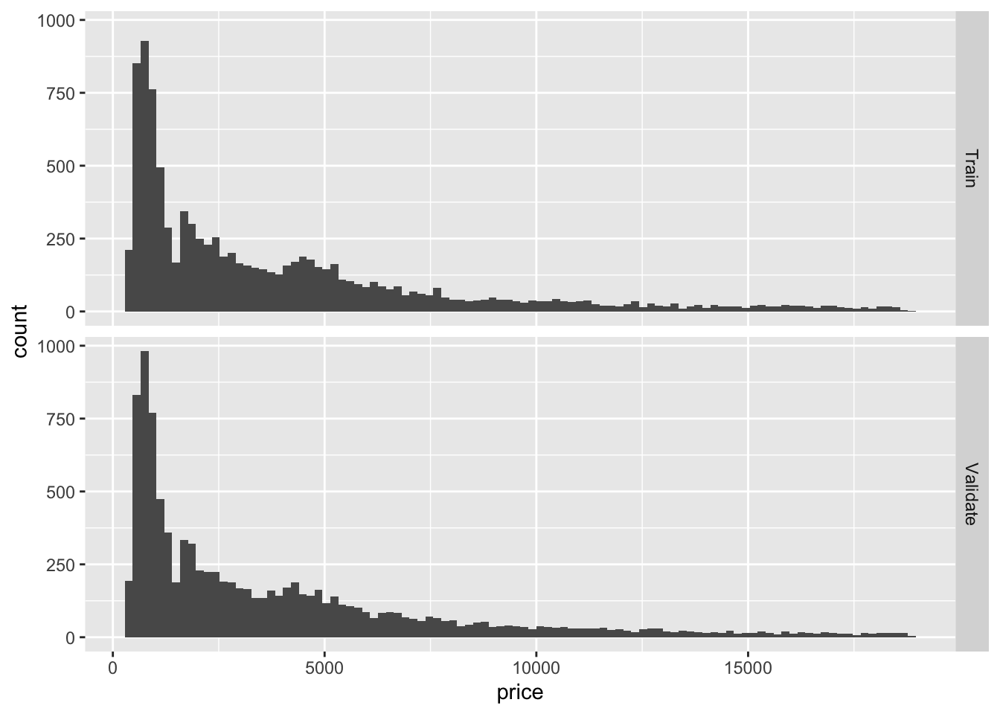
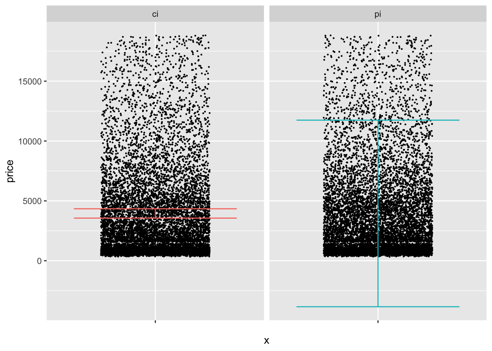

# Stats: Confidence vs Prediction Intervals

*Purpose*: There are multiple kinds of statistical intervals, and different intervals are useful for answering different questions. In this exercise, we'll learn about *prediction intervals*: How they differ from confidence intervals, and when we would use a CI versus a PI.

*Reading*: (None, this is the reading)


```r
library(tidyverse)
```

```
## ── Attaching packages ─────────────────────────────────────── tidyverse 1.3.0 ──
```

```
## ✔ ggplot2 3.4.0      ✔ purrr   1.0.1 
## ✔ tibble  3.1.8      ✔ dplyr   1.0.10
## ✔ tidyr   1.2.1      ✔ stringr 1.5.0 
## ✔ readr   2.1.3      ✔ forcats 0.5.2
```

```
## ── Conflicts ────────────────────────────────────────── tidyverse_conflicts() ──
## ✖ dplyr::filter() masks stats::filter()
## ✖ dplyr::lag()    masks stats::lag()
```

```r
library(modelr)
library(broom)
```

```
## 
## Attaching package: 'broom'
```

```
## The following object is masked from 'package:modelr':
## 
##     bootstrap
```

```r
## Helper function to compute uncertainty bounds
add_uncertainties <- function(data, model, prefix = "pred", ...) {
  df_fit <-
    stats::predict(model, data, ...) %>%
    as_tibble() %>%
    rename_with(~ str_c(prefix, "_", .))

  bind_cols(data, df_fit)
}
```

## Introduction: Confidence vs Prediction Intervals
<!-- -------------------------------------------------- -->

There are multiple kinds of statistical intervals: We have already discussed [confidence intervals](https://en.wikipedia.org/wiki/Confidence_interval) (in e-stat06-clt), now we'll discuss [prediction intervals](https://en.wikipedia.org/wiki/Prediction_interval).

## Specific Mathematical Example: Normal Distribution

To help distinguish between between confidence intervals (CI) and prediction intervals (PI), let's first limit our attention to normal distributions (where the math is easy).

We saw in e-stat06-clt that a confidence interval is a way to summarize our knowledge about an *estimated parameter*; for instance, a confidence interval $[l, u]$ for the sample mean $\overline{X}$ of a normal distribution at confidence level $C$ would be

$$C = \mathbb{P}\left[l < \overline{X} < u\right] = \mathbb{P}\left[\frac{l - \mu}{\sigma / \sqrt{n}} < Z < \frac{u - \mu}{\sigma / \sqrt{n}}\right].$$

Note the $\sigma / \sqrt{n}$ in the denominator on the right; this is the standard error for the sample mean $\overline{X}$. A CI is a useful way to summarize our uncertainty about an estimated parameter.

A different kind of interval is a *prediction interval* (PI). Rather than summarizing information about an estimated parameter, a PI summarizes information about *future observations*. The following equation defines a prediction interval for a normal distribution *assuming we magically know the mean and variance*:

$$P = \mathbb{P}\left[l < X < u\right] = \mathbb{P}\left[\frac{l - \mu}{\sigma} < Z < \frac{u - \mu}{\sigma}\right]$$
**Observations**:

- Note that the CI equation above has a dependence on $n$; as we gather more data the interval will tend to narrow.
- Note that the PI equation above have *no dependence* on $n$; when we turn the "magic" off and have to estimate `mean, sd` from data a dependence on $n$ shows up. However, even if we had infinite data (recovering the "magic" equation above), the interval would still not collapse to zero width.

### __q1__ Check your understanding; I provide code below to compute a confidence interval for the sample mean when sampling from `rnorm(mean = 1, sd = 2)` with `n = 400`. Modify the code to compute a prediction interval for the same underlying normal distribution.


```r
## NOTE: No need to edit this setup
mu <- 1  # Normal mean
sd <- 2  # Normal variance
n <- 400 # Number of samples

ci_lwr <- mu - 1.96 * sd / sqrt(n)
ci_upr <- mu + 1.96 * sd / sqrt(n)
pi_lwr <- mu - 1.96 * sd
pi_upr <- mu + 1.96 * sd
```

Use the following tests to check your work.


```r
## NOTE: No need to change this
assertthat::assert_that(abs(pi_lwr + 2.92) <= 1e-6)
```

```
## [1] TRUE
```

```r
assertthat::assert_that(abs(pi_upr - 4.92) <= 1e-6)
```

```
## [1] TRUE
```

```r
print("Well done!")
```

```
## [1] "Well done!"
```

Our first observation about CI and PI is that PI will tend to be wider than CI! That's because they are telling us *fundamentally different things* about our population. Consequently, we use CI and PI for *very different applications*.

## Applications of CI and PI

A *confidence interval* is most likely to be useful when we care *more about aggregates*---rather than the individual observations.

A *prediction interval* is most likely to be useful when we care *more about individual observations*---rather than the aggregate behavior.

Let's think back to e-stat10-hyp-intro, where we were buying *many* diamonds. In that case we constructed confidence intervals on the mean price of diamonds and on the proportion of high-cut diamonds. Since we cared primarily about the properties of *many* diamonds, it made sense to use confidence interval to support our decision making.

Now let's think of a different application: Imagine we were going to purchase just *one diamond*. In that case we don't care about the *mean price*; we care about the *single price* of the *one diamond* we'll ultimately end up buying. In this case, we would be better off constructing a prediction interval for the price of diamonds from the population---this will give us a sense of the range of values we might encounter in our purchase.

Prediction intervals are also used for [other applications](https://en.wikipedia.org/wiki/Prediction_interval#Applications), such as defining a "standard reference range" for blood tests: Since doctors care about the individual patients---we want *every* patient to survive, not just mythical "average" patients!---it is more appropriate to use a prediction interval for this application.

Let's apply these ideas to the diamonds dataset:


```r
## NOTE: No need to edit this setup
# Create a test-validate split
set.seed(101)
diamonds_randomized <-
  diamonds %>%
  slice(sample(dim(diamonds)[1]))

diamonds_train <-
  diamonds_randomized %>%
  slice(1:10000)

diamonds_validate <-
  diamonds_randomized %>%
  slice(10001:20000)
```

We're about to blindly apply the normal-assuming formulae, but before we do that, let's quickly inspect our data to see how normal or not they are:


```r
## NOTE: No need to edit this chunk
bind_rows(
  diamonds_train %>% mutate(source = "Train"),
  diamonds_validate %>% mutate(source = "Validate")
) %>%

  ggplot(aes(price)) +
  geom_histogram(bins = 100) +

  facet_grid(source ~ .)
```


Take a quick look at the plot above, and make a prediction (to yourself) whether the normally-approximated CI and PI will behave well in this case. Then continue on to q2.

### __q2__ Using the formulas above, estimate CI and PI using `diamonds_train`. Visualize the results using the chunk `q2-vis` below, and answer the questions under *observations*.


```r
df_q2 <-
  diamonds_train %>%
  summarize(
    price_mean = mean(price),
    price_sd = sd(price),
    price_n = n()
  ) %>%
  mutate(
   ci_lwr = price_mean - 1.96 * price_sd / sqrt(n),
   ci_upr = price_mean + 1.96 * price_sd / sqrt(n),
   pi_lwr = price_mean - 1.96 * price_sd,
   pi_upr = price_mean + 1.96 * price_sd
  ) %>%
  select(ci_lwr, ci_upr, pi_lwr, pi_upr)
df_q2
```

```
## # A tibble: 1 × 4
##   ci_lwr ci_upr pi_lwr pi_upr
##    <dbl>  <dbl>  <dbl>  <dbl>
## 1  3561.  4340. -3842. 11743.
```

Use the following code to visualize your results; answer the questions below.


```r
## NOTE: No need to edit this chunk
df_q2 %>%
  pivot_longer(
    names_to = c("type", ".value"),
    names_sep = "_",
    cols = everything()
  ) %>%

  ggplot() +
  geom_point(
    data = diamonds_validate,
    mapping = aes(x = "", y = price),
    position = position_jitter(width = 0.3),
    size = 0.2
  ) +
  geom_errorbar(aes(x = "", ymin = lwr, ymax = upr, color = type)) +

  guides(color = FALSE) +
  facet_grid(~ type)
```

```
## Warning: The `<scale>` argument of `guides()` cannot be `FALSE`. Use "none" instead as
## of ggplot2 3.3.4.
```



**Observations**:

- Visually the CI and PI seem decent.
  - The CI seems to be located in the "middle" of the data.
  - The PI covers a wide fraction of the data. However, its lower bound goes negative, which is undesirable.
- I would check the CI against the population mean (if available) or a validation mean.
- I would check if the PI contains an appropriate fraction of prices, either from the population (if available), or from validation data.
- Both the CI and PI above assume a normal distribution and perfectly-known parameters `mean, sd`. The assumption of perfectly-known parameters is probably ok here (since we have *a lot* of data), but based on EDA we've done before, the assumption of normality is quite poor.

### __q3__ Test whether your CI and PI are constructed correctly: Remember the definitions of what CI and PI are meant to accomplish, and check how closely your intervals agree with the validation data.


```r
## TODO: Devise a test to see if your CI and PI are correctly reflecting
##       the diamonds population; use diamonds_validation in your testing
## Testing the CI
bind_cols(
  df_q2 %>% select(ci_lwr, ci_upr),
  diamonds_validate %>% summarize(price_mean = mean(price))
) %>%
  select(ci_lwr, price_mean, ci_upr)
```

```
## # A tibble: 1 × 3
##   ci_lwr price_mean ci_upr
##    <dbl>      <dbl>  <dbl>
## 1  3561.      3917.  4340.
```

```r
## Testing the PI
left_join(
  diamonds_validate,
  df_q2 %>% select(pi_lwr, pi_upr),
  by = character()
) %>%
  summarize(P_empirical = mean(pi_lwr <= price & price <= pi_upr))
```

```
## # A tibble: 1 × 1
##   P_empirical
##         <dbl>
## 1       0.935
```

**Observations**:

- My CI does include the population mean.
- My PI includes ~0.94 of the validation prices, which is quite close to the 0.95 desired.

<!-- include-exit-ticket -->
