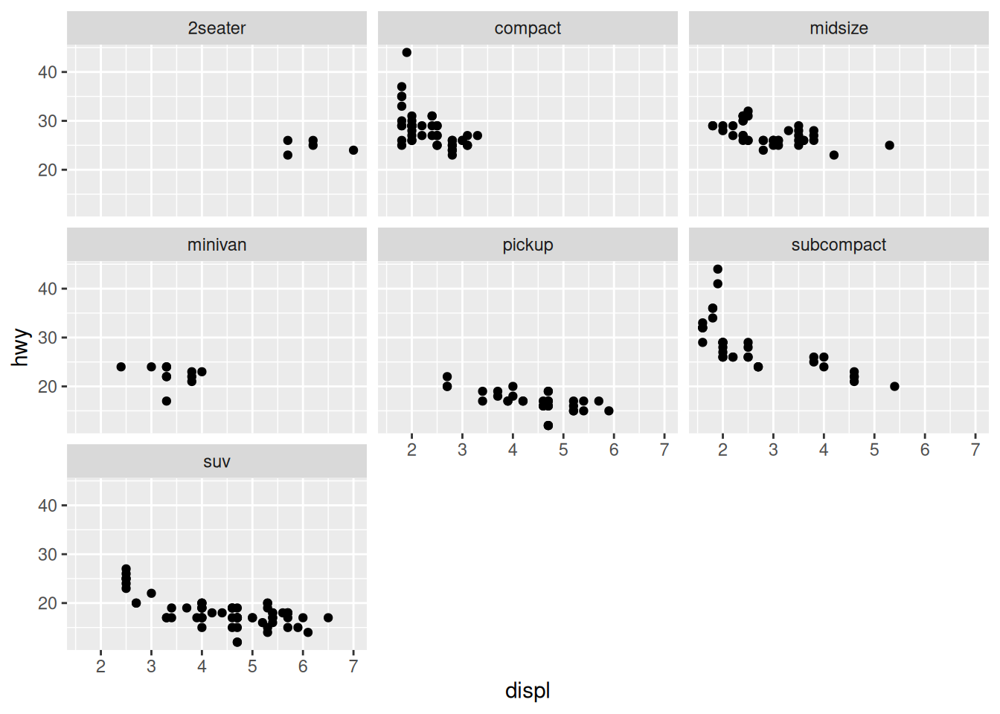

# Vis: Small Multiples

*Purpose*: A powerful idea in visualization is the *small multiple*. In this exercise you'll learn how to design and create small multiple graphs.

*Reading*: (None; there's a bit of reading here.)

"At the heart of quantitative reasoning is a single question: *Compared to what?*" Edward Tufte on visual comparison.


## Small Multiples
<!-- -------------------------------------------------- -->

Facets in ggplot allow us to apply the ideas of [small multiples](https://en.wikipedia.org/wiki/Small_multiple). As an example, consider the following graph:


``` r
economics %>%
  pivot_longer(
    names_to = "variable",
    values_to = "value",
    cols = c(pce, pop, psavert, uempmed, unemploy)
  ) %>%

  ggplot(aes(date, value)) +
  geom_line() +
  facet_wrap(~variable, scales = "free_y")
```


The "multiples" are the different panels; above we've separated the different variables into their own panel. This allows us to compare trends simply by lookin across at different panels. The faceting above works well for comparing trends: It's clear by inspection whether the various trends are increasing, decreasing, etc.

The next example with the `mpg` data is not so effective:


``` r
## NOTE: No need to edit; study this example
mpg %>%
  ggplot(aes(displ, hwy)) +
  geom_point() +
  facet_wrap(~class)
```



With these scatterplots it's more difficult to "keep in our heads" the absolute positions of the other points as we look across the multiples. Instead we could add some "ghost" points:


``` r
## NOTE: No need to edit; study this example
mpg %>%
  ggplot(aes(displ, hwy)) +
  ## A bit of a trick; remove the facet variable to prevent faceting
  geom_point(
    data = . %>% select(-class),
    color = "grey80"
  ) +
  geom_point() +
  facet_wrap(~class) +
  theme_minimal()
```


There's a trick to getting the visual above; removing the facet variable from an internal dataframe prevents the faceting of that layer. This combined with a second point layer gives the "ghost" point effect.

The presence of these "ghost" points provides more context; they facilitate the "Compared to what?" question that Tufte puts at the center of quantitative reasoning.

### __q1__ Edit the following figure to use the "ghost" point trick above.


``` r
## TODO: Edit this code to facet on `cut`, but keep "ghost" points to aid in
## comparison.
diamonds %>%
  ggplot(aes(carat, price)) +
  geom_point()
```


``` r
diamonds %>%
  ggplot(aes(carat, price)) +
  geom_point(
    data = . %>% select(-cut),
    color = "grey80"
  ) +
  geom_point() +
  facet_wrap(~cut)
```


## Organizing Factors
<!-- -------------------------------------------------- -->

Sometimes your observations will organize into natural categories. In this case facets are a great way to group your observations. For example, consider the following figure:


``` r
mpg %>%
  group_by(model) %>%
  filter(row_number(desc(year)) == 1) %>%
  ungroup() %>%
  mutate(
    manufacturer = fct_reorder(manufacturer, hwy),
    model = fct_reorder(model, desc(hwy))
  ) %>%

  ggplot(aes(hwy, model)) +
  geom_point() +
  facet_grid(manufacturer~., scale = "free_y", space = "free") +
  theme(
    strip.text.y = element_text(angle = 0)
  )
```


There's *a lot* going on this figure, including a number of subtle points. Let's list them out:

- I filter on the latest model with the `row_number` call (not strictly necessary).
- I'm re-ordering both the `manufacturer` and `model` on `hwy`.
  - However, I reverse the order of `model` to get a consistent "descending" pattern.
- I set both the `scale` and `space` arguments of the facet call; without those the spacing would be messed up (try it!).
- I rotate the facet labels to make them more readable.

### __q2__ Create a small multiple plot like `ex-mpg-manufacturer` above. Keep in mind the idea of "compared to what?" when deciding which variables to place close to one another.


``` r
## TODO: Create a set of small multiples plot from these data
as_tibble(iris) %>%
  pivot_longer(
    names_to = "part",
    values_to = "length",
    cols = -Species
  )
```

```
## # A tibble: 600 × 3
##    Species part         length
##    <fct>   <chr>         <dbl>
##  1 setosa  Sepal.Length    5.1
##  2 setosa  Sepal.Width     3.5
##  3 setosa  Petal.Length    1.4
##  4 setosa  Petal.Width     0.2
##  5 setosa  Sepal.Length    4.9
##  6 setosa  Sepal.Width     3  
##  7 setosa  Petal.Length    1.4
##  8 setosa  Petal.Width     0.2
##  9 setosa  Sepal.Length    4.7
## 10 setosa  Sepal.Width     3.2
## # ℹ 590 more rows
```


``` r
as_tibble(iris) %>%
  pivot_longer(
    names_to = "part",
    values_to = "length",
    cols = -Species
  ) %>%

  ggplot(aes(length, Species)) +
  geom_point() +
  facet_grid(part~., scale = "free_y", space = "free") +
  theme(
    strip.text.y = element_text(angle = 0)
  )
```


I chose to put the measurements of the same part close together, to facilitate
comparison of the common plant features across different species.

<!-- include-exit-ticket -->
