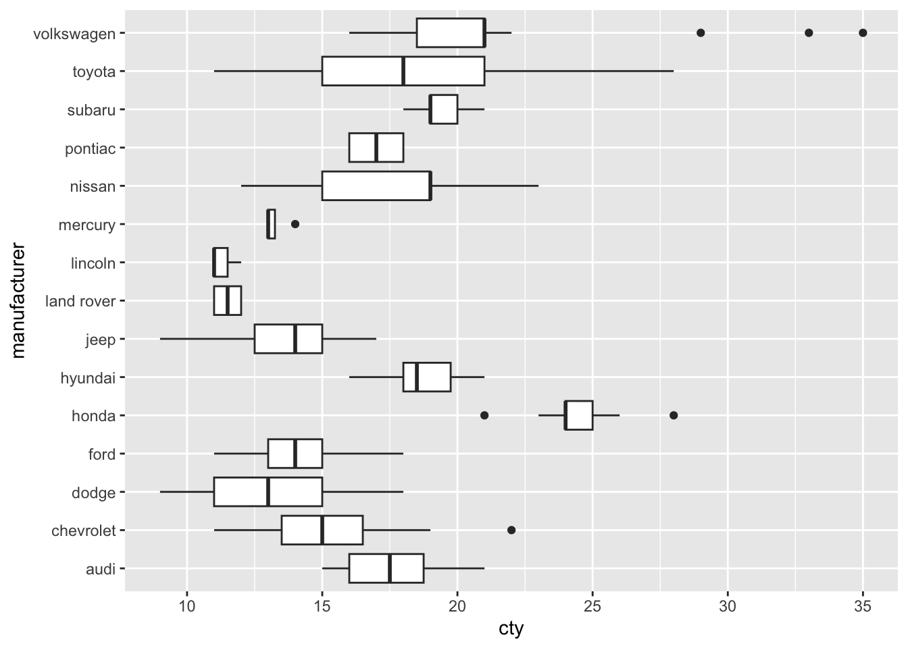
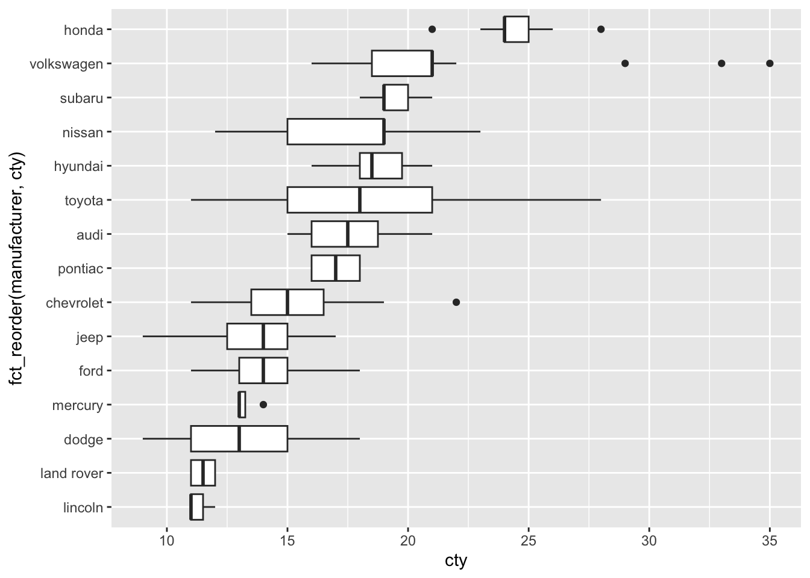
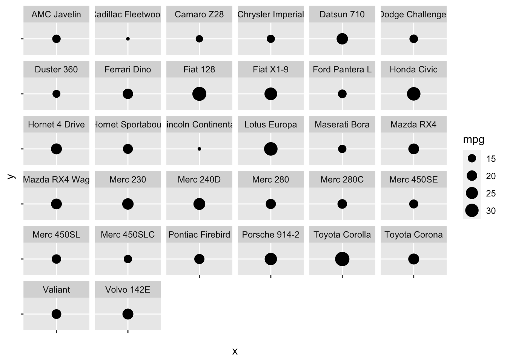
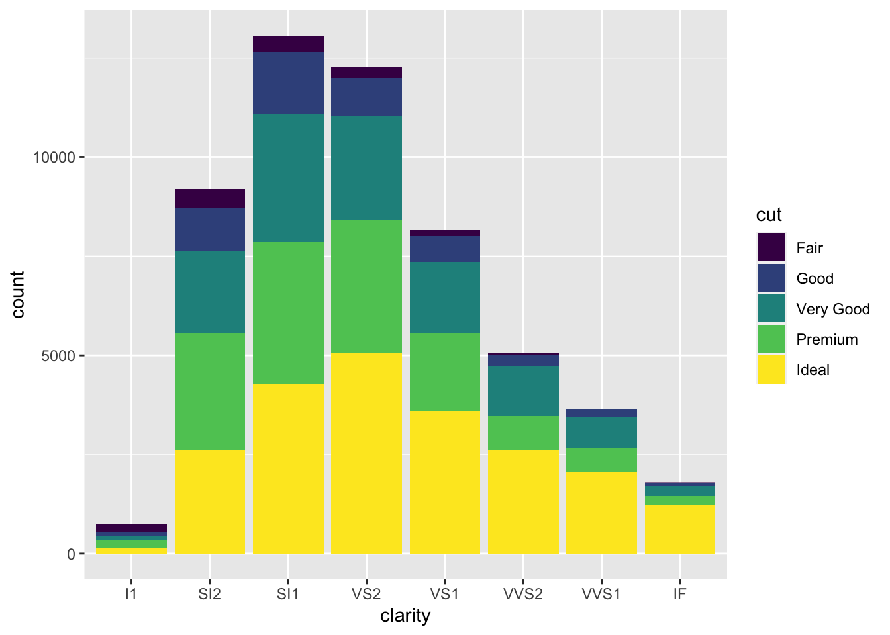
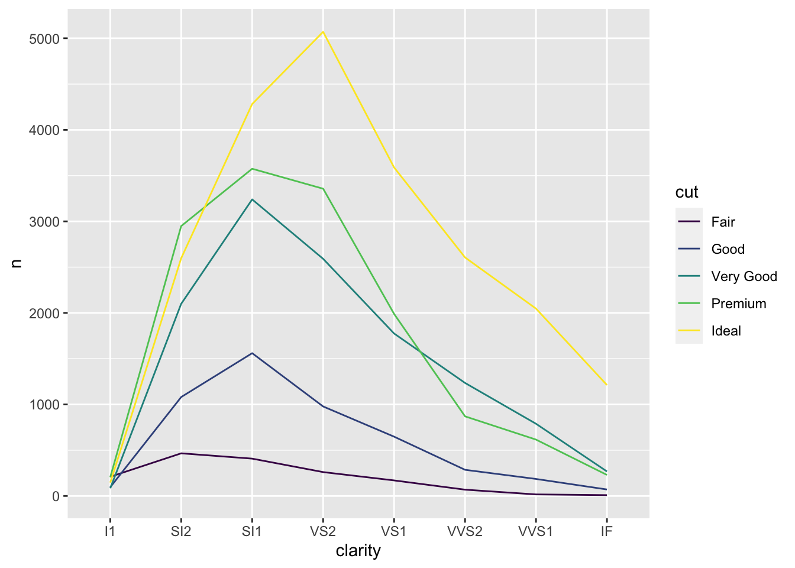
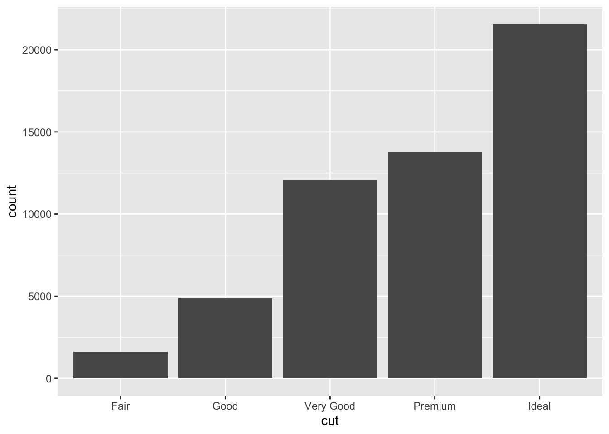

# Vis: Improving Graphs

*Purpose*: Creating a *presentation-quality* graph is an *iterative exercise*. There are many different ways to show the same data, some of which are more effective for communication than others. Let's return to the ideas from "How Humans See Data" and use them to improve upon some graphs: This will give you practice iterating on visuals.

*Reading*: [How Humans See Data](https://www.youtube.com/watch?v=fSgEeI2Xpdc&list=PLluqivwOH1ouKkbM0c6x-g7DQnXF0UmC0&index=37&t=0s) (Video from prior exercise, for reference)


```r
library(tidyverse)
```

```
## ── Attaching packages ─────────────────────────────────────── tidyverse 1.3.1 ──
```

```
## ✔ ggplot2 3.3.5     ✔ purrr   0.3.4
## ✔ tibble  3.1.2     ✔ dplyr   1.0.7
## ✔ tidyr   1.1.3     ✔ stringr 1.4.0
## ✔ readr   1.4.0     ✔ forcats 0.5.1
```

```
## ── Conflicts ────────────────────────────────────────── tidyverse_conflicts() ──
## ✖ dplyr::filter() masks stats::filter()
## ✖ dplyr::lag()    masks stats::lag()
```

## Improve these graphs!
<!-- -------------------------------------------------- -->

Using the ideas from the reading (video), state some issues with the following graphs. Remember the *visual hierarchy*:

1. Position along a common scale
2. Position on identical but nonaligned scales
3. Length
4. Angle; Slope (With slope not too close to 0, $\pi/2$, or $\pi$.)
5. Area
6. Volume; Density; Color saturation
7. Color hue

### __q1__ Use concepts from the reading to improve the following graph. *Make sure your graph shows all the same variables*, no more and no fewer.


```r
## NOTE: No need to edit; run and inspect
mpg %>%
  ggplot(aes(manufacturer, cty)) +
  geom_boxplot() +
  coord_flip()
```



Create your improved graph here


```r
## TODO: Create an improved version of the graph above
## NOTE: This is just one possibility
mpg %>%
  ggplot(aes(fct_reorder(manufacturer, cty), cty)) +
  geom_boxplot() +
  coord_flip()
```



### __q2__ Use concepts from the reading to improve the following graph. *Make sure your graph shows all the same variables*, no more and no fewer.


```r
## NOTE: No need to edit; run and inspect
as_tibble(mtcars) %>%
  mutate(model = rownames(mtcars)) %>%

  ggplot(aes(x = "", y = "", size = mpg)) +
  geom_point() +
  facet_wrap(~model)
```



Create your improved graph here


```r
## TODO: Create an improved version of the graph above
## NOTE: This is just one possibility
as_tibble(mtcars) %>%
  mutate(
    model = rownames(mtcars),
    model = fct_reorder(model, mpg)
  ) %>%

  ggplot(aes(x = model, y = mpg)) +
  geom_col() +
  coord_flip()
```


### __q3__ Use concepts from the reading to improve the following graph. *Make sure your graph shows all the same variables*, no more and no fewer.


```r
## NOTE: No need to edit; run and inspect
diamonds %>%
  ggplot(aes(clarity, fill = cut)) +
  geom_bar()
```



Create your improved graph here


```r
## TODO: Create an improved version of the graph above
## NOTE: This is just one possibility
diamonds %>%
  count(cut, clarity) %>%

  ggplot(aes(clarity, n, color = cut, group = cut)) +
  geom_line()
```



### __q4__ Use concepts from the reading to improve the following graph. *Make sure your graph shows all the same variables*, no more and no fewer.


```r
## NOTE: No need to edit; run and inspect
diamonds %>%
  ggplot(aes(x = "", fill = cut)) +
  geom_bar() +
  coord_polar("y") +
  labs(x = "")
```


Create your improved graph here


```r
## TODO: Create an improved version of the graph above
## NOTE: This is just one possibility
diamonds %>%
  ggplot(aes(cut)) +
  geom_bar()
```



<!-- include-exit-ticket -->
