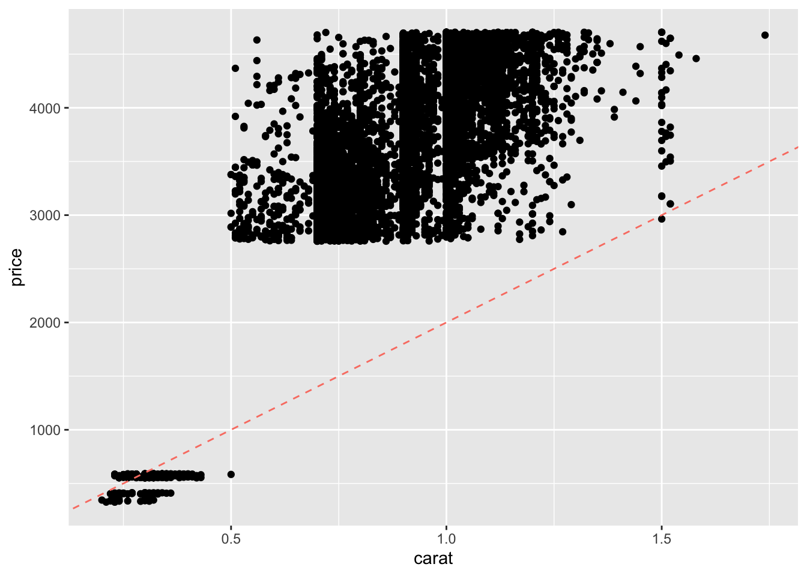
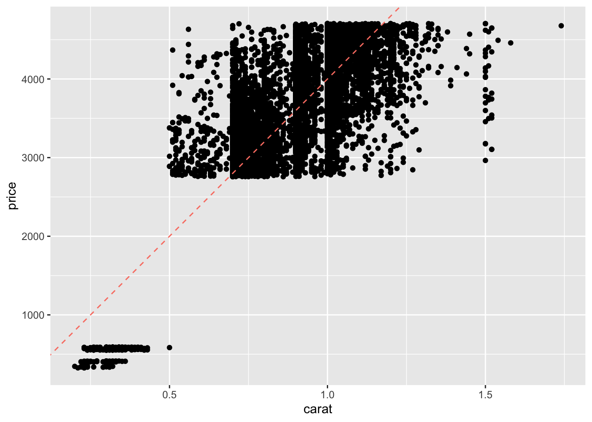
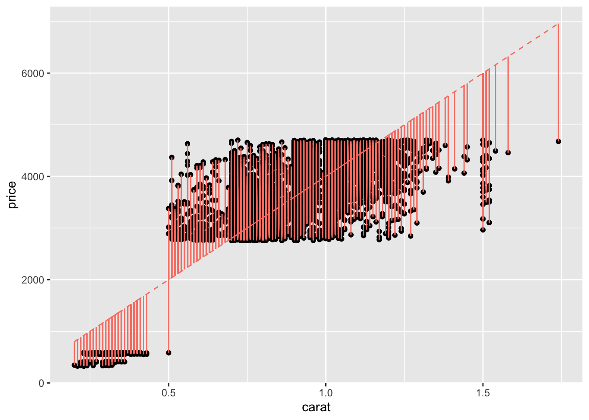
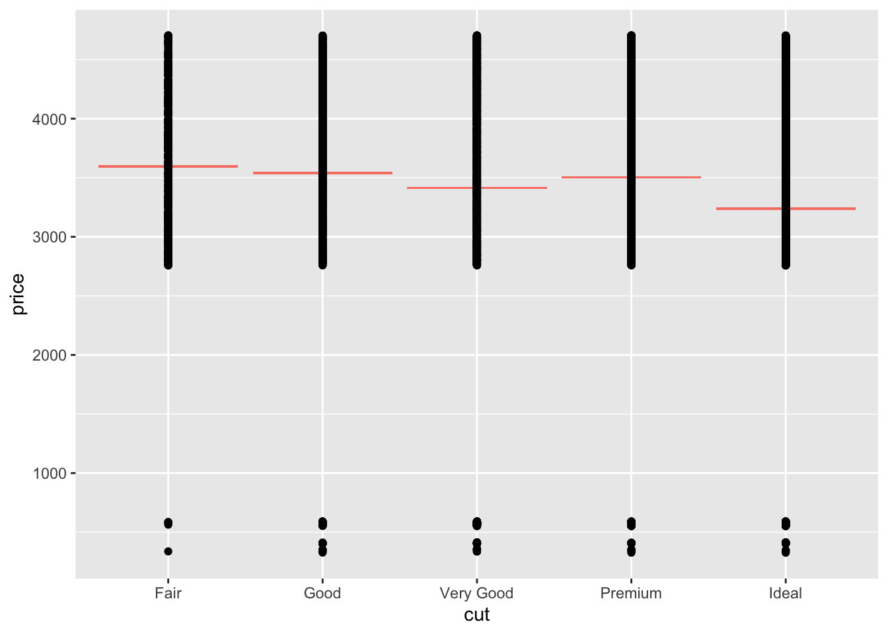
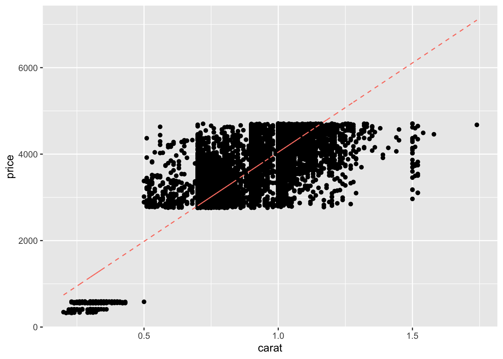
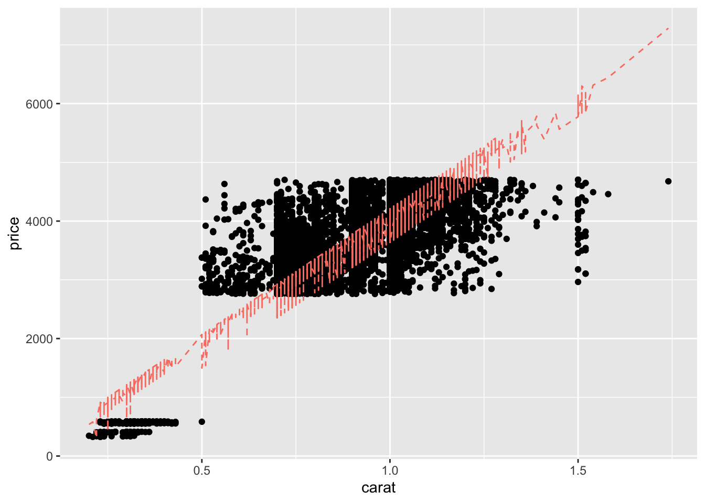
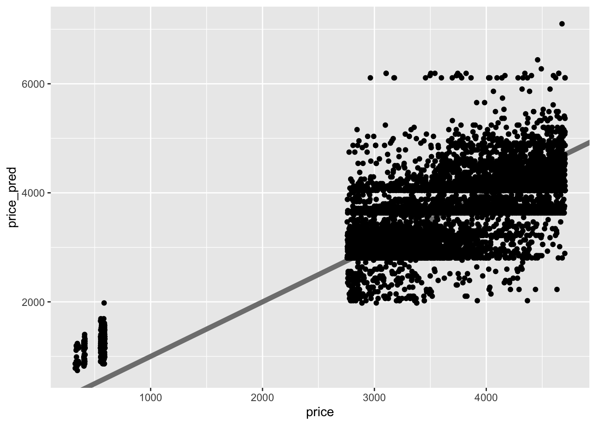
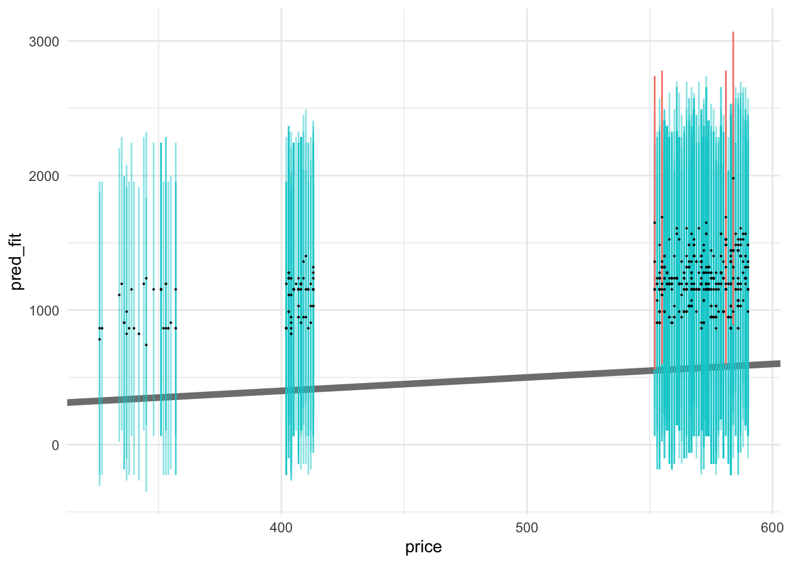
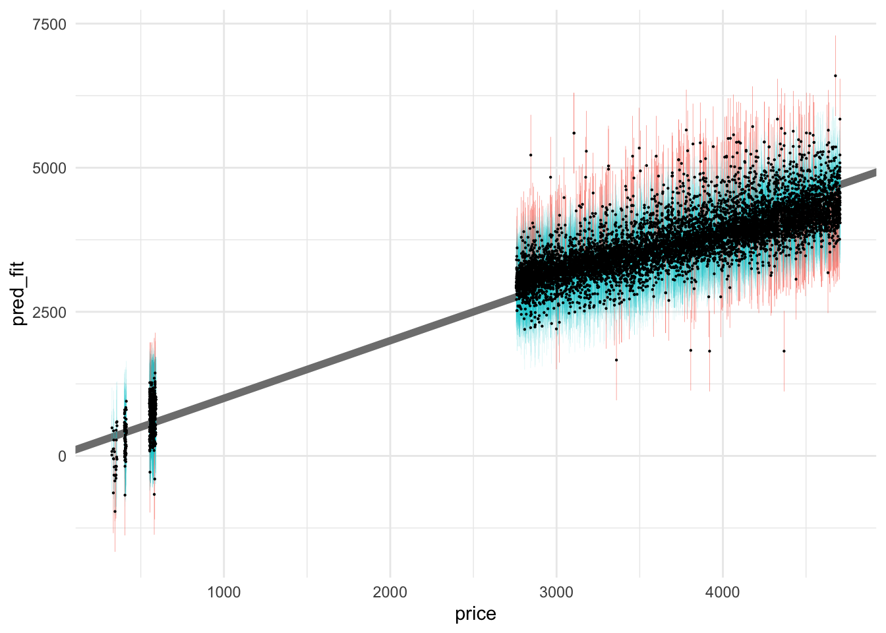

# Model: Introduction to Modeling

*Purpose*: Modeling is a key tool for data science: We will use models to understand the relationships between variables and to make predictions. **Building models is subtle and difficult**. To that end, this will be a high-level tour through the key parts of building and assessing a model. In this exercise, you'll learn what a model is, how to *fit* a model, how to *assess* a fitted model, some ways to *improve* a model, and how to *quantify* how trustworthy a model is.

*Reading*: (*None*, this exercise *is* the reading.)


```r
library(tidyverse)
```

```
## ── Attaching packages ─────────────────────────────────────── tidyverse 1.3.1 ──
```

```
## ✔ ggplot2 3.3.5     ✔ purrr   0.3.4
## ✔ tibble  3.1.2     ✔ dplyr   1.0.7
## ✔ tidyr   1.1.3     ✔ stringr 1.4.0
## ✔ readr   1.4.0     ✔ forcats 0.5.1
```

```
## ── Conflicts ────────────────────────────────────────── tidyverse_conflicts() ──
## ✖ dplyr::filter() masks stats::filter()
## ✖ dplyr::lag()    masks stats::lag()
```

```r
library(modelr)
library(broom)
```

```
## 
## Attaching package: 'broom'
```

```
## The following object is masked from 'package:modelr':
## 
##     bootstrap
```

```r
## NOTE: No need to edit this chunk
set.seed(101)

## Select training data
df_train <-
  diamonds %>%
  slice(1:1e4)

## Select test data
df_test <-
  diamonds %>%
  slice((1e4 + 1):2e4)
```

## A simple model

In what follows, we'll try to fit a *linear, one-dimensional* model for the `price` of a diamond. It will be *linear* in the sense that it will be a linear function of its inputs; i.e. for an input $x$ we'll limit ourselves to scaling the input $\beta \times x$. It will also be *one-dimensional* in the sense that we will only consider one input; namely, the `carat` of the diamond. Thus, my model for predicted price $\hat{f}$ will be

$$\hat{f} = \beta_0 + \beta_{\text{carat}} (\text{carat}) + \epsilon,$$

where $\epsilon$ is an *additive error* term, which we'll model as a random variable. Remember that $\hat{f}$ notation indicates an estimate for the quantity $f$. To start modeling, I'll choose *parameters* for my model by selecting values for the slope and intercept.


```r
## Set model parameter values [theta]
slope <- 1000 / 0.5 # Eyeball: $1000 / (1/2) carat
intercept <- 0

## Represent model as an `abline`
df_train %>%

  ggplot(aes(carat, price)) +
  geom_point() +
  geom_abline(
    slope = slope,
    intercept = intercept,
    linetype = 2,
    color = "salmon"
  )
```



That doesn't look very good; the line tends to miss the higher-carat values. I manually adjust the slope up by a factor of two:


```r
## Set model parameter values [theta]
slope <- 2000 / 0.5 # Adjusted by factor of 2
intercept <- 0

## Represent model as an `abline`
df_train %>%

  ggplot(aes(carat, price)) +
  geom_point() +
  geom_abline(
    slope = slope,
    intercept = intercept,
    linetype = 2,
    color = "salmon"
  )
```



This *manual* approach to *fitting a model*---choosing parameter values---is labor-intensive and silly. Fortunately, there's a better way. We can *optimize* the parameter values by minimizing a chosen metric.

First, let's visualize the quantities we will seek to minimize:


```r
## Set model parameter values [theta]
slope <- 2000 / 0.5
intercept <- 0

## Compute predicted values
df_train %>%
  mutate(price_pred = slope * carat + intercept) %>%

  ## Visualize *residuals* as vertical bars
  ggplot(aes(carat, price)) +
  geom_point() +
  geom_segment(
    aes(xend = carat, yend = price_pred),
    color = "salmon"
  ) +
  geom_line(
    aes(y = price_pred),
    linetype = 2,
    color = "salmon"
  )
```



This plot shows the *residuals* of the model, that is

$$\text{Residual}_i(\theta) = \hat{f}_i(\theta) - f_i,$$

where $f_i$ is the i-th observed output value (`price`), $\hat{f}_i(\theta)$ is the i-th prediction from the model (`price_pred`), and $\theta$ is the set of parameter values for the model. For instance, the *linear, one-dimensional* model above has as parameters `theta = c(slope, intercept)`. We can use these residuals to define an error metric and fit a model.

## Fitting a model

Define the *mean squared error* (MSE) via

$$\text{MSE}(\theta) = \frac{1}{n} \sum_{i=1}^n \text{Residual}_i(\theta)^2 = \frac{1}{n} \sum_{i=1}^n (\hat{f}_i(\theta) - f_i)^2.$$

This is a summary of the total error of the model. While we could carry out this optimization by hand, the `R` routine `lm()` (which stands for *linear model*) automates this procedure. We simply give it `data` over which to fit the model, and a `formula` defining which inputs and output to consider.


```r
## Fit model
fit_carat <-
  df_train %>%
  lm(
    data = .,               # Data for fit
    formula = price ~ carat # Formula for fit
  )

fit_carat %>% tidy()
```

```
## # A tibble: 2 x 5
##   term        estimate std.error statistic   p.value
##   <chr>          <dbl>     <dbl>     <dbl>     <dbl>
## 1 (Intercept)    -84.6      21.0     -4.04 0.0000546
## 2 carat         4129.       23.9    173.   0
```

The `tidy()` function takes a fit and returns the model's parameters; here we can see the `estimate` values for the coefficients, as well as some statistical information (which we'll discuss in a future exercise). The `formula` argument uses R's formula notation, where `Y ~ X` means "fit a linear model with `Y` as the value to predict, and with `X` as an input." The formula `price ~ carat` translates to the linear model

$$\widehat{\text{price}} = \beta_0 + \beta_{\text{carat}} (\text{carat}) + \epsilon.$$

This slightly-mysterious formula notation `price ~ carat` is convenient for defining many kinds of models, as we'll see in the following task.

### __q1__ Fit a basic model.

Copy the code above to fit a model of the form

$$\widehat{\text{price}} = \beta_0 + \beta_{\text{carat}} (\text{carat}) + \beta_{\text{cut}} (\text{cut}) + \epsilon.$$

Answer the questions below to investigate how this model form handles the variable `cut`.


```r
fit_q1 <-
  df_train %>%
  lm(
    data = .,
    formula = price ~ carat + cut
  )

fit_q1 %>% tidy()
```

```
## # A tibble: 6 x 5
##   term        estimate std.error statistic  p.value
##   <chr>          <dbl>     <dbl>     <dbl>    <dbl>
## 1 (Intercept)   -294.       22.1    -13.3  3.39e-40
## 2 carat         4280.       24.0    178.   0       
## 3 cut.L          349.       17.7     19.7  4.10e-85
## 4 cut.Q         -135.       15.8     -8.56 1.26e-17
## 5 cut.C          208.       14.3     14.5  2.94e-47
## 6 cut^4           82.2      12.1      6.78 1.26e-11
```

**Observations**:

- `carat` is a continuous variable, while `cut` is an (ordinal) factor; it only takes fixed non-numerical values.
- We can't reasonably multiply `cut` by a constant as it is not a number.
- The `term` for `carat` is just one numerical value (a slope), while there are multiple `term`s for `cut`.
  - These are `lm()`s way of *encoding* the `cut` factor as a numerical value: Note that there are `5` levels for `cut` and `4` terms representing `cut`.

*Aside*: Handling *factors* in modeling is handled automatically by `lm()` by introducing [*dummy variables*](https://en.wikipedia.org/wiki/Dummy_variable_(statistics)). Conceptually, what the linear model does is fit a single *contant value* for each level of the factor. This gives us a different prediction for each factor level, as the next example shows.


```r
## NOTE: No need to edit; just run and inspect
fit_cut <-
  lm(
    data = df_train,
    formula = price ~ cut
  )

df_train %>%
  add_predictions(fit_cut, var = "price_pred") %>%
  ggplot(aes(cut)) +
  geom_errorbar(aes(ymin = price_pred, ymax = price_pred), color = "salmon") +
  geom_point(aes(y = price))
```



## Assessing a model

Next, let's visually inspect the results of model `fit_carat` using the function `modelr::add_predictions()`:


```r
## Compute predicted values
df_train %>%
  add_predictions(
    model = fit_carat,
    var = "price_pred"
  ) %>%

  ggplot(aes(carat, price)) +
  geom_point() +
  geom_line(
    aes(y = price_pred),
    linetype = 2,
    color = "salmon"
  )
```



Frankly, these model predictions don't look very good! We know that diamond prices probably depend on the "4 C's"; maybe your model using more predictors will be more effective?

### __q2__ Repeat the code above from chunk `vis-carat` to produce a similar visual with your model `fit_q1`. *This visual is unlikely to be effective*, note in your observations why that might be.


```r
df_train %>%
  add_predictions(
    model = fit_q1,
    var = "price_pred"
  ) %>%

  ggplot(aes(carat, price)) +
  geom_point() +
  geom_line(
    aes(y = price_pred),
    linetype = 2,
    color = "salmon"
  )
```



**Observations**:

- A diamond can have a different value of `cut` at a fixed value of `carat`; this means our model can take different values at a fixed value of `carat`. This leads to the "squiggles" we see above.

Visualizing the results against a single variable quickly breaks down when we have more than one predictor! Let's learn some other tools for assessing model accuracy.

## Model Diagnostics

The plot above allows us to visually assess the model performance, but sometimes we'll want a quick *numerical summary* of model accuracy, particularly when comparing multiple models for the same data. The functions `modelr::mse` and `modelr::rsquare` are two *error metrics* we can use to summarize accuracy:


```r
## Compute metrics
mse(fit_carat, df_train)
```

```
## [1] 309104.4
```

```r
rsquare(fit_carat, df_train)
```

```
## [1] 0.7491572
```

- `mse` is the [*mean squared error*](https://en.wikipedia.org/wiki/Mean_squared_error). Lower values are more accurate.
  - The `mse` has no formal upper bound, so we can only compare `mse` values between models.
  - The `mse` also has the square-units of the quantity we're predicting; for instance our model's `mse` has units of $\$^2$.
- `rsquare`, also known as the [*coefficient of determination*](https://en.wikipedia.org/wiki/Coefficient_of_determination), lies between `[0, 1]`. Higher values are more accurate.
  - The `rsquare` has bounded values, so we can think about it in absolute terms: a model with `rsquare == 1` is essentially perfect, and values closer to `1` are better.

### __q3__ Compute the `mse` and `rsquare` for your model `fit_q1`, and compare the values against those for `fit_carat`. Is your model more accurate?


```r
mse(fit_q1, df_train)
```

```
## [1] 290675.2
```

```r
rsquare(fit_q1, df_train)
```

```
## [1] 0.7641128
```

**Observations**:

- The model `fit_q1` is slightly more accurate than `fit_carat`, at least on `df_train`

*Aside*: What's an acceptable r-squared value? That really depends on the application. For some physics-related problems $R \approx 0.9$ might be considered unacceptably low, while for some human-behavior related problems $R \approx 0.7$ might be considered quite good!

While it's difficult to visualize model results against *multiple variables*, we can always compare *predicted vs actual* values. If the model fit were perfect, then the predicted $\hat{f}$ and actual $f$ values would like along a straight line with slope one.


```r
## NOTE: No need to change this
## predicted vs actual
df_train %>%
  add_predictions(
    model = fit_carat,
    var = "price_pred"
  ) %>%

  ggplot(aes(price, price_pred)) +
  geom_abline(slope = 1, intercept = 0, color = "grey50", size = 2) +
  geom_point()
```



This fit looks quite poor---there is a great deal of scatter of actual values away from the predicted values. What's more, the scatter doesn't look random; there seem to be some consistent patterns (e.g. "stripes") in the plot that suggest there may be additional patterns we could incorporate in our model, if we added more variables. Let's try that!

## Improving a model

The plot above suggests there may be some patterns we're not accounting for in our model: Let's build another model to use that intuition.

### __q4__ Fit an updated model.

Fit a model `fit_4c` of the form:

$$\widehat{\text{price}} = \beta_0 + \beta_{\text{carat}} (\text{carat}) + \beta_{\text{cut}} (\text{cut}) + \beta_{\text{color}} (\text{color}) + \beta_{\text{clarity}} (\text{clarity}) + \epsilon.$$

Compute the `mse` and `rsquare` of your new model, and compare against the previous models.


```r
fit_4c <-
  df_train %>%
  lm(
    data = .,
    formula = price ~ carat + cut + color + clarity
  )

rsquare(fit_q1, df_train)
```

```
## [1] 0.7641128
```

```r
rsquare(fit_4c, df_train)
```

```
## [1] 0.897396
```

**Observations**:

- I find that adding all four C's improves the model accuracy quite a bit.

Generally, *adding more variables tends to improve model accuracy*. However, *this is not always the case*. In a future exercise we'll learn more about selecting meaningful variables in the context of modeling.

Note that even when we use all 4 C's, we still do not have a *perfect* model. Generally, any model we fit will have some inaccuracy. If we plan to use our model to make decisions, it's important to have some sense of **how much we can trust our predictions**. Metrics like model error are a coarse description of general model accuracy, but we can get much more useful information *for individual predictions* by **quantifying uncertainty**.

## Quantifying uncertainty

We've talked about **confidence intervals** before for estimates like the sample mean. Let's take a (brief) look now at *prediction intervals* (PI). The code below approximates prediction intervals based on the `fit_carat` model.


```r
## NOTE: No need to edit this chunk
## Helper function to compute uncertainty bounds
add_uncertainties <- function(data, model, prefix = "pred", ...) {
  df_fit <-
    stats::predict(model, data, ...) %>%
    as_tibble() %>%
    rename_with(~ str_c(prefix, "_", .))

  bind_cols(data, df_fit)
}

## Generate predictions with uncertainties
df_pred_uq <-
  df_train %>%
  add_uncertainties(
    model = fit_carat,
    prefix = "pred",
    interval = "prediction",
    level = 0.95
  )

df_pred_uq %>% glimpse()
```

```
## Rows: 10,000
## Columns: 13
## $ carat    <dbl> 0.23, 0.21, 0.23, 0.29, 0.31, 0.24, 0.24, 0.26, 0.22, 0.23, 0…
## $ cut      <ord> Ideal, Premium, Good, Premium, Good, Very Good, Very Good, Ve…
## $ color    <ord> E, E, E, I, J, J, I, H, E, H, J, J, F, J, E, E, I, J, J, J, I…
## $ clarity  <ord> SI2, SI1, VS1, VS2, SI2, VVS2, VVS1, SI1, VS2, VS1, SI1, VS1,…
## $ depth    <dbl> 61.5, 59.8, 56.9, 62.4, 63.3, 62.8, 62.3, 61.9, 65.1, 59.4, 6…
## $ table    <dbl> 55, 61, 65, 58, 58, 57, 57, 55, 61, 61, 55, 56, 61, 54, 62, 5…
## $ price    <int> 326, 326, 327, 334, 335, 336, 336, 337, 337, 338, 339, 340, 3…
## $ x        <dbl> 3.95, 3.89, 4.05, 4.20, 4.34, 3.94, 3.95, 4.07, 3.87, 4.00, 4…
## $ y        <dbl> 3.98, 3.84, 4.07, 4.23, 4.35, 3.96, 3.98, 4.11, 3.78, 4.05, 4…
## $ z        <dbl> 2.43, 2.31, 2.31, 2.63, 2.75, 2.48, 2.47, 2.53, 2.49, 2.39, 2…
## $ pred_fit <dbl> 865.1024, 782.5204, 865.1024, 1112.8483, 1195.4303, 906.3934,…
## $ pred_lwr <dbl> -225.25853, -307.86569, -225.25853, 22.55812, 105.16206, -183…
## $ pred_upr <dbl> 1955.463, 1872.906, 1955.463, 2203.139, 2285.699, 1996.742, 1…
```

The helper function `add_uncertainties()` added the columns `pred_fit` (the predicted price), as well as two new columns: `pred_lwr` and `pred_upr`. These are the bounds of a *prediction interval* (PI), an interview meant to capture *not* a future sample statistic, *but rather* a future observation.

The following visualization illustrates the computed prediction intervals: I visualize the prediction intervals with `geom_errorbar`. Note that we get a PI *for each observation*; every dot gets an interval.

Since we have access to the true values `price`, we can assess whether the true observed values fall within the model prediction intervals; this happens when the diagonal falls within the interval on a predicted-vs-actual plot.


```r
## NOTE: No need to edit this chunk
# Visualize
df_pred_uq %>%
  filter(price < 1000) %>%

  ggplot(aes(price)) +
  geom_abline(slope = 1, intercept = 0, size = 2, color = "grey50") +
  geom_errorbar(
    data = . %>% filter(pred_lwr <= price & price <= pred_upr),
    aes(ymin = pred_lwr, ymax = pred_upr),
    width = 0,
    size = 0.5,
    alpha = 1 / 2,
    color = "darkturquoise"
  ) +
  geom_errorbar(
    data = . %>% filter(price < pred_lwr | pred_upr < price),
    aes(ymin = pred_lwr, ymax = pred_upr),
    width = 0,
    size = 0.5,
    color = "salmon"
  ) +
  geom_point(aes(y = pred_fit), size = 0.1) +
  theme_minimal()
```



Ideally these prediction intervals should include a desired fraction of observed values; let's compute the *empirical coverage* to see if this matches our desired `level = 0.95`.


```r
## NOTE: No need to edit this chunk
# Compute empirical coverage
df_pred_uq %>%
  summarize(coverage = mean(pred_lwr <= price & price <= pred_upr))
```

```
## # A tibble: 1 x 1
##   coverage
##      <dbl>
## 1    0.959
```

The empirical coverage is quite close to our desired level.

### __q6__ Use the helper function `add_uncertainties()` to add prediction intervals to `df_train` based on the model `fit_4c`.


```r
df_q6 <-
  df_train %>%
  add_uncertainties(
    model = fit_4c,
    prefix = "pred",
    interval = "prediction",
    level = 0.95
  )

## NOTE: No need to edit code below
# Compute empirical coverage
df_q6 %>%
  summarize(coverage = mean(pred_lwr <= price & price <= pred_upr))
```

```
## # A tibble: 1 x 1
##   coverage
##      <dbl>
## 1    0.956
```

```r
# Visualize
df_q6 %>%
  ggplot(aes(price)) +
  geom_abline(slope = 1, intercept = 0, size = 2, color = "grey50") +
  geom_errorbar(
    data = . %>% filter(pred_lwr <= price & price <= pred_upr),
    aes(ymin = pred_lwr, ymax = pred_upr),
    width = 0,
    size = 0.1,
    alpha = 1 / 5,
    color = "darkturquoise"
  ) +
  geom_errorbar(
    data = . %>% filter(price < pred_lwr | pred_upr < price),
    aes(ymin = pred_lwr, ymax = pred_upr),
    width = 0,
    size = 0.1,
    color = "salmon"
  ) +
  geom_point(aes(y = pred_fit), size = 0.1) +
  theme_minimal()
```


We will discuss prediction intervals further in a future exercise. For now, know that they give us a sense of how much we should trust our model predictions.

## Summary

To summarize this reading, here are the steps to fitting and using a model:

- *Choose* a model form, e.g. if only considering *linear models*, we may consider `price ~ carat` vs `price ~ carat + cut`.
- *Fit* the model with data; this is done by optimizing a user-chosen metric, such as the `mse`.
- *Assess* the model with metrics (`mse, rsquare`) and plots (predicted-vs-actual).
- *Improve* the model if needed, e.g. by adding more predictors.
- *Quantify* the trustworthiness of the model, e.g. with prediction intervals.
- *Use* the model to do useful work! We'll cover this in future exercises.

## Preview

Notice that in this exercise, we only used `df_test`, but I *also* defined a tibble `df_train`. What happens when we fit the model on `df_train`, but assess it on `df_test`?


```r
## NOTE: No need to edit this chunk
rsquare(fit_4c, df_train)
```

```
## [1] 0.897396
```

```r
rsquare(fit_4c, df_test)
```

```
## [1] 0.7860757
```

Note that `rsquare` on the *training data* `df_train` is much higher than `rsquare` on the *test data* `df_test`. This indicates that the assessment of model accuracy is *overly optimistic* when assessing the model with `df_train`. We will explore this idea more in `e-stat12-models-train-test`.

<!-- include-exit-ticket -->
