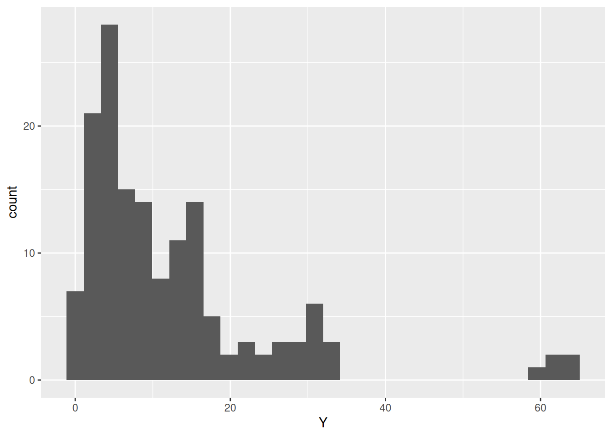

# Model: Variability Quadrants

*Purpose*: All real data have variability: repeated measurements of "the same" quantity tend to result in different values. To help you recognize different kinds of variability and choose a reasonable analysis procedure based on the kind of variability, you will learn about different *sources* of variability in this exercise.

*Reading*: [Conceptual Tools for Handling Uncertainty](https://drive.google.com/file/d/1nuGuPGG0zLgB72wjwfAoMiKAWQ4g7hlr/view?usp=sharing)


``` r
## Note: No need to edit this chunk!
library(tidyverse)
```

```
## ── Attaching core tidyverse packages ──────────────────────── tidyverse 2.0.0 ──
## ✔ dplyr     1.1.4     ✔ readr     2.1.5
## ✔ forcats   1.0.0     ✔ stringr   1.5.1
## ✔ ggplot2   3.5.1     ✔ tibble    3.2.1
## ✔ lubridate 1.9.4     ✔ tidyr     1.3.1
## ✔ purrr     1.0.4     
## ── Conflicts ────────────────────────────────────────── tidyverse_conflicts() ──
## ✖ dplyr::filter() masks stats::filter()
## ✖ dplyr::lag()    masks stats::lag()
## ℹ Use the conflicted package (<http://conflicted.r-lib.org/>) to force all conflicts to become errors
```

## Variability

As we've seen in this course, real data exhibit *variability*; that is, repeated measurements of "the same" quantity that result in different values. Variability can arise due to a variety of reasons, and different kinds of variability should be analyzed in different ways. To help make this determination, we're going to study a theoretical framework for variability.

## The Cause-Source Quadrants

As descrinbed in the reading, the *cause-source quadrants* organize variability into four distinct categories. Today, we're going to focus on the *source* axis, and limit our attention to *chance causes*.


- *Cause* is an idea from statistical quality control (manufacturing); a *chance cause* is modeled as random, while an *assignable cause* is thought to be traceable and preventable.
- *Source* is an idea from statistics education theory; this concept is explained further below.

## Real vs Erroneous Source

The idea of *source* can only be understood in the distinction between a *quantity of interest* (QOI) and a *measurement*: The *QOI* is the quantity that we are seeking to study, while the *measurement* is a possibly-corrupted version of our QOI. The key insight is that **variability can occur both in the QOI, and in the measurement**.


As a simple example: based on our current understanding of physics, the speed of light `c` is a [constant value](https://en.wikipedia.org/wiki/Speed_of_light). Therefore, any variability we see in measurements of `c` are understood to be *erroneous variability*; real variability in `c` is not considered to be possible.

Conversely, our current understanding of physics is that quantum phenomena are [fundamentally unpredictable](https://en.wikipedia.org/wiki/Quantum_mechanics), and can only be described in a statistical sense. This means that quantum phenomena exhibit real variability.

Other physical quantities exhibit both real and erroneous variability. Since the concept of a *QOI* relies on a choice, the only way we can make progress with this concept is to consider a specific scenario in detail.

## Manufacturing structural steel components

*The Context*: A manufacturer is producing cast steel parts for a landing gear. The part in question takes a heavy load, and if it fails it will disable the aircraft on the ground. These parts will be manufactured in bulk; approximately 500 will be made and installed in commercial aircraft that will operate for decades.

*The QOI*: The strength of each steel component---as-manufactured---will ultimately determine whether each aircraft is safe. As we learned in `c08-structures`, a structure is safe if its applied stress is less than its strength. Therefore, a smaller material strength is a more conservative value for design purposes.

## Scenarios

### __q1__ Imagine the manufacturer selects one part and performs multiple non-destructive tensile tests on that single part, under similar conditions. The measured elasticity from each test is slightly different. Is this variability real or erroneous?

- Erroneous
- The properties of the component are essentially set at manufacturing time; if multiple measurements on the same part return different values, then the variability is most likely an error introduced by the measurement process.

### __q2__ Imagine the manufacturer selects multiple parts and---for each part---performs multiple non-destructive tensile tests, all under similar conditions. The measured elasticity values for each part are averaged to provide a more reliable estimate for each part. Upon comparing the parts, each averaged value is fairly different. Is this variability real or erroneous?

- Real
- The properties of the component are essentially set at manufacturing time; but no manufacturing process can create items with identical properties. Particularly if variability remains after erroneous variability has been controlled and eliminated (as described in the prompt), then the remaining variability is real.

### __q3__ Now the manufacturer selects multiple parts and performs a destructive tensile test to characterize the strength of each part, with tests carried out under similar conditions. The measured strength values exhibit a fair amount of variability. Is this variability real or erroneous?

- Without more information, it is impossible to say. It is likely a combination of real and erroneous sources.
- Real variability can arise from the manufacturing process, and erroneous variability can arise from the measurement. Since the measurement is destructive, we cannot use multiple measurements to control the erroneous variability.
- Note that it would generally be conservative to treat all of the variability in a strength as real; this would lead to parts that are heavier but safer than they need to be.

## Analyzing Data

The following generates data with both *noise* and *deviation*


``` r
set.seed(101)
df_meas <-
  map_dfr(
    1:30,
    function(i) {
      Y_deviation <- rlnorm(n = 1, meanlog = 2)
      Y_noise <- rnorm(n = 5, sd = 1)

      tibble(Y = Y_deviation + Y_noise) %>%
        mutate(id_sample = i, id_meas = row_number())
    }
  )
```

`id_sample` - represents an individual part
`id_meas` - represents an individual measurement, with multiple carried out on each part
`Y` - an individual measurement, identified by `id_sample` and `id_meas`

If we make a simple histogram, we can see that the measured value `Y` is highly variable:


``` r
df_meas %>%
  ggplot(aes(Y)) +
  geom_histogram(bins = 30)
```



However, these data exhibit multiple *sources* of variability. The following questions will help you learn how to analyze data in light of this mixed variability.

### __q4__ Inspect the following graph. Answer the questions under *observations* below.


``` r
## NOTE: No need to edit; run and inspect
df_meas %>%
  ggplot(aes(id_sample, Y)) +
  geom_point(
    data = . %>%
      group_by(id_sample) %>%
      summarize(Y = mean(Y)),
    color = "red",
    size = 1
  ) +
  geom_point(size = 0.2) +
  theme_minimal()
```


*Observations*
- Based on the visual, the variability due to deviation is obviously much larger than the variability due to noise: There is considerably more scatter between the red dots (each sample's measurement mean), than there is scatter around each red dot.

We can make this quantitative with an *analysis of variance*:


``` r
fit_meas <-
  df_meas %>%
  lm(formula = Y ~ id_sample + id_meas)
anova(fit_meas)
```

```
## Analysis of Variance Table
## 
## Response: Y
##            Df  Sum Sq Mean Sq F value Pr(>F)
## id_sample   1    26.0  26.040  0.1609 0.6889
## id_meas     1     0.9   0.869  0.0054 0.9417
## Residuals 147 23792.3 161.852
```

A [random effects model](https://en.wikipedia.org/wiki/Random_effects_model) would be more appropriate for these data, but the fixed-effects ANOVA above gives a rough quantitative comparison.


### __q5__ Imagine `Y` represents the measured strength of the cast steel. Would it be safe to simply average all of the values and use that as the material strength for design?

- No, it would be foolish to take the average of all these strength measurements and use that value for design. In fact, in aircraft design, this approach would be *illegal* according to [Federal Airworthiness Regulations](https://www.law.cornell.edu/cfr/text/14/25.613).

### __q6__ Compute the `0.1` quantile of the `Y` measurements. Would this be a conservative value to use as a material strength for design?


``` r
## TODO: Compute the 0.01 quantile of the `Y` values; complete the code below
# For comparison, here's the mean of the data
Y_mean <-
  df_meas %>%
  summarize(Y_mean = mean(Y)) %>%
  pull(Y_mean)

Y_lo <-
  df_meas %>%
  summarize(Y_lo = quantile(Y, p = 0.1)) %>%
  pull(Y_lo)

# Compare the values
Y_mean
```

```
## [1] 12.30886
```

``` r
Y_lo
```

```
##      10% 
## 2.011725
```

Use the following to check your work.


``` r
## NO NEED TO EDIT; use this to check your work
assertthat::assert_that(abs(as.numeric(Y_lo) - 2.0117) < 1e-3)
```

```
## [1] TRUE
```

``` r
print("Nice!")
```

```
## [1] "Nice!"
```

*Observations*

- `Y_lo` is considerably smaller than `Y_mean`.
- Yes, the 10% quantile would be a conservative material strength value. This would still not be in compliance with [FAA regulations](https://arc.aiaa.org/doi/full/10.2514/1.J059578) for material properties, but it is certainly better than using the (sample) mean.

### __q7__ The following code reduces the variability due to noise before computing the quantile. Run the code below, and answer the questions under *Observations* below.


``` r
## NOTE: No need to edit; run and answer the questions below
Y_lo_improved <-
  df_meas %>%
  ## Take average within each sample's measurements
  group_by(id_sample) %>%
  summarize(Y_sample = mean(Y)) %>%
  ## Take quantile over all the samples
  summarize(Y_lo = quantile(Y_sample, p = 0.1)) %>%
  pull(Y_lo)
Y_lo_improved
```

```
##      10% 
## 2.566182
```

``` r
Y_lo
```

```
##      10% 
## 2.011725
```

*Observations*

- The new value `Y_lo_improved` is less conservative, but it is also more efficient. This value reduces the effects of noise, which focuses on the design-relevant deviation present in the material property of interest.
- To compute `Y_lo_improved`, we needed multiple observations `id_meas` on each sample `id_sample`.
- In reality, we cannot collect a dataset like `df_meas` for strength properties; this is because we can't collect more than one strength measurement per sample!
- It is possible to collect repeated observations with any non-destructive measurement. For material properties, this could include the elasticity, poisson ratio, density, etc.

*Aside*: This kind of statistical experimental design is sometimes called a [nested design](https://online.stat.psu.edu/stat503/lesson/14/14.1).

<!-- include-exit-ticket -->
