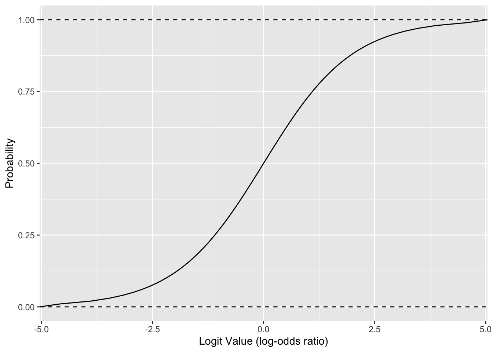
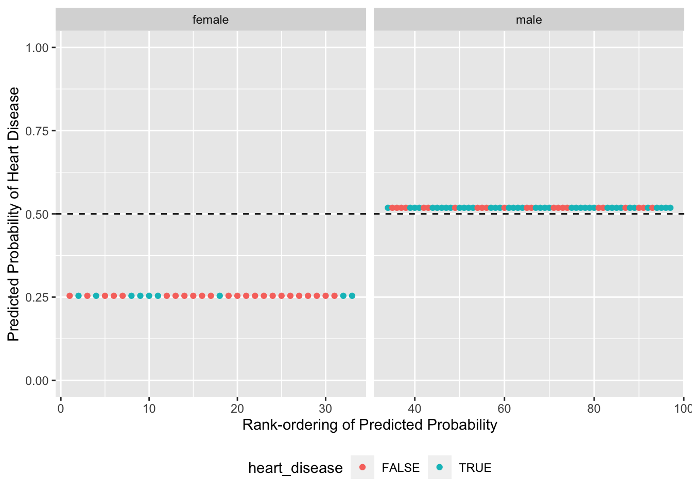
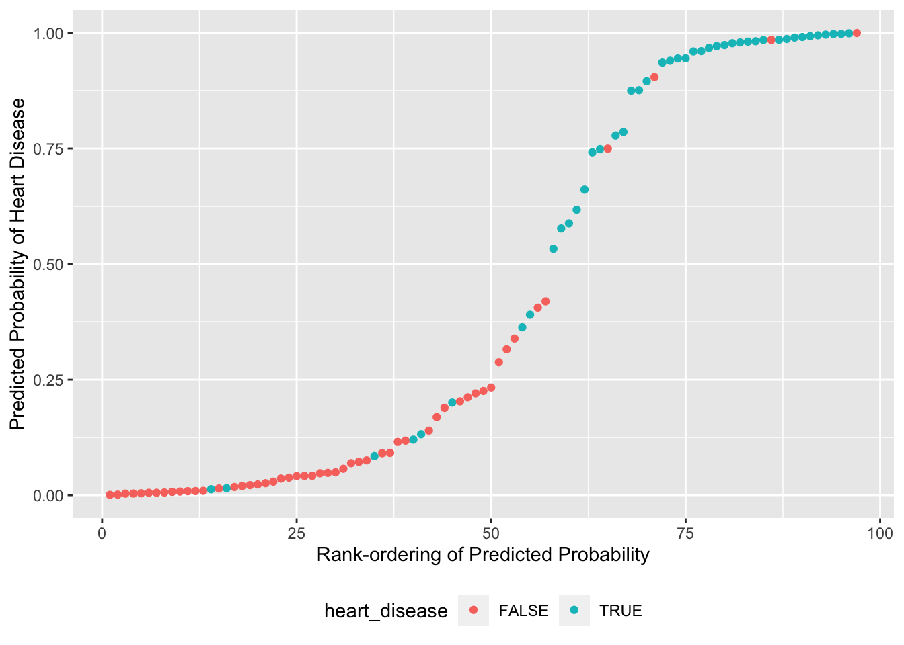

# Model: Logistic Regression

*Purpose*: So far we've talked about models to predict continuous values. However, we can also use models to make predictions about *binary outcomes*---classification. Classifiers are useful for a variety of uses, but they introduce a fair bit more complexity than simple linear models. In this exercise you'll learn about *logistic regression*: a variation on linear regression that is useful for classification.

*Reading*: [StatQuest: Logistic Regression](https://www.youtube.com/watch?v=vN5cNN2-HWE) (Required, just watch up to 10:47 and dont' worry about the p-value stuff).


```r
library(tidyverse)
```

```
## ── Attaching packages ─────────────────────────────────────── tidyverse 1.3.0 ──
```

```
## ✔ ggplot2 3.4.0      ✔ purrr   1.0.1 
## ✔ tibble  3.1.8      ✔ dplyr   1.0.10
## ✔ tidyr   1.2.1      ✔ stringr 1.5.0 
## ✔ readr   2.1.3      ✔ forcats 0.5.2
```

```
## ── Conflicts ────────────────────────────────────────── tidyverse_conflicts() ──
## ✖ dplyr::filter() masks stats::filter()
## ✖ dplyr::lag()    masks stats::lag()
```

```r
library(modelr)
library(broom)
```

```
## 
## Attaching package: 'broom'
```

```
## The following object is masked from 'package:modelr':
## 
##     bootstrap
```

*Note*: This exercise is heavily inspired by Josh Starmer's [logistic regression](https://github.com/StatQuest/logistic_regression_demo/blob/master/logistic_regression_demo.R) example.

*Background*: This exercise's data comes from the UCI Machine Learning Database; specifically their [Heart Disease Data Set](https://archive.ics.uci.edu/ml/datasets/Heart+Disease). These data consist of clinical measurements on patients, and are intended to help study heart disease.

## Setup
<!-- ------------------------- -->

Note: The following chunk contains *a lot of stuff*, but you already did this in e-data13-cleaning!


```r
## NOTE: No need to edit; you did all this in a previous exercise!
url_disease <- "http://archive.ics.uci.edu/ml/machine-learning-databases/heart-disease/processed.cleveland.data"
filename_disease <- "./data/uci_heart_disease.csv"

## Download the data locally
curl::curl_download(
        url_disease,
        destfile = filename_disease
      )

## Wrangle the data
col_names <- c(
  "age",
  "sex",
  "cp",
  "trestbps",
  "chol",
  "fbs",
  "restecg",
  "thalach",
  "exang",
  "oldpeak",
  "slope",
  "ca",
  "thal",
  "num"
)

## Recoding functions
convert_sex <- function(x) {
  case_when(
    x == 1 ~ "male",
    x == 0 ~ "female",
    TRUE ~ NA_character_
  )
}
convert_cp <- function(x) {
  case_when(
    x == 1 ~ "typical angina",
    x == 2 ~ "atypical angina",
    x == 3 ~ "non-anginal pain",
    x == 4 ~ "asymptomatic",
    TRUE ~ NA_character_
  )
}
convert_fbs <- function(x) {
  if_else(x == 1, TRUE, FALSE)
}
convert_restecv <- function(x) {
  case_when(
    x == 0 ~ "normal",
    x == 1 ~ "ST-T wave abnormality",
    x == 2 ~ "Estes' criteria",
    TRUE ~ NA_character_
  )
}
convert_exang <- function(x) {
  if_else(x == 1, TRUE, FALSE)
}
convert_slope <- function(x) {
  case_when(
    x == 1 ~ "upsloping",
    x == 2 ~ "flat",
    x == 3 ~ "downsloping",
    TRUE ~ NA_character_
  )
}
convert_thal <- function(x) {
  case_when(
    x == 3 ~ "normal",
    x == 6 ~ "fixed defect",
    x == 7 ~ "reversible defect",
    TRUE ~ NA_character_
  )
}

## Load and wrangle
df_heart_disease <-
  read_csv(
    filename_disease,
    col_names = col_names,
    col_types = cols(
      "age" = col_number(),
      "sex" = col_number(),
      "cp" = col_number(),
      "trestbps" = col_number(),
      "chol" = col_number(),
      "fbs" = col_number(),
      "restecg" = col_number(),
      "thalach" = col_number(),
      "exang" = col_number(),
      "oldpeak" = col_number(),
      "slope" = col_number(),
      "ca" = col_number(),
      "thal" = col_number(),
      "num" = col_number()
    )
  ) %>%
  mutate(
    sex = convert_sex(sex),
    cp = convert_cp(cp),
    fbs = convert_fbs(fbs),
    restecg = convert_restecv(restecg),
    exang = convert_exang(exang),
    slope = convert_slope(slope),
    thal = convert_thal(thal)
  )
```

```
## Warning: One or more parsing issues, call `problems()` on your data frame for details,
## e.g.:
##   dat <- vroom(...)
##   problems(dat)
```

```r
df_heart_disease
```

```
## # A tibble: 303 × 14
##      age sex    cp       trest…¹  chol fbs   restecg thalach exang oldpeak slope
##    <dbl> <chr>  <chr>      <dbl> <dbl> <lgl> <chr>     <dbl> <lgl>   <dbl> <chr>
##  1    63 male   typical…     145   233 TRUE  Estes'…     150 FALSE     2.3 down…
##  2    67 male   asympto…     160   286 FALSE Estes'…     108 TRUE      1.5 flat 
##  3    67 male   asympto…     120   229 FALSE Estes'…     129 TRUE      2.6 flat 
##  4    37 male   non-ang…     130   250 FALSE normal      187 FALSE     3.5 down…
##  5    41 female atypica…     130   204 FALSE Estes'…     172 FALSE     1.4 upsl…
##  6    56 male   atypica…     120   236 FALSE normal      178 FALSE     0.8 upsl…
##  7    62 female asympto…     140   268 FALSE Estes'…     160 FALSE     3.6 down…
##  8    57 female asympto…     120   354 FALSE normal      163 TRUE      0.6 upsl…
##  9    63 male   asympto…     130   254 FALSE Estes'…     147 FALSE     1.4 flat 
## 10    53 male   asympto…     140   203 TRUE  Estes'…     155 TRUE      3.1 down…
## # … with 293 more rows, 3 more variables: ca <dbl>, thal <chr>, num <dbl>, and
## #   abbreviated variable name ¹​trestbps
```

The data above are *clean*, but we still need to prepare them for *modeling*. Remember from e-data13-cleaning that we had to filter out rows with `NA` values. Additionally, we're going to convert `num` (a numerical factor) into a binary outcome indicating the presence of heart disease:


```r
## NOTE: No need to edit; preparing the data for modeling
df_data <-
  df_heart_disease %>%
  rowid_to_column() %>%
  ## Filter rows with NA's (you did this in e-data13-cleaning)
  filter(!is.na(ca), !is.na(thal)) %>%
  ## Create binary outcome for heart disease
  mutate(heart_disease = num > 0)
```

The last step of data setup is up to you!

### __q1__ Perform a train-validate split of `df_data`. Make sure to *shuffle* the data when splitting, and ensure that `df_train` and `df_validate` together contain the entire dataset.


```r
n_train <- 200

df_train <-
  df_data %>%
  slice_sample(n = n_train)

df_validate <-
  anti_join(
    df_data,
    df_train,
    by = "rowid"
  )
```

Use the following to check your code.


```r
## NOTE: No need to change this
# Correct size
assertthat::assert_that(
  dim(bind_rows(df_train, df_validate))[1] == dim(df_data)[1]
)
```

```
## [1] TRUE
```

```r
# All rowid's appear exactly once
assertthat::assert_that(all(
  bind_rows(df_train, df_validate) %>% count(rowid) %>% pull(n) == 1
))
```

```
## [1] TRUE
```

```r
# Data shuffled
assertthat::assert_that(
  !all(
    bind_rows(df_train, df_validate) %>% pull(rowid) ==
    df_data %>% pull(rowid)
  )
)
```

```
## [1] TRUE
```

```r
print("Well done!")
```

```
## [1] "Well done!"
```

## Logistic Regression
<!-- ------------------------- -->

As the required video introduced, logistic regression bears some resemblance to linear regression. However, rather than predicting *continuous* outcomes (such as the price of a diamond), we will instead predict a *binary* outcome (in the present exercise: whether or not a given patient has heart disease).

In order to "fit a line" to this kind of binary data, we make a careful choice about what to model: Rather than model the binary outcome directly, we instead model the *probability* (a continuous value) that a given observation falls into one category or the other. We can then categorize observations based on predicted probabilities with some user-specified threshold (which we'll talk more about in a future exercise).

There's one more trick we need to make this scheme work: Probabilities lie between $p \in [0, 1]$, but the response of linear regression can be any real value between $x \in (-\infty, +\infty)$. To deal with this, we use the *logit function* to "warp space" and transform between the interval $p \in [0, 1]$ and the whole real line $x \in (-\infty, +\infty)$.


```r
## We'll need the logit and inverse-logit functions to "warp space"
logit <- function(p) {
  odds_ratio <- p / (1 - p)
  log(odds_ratio)
}

inv.logit <- function(x) {
  exp(x) / (1 + exp(x))
}
```

The result of the logit function is a [log-odds ratio](https://www.youtube.com/watch?v=ARfXDSkQf1Y), which is just a different way of expressing a probability. This is what it looks like to map from probabilities `p` to log-odds ratios:


```r
tibble(p = seq(0, 1, length.out = 100)) %>%
  mutate(x = logit(p)) %>%

  ggplot(aes(p, x)) +
  geom_vline(xintercept = 0, linetype = 2) +
  geom_vline(xintercept = 1, linetype = 2) +
  geom_line() +

  labs(x = "Probability", y = "Logit Value (log-odds ratio)")
```


And this is what it looks like to carry out the *inverse mapping* from log-odds ratios to probabilities:


```r
tibble(p = seq(0, 1, length.out = 100)) %>%
  mutate(x = logit(p)) %>%

  ggplot(aes(x, p)) +
  geom_hline(yintercept = 0, linetype = 2) +
  geom_hline(yintercept = 1, linetype = 2) +
  geom_line() +

  labs(y = "Probability", x = "Logit Value (log-odds ratio)")
```



This curve (the inverse-logit) is the one we'll stretch and shift in order to fit a logistic regression.

## A Worked Example
<!-- ------------------------- -->

The following code chunk fits a logistic regression model to your training data, predicts classification probabilities on the validation data, and visualizes the results so we can assess the model. You'll practice carrying out these steps soon: First let's practice interpreting a logistic regression model's outputs.

### __q2__ Run the following code and study the results. Answer the questions under *observations* below.


```r
## NOTE: No need to edit; just run and answer the questions below

## Fit a basic logistic regression model: biological-sex only
fit_basic <- glm(
  formula = heart_disease ~ sex,
  data = df_train,
  family = "binomial"
)

## Predict the heart disease probabilities on the validation data
df_basic <-
  df_validate %>%
  add_predictions(fit_basic, var = "log_odds_ratio") %>%
  arrange(log_odds_ratio) %>%
  rowid_to_column(var = "order") %>%
  ## Remember that logistic regression fits the log_odds_ratio;
  ## convert this to a probability with inv.logit()
  mutate(pr_heart_disease = inv.logit(log_odds_ratio))

## Plot the predicted probabilities and actual classes
df_basic %>%
  ggplot(aes(order, pr_heart_disease, color = heart_disease)) +
  geom_hline(yintercept = 0.5, linetype = 2) +
  geom_point() +

  facet_grid(~ sex, scales = "free_x") +
  coord_cartesian(ylim = c(0, 1)) +
  theme(legend.position = "bottom") +
  labs(
    x = "Rank-ordering of Predicted Probability",
    y = "Predicted Probability of Heart Disease"
  )
```



**Observations**:

- With a threshold at `0.5` the model would perform poorly: it appears we would miss miss a large number of people with heart disease.
- This model only considers the binary variable `sex`; thus the model only predicts two probability values, one for female and one for male.

In the next modeling exercise we'll discuss how to *quantitatively* assess the results of a classifier. For the moment, know that our objective is usually to maximize the rates of true positives (TP) and true negatives (TN). In our example, true positives are when we correctly identify the presence of heart disease, and true negatives are when we correctly flag the absence of heart disease. Note that we can make errors in "either direction": a false positive (FP) or a false negative (FN), depending on the underlying true class.


```r
## NOTE: No need to edit; run and inspect
pr_threshold <- 0.5

df_basic %>%
  mutate(
    true_positive = (pr_heart_disease > pr_threshold) & heart_disease,
    false_positive = (pr_heart_disease > pr_threshold) & !heart_disease,
    true_negative = (pr_heart_disease <= pr_threshold) & !heart_disease,
    false_negative = (pr_heart_disease <= pr_threshold) & heart_disease
  ) %>%
  summarize(
    TP = sum(true_positive),
    FP = sum(false_positive),
    TN = sum(true_negative),
    FN = sum(false_negative)
  )
```

```
## # A tibble: 1 × 4
##      TP    FP    TN    FN
##   <int> <int> <int> <int>
## 1    36    25    29     7
```

These numbers don't mean a whole lot on their own; we'll use them to compare performance across models. Next you'll practice using R functions to carry out logistic regression for classification, and build a model to compare against this basic one.

## Doing Logistic Regression
<!-- ------------------------- -->

### __q3__ Using the code from q2 as a pattern, fit a logistic regression model to `df_train`.


```r
fit_q3 <- glm(
  formula = heart_disease ~ . - num,
  data = df_train,
  family = "binomial"
)
```

Use the following to check your work.


```r
## NOTE: No need to change this
# Correct size
assertthat::assert_that(dim(
              df_validate %>%
              add_predictions(fit_q3)
)[1] > 0)
```

```
## [1] TRUE
```

```r
print("Nice!")
```

```
## [1] "Nice!"
```

### __q4__ Recall that logistic regression predicts log-odds-ratio values; add these predictions to `df_validate` and convert them to probabilities `pr_heart_disease`.


```r
df_q4 <-
  df_validate %>%
  add_predictions(fit_q3, var = "log_odds_ratio") %>%
  mutate(pr_heart_disease = inv.logit(log_odds_ratio))

## Plot the predicted probabilities and actual classes
df_q4 %>%
  arrange(pr_heart_disease) %>%
  rowid_to_column(var = "order") %>%

  ggplot(aes(order, pr_heart_disease, color = heart_disease)) +
  geom_point() +

  coord_cartesian(ylim = c(0, 1)) +
  theme(legend.position = "bottom") +
  labs(
    x = "Rank-ordering of Predicted Probability",
    y = "Predicted Probability of Heart Disease"
  )
```



Use the following to check your code.


```r
## NOTE: No need to change this
# Correct size
assertthat::assert_that(all(
      df_q4 %>%
        mutate(check = (0 <= pr_heart_disease) & (pr_heart_disease <= 1)) %>%
        pull(check)
))
```

```
## [1] TRUE
```

```r
print("Excellent!")
```

```
## [1] "Excellent!"
```

### __q5__ Inspect your graph from q4 and choose a threshold for classification. Compare your count of true positives (TP) and true negatives (TN) to the model above.


```r
## NOTE: This is a somewhat subjective choice; we'll learn some principles
##       in the next modeling exercise.
pr_threshold <- 0.75

## NOTE: No need to edit this; just inspect the results
df_q4 %>%
  mutate(
    true_positive = (pr_heart_disease > pr_threshold) & heart_disease,
    false_positive = (pr_heart_disease > pr_threshold) & !heart_disease,
    true_negative = (pr_heart_disease <= pr_threshold) & !heart_disease,
    false_negative = (pr_heart_disease <= pr_threshold) & heart_disease
  ) %>%
  summarize(
    TP = sum(true_positive),
    FP = sum(false_positive),
    TN = sum(true_negative),
    FN = sum(false_negative)
  )
```

```
## # A tibble: 1 × 4
##      TP    FP    TN    FN
##   <int> <int> <int> <int>
## 1    27     4    50    16
```

**Observations**:

- My model ended up having fewer true positives.
- My model ended up with many more true negatives.

<!-- include-exit-ticket -->
