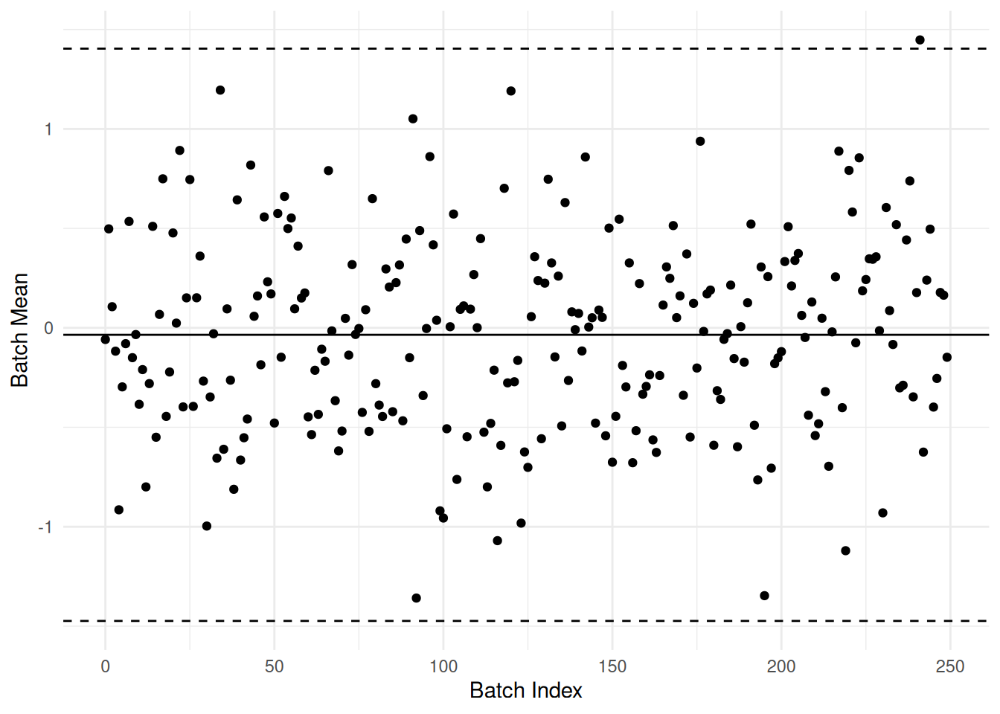
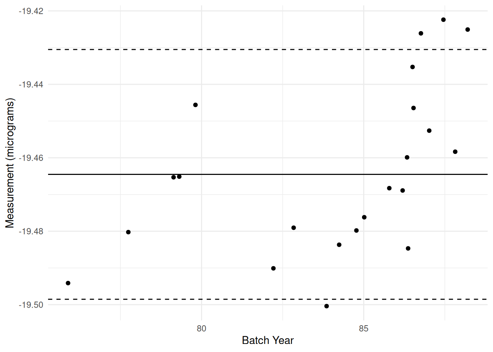

# Vis: Control Charts

*Purpose*: Remember in c02-michelson (q4) when you studied a *control chart*? Now that we've learned about confidence intervals, we can more formally study control charts. These are a key tool in [statistical process control](https://en.wikipedia.org/wiki/Statistical_process_control), which is how manufacturers rigorously track and control the quality of manufactured goods. Control charts help a process manager track when something has gone wrong in a manufacturing line, and are used to determine when a process is running smoothly.

*Reading*: [Example use](https://www.itl.nist.gov/div898/handbook/mpc/section3/mpc3521.htm) of a control chart, based on NIST mass calibration data. (Optional)

*Prerequisites*: c02-michelson, e-stat06-clt


``` r
library(tidyverse)
```

```
## ── Attaching core tidyverse packages ──────────────────────── tidyverse 2.0.0 ──
## ✔ dplyr     1.1.4     ✔ readr     2.1.5
## ✔ forcats   1.0.0     ✔ stringr   1.5.1
## ✔ ggplot2   3.5.1     ✔ tibble    3.2.1
## ✔ lubridate 1.9.4     ✔ tidyr     1.3.1
## ✔ purrr     1.0.4     
## ── Conflicts ────────────────────────────────────────── tidyverse_conflicts() ──
## ✖ dplyr::filter() masks stats::filter()
## ✖ dplyr::lag()    masks stats::lag()
## ℹ Use the conflicted package (<http://conflicted.r-lib.org/>) to force all conflicts to become errors
```

## Control Chart: Example

Below is an example of a control chart: A control chart is used to help detect when something out-of-the-ordinary occurred. Essentially, it is a tool to help us determine when something non-random happened so we can plan a follow-up study and prevent that non-random event from happening in the future. To do that detection work, we look for patterns.

Note that two kinds of patterns have been highlighted below: an outlier that lies outside the *control limits*, and a "run" of batch means that all lie off-center (to one side of the "grand mean," the solid line).


## Control chart steps

To construct and use a control chart, follow these steps:

1. Group individual observations into consecutive batches, say 4 to 10 observations. If parts are manufactured in batches, then use those groups.
2. Take the mean of each batch, compute the "grand mean" based on all of the data, and establish "control limits" based on a confidence interval for the batch means (where $n$ is your batch size).
3. Plot each batch mean sequentially, and visually indicate the control limits and grand mean on your plot.
4. Compare each batch mean against the control limits and grand mean. Look for patterns to suggest batches where something out-of-the-ordinary happened. Some examples include:
- Batches that fall outside the control limits
- Consecutive batches that lie above or below the mean
- Persistent up-and-down patterns

If there are no coherent patterns and if only an expected number of batch means fall outside the control limits, then there is no evidence for non-random behavior. A process free of any obvious non-random behavior is said to be under *statistical control*, or to be a  [stable process](https://en.wikipedia.org/wiki/Statistical_process_control#Stable_process).

If you *do* detect something out-of-the-ordinary, use the batch index to go investigate those cases in greater detail. **A control chart helps you *detect* when something went wrong---it does *not* tell you what went wrong.**

Like any form of EDA, it is also a good idea to experiment with different batch sizes.

## Data Preparation

To illustrate the control chart concept, let's first generate some data that is completely random.


``` r
set.seed(101)
df_data <-
  tibble(X = rnorm(n = 1000))
```

Following Step 1, we need to assign batch identifiers to group the data.

### __q1__ Use integer division `%/%` and the `row_number()` helper to group consecutive observations into groups of `4` with a common identifier `id`.

*Hint*: Since `R` is a one-based index language, you will need to adjust the output of `row_number()` before performing the integer division `%/%`.


``` r
df_q1 <-
  df_data %>%
  mutate(id = (row_number() - 1) %/% 4)
df_q1
```

```
## # A tibble: 1,000 × 2
##         X    id
##     <dbl> <dbl>
##  1 -0.326     0
##  2  0.552     0
##  3 -0.675     0
##  4  0.214     0
##  5  0.311     1
##  6  1.17      1
##  7  0.619     1
##  8 -0.113     1
##  9  0.917     2
## 10 -0.223     2
## # ℹ 990 more rows
```

Use the following to check your work.


``` r
## NOTE: No need to change this
assertthat::assert_that(
df_q1 %>%
  filter(row_number() <= 4) %>%
  summarize(sd = sd(id)) %>%
  pull(sd) == 0
)
```

```
## [1] TRUE
```

``` r
assertthat::assert_that(
df_q1 %>%
  filter(row_number() >= 997) %>%
  summarize(sd = sd(id)) %>%
  pull(sd) == 0
)
```

```
## [1] TRUE
```

``` r
print("Nice!")
```

```
## [1] "Nice!"
```

## Generate Control Limits

Next, we'll use our knowledge about confidence intervals and the CLT to set the *control limits*, based on our batch size.

### __q2__ Use a central limit theorem (CLT) approximation to set 3 sigma confidence interval limits on the group mean you computed above.

*Note*: A 3 sigma bound corresponds to a coverage probability of `1 - pnorm(-3) * 2`; approximately $99.7%$.

*Hint*: Think carefully about how many samples will be in each *group*, not in your dataset in total.


``` r
X_grand <-
  df_data %>%
  summarize(X_mean = mean(X)) %>%
  pull(X_mean)
X_sd <-
  df_data %>%
  summarize(X_sd = sd(X)) %>%
  pull(X_sd)

X_g4_lo <- X_grand - 3 * X_sd / sqrt(4)
X_g4_up <- X_grand + 3 * X_sd / sqrt(4)
X_g4_lo
```

```
## [1] -1.473529
```

``` r
X_grand
```

```
## [1] -0.03486206
```

``` r
X_g4_up
```

```
## [1] 1.403805
```

Use the following to check your work.


``` r
## NOTE: No need to change this
assertthat::assert_that(abs(X_g4_lo + 3 / sqrt(4)) < 0.1)
```

```
## [1] TRUE
```

``` r
assertthat::assert_that(abs(X_grand) < 0.05)
```

```
## [1] TRUE
```

``` r
assertthat::assert_that(abs(X_g4_up - 3 / sqrt(4)) < 0.1)
```

```
## [1] TRUE
```

``` r
print("Excellent!")
```

```
## [1] "Excellent!"
```

## Visualize and Interpret

### __q3__ Inspect the following control chart, and answer the questions under *observe* below.


``` r
## NOTE: No need to edit; run and inspect
df_q1 %>%
  group_by(id) %>%
  summarize(X_batch = mean(X)) %>%

  ggplot(aes(id, X_batch)) +
  geom_hline(yintercept = X_g4_lo, linetype = "dashed") +
  geom_hline(yintercept = X_grand) +
  geom_hline(yintercept = X_g4_up, linetype = "dashed") +
  geom_point() +
  theme_minimal() +
  labs(
    x = "Batch Index",
    y = "Batch Mean"
  )
```



**Observations**:
- I would expect about `1 - qnorm(-3) * 2`---$99.7%$ of the points to lie inside the control bounds. Given that we have 250 points, I'd expect about one to lie outside.
- One point lies outside the control limits, as we would expect if the points were completely random.
- I don't see any coherent pattern in the points. This makes sense, as these points *are* random (by construction).

## Control Chart: Application

Next you will construct a control chart for a real dataset. The following code downloads and parses a dataset from the NIST website studying [proof masses](https://en.wikipedia.org/wiki/Proof_mass). These are comparative measurements between "exact" 1 kilogram masses, carried out by one of the world's most-rigorous measurement societies.


``` r
## NO NEED TO EDIT; the following will download and read the data
url <- "https://www.itl.nist.gov/div898/handbook/datasets/MASS.DAT"
filename <- "./data/nist-mass.dat"
download.file(url, filename)
df_mass <-
  read_table(
    filename,
    skip = 25,
    col_names = c(
      "date",
      "standard_id",
      "Y",
      "balance_id",
      "residual_sd",
      "design_id"
    )
  )
```

```
## 
## ── Column specification ────────────────────────────────────────────────────────
## cols(
##   date = col_double(),
##   standard_id = col_double(),
##   Y = col_double(),
##   balance_id = col_double(),
##   residual_sd = col_double(),
##   design_id = col_double()
## )
```

``` r
df_mass
```

```
## # A tibble: 217 × 6
##     date standard_id     Y balance_id residual_sd design_id
##    <dbl>       <dbl> <dbl>      <dbl>       <dbl>     <dbl>
##  1  75.9          41 -19.5         12      0.0217        41
##  2  75.9          41 -19.5         12      0.0118        41
##  3  76.0          41 -19.5         12      0.0232        41
##  4  76.1          41 -19.5         12      0.021         41
##  5  76.6          41 -19.5         12      0.0265        41
##  6  76.7          41 -19.5         12      0.0317        41
##  7  77.2          41 -19.5         12      0.0194        41
##  8  77.3          41 -19.5         12      0.0316        41
##  9  77.6          41 -19.5         12      0.0274        41
## 10  77.7          41 -19.5         12      0.0361        41
## # ℹ 207 more rows
```

Note that `Y` denotes a kind of comparison between multiple "exact" 1 kilogram masses (with `Y` measured in micrograms), while `date` denotes the (fractional) years since 1900.

First, try plotting and interpreting the data without a control chart.

### __q4__ Plot the measured values `Y` against their date of measurement `date`. Answer the questions under *Observations* below.


``` r
## TASK: Plot Y vs date
```

**Observations**:
- There is considerable variation! Measurements of *any* kind are *not* exactly repeatable; variability is unavoidable.
- There seem to be two "upward" trends; one in the late 1970's, and another from the mid 80's onward.
- The "density" of measurements is not consistent; it seems that many measurements are taken around the same time, with much more "sparse" measurements in between.
- Something odd seems to have happened after 1985; the measurements seem to shift upward.

Next, prepare the data for a control chart of the NIST data.

### __q5__ Generate control chart data for a batch size of `10`.


``` r
n_group <- 10
df_q4 <-
  df_mass %>%
  mutate(group_id = (row_number() - 1) %/% n_group) %>%
  group_by(group_id) %>%
  summarize(
    Y_mean = mean(Y),
    date = min(date)
  )

Y_mean <-
  df_mass %>%
  summarize(Y_mean = mean(Y)) %>%
  pull(Y_mean)
Y_sd <-
  df_mass %>%
  summarize(Y_sd = sd(Y)) %>%
  pull(Y_sd)

Y_g_lo <- Y_mean - 3 * Y_sd / sqrt(n_group)
Y_g_up <- Y_mean + 3 * Y_sd / sqrt(n_group)
Y_g_lo
```

```
## [1] -19.49853
```

``` r
Y_mean
```

```
## [1] -19.46452
```

``` r
Y_g_up
```

```
## [1] -19.43051
```

Use the following to check your work.


``` r
## NOTE: No need to change this
assertthat::assert_that(abs(Y_g_lo + 19.49853) < 1e-4)
```

```
## [1] TRUE
```

``` r
assertthat::assert_that(abs(Y_mean + 19.46452) < 1e-4)
```

```
## [1] TRUE
```

``` r
assertthat::assert_that(abs(Y_g_up + 19.43051) < 1e-4)
```

```
## [1] TRUE
```

``` r
print("Excellent!")
```

```
## [1] "Excellent!"
```

Next, plot the control chart data and inspect.

### __q6__ Run the following chunk and answer the questions under *Observations* below.


``` r
## NOTE: No need to edit; run and inspect
df_q4 %>%
  ggplot(aes(date, Y_mean)) +
  geom_hline(yintercept = Y_g_lo, linetype = "dashed") +
  geom_hline(yintercept = Y_mean) +
  geom_hline(yintercept = Y_g_up, linetype = "dashed") +
  geom_point() +
  theme_minimal() +
  labs(
    x = "Batch Year",
    y = "Measurement (micrograms)"
  )
```



**Observations**:
- There is considerable variation! Measurements of *any* kind are *not* exactly repeatable; variability is unavoidable.
  - Still the case in this control chart!
- There seem to be two "upward" trends; one in the late 1970's, and another from the mid 80's onward.
  - This is much more prominent in the control chart
- The "density" of measurements is not consistent; it seems that many measurements are taken around the same time, with much more "sparse" measurements in between.
  - This is a bit harder to see in the control chart; we have to keep in mind that each batch represents multiple measurements.
- Something odd seems to have happened after 1985; the measurements seem to shift upward.
  - More visually obvious in the control chart.

- We can also make quantitative statements with the control chart: There are three points violating the control limits in the late 80's. There is also one batch violating the control limit before 1985.
- From 1980 to 1985, many of the batches lay below the grand mean; something seems off here.

Remember that a control chart is only a *detection* tool; to say more, you would need to go investigate the data collection process.

<!-- include-exit-ticket -->
