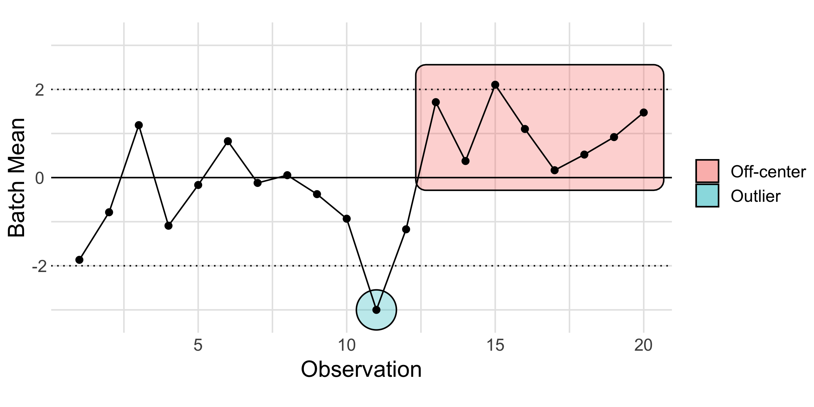

*Purpose*: 

```{r setup, include=FALSE}
# knitr options
knitr::opts_chunk$set(echo = TRUE)
```

```{r library}
## Note: No need to edit this chunk!
library(tidyverse)
```

# Variability

## The Cause-Source Quadrants

The *cause-source quadrants* organize variability into four distinct categories. Last time, we learned about the *source* axis. Today, we're going to focus on the *cause* axis.


## Chance vs Assignable Cause

# Hunting Assignable Causes

## Control Charts - Observing a process



## Comparing Groups - A planned experiment

# Treating Assignable Causes


If we decide there are no remaining assignable causes, we should then treat the remaining chance causes appropriately. Remember that we discussed how to do this in `e-model06-source`.

<!-- include-exit-ticket -->

# References

If you'd like to read more about the cause-source quadrants, see [this two-page description](https://www.zdelrosario.com/media/zdr-cause-source-2.pdf)
