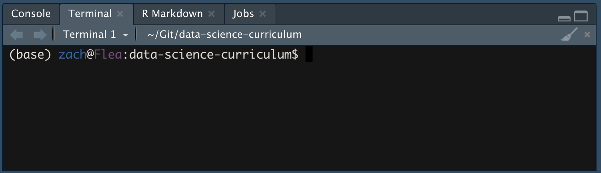
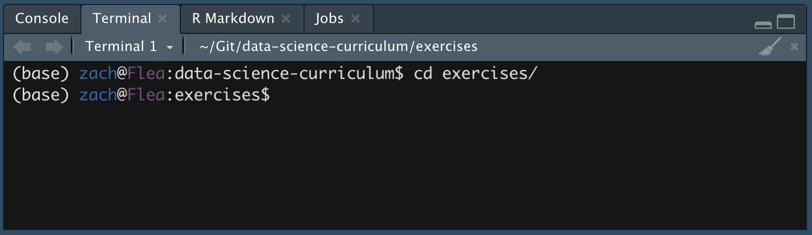
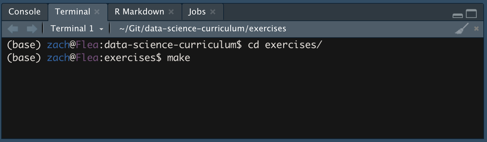

*Purpose*: Git is a powerful tool to manage our work, but it can be confusing at first. Here we will read some introductory materials about Git, and use the software to download and set up the exercises for the course.

*Reading*: [Automated Version Control](https://swcarpentry.github.io/git-novice/01-basics/index.html), complete the steps in [Setting Up Git](https://swcarpentry.github.io/git-novice/02-setup/index.html)

*Note*: For the steps in the reading, I recommend using the Terminal in RStudio. This should help ensure you have access to Git.

*Topics*: version control, git setup, working with our exercises, ssh keys

# Set Up SSH Key
<!-- -------------------------------------------------- -->

Before you can "clone" (download) the repository of exercises, you'll need to set up `ssh` with GitHub. Follow these instructions to [add an SSH key](https://help.github.com/en/github/authenticating-to-github/adding-a-new-ssh-key-to-your-github-account) to your account. This will allow you to work with GitHub without typing in your password.

*Note*: This can be a bit confusing if you've never worked with SSH before; *please do ask questions* if you are stuck!

# Downloading Our Exercises
<!-- -------------------------------------------------- -->

Using RStudio, we will download a local copy of the [data-science-curriculum](https://github.com/zdelrosario/data-science-curriculum). Follow these instructions:

- Open [data-science-curriculum](https://github.com/zdelrosario/data-science-curriculum) in your browser, and click the "Clone" button. Make sure you have "SSH" selected, and click the "clipboard" button to copy the `git@github:...` url.

- Open the `Terminal` tab

- Use the change directory (`cd`) command to change to where you want to copy `data-science-curriculum`, and use the `git clone` command to copy the repository.

- *Note*: I recommend creating a `Git` directory on your computer in an easy-to-find location (say Home or Documents), and that you put `data-science-curriculum` there.

- Change Directory to `exercises` with the command `cd exercises`

- Run the command `make` to create the `assignment` files

- Great job! Now you have all the assignment exercises for the course!

<!-- include-exit-ticket -->
