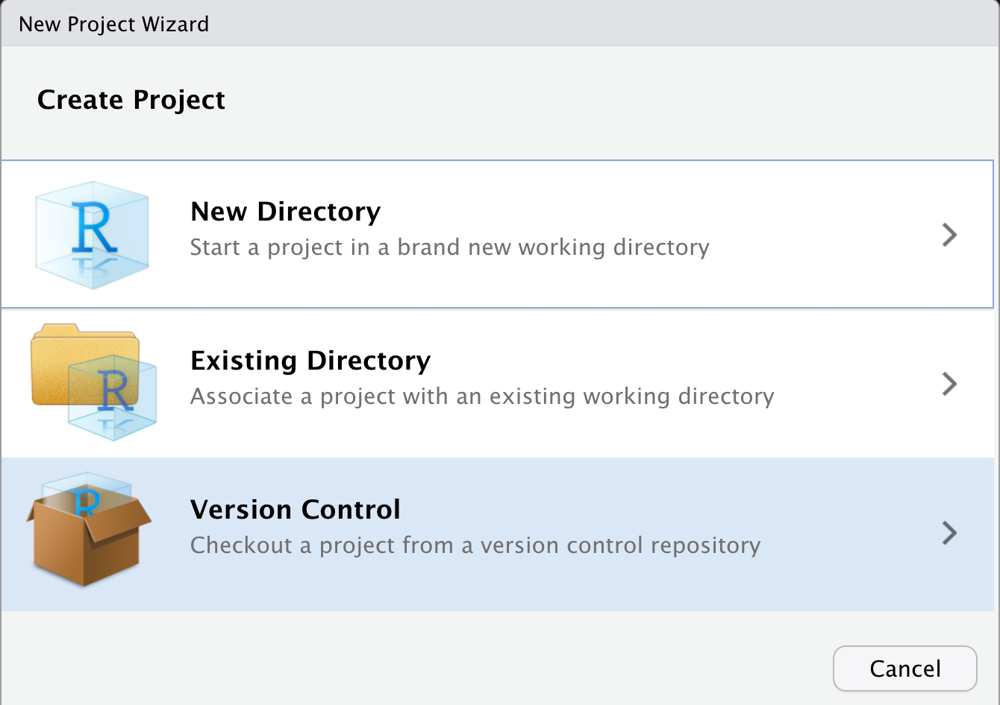
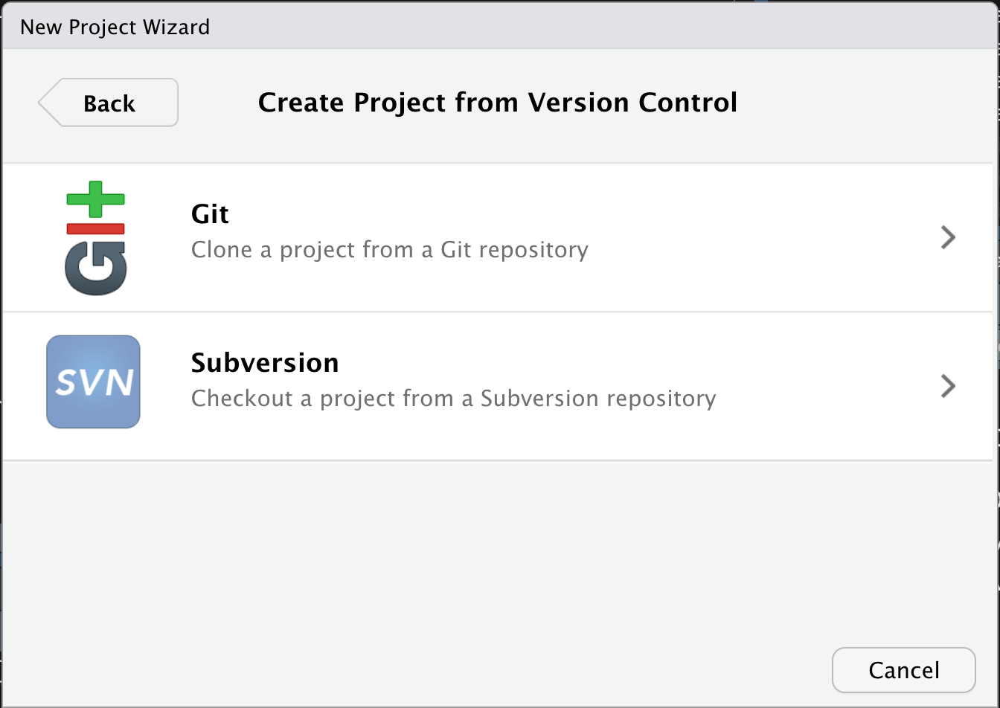

Reproducibility: Git and Our Curriculum
================
Zachary del Rosario
2020-06-24

*Purpose*: Git is a powerful tool to manage our work, but it can be
confusing at first. Here we will read some introductory materials about
Git, and use the software to download and set up the exercises for the
course.

*Reading*: [Automated Version
Control](https://swcarpentry.github.io/git-novice/01-basics/index.html),
complete the steps in [Setting Up
Git](https://swcarpentry.github.io/git-novice/02-setup/index.html)

*Topics*: version control, git setup, working with our exercises

# Downloading Our Exercises

<!-- -------------------------------------------------- -->

Using RStudio, we will download a local copy of the
[data-science-curriculum](https://github.com/zdelrosario/data-science-curriculum).
Follow these instructions:

  - Navigate to `File > New Project...`

  - Select the `Version Control` option

  - Select `Git`

  - Input the relevant information; you will need to provide
    <https://github.com/zdelrosario/data-science-curriculum> as the
    `Repository URL` (this will auto-populate the `Project Directory
    Name`), and select a directory on your computer.
  - *Note*: I recommend creating a `Git` directory on your computer in
    an easy-to-find location (say Home or Documents), and that you put
    `data-science-repository` there.

  - Once you have successfully cloned `data-science-curriculum`, open
    the `Terminal` tab

  - Change Directory to `exercises` by typing `$ cd exercises`

  - Run the command `$ make` to create the `assignment` files

  - Great job\! Now you have all the assignment exercises for the
    course\!
