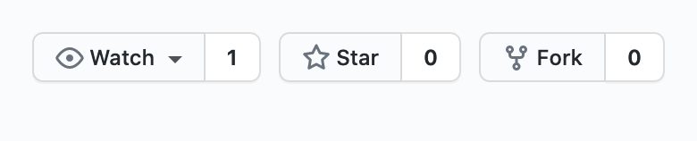
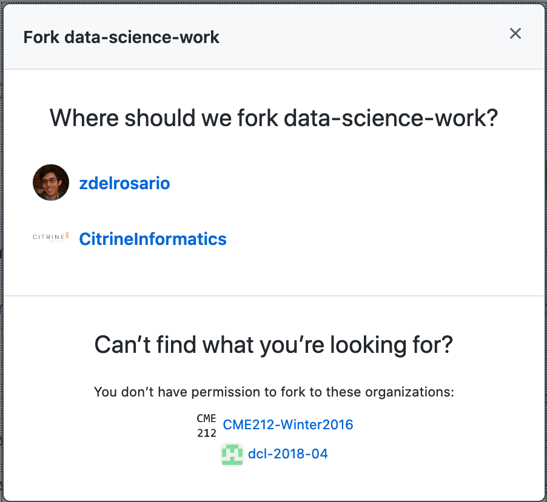

*Purpose*: (Learn how to fork and PR)

*Reading*: [GitHub Forking](https://gist.github.com/Chaser324/ce0505fbed06b947d962) (Optional / Reference)

# Overview

At a *high level*, what you and your partner are going to do is create a copy of each others' public repos, make a change, and request that your partner *merge* those changes into their own repo. Using this workflow, you and your partner will be able to collaborate asynchronously on the same documents, all while maintaining safe version control of your work.

In this case you'll make *trivial edits* to the **TODO** items below, but in practice you can use an identical process to edit things like software and reports.

## Partner Team

(You and your partner will edit the *TODO* items *separately* and *combine*, through the magic of *git*!)

| Title | Person |
|---|---|
| *Forking* Partner | **TODO** |
| *Merging* Partner | **TODO** |

*Note*: All instructions below are coded for either the *Forking* partner, the *Merging* partner, or *Both*. Note that you will both do all of these steps, but you will take turns being *Forking* and *Merging*. Pay attention to when these flags change---that indicates where you and your partner need to take different actions.

__q1__ (*Both*) Pick a partner in the class, preferably from your learning team. You must mutually agree to complete this exercise together, which will involve *forking* your partner's public repo and making a *pull request*.

__q2__ (*Forking*) Navigate to your partner's GitHub repo page, and click the *Fork* button on the top-right of the page.



Depending on how much you've used GitHub already, you may get an additional menu once you click *Fork*. For instance, I'm part of some other organizations, and have the option to fork under those other accounts. *Make sure to fork under your own account*.



Wait for the forking process to finish....


What you've just done is create a *copy* of your partner's repository; you can now edit this copy as your own. This is called a *fork* of a repository. *Clone* your forked repository to your machine to create a local version that you can edit. Remember that you click the "copy to clipboard" button under *Code*:


Then use the command below to clone your fork:

```{bash}
# You should be able to paste the git@github.com part you copied above
$ git clone git@github.com:YOUR-USERNAME/YOUR-FORKED-REPO
$ cd YOUR-FORKED-REPO
```

__q3__ (*Forking*) Add your partner's repository as a *remote*. The reading described how to do this from the command line; use the command *within your forked repository*

```{bash}
$ git remote add upstream https://github.com/UPSTREAM-USER/ORIGINAL-PROJECT.git
```

where you should replace `UPSTREAM-USER` with your partner's GitHub username, and `ORIGINAL-PROJECT` with the name of your partner's GitHub public repo (the one you forked). What this does is allow you to pull any changes your partner makes in their own repo using the command `git fetch upstream`. We won't use that command in this exercise, but it's good to be aware of.

__q4__ (*Forking*) Create a branch for making your edits. 

```{bash}
# Use master as the starting point for your branch
git checkout master

# Create a new branch named dev_addname
git branch dev_addname

# Switch to your new branch
git checkout dev_addname
```

__q5__ (*Forking*) Inspect your partner's repository; if they don't have an `exercises` directory, create a new one. Within that `exercise` directory either open their existing `e-rep-05-collab-assignment.Rmd`, or copy this file into the `exercises` directory. Edit the **TODO** above under *Forking Partner* to be your own name.

__q6__ (*Forking*) Commit

__q7__ (*Forking*) Open a pull request

__q8__ (*Merging*) Open your public repo GitHub page; you should see that your partner has an open pull request.

__qX__ (*Forking*) Once you're done working on a branch, you can switch back to master with:

```{bash}
$ git checkout master
```

<!-- include-exit-ticket -->
