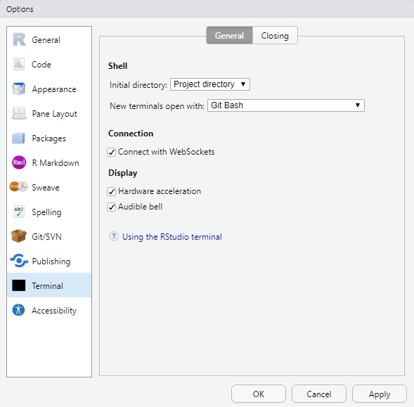
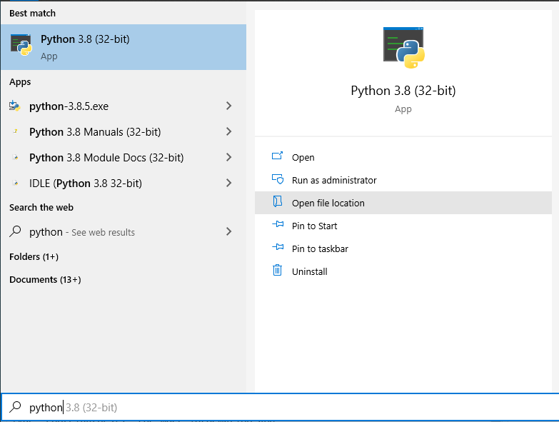
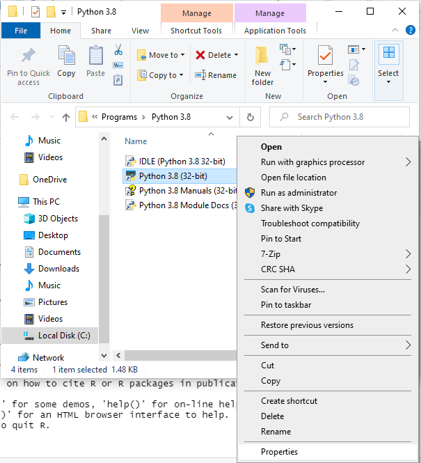
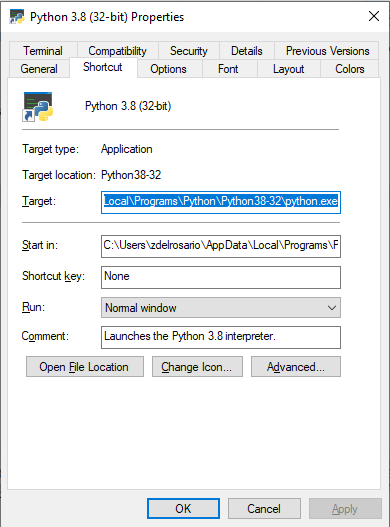

# Using Git on Windows with Git Bash

Git Bash is a helpful utility for working with Git on Windows. It gives us a linux-like interface that we can use within RStudio as well!

## Ensure you have Git Bash
<!-- ------------------------- -->

Press the Windows key and type "Git Bash". You may already have it installed! If not, go to the [Git website](https://git-scm.com/downloads) and click the Windows download and install.

## Use Git Bash in RStudio
<!-- ------------------------- -->

Let's make sure you can use Git Bash in RStudio. Open RStudio and click the following buttons:

`Tools > Global Options > Terminal`

And select `Git Bash` as your Terminal.

This will allow you to use the `Terminal` in RStudio for the tasks mentioned in the other exercises.

<!-- ## Add `make` to Git Bash -->
<!-- <\!-- ------------------------- -\-> -->

<!-- Follow [these instructions](https://gist.github.com/evanwill/0207876c3243bbb6863e65ec5dc3f058); **only the `make`** section. You will download a `zip` file, extract, and copy those files to `C:\Program Files\Git\mingw64\` *without* overwriting any files. -->

<!-- This will allow you to run `> make` from Git Bash within the `data-science-curriculum`, which will process the exercises. However, the final step of `make` will fail unless you also install Python. -->

<!-- ## Install Python (Highly recommended) -->
<!-- <\!-- ------------------------- -\-> -->

<!-- Installing Python is optional but *highly recommended*; this will create a set of exercises in `exercises_sequenced` that have a prefix `dXY-` for the *day* associated with that exercise (e.g. `d03-` means day 3 of the class). -->

<!-- - Download and install [Python](https://www.python.org/downloads/windows/) for Windows. Make sure to download a 64 bit version (you should see `x86-64` in the link). -->
<!-- - Once installed, determine the `path` of your Python executable. -->

<!-- 1. Press the Windows key, type `python`, and click the "open file location" button. -->

<!--  -->

<!-- 2. It's likely that this is *not actually Python*! Instead, it's a shortcut. Click on *Properties* so we can see where this shortcut points. -->

<!--  -->

<!-- 3. This will bring up a menu with a `Target` field that ends with `python.exe`. Everything that comes before `python.exe` is the **path** of that file. Copy that text, and be ready to paste it into another file. -->

<!--  -->

<!-- - [Download](https://github.com/zdelrosario/data-science-curriculum/blob/master/exercises/.bashrc) the example `.bashrc` file, and save it to your *home directory*. This is usually `C:\Users\username`; for example, my home directory is `C:\Users\zdelrosario`. -->

<!-- - Copy the **path** for Python into that example `.bashrc` file (you can use notepad to edit it), following the instructions to edit the `export PATH="$PATH:/stuff"` line. -->

<!-- - In Git Bash, change directories to the `data-science-curriculum` and try to run `make`. If Python is installed correctly, then you should see a bunch of stuff fly by in Git Bash, and the folder `exercises_sequenced` should fill with exercises. -->

<!-- If you have **any** issues with these steps, please reach out to one of the teaching staff! -->
