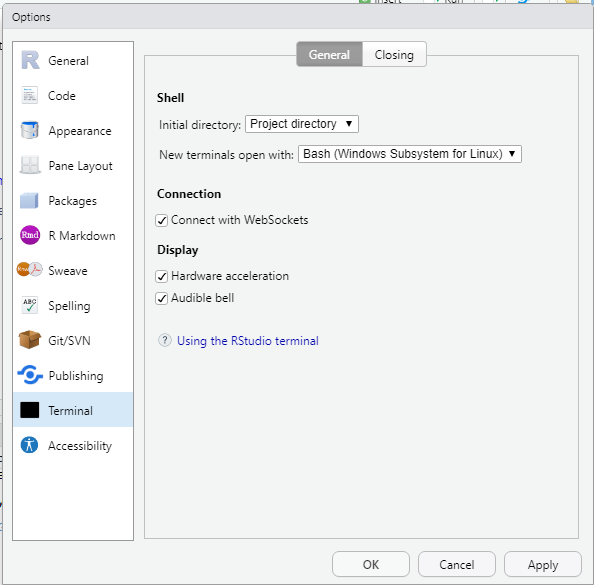

# Windows Subsystem for Linux (WSL)
<!-- -------------------------------------------------- -->

## Enable WSL
<!-- ------------------------- -->

These steps will allow you to *install* WSL.

1. Open PowerShell, with Admin privileges

You can do this by pressing the Windows key, typing `PowerShell`, and clicking "run as administrator".

2. Enable WSL

Run the following command in PowerShell

`dism.exe /online /enable-feature /featurename:Microsoft-Windows-Subsystem-Linux /all /norestart`

3. Enable VM

Run the following command in PowerShell

`dism.exe /online /enable-feature /featurename:VirtualMachinePlatform /all /norestart`

4. Restart your computer

5. Open PowerShell with admin privileges

## Linux distribution setup
<!-- ------------------------- -->

Now that you've enabled WSL, you need to populate WSL with a specific Linux distribution. The following link will install Ubuntu (a particular flavor of Linux) in your WSL.

- [Download Ubuntu 20.04](https://aka.ms/wslubuntu2004)

Note that you will have to provide a user name and password for your Ubuntu installation---it's running its own operating system! Remember this password as you will need it to run commands within the WSL.

## Use WSL in RStudio
<!-- ------------------------- -->

You just did all this hard work setting up WSL; now let's make sure to use those efforts in RStudio! Open RStudio and click the following buttons:

`Tools > Global Options > Terminal`

And select `Bash (Windows Subsystem for Linux)` as your Terminal.

This will allow you to use the `Terminal` in RStudio for the tasks mentioned in the other exercises.

## Installing missing packages in terminal
<!-- ------------------------- -->

You will need to install some missing packages in order to fully use the `data-science-curriculum` repository. For instance, you will need the `make` command to build; this is how you install it from WSL:

`$ sudo apt install make --fix-missing`

*Note*: This is a place where you will have to use your WSL password; if you made this different from your computer's password, make sure to give it the right password!

# Small Tricks
<!-- -------------------------------------------------- -->

## Copying from clipboard
<!-- ------------------------- -->

In WSL, rather than the copy instructions given by GitHub, you will need to use the following spell to copy your publickey.

`$ cat ~/.ssh/id_rsa.pub | clip.exe`

## Copy-paste to RStudio's terminal
<!-- ------------------------- -->

In order to paste in RStudio's terminal, you have to use `CTRL + SHIFT + P`, rather than the usual `CTRL + P`.

