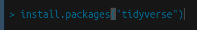

Setup
================
2020-05-02

*Purpose*: We’re going to make extensive use of the [R programming
language](https://www.r-project.org/about.html); in particular, the
[Tidyverse](https://www.tidyverse.org/) packages. This first exercise
will guide you through setting up the necessary software.

**q1** Install Rstudio

Download [RStudio
Desktop](https://rstudio.com/products/rstudio/download/) and install the
[R programming language](https://cran.rstudio.com/). Both are free\!

Once installed, you can open this `.Rmd` file in RStudio. This is an `R
Markdown` file, which is a combination of human-readable text and
machine-readable code. Think of it as a modern take on a lab notebook.

**q2** Install packages

Next, run RStudio. When the program opens, you should see a console tab,
as in the image below.

Note that RStudio has multiple tabs, including the `Console`,
`Terminal`, `Jobs`, and any files you may have opened. Make sure you are
in the `Console` tab.

Type the line `install.packages("tidyverse")` in your `Console` and
press Enter. This will start the installation of the `tidyverse`
package, which we will use extensively in this class.

**q3** Test your install

Once your installation has finished, return to your console and use the
command `library(tidyverse)`. If your installation is complete, this
command should return a list of packages and version numbers, similar to
the image below.

If you have any issues with installation, **please** let me know\!
