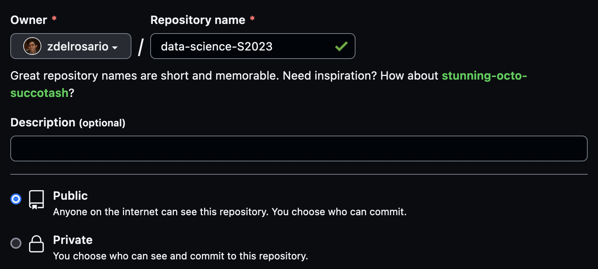
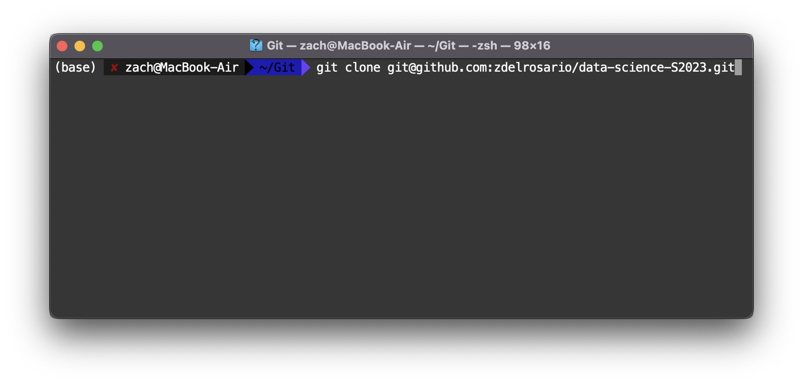

# Reproducibility: Git and Our Curriculum

*Purpose*: Git is a powerful tool to manage our work, but it can be confusing at first. Here we will read some introductory materials about Git, and use the software to download and set up the exercises for the course.

*Reading*: [Automated Version Control](https://swcarpentry.github.io/git-novice/01-basics/index.html), complete the steps in [Setting Up Git](https://swcarpentry.github.io/git-novice/02-setup/index.html)

*Note*: For the steps in the reading, I recommend using the Terminal in RStudio. This should help ensure you have access to Git.

*Topics*: version control, git setup, working with our exercises, ssh keys

*Note*: If you're reading this file in RStudio, you can Shift + Click (CMD + Click) to follow a link.

## Windows-specific Instructions
<!-- -------------------------------------------------- -->

If you are on a Windows computer, you will need to complete some additional steps. Please follow [these instructions](https://github.com/zdelrosario/data-science-curriculum/blob/master/exercises/e-windows-gitbash.md) before continuing.

## Set Up SSH Key
<!-- -------------------------------------------------- -->

Before you can "clone" (download) the repository of exercises, you'll need to set up `ssh` with GitHub. Follow these instructions to [add an SSH key](https://help.github.com/en/github/authenticating-to-github/adding-a-new-ssh-key-to-your-github-account) to your account. This will allow you to work with GitHub without typing in your password.

*Note*: This can be a bit confusing if you've never worked with SSH before; *please do ask questions* if you are stuck!

## Downloading Our Exercises
<!-- -------------------------------------------------- -->

Open your browser and log into GitHub. Click the `New` button to create a new repository.

Give this a sensible name, like `data-science-S2023`. **Ensure your repository is public,** or you will not be able to submit your homework!

Once you've selected the correct settings, click `Create Repository`. This creates a repository on GitHub's servers, but you still need to download it locally. After creating your repository, you'll see the following link in your browser. Copy the SSH link (note, **not** the HTTPS link) and open a Terminal. 

Navigate in your terminal to the location where you'd like to store your work for this class. Type the command `git clone` and paste the link you copied above. Hit Return to "clone" a local copy of your repository. Git will likely tell you that you cloned an empty repository. That's OK! We're going to add the course materials next.

*Note*: If you haven't used a Terminal before, just open RStudio and find the Terminal tab (towards the bottom).

Download the curriculum as a zip file from [this link](https://github.com/zdelrosario/data-science-curriculum/archive/refs/heads/build.zip). Unzip this in your blank repository. Unzip the materials and copy them to your (empty) repository. Once you've done this, your repository folder should look like this:

Once you've copied over the materials, run the three following commands from your Terminal while inside your repository:

`git add *`

`git commit -m "initial commit"`

`git push`

If you do this successfully, you can refresh the repository page in your browser and see the following:

Once you've gotten to this point, take a moment to look around the repository. The `exercises_sequenced` folder contains all of the Exercises for the course, while the `challenges` folder contains all of the challenges you will complete as your homework. You will commit your work to this repository then submit links on Canvas.

*Aside*: Note that *Git* and *GitHub* are two different things! *Git* is a
version control tool, while *GitHub* is a service that uses Git where you can host repositories. For instance, [GitLab](https://about.gitlab.com/) is another service where you can host Git repositories.

<!-- include-exit-ticket -->
# Exit Ticket
<!-- -------------------------------------------------- -->

Once you have completed this exercise, make sure to fill out the **exit ticket survey**, [linked here](https://docs.google.com/forms/d/e/1FAIpQLSeuq2LFIwWcm05e8-JU84A3irdEL7JkXhMq5Xtoalib36LFHw/viewform?usp=pp_url&entry.693978880=e-rep01-intro-git-assignment.Rmd).
