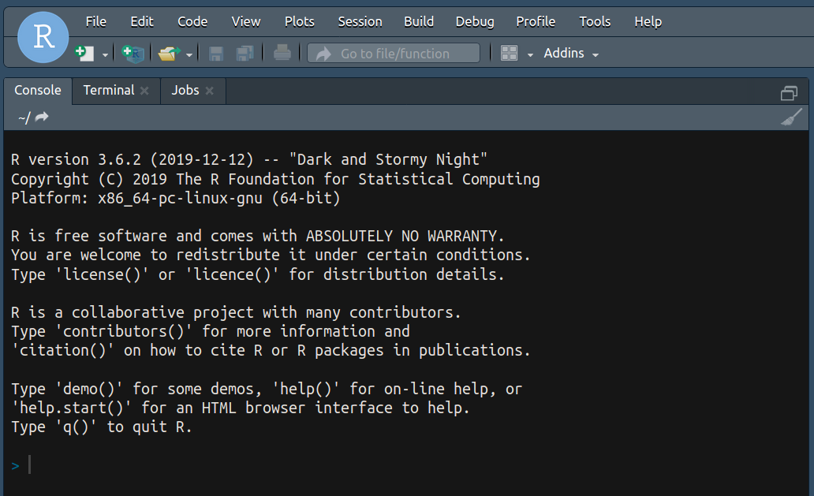

# Setup: RStudio

*Purpose*: We're going to make extensive use of the [R programming language](https://www.r-project.org/about.html); in particular, the [Tidyverse](https://www.tidyverse.org/) packages. This first exercise will guide you through setting up the necessary software.

*Reading*: (None)

*Note*: If you're reading this file in RStudio, you can Shift + Click (CMD + Click) to follow a link.

```{r setup, include=FALSE}
# knitr options
knitr::opts_chunk$set(echo = TRUE)
```

### __q1__ Install Rstudio

Download [RStudio Desktop](https://rstudio.com/products/rstudio/download/) and install the [R programming language](https://cran.rstudio.com/). Both are free!

Once installed, you can [download the source](https://github.com/zdelrosario/data-science-curriculum/blob/master/exercises/e-setup00-install-master.Rmd) for this exercise and open open it in RStudio (or you can follow `e-rep01-intro-git` and *clone* the repository). This is an `R Markdown` file, which is a combination of human-readable text and machine-readable code. Think of it as a modern take on a lab notebook.

### __q2__ Install packages

Next, run RStudio. When the program opens, you should see a console tab, as in
the image below.



Note that RStudio has multiple tabs, including the `Console`, `Terminal`,
`Jobs`, and any files you may have opened. Make sure you are in the `Console`
tab.

Type the line `install.packages("tidyverse")` in your `Console` and press Enter.
This will start the installation of the `tidyverse` package, which we will use
extensively in this class.


### __q3__ Test your install

Once your installation has finished, return to your console and use the command
`library(tidyverse)`. If your installation is complete, this command should
return a list of packages and version numbers, similar to the image below.


If you have any issues with installation, __please__ let me know!

### __q4__ Download extras

We'll use a number of extras for this class. To that end, please install the following packages. Note that you can install multiple packages with the syntax `install.packages(c("curl", "mvtnorm"))`, extending the arguments inside `c()` as desired.

- `broom`
- `curl`
- `fitdistrplus`
- `gapminder`
- `ggrepel`
- `googlesheets4`
- `nycflights13`
- `modelr`
- `mvtnorm`
- `rsample`
- `Rtsne`
- `viridis`

### __q5__ Download cheatsheets

The `tidyverse` is essentially a language built on top of R. As such, there are
a lot of functions to remember. To that end, RStudio has put together a number
of [cheatsheets](https://rstudio.com/resources/cheatsheets/) to reference when
doing data science. Some of the most important ones are:

- [Data visualization](https://github.com/rstudio/cheatsheets/raw/master/data-visualization-2.1.pdf)
- [Data transformation](https://github.com/rstudio/cheatsheets/raw/master/data-transformation.pdf)
- [Data importing](https://github.com/rstudio/cheatsheets/raw/master/data-import.pdf)

Later, we will learn special tools for handling other types of data. The following cheatsheets will be useful for those:

- [String data](https://github.com/rstudio/cheatsheets/raw/master/strings.pdf)
- [Dates and times](https://github.com/rstudio/cheatsheets/raw/master/lubridate.pdf)
- [Factors](https://github.com/rstudio/cheatsheets/raw/master/factors.pdf)
- [R Markdown](https://github.com/rstudio/cheatsheets/raw/master/rmarkdown-2.0.pdf)

<!-- include-exit-ticket -->
# Exit Ticket
<!-- -------------------------------------------------- -->

Once you have completed this exercise, make sure to fill out the **exit ticket survey**, [linked here](https://docs.google.com/forms/d/e/1FAIpQLSeuq2LFIwWcm05e8-JU84A3irdEL7JkXhMq5Xtoalib36LFHw/viewform?usp=pp_url&entry.693978880=e-setup00-install-assignment.Rmd).
