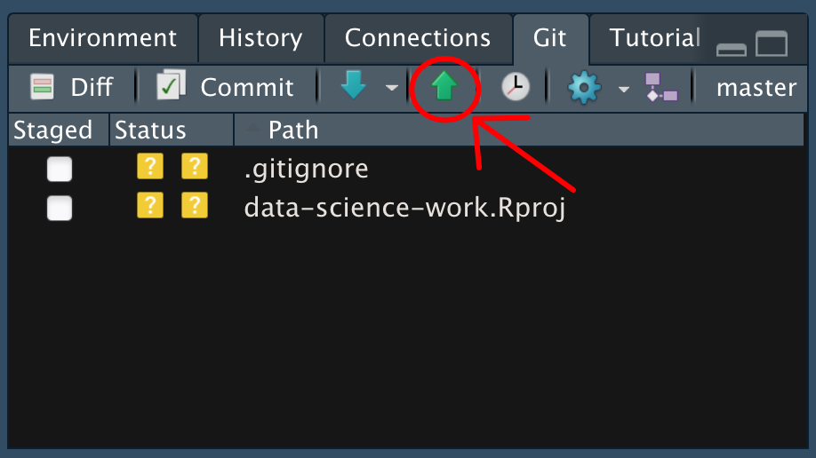

# Reproducibility: Tracking Changes with Git

*Purpose*: In this class you'll turn in all your work using GitHub. To do this, you'll need to be able to track and push changes in your repository.

*Reading*: Follow all the steps in [Tracking Changes](https://swcarpentry.github.io/git-novice/04-changes/index.html)

*Topics*: Staging, committing, pushing

## Configure RStudio to use git
<!-- -------------------------------------------------- -->

This exercise introduces the *graphical* interface for git through RStudio. To
use this interface, you'll need to click `Tools -> Global Options -> Git/SVN`.
If *Git executable* shows (none), click *Browse* and selec tthe git executable
installed on your system.

- On Mac / Linux you can use `which git` from your command line
- On Windows `git.exe` is probably somewhere in `Program Files`

See [these
notes](https://jennybc.github.io/2014-05-12-ubc/ubc-r/session03_git.html) for
more info.

## Set Up Your Repository
<!-- -------------------------------------------------- -->

## Add a readme
<!-- ------------------------- -->

Navigate to your repository (the one you made in `e-rep02-create`). If you don't yet have a file called `README.md`, create it. You can do this through RStudio with `File > New File > Markdown File`.

### __q1__ Edit your `README.md` with information about your repository. For instance, you could add your name and a short description.

## Commit changes
<!-- ------------------------- -->

Once you've updated your readme, you can click on the `Git` tab in RStudio to check changes in your repository.

*Note*: The `Git` tab will only appear if you've opened a *project* in RStudio. You can do this by clicking the `Project` button in the top-right of RStudio and opening the `data-science-curriculum.Rproj` file in your repository. OR you can just use git through whatever interface you like best!

This is an alternative to using Git with the terminal. We'll work through an entire workflow of *commiting* and *pushing* our work to your GitHub repository.

### __q2__ From RStudio, click the `Staged` button for `README.md`. Then click `Commit` to open the commit dialogue; add a commit message then click `Commit` to finish.

This will open a window confirming your commit; you can safely close this.

Once you've finished this, you've successfully tracked your changes *locally*. However, since your repository is linked to GitHub, you can also save your changes by *pushing* them to the remote server.

### __q3__ Click the `push` button (green upward arrow, highlighted below) to push your changes to GitHub. Check your repository in GitHub (on the internet); you should be able to see your changes to the readme text.

Now you have a backup copy of your work in GitHub, and you can easily share your work by sharing a link to your repository! This is how you will submit Challenges to Canvas: by sharing a link to your work.

<!-- include-exit-ticket -->
# Exit Ticket
<!-- -------------------------------------------------- -->

Once you have completed this exercise, make sure to fill out the **exit ticket survey**, [linked here](https://docs.google.com/forms/d/e/1FAIpQLSeuq2LFIwWcm05e8-JU84A3irdEL7JkXhMq5Xtoalib36LFHw/viewform?usp=pp_url&entry.693978880=e-rep03-track-assignment.Rmd).
