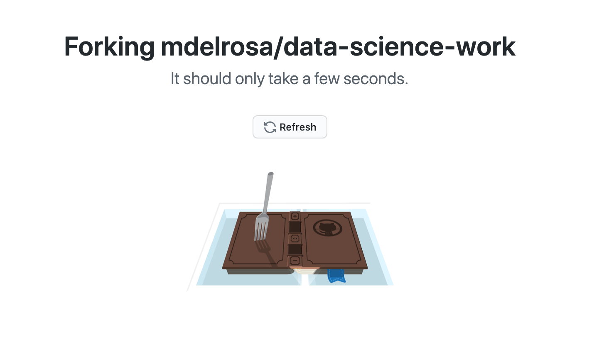
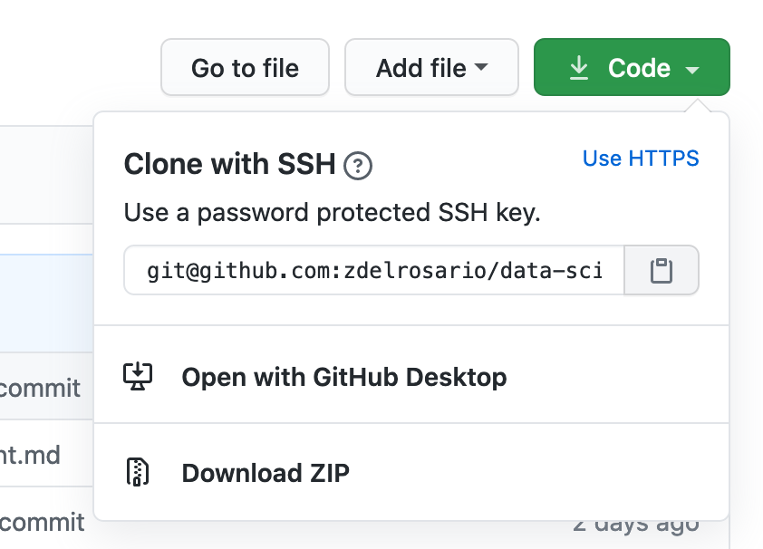

# Reproducibility: Collaborating with GitHub

*Purpose*: Git and GitHub are extremely useful for collaboration, but they take
some getting used to. In this *partner exercise*, you will learn how to
contribute to a partner's work, and how to merge contributions to your own work.
This will be your first taste of using Git not just as a way to track changes,
but also as a powerful collaboration tool.

*Reading*: [GitHub Forking](https://gist.github.com/Chaser324/ce0505fbed06b947d962) (Optional / Reference)

## Overview

At a *high level*, what you and your partner are going to do is create a copy of each others' public repos, make a change, and request that your partner *merge* those changes into their own repo. Using this workflow, you and your partner will be able to collaborate asynchronously on the same documents, all while maintaining safe version control of your work.

In this case you'll make *trivial edits* to the **TODO** items below, but in practice you can use an identical process to edit things like software and reports.

## Partner Team

(You and your partner will edit the *TODO* items *separately* and *combine*, through the magic of *git*!)

| Title | Person |
|---|---|
| *Forking* Partner | **TODO** |
| *Merging* Partner | **TODO** |

*Note*: All instructions below are coded for either the *Forking* partner, the *Merging* partner, or *Both*. Note that you will both do all of these steps, but you will take turns being *Forking* and *Merging*. Pay attention to when these flags change---that indicates where you and your partner need to take different actions.

### __q1__ (*Both*) Pick a partner in the class, preferably from your learning team. You must mutually agree to complete this exercise together, which will involve *forking* your partner's public repo and making a *pull request*.

## Forking Partner

### __q2__ (*Forking*) Navigate to your partner's GitHub repo page, and click the *Fork* button on the top-right of the page.


Depending on how much you've used GitHub already, you may get an additional menu once you click *Fork*. For instance, I'm part of some other organizations, and have the option to fork under those other accounts. *Make sure to fork under your own account*.


Wait for the forking process to finish....



What you've just done is create a *copy* of your partner's repository; you can now edit this copy as your own. This is called a *fork* of a repository. *Clone* your forked repository to your machine to create a local version that you can edit. Remember that you click the "copy to clipboard" button under *Code*:



Then use the command below to clone your fork:

```{bash, eval=FALSE}
# You should be able to paste the git@github.com part you copied above
$ git clone git@github.com:YOUR-USERNAME/YOUR-FORKED-REPO
$ cd YOUR-FORKED-REPO
```

### __q3__ (*Forking*) Add your partner's repository as a *remote*. The reading described how to do this from the command line; use the command *within your forked repository*

```{bash, eval=FALSE}
$ git remote add upstream https://github.com/UPSTREAM-USER/ORIGINAL-PROJECT.git
```

where you should replace `UPSTREAM-USER` with your partner's GitHub username, and `ORIGINAL-PROJECT` with the name of your partner's GitHub public repo (the one you forked). What this does is allow you to pull any changes your partner makes in their own repo using the command `git fetch upstream`. We won't use that command in this exercise, but it's good to be aware of.

### __q5__ (*Forking*) Inspect your partner's repository (your forked-and-cloned version); if they don't have an `exercises` directory, create a new one. Within that `exercise` directory either open their existing `e-rep-05-collab-assignment.Rmd`, or copy this file into the `exercises` directory. Edit the **TODO** above under *Forking Partner* to be your own name.

### __q6__ (*Forking*) Commit your changes, and push them to your forked repository. If you do `$ git push`, you will probably see something like:

```{bash, eval=FALSE}
fatal: The current branch dev_addname has no upstream branch.
To push the current branch and set the remote as upstream, use

    git push --set-upstream origin master
```

If you see this, it's because Git is not willing to make assumptions about *where you want to push*. The `--set-upstream origin master` tells Git to push to `origin` (which should be set to your forked repository if you cloned it in q2 above), while `master` tells Git to push the changes to the `master` branch.

Follow the instructions by running

```{bash, eval=FALSE}
$ git push --set-upstream origin master
```

This will push your commit(s) to your forked repo. Now you have the changes in your *personal* copy of your partner's work. Our task is now to request that our partner incorporate these changes in their own repository.

### __q7__ (*Forking*) Navigate your browser to your forked repository on GitHub. You should see a banner like the following:


Click the **Pull request** to start the process of making a pull request (PR). Add a comment justifying the PR, and click **Create pull request**. Your partner will now be able to see your PR. Your *merging* partner will finish the rest of the exercise (though you should still complete the *merging* part on your own repo!).

## Merging Partner

__q8__ (*Merging*) Open your public repo GitHub page; you should see that your partner has an open pull request.You can see the list of pull requests by clicking on the `Pull requests` tab towards the top of your repo.


*Note*: You'll probably also get an automated email from GitHub once your partner opens a PR.

Your task is to *merge* their pull request. Click on the merge request your partner opened; for instance mine was described as `Adding exercises dir, rep05.Rmd` by `mdelrosa`.


Hopefully, you will see the message "This branch has no conflicts with the base
branch. Merging can be performed automatically." This means that the edits your
partner made don't conflict with any changes you made. Thus Git can
*automagically* combine all the edits. Click `Merge pull request` and `Confirm
merge` to proceed.

*Note*: If you don't see "Merging can be performed automatically," *please*
reach out to one of the teaching team. We'll gladly help you out!


Once done, the page should change to let you know that you completed the merge,
as shown below:


__q8__ (*Merging*) Now you will pull the most recent changes to your local copy
of your repo. before pulling. Navigate to the directory of your repo. Make sure
to commit any stray changes (e.g. in-progress exercises!). Then run `git pull`.

```{bash, eval=FALSE}
$ cd /path/to/your/repo
$ git pull
```

This will pull down the latest changes that your partner made.

### __q9__ (*Merging*) Replace **TODO** above under *Merging partner* to complete the exercise. Commit and push these changes to your repo.

## Forking Partner

### __q10__ (*Forking*) Now your partner has successfully merged your edits, but in
order to keep collaborating, you'll need to update your fork based on your
partner's current (and future!) edits.

Use the following command to *fetch* your partner's edits.

```{bash, eval=FALSE}
$ git fetch upstream
```

Note that this hasn't actually changed your local repo; to see this check out
your *branches*.

```{bash, eval=FALSE}
$ git branch -va
```

Note that I have my own master branch, and also have my partner's
`upstream/master` that has the merged pull request from q8.


In order to keep your forked copy of your partner's repo current, run the following commands.

```{bash, eval=FALSE}
# Make sure you're on the master branch
$ git checkout master
# merge your master with your partner's upstream/master
$ git merge upstream/master
```

If you do this *after* your partner has changed and pushed the assignment in q9,
you should see both your and your partner's name in the assignment document.

*Aside*: That was *a lot* of work just to get two names in one document. But the
advantage in this process is that *the document was rigorously controlled*
through every stage of this process, and you now have a *fully reversible and
searchable history* of the document through all the changes. Git takes a lot of
work to learn, but is *extraordinarly powerful* for collaboration.

<!-- include-exit-ticket -->
# Exit Ticket
<!-- -------------------------------------------------- -->

Once you have completed this exercise, make sure to fill out the **exit ticket survey**, [linked here](https://docs.google.com/forms/d/e/1FAIpQLSeuq2LFIwWcm05e8-JU84A3irdEL7JkXhMq5Xtoalib36LFHw/viewform?usp=pp_url&entry.693978880=e-rep05-collab-assignment.Rmd).
