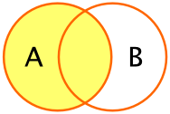

*Purpose*: Often our data are scattered across multiple sets. In this case, we need to be able to *join* data.

*Reading*: (None, this is the reading)
*Topics*: Welcome, mutating joins, filtering joins, Binds and set operations

```{r setup, include=FALSE}
# knitr options
knitr::opts_chunk$set(echo = TRUE)
```

```{r library}
library(tidyverse)
library(nycflights13)
```

## Combining data

Frequently, the data we need for an analysis is scattered across multiple datasets. In that case, we need tools to *combine* data sets. In R there are two classes of data-combiners:

- *Binding* is a "dumb" way to combine datasets: When binding we have to be very careful to combine the right rows and columns.
- *Joining* is a smarter way to combine datasets. We provide certain shared variables (*join keys*) to join the correct rows.

### Dangers of Binding!

As noted above, binding is a "dumb" way to combine data. 

Let's look at an example using `bind_columns`. This will take two datasets and "glue" them together in whatever order the happened to be arranged in.

```{r beatles-setup}
## NOTE: No need to change this; setup
beatles1 <-
  tribble(
    ~band, ~name,
    "Beatles", "John",
    "Beatles", "Paul",
    "Beatles", "George",
    "Beatles", "Ringo"
  )

beatles2 <-
  tribble(
       ~surname, ~instrument,
    "McCartney",      "bass",
     "Harrison",    "guitar",
        "Starr",     "drums",
       "Lennon",    "guitar"
  )

bind_cols(beatles1, beatles2)
```

### __q1__ Diagnose an issue

Describe what is wrong with the result of `bind_cols` above and how it happened.

*Hint*: John Lennon played guitar in The Beatles. John McCartney is not a real person... (as far as I know).

- Write your answer here

## Joining data

Rather than do a dumb binding, we can use a set of columns to more intelligently *join* two datasets. Joins operate by combining only those rows of data that match on a selected set of *join keys*. For example, the following image illustrates how we would join two datasets on the columns `A` and `B`. Note that only those rows that match on both `A` and `B` are joined.


Here's what the example would look like with R datasets:

```{r}
## NOTE: No need to edit
df1 <- tibble(
  A = c(1, 1),
  B = c(1, 2),
  C = c(2, 2)
)
df2 <- tibble(
  A = c(1, 1),
  B = c(1, 3),
  D = c(4, 1)
)

inner_join(df1, df2, by = c("A", "B"))
```

Note how the joined dataset includes columns from both `df1` and `df2`. This is "the point" of joining data---to bring together different sources of data.

Note that we can "chain" multiple joins to combine datasets. Sometimes this is necessary when we have different join keys between different pairs of datasets. As an example, we'll use the following `beatles3` to *correctly* join the data.

```{r beatles-full}
## NOTE: No need to change this; setup
# This is our source of join key information
beatles3 <-
  tribble(
    ~name, ~surname,
    "John", "Lennon",
    "Paul", "McCartney",
    "George", "Harrison",
    "Ringo", "Starr"
  )
```

### __q2__ Use the following `beatles3` to *correctly* join `beatles1`

*Hint*: You will need to use two join functions to complete this task.

```{r q2-task}
df_q2 <-
## TODO: Join beatles1 and beatles2 using beatles3 to match rows

df_q2
```

Use the following test to check your work:

```{r q2-tests}
## NOTE: No need to change this
# Reference dataset
beatles_joined <-
  tribble(
    ~band, ~name, ~surname, ~instrument,
    "Beatles", "John", "Lennon", "guitar",
    "Beatles", "Paul", "McCartney", "bass",
    "Beatles", "George", "Harrison", "guitar",
    "Beatles", "Ringo", "Starr", "drums"
  )
# Check for correctness
assertthat::assert_that(all_equal(df_q2, beatles_joined))
print("Nice!")
```

There's a **very important lesson** here: In general, don't trust `bind_cols`. It's easy in the example above to tell there's a problem because the data are *small*; when working with larger datasets, R will happily give you the wrong answer if you give it the wrong instructions. Whenever possible, use some form of join to combine datasets.

## Different types of joins

There are two primary classes of joints: *mutating joins* and *filter joins*.

### Mutating joins

*Mutating joins* modify (or "mutate") the data. There are four primary mutating joins to consider:

- `left_join(df_A, df_B)`: This preserves all rows in `df_A`, and only those in `df_B` that have a match



- `right_join(df_A, df_B)`: This preserves all rows in `df_B`, and only those in `df_A` that have a match
- `inner_join(df_A, df_B)`: This preserves only those rows that have a match between `df_A` and `df_B`


- `full_join(df_A, df_B)`: This preserves all rows in `df_A` and all rows in `df_B`, regardless of matches.


*Note*: Much of the join terminology is based on [SQL](https://en.wikipedia.org/wiki/Join_(SQL)), which is a database access language.

Here are a few tips to help with selecting the appropriate join:

- *To preserve as many rows as possible*, use a `full_join()`
- *To ensure only valid matches*, use an `inner_join()`
- *To add information to a dataset `df_main`*, use `left_join(df_main, df_extra)`

### Keys with different names

So far in our examples, join keys have had the same column name. However, there is no guarantee that our join keys will have the same names across all datasets. Thankfully, the `*_join()` functions have a way to deal with non-matching names. We can use a *named vector* to specify the key names on both sides.

For instance, the `nycflights13` database has multiple tables, including one for the airpots:

```{r}
airports
```

Note that the airport identifier in `airports` is `faa`. However, for flights, we have to specify an airport identifier for both the `origin` and `dest`. We can use a named vector to match up the join key:

```{r}
## NOTE: No need to edit
flights %>% 
  select(flight, origin) %>% 
  left_join(
    airports %>% select(faa, name),
    #       name in `flights`   name in `airports`
    by = c( "origin"          = "faa"              )
  )
```


### __q3__ Add the airport name

Complete the code below by using an appropriate join to add the airport name to the `flights` dataset.

*Aside*: While you're at it, try replacing `left_join()` with `inner_join()`. What happens to the resulting data?

```{r q3-task}
## TASK: Add the airport name for the `dest` using a join
flights %>% 
  left_join(
    airports %>% select(faa, name),
    ## TODO: Select the correct join keys
  ) %>% 
  select(flight, dest, name, everything())
```


### Filtering joins

Unlike a mutating join, a *filtering join* only filters rows---it doesn't modify values or add any new columns. There are two filter joins:

- `semi_join(df_main, df_criteria)`: Returns those rows in `df_main` that have a match in `df_criteria`
- `anti_join(df_main, df_criteria)`: Returns those rows in `df_main` that *do not* have a match in `df_criteria`

Filtering joins are an elegant way to produce complicated filters. They are especially helpful because you can first inspect what *criteria* you'll filter on, then perform the filter. We'll use the tidyr tool `expand_grid` to make such a criteria dataframe, then apply it to filter the `flights` data.

### __q4__ Create a "grid" of values

Use `expand_grid` to create a `criteria` dataframe with the `month` equal to `8, 9` and the airport identifiers in `dest` for the San Francisco, San Jose, and Oakland airports. We'll use this in q4 for a filter join.

*Hint 1*: To find the airport identifiers, you can either use `str_detect` to filter the `airports` dataset, or use Google!

*Hint 2*: Remember to look up the documentation for a function you don't yet know!

```{r q4-task}
criteria <-
## TODO: Use expand_grid to create a criteria dataframe

criteria
```

Use the following test to check your work:

```{r q4-tests}
## NOTE: No need to change this
assertthat::assert_that(
              all_equal(
                criteria,
                criteria %>%
                semi_join(
                  airports %>%
                  filter(
                    str_detect(name, "San Jose") |
                    str_detect(name, "San Francisco") |
                    str_detect(name, "Metropolitan Oakland")
                ),
                by = c("dest" = "faa")
              )
            )
          )

assertthat::assert_that(
              all_equal(
                criteria,
                criteria %>% filter(month %in% c(8, 9))
              )
            )

print("Well done!")
```

### __q5__ Filter with your `criteria`

Use the `criteria` dataframe you produced above to filter `flights` on `dest` and `month`.

*Hint*: Remember to use a *filtering join* to take advantage of the `criteria` dataset we built above!

```{r q5-task}
df_q5 <-
  flights %>%
## TODO: Use expand_grid to create a criteria dataframe

df_q5
```

Use the following test to check your work:

```{r q5-tests}
## NOTE: No need to change this
assertthat::assert_that(
              all_equal(
                df_q5,
                df_q5 %>%
                filter(
                  month %in% c(8, 9),
                  dest %in% c("SJC", "SFO", "OAK")
                )
              )
            )

print("Nice!")
```

<!-- include-exit-ticket -->
# Exit Ticket
<!-- -------------------------------------------------- -->

Once you have completed this exercise, make sure to fill out the **exit ticket survey**, [linked here](https://docs.google.com/forms/d/e/1FAIpQLSeuq2LFIwWcm05e8-JU84A3irdEL7JkXhMq5Xtoalib36LFHw/viewform?usp=pp_url&entry.693978880=e-data05-join-assignment.Rmd).
