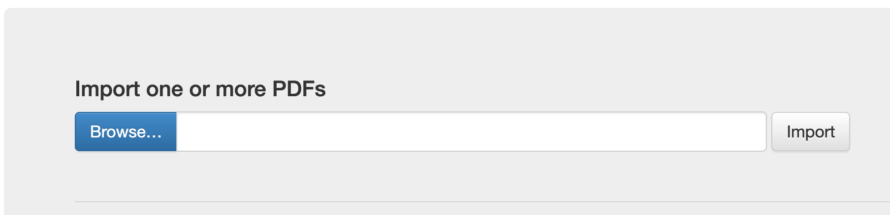
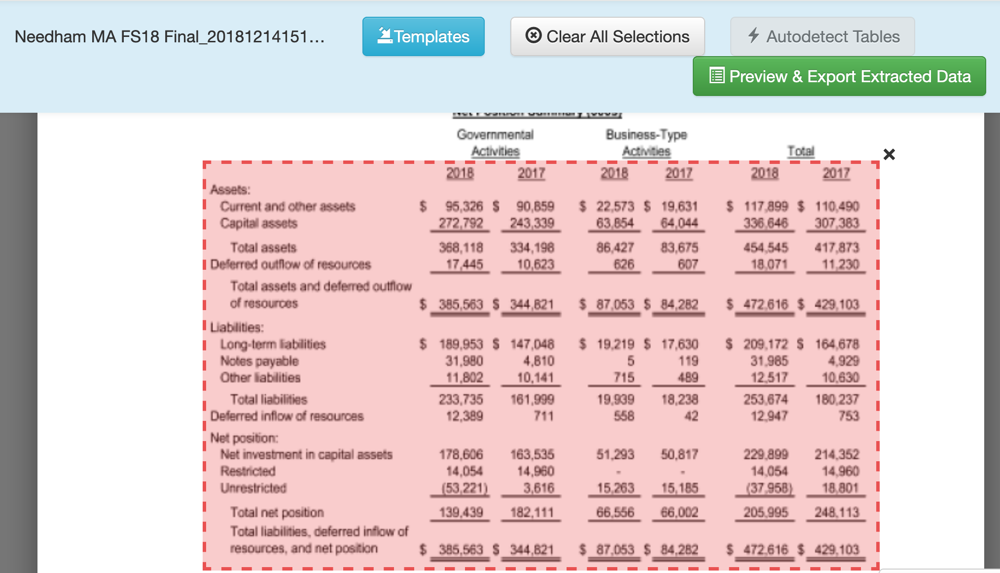

# Data: Liberating data with Tabula

*Purpose*: Sometimes data are messy---we know how to deal with that. Other times data are "locked up" in a format we can't easily analyze, such as in a PDF. In this exercise you'll learn how to *liberate* data from a PDF table using Tabula.

*Reading*: (*None*, this exercise *is* the reading.)

```{r setup}
library(tidyverse)
```

*Background*: [Tabula](https://tabula.technology/) is a piece of software developed for journalists carrying out investigative reporting. It was developed with support from organizations like [ProPublica](http://propublica.org/) and [The New York Times](http://www.nytimes.com/). This tool is meant to help investigators parse unwieldy PDFs and liberate useful information.

## Setup

### __q1__ Install Tabula.

Download and install [Tabula](https://tabula.technology/); the webpage has installation instructions.

*Note*: Tabula's interface is through a locally-hosted server; it should automatically open a browser window for Tabula. If it does not, then open [http://localhost:8080/](http://localhost:8080/) after you've launched Tabula.

## Liberating Data

### __q2.1__ Obtain the data.

Download `FY2019 independent financial audit report (PDF)` from the Needham, MA [financial reports page](https://www.needhamma.gov/1673/Financial-Reports).

### __q2.2__ Try it the hard way.

Try copy-pasting from the FY2019 report the table `Government-Wide Financial Analysis` into a text document or your favorite spreadsheet editor. **This is unlikely to produce the desired result.** (Please don't spend any time trying to format this copied data---you're about to learn a better way!)

Tabula is a tool that will help us *liberate* the data; basically, it's a copy-paste for PDF tables *that actually works*.

### __q3__ Extract from the FY2019 report the `Government-Wide Financial Analysis` table.

We'll do this in steps:

1. Click the browse button to select your downloaded FY2019 report and click *Import*.



2. Wait for the file to finish processing; this takes about 2 minutes on my laptop.


3. Once Tabula has imported the file, your view will switch to a view of the PDF.


4. Scroll to the `Government-Wide Financial Analysis` table; click and drag to select the data. Click *Preview & Export Extracted Data*.



5. You will arrive at a preview of the extracted data. You may find that Tabula has merged some of the columns; if this happens click the *Revise selection(s)* button to go back and adjust your selection.


6. Once you have a preview that matches the columns above, select the CSV filetype and click the *Export* button. Download the file to your `data` folder and give it a sensible filename.

### __q4__ Load and clean the data.

Load and clean the table you extracted above. Use the column names `category` and `[government|business|total]_[2019|2018]`. Do not *tidy* (pivot) the data yet, but make sure the appropriate columns are numeric.

*Note*: In accounting practice, numbers in parentheses are understood to be negative, e.g. `(1000) = -1000`.

```{r q4-task, eval=FALSE}
## TODO: Load and clean the data
df_2019 <- NA
df_2019 %>% glimpse()
```

Use the following to check your work:

```{r q4-tests, eval=FALSE}
## NOTE: No need to edit; check a couple problematic values
assertthat::assert_that(
  (
    df_2019 %>%
    filter(category == "Deferred outflow of resources") %>%
    pull(business_2019)
  ) == 1160
)

assertthat::assert_that(
  (
    df_2019 %>%
    filter(category == "Unrestricted") %>%
    pull(governmental_2019)
  ) == -62396
)

print("Excellent!")
```

Where Tabula really shines is in cases where you need to process *many* documents; if you find yourself needing to process a whole folder of PDF's, consider using Tabula.

<!-- include-exit-ticket -->
# Exit Ticket
<!-- -------------------------------------------------- -->

Once you have completed this exercise, make sure to fill out the **exit ticket survey**, [linked here](https://docs.google.com/forms/d/e/1FAIpQLSeuq2LFIwWcm05e8-JU84A3irdEL7JkXhMq5Xtoalib36LFHw/viewform?usp=pp_url&entry.693978880=e-data15-tabula-assignment.Rmd).
