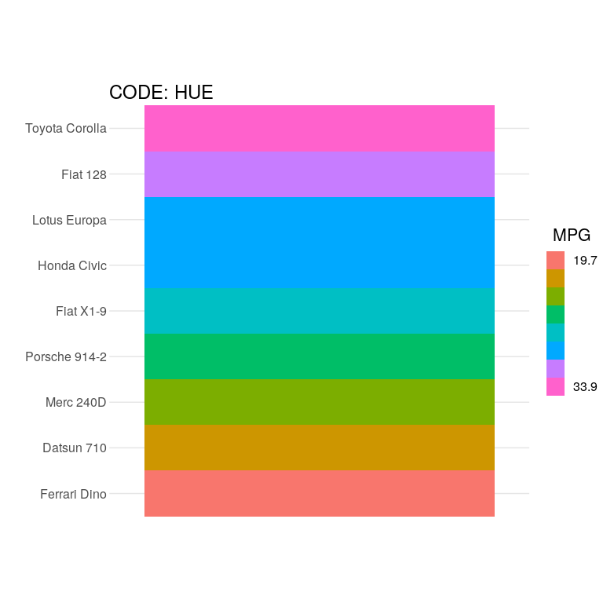
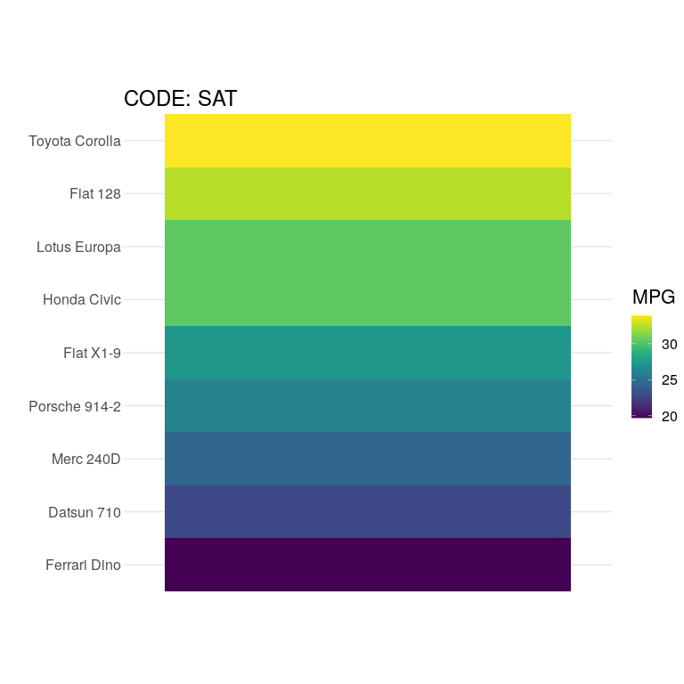
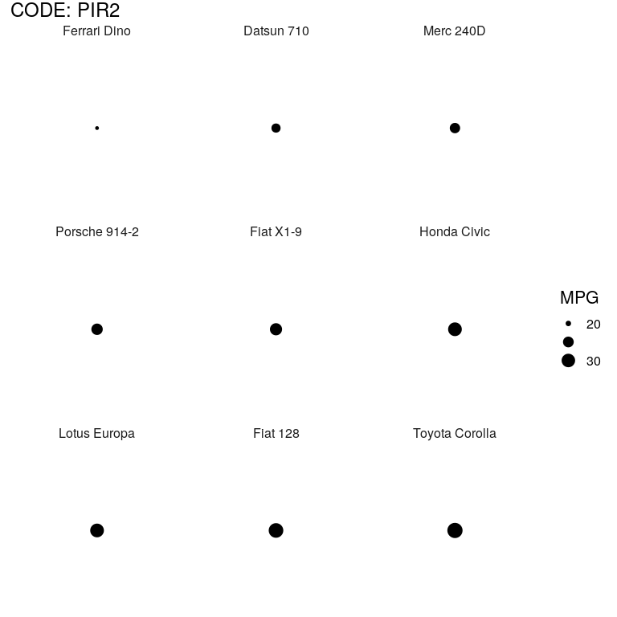
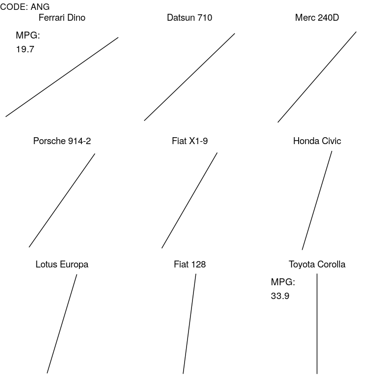
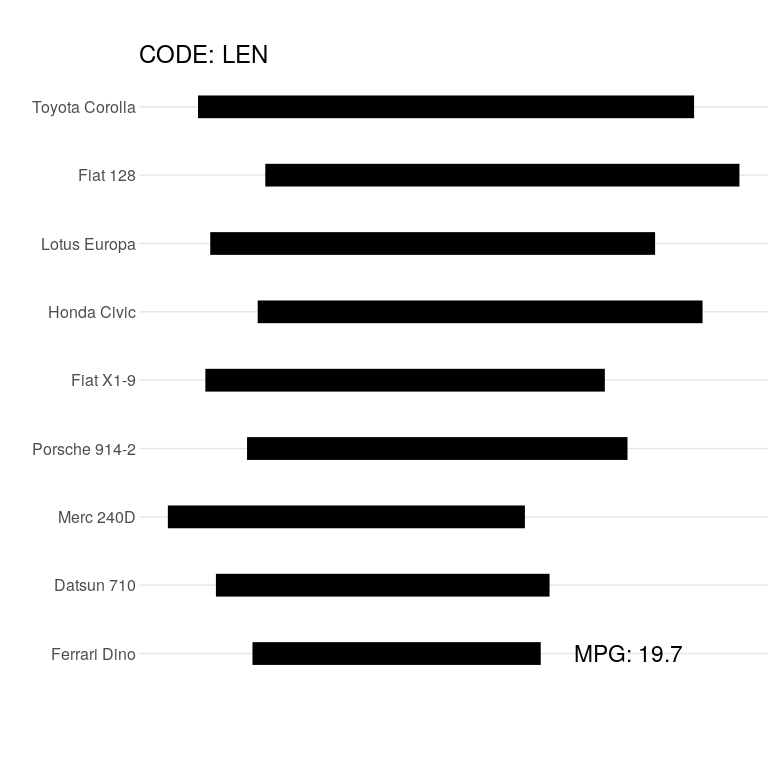
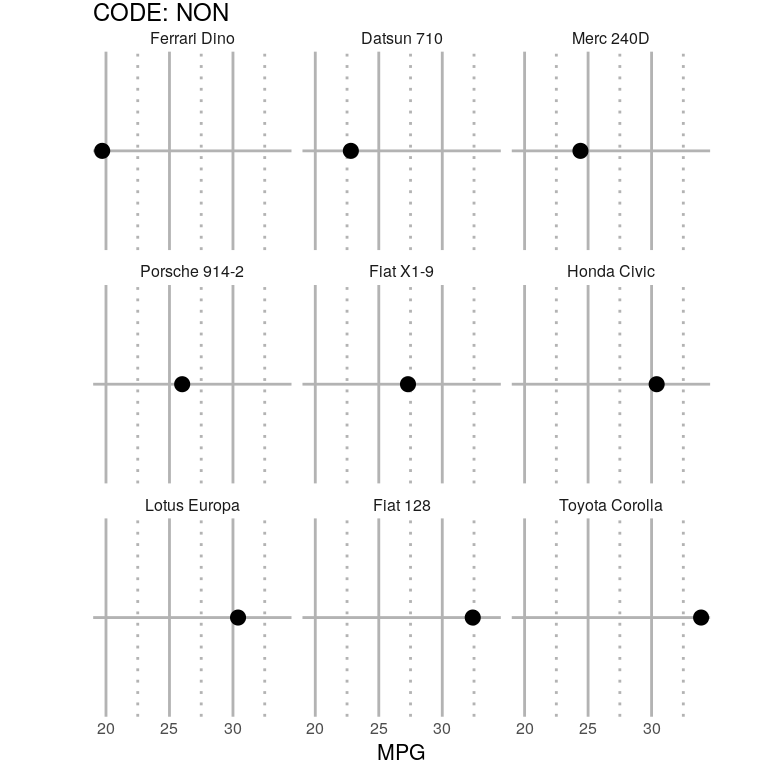
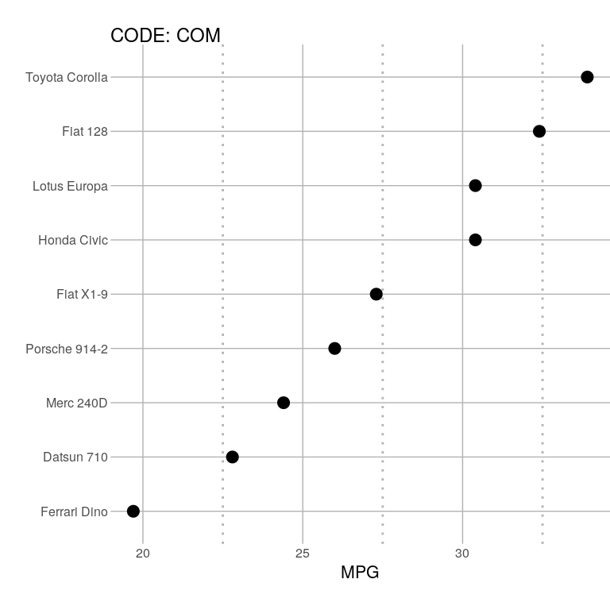

Rungs on the Visual Hierarchy
================
Zachary del Rosario
2020-07-18

Examples of rungs on the *visual hierarchy*, adapted from [John
Rauser](https://www.youtube.com/watch?v=fSgEeI2Xpdc&list=PLluqivwOH1ouKkbM0c6x-g7DQnXF0UmC0&index=37&t=0s)
\[1,
    3\].

``` r
library(tidyverse)
```

    ## ── Attaching packages ─────────────────────────────────────── tidyverse 1.3.0 ──

    ## ✔ ggplot2 3.3.1     ✔ purrr   0.3.4
    ## ✔ tibble  3.0.1     ✔ dplyr   1.0.0
    ## ✔ tidyr   1.1.0     ✔ stringr 1.4.0
    ## ✔ readr   1.3.1     ✔ forcats 0.5.0

    ## ── Conflicts ────────────────────────────────────────── tidyverse_conflicts() ──
    ## ✖ dplyr::filter() masks stats::filter()
    ## ✖ dplyr::lag()    masks stats::lag()

``` r
library(rzdr) # Custom

## Parameters
n_cars <- 9

## Prepare the data
df_mtcars <-
  as_tibble(mtcars) %>%
  mutate(
    model = rownames(mtcars),
    model = fct_reorder(model, mpg)
  )

model_select <-
  df_mtcars %>%
  arrange(desc(mpg)) %>%
  head(n_cars - 1) %>%
  bind_rows(., df_mtcars %>% filter(str_detect(model, "Ferrari"))) %>%
  pull(model)
```

Rauser reports the Visual Hierarchy, as originally reported in Table 1
of Cleveland and McGill (1985) \[2\].

**The Visual Hierarchy**:

1.  Position along a common scale
2.  Position on identical but nonaligned scales
3.  Length
4.  Angle; Slope
5.  Area
6.  Volume; Density; Color saturation
7.  Color hue

### 7\. Color hue

<!-- ------------------------- -->

``` r
mpg_levels <-
  df_mtcars %>%
  filter(model %in% model_select) %>%
  mutate(mpg = as.factor(mpg)) %>%
  pull(mpg) %>%
  levels(.)

df_mtcars %>%
  filter(model %in% model_select) %>%

  ggplot(aes("a", model, fill = as.factor(mpg))) +
  geom_tile() +
  scale_fill_discrete(
    name = "MPG",
    labels = rev(c("19.7", "", "", "", "", "", "", "33.9")),
    limits = rev(mpg_levels)
  ) +
  scale_x_discrete(breaks = c()) +
  theme_common() +
  theme(
    axis.text.y = element_text(hjust = 1),
    plot.title.position = "panel"
  ) +
  labs(
    x = NULL,
    y = "",
    title = "CODE: HUE"
  )
```

<!-- -->

### 6\. Color saturation

<!-- ------------------------- -->

``` r
df_mtcars %>%
  filter(model %in% model_select) %>%

  ggplot(aes("a", model, fill = mpg)) +
  geom_tile() +
  viridis::scale_fill_viridis(
             name = "MPG"
  ) +
  scale_x_discrete(breaks = c()) +
  theme_common() +
  theme(
    axis.text.y = element_text(hjust = 1),
    plot.title.position = "panel"
  ) +
  labs(
    x = NULL,
    y = "",
    title = "CODE: SAT"
  )
```

<!-- -->

### 5\. Area

<!-- ------------------------- -->

``` r
df_mtcars %>%
  filter(model %in% model_select) %>%

  ggplot() +
  geom_point(aes(0, 0, size = mpg)) +

  scale_size(
    name = "MPG",
    breaks = c(20, 25, 30),
    labels = c("20", "", "30")
  ) +
  scale_x_discrete(breaks = c()) +
  scale_y_discrete(breaks = c()) +
  facet_wrap( ~ model) +
  theme_common() +
  theme(plot.title.position = "panel") +
  labs(
    x = NULL,
    y = NULL,
    title = "CODE: PIR2"
  )
```

<!-- -->

### 4\. Angle

<!-- ------------------------- -->

``` r
df_mtcars %>%
  filter(model %in% model_select) %>%
  mutate(
    theta = (mpg - 0) / (max(mpg) - 0) * pi / 2,
    x = -cos(theta),
    y = -sin(theta),
    xend = cos(theta),
    yend = sin(theta)
  ) %>%

  ggplot() +
  geom_segment(aes(x = x, y = y, xend = xend, yend = yend)) +
  geom_text(
    data = . %>% filter(model %in% c("Ferrari Dino", "Toyota Corolla")),
    aes(x = -0.5, y = +0.7, label = str_c("MPG:\n", mpg)),
    hjust = 0,
    size = 5
  ) +

  facet_wrap( ~ model) +
  theme_void() +
  theme(
    plot.title.position = "panel",
    strip.text.x = element_text(size = 14)
  ) +
  labs(
    x = NULL,
    y = "",
    title = "CODE: ANG"
  )
```

<!-- -->

### 3\. Length

<!-- ------------------------- -->

``` r
set.seed(101)

df_mtcars %>%
  filter(model %in% model_select) %>%
  mutate(
    x = runif(n(), 0, 10),
    xend = x + mpg
  ) %>%

  ggplot() +
  geom_segment(
    aes(x = x, xend = xend, y = model, yend = model),
    size = 8
  ) +
  geom_text(
    data = . %>% filter(model == "Ferrari Dino"),
    aes(x = xend + 6, y = model, label = str_c("MPG: ", mpg)),
    size = 6
  ) +

  scale_x_continuous(breaks = c()) +
  theme_common() +
  theme(
    axis.text.y = element_text(hjust = 1),
    plot.title.position = "panel"
  ) +
  labs(
    x = "",
    y = "",
    title = "CODE: LEN"
  )
```

<!-- -->

### 2\. Nonaligned Scale

<!-- ------------------------- -->

``` r
df_mtcars %>%
  filter(model %in% model_select) %>%

  ggplot(aes(mpg, "a")) +
  geom_point(size = 5) +

  scale_x_continuous(breaks = c(20, 25, 30, 35)) +
  facet_wrap( ~ model, scales = "free_y") +
  theme_common() +
  theme(
    axis.text.y = element_blank(),
    panel.grid.major = element_line(color = "grey70", size = 1.0),
    panel.grid.minor = element_line(color = "grey70", size = 1.0, linetype = "dotted"),
    plot.title.position = "panel"
  ) +
  labs(
    x = "MPG",
    y = "",
    title = "CODE: NON"
  )
```

<!-- -->

### 1\. Common Scale

<!-- ------------------------- -->

``` r
df_mtcars %>%
  filter(model %in% model_select) %>%

  ggplot(aes(mpg, fct_reorder(model, mpg))) +
  geom_point(size = 5) +

  theme_common() +
  theme(
    axis.text.y = element_text(hjust = 1),
    panel.grid.major = element_line(color = "grey70"),
    panel.grid.minor = element_line(color = "grey70", size = 1.0, linetype = "dotted"),
    plot.title.position = "panel"
  ) +
  labs(
    x = "MPG",
    y = "",
    title = "CODE: COM"
  )
```

<!-- -->

# References

<!-- -------------------------------------------------- -->

\[1\] Rauser, J. “How Humans See Data” (2016) O’Reilly /Velocity/
Conference,
[link](https://www.youtube.com/watch?v=fSgEeI2Xpdc&list=PLluqivwOH1ouKkbM0c6x-g7DQnXF0UmC0&index=37&t=0s)

\[2\] Cleveland, W. and McGill, R. “Graphical Perception and Graphical
Methods for Analyzing Scientific Data” (1985) /Science/,
[link](https://science.sciencemag.org/content/sci/229/4716/828.full.pdf?casa_token=4pt5ELGRLRoAAAAA:luBCd_iaZVsAHQb08TYo2JZmx0LJ-WG0xTbXk1By6NSrazi7I804pXGq2XIjEeeHeROfcTyEj0nA)

\[3\] Rauser, J. (Source code for HHSD Talk figures)
[link](https://github.com/jrauser/writing/blob/master/how_humans_see_data/hhsd_notes.Rmd)
